# A Cloudflare Workers primer: hello world

``` example
o______________o
| Hello world! |
o--------------o
        \   ^__^
         \  (oo)_______
            (__)\       )\/\
                ||----w |
                ||     ||

```

Keen to get started with your *Hello World* Cloudflare Worker? Skip to
the [setup](id:cloudflare-worker-hello-world-setup) section.

## A little background

The vast majority of my software development experience has been
centered around client-side software. The few times I've needed a
server-side component for a hobby project, I've historically
provisioned a linux [virtual
machine](https://en.wikipedia.org/wiki/Virtual_machine) somewhere and
ran whatever services I needed. I have to admit though, I don't enjoy
the provisioning process, configuration, maintenance, upgrades, database
admin, etc. which take time away from the part I enjoy more: building
and experimenting with features.

While
[containers](https://en.wikipedia.org/wiki/Containerization_(computing))
have made things somewhat simpler, much of the maintenance tradeoffs
remain.

These days, the server-managing overhead has been greatly reduced by
\"[serverless](https://en.wikipedia.org/wiki/Serverless_computing)\"
solutions. Odd terminology for a server offering, but I digress. It more
or less refers to removing most of that additional responsibility that
comes with managing your own servers and enabling you to focus on
building your business logic. Having said that, I've typically shied
away from these services, with the possibly irrational fear of vendor
lock-in.

The thing is, if most of my potential server-side needs merely require
an entry point (where I could route/handle incoming requests) and
possibly some persistence (maybe a database), I should be able to
abstract these things away and build server-side logic against portable
abstractions. With that in place, maybe there's little vendor lock-in
to worry about? Who knows, the devil's in the detail. If I keep shying
away from these services, I'll never know, so maybe I should try some
and see.

## Let's try Cloudflare Workers

There are no shortages of serverless options offering [functions as a
service](https://en.wikipedia.org/wiki/Function_as_a_service). Google
Cloud, AWS Lambda, Azure Functions, Vercel Functions, Netlify Functions,
Fastly, Cloudflare workers, I could go on...

While I haven't researched the different offerings, I had made a mental
note to check out Cloudflare Workers as they had [announced
D1](https://blog.cloudflare.com/introducing-d1), their database backed
by SQLite ...and who doesn't love SQLite? ;) OK, I'm no expert here,
but I have had a pleasant experience whenever I've used it. These days,
even [Emacs 29 got some SQLite
love](https://xenodium.com/emacs-29s-sqlite-mode/), which prompted me to
add [cell
navigation/navigation](https://xenodium.com/sqlite-mode-goodies/) and
[try other
experiments](https://xenodium.com/further-sqlite-mode-extensions/).

## D1 / SQLite in beta

Keep in mind that D1 is in public beta and not yet recommended for large
production workloads. From the [Cloudflare
site](https://developers.cloudflare.com/d1/):

> \"While the D1 team expects breaking changes and issues to be minimal,
> they may still occur. The D1 team generally does not recommend running
> large production workloads on beta products.\"

## Workers cost

In terms of pricing (as of 2024-01-13), the [free
tier](https://developers.cloudflare.com/workers/platform/pricing)
enables workers to handle up 100,000 requests per day. Plenty for trying
things out.

In any case, we're only checking out Cloudflare's offering, so let's
move on...

## Settings up a new Cloudflare Worker (via web dash)

Cloudflare has a tiny snippet on their [Workers landing
page](https://workers.cloudflare.com/) that sets things up rather
quickly, but [I won't be using it]{.underline}.

``` sh
~/ $ npm create cloudflare -- my-app
~/ $ cd my-app
~/ $ npx wrangler deploy
Published https://my-app.world.workers.dev
```

⚠️ *Note: before you get copying and pasting, read on.*

Cloudflare's snippet is helpful, but it does quite a bit under the
hood. I'm somewhat of a node and serverless noob, so I wanted to
understand things a little more and figure out the bare minimum needed
to start a minimal Cloudflare Worker project.

Instead, we'll first click here and there over at
<https://dash.cloudflare.com> to spin off our new worker from the web
and later continue from the command line.


Give the worker a name. We'll call it \"todos\" to give ya a little
sneak peak at what the next post is possibly about... But you can call
it whatever you'd like. Keep in mind you'll need to use this name to
refer to your new worker.


Congrats, you've now deployed a new worker. You can access it via the
URL that looks something like <https://todos.somewhere.workers.dev>

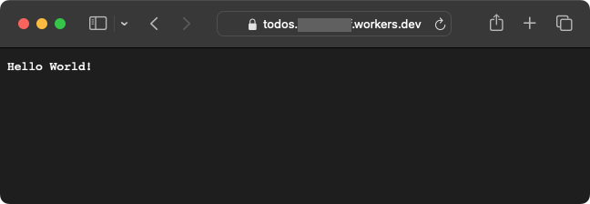

This is great and all, but we want to build something with this new
worker, so let's set up our local development environment...

## Prerequisites

You'll need [node.js](https://nodejs.org/) installed on your machine.

I happen to be on macOS, so I installed node via
[Homebrew](https://brew.sh/).

``` sh
brew install node
```

## Create a new node project

We want to start with a bare bones node project, so let's do just that.

``` sh
mkdir HelloCloudflareWorker
cd HelloCloudflareWorker
npm init -y
```

## Install TypeScript (compiler)

I like some guardrails when targetting Javascript, so I'll use the
[TypeScript](https://www.typescriptlang.org) compiler in this project.
Let's install it.

``` sh
npm install --save-dev typescript
npx tsc --init
```

## Install Cloudflare Typescript types

To have Cloudflare types information accessible to the TypeScript
compiler, we'll need to install that too.

``` sh
npm install --save-dev @cloudflare/workers-types
```

## Install Wrangler (Cloudflare tooling)

To manage your worker from the command-line, you'll need Cloudflare's
[wrangler](https://developers.cloudflare.com/workers/wrangler/) tool.
Let's install it.

``` sh
npm install --save-dev wrangler
```

## Point Wrangler to our worker

We're done installing things now. Let's point wrangler to our new
worker by creating its config file.

`wrangler.toml`{.verbatim}

``` sh
name = "todos"
main = "worker/worker.ts"
```

## Worker entry point

By default, the worker we created using Cloudflare's dash has the
following entry point:

``` js
export default {
  async fetch(request, env, ctx) {
    return new Response( 'Hello World!'):
  }
}
```

However, this isn't yet included in our development environment. We
need to write our first bit of code. You may have noticed our
`wrangler.toml`{.verbatim} is pointing to the main entry point
(`worker/worker.ts`{.verbatim}) and this file doesn't exist yet. Let's
create it, though be sure to also create its owning directory:

``` sh
mkdir worker
```

Now we can create our very own `worker/worker.ts`{.verbatim}. Let's
make the first change that shapes worker to our liking. Rather than just
printing \"Hello World\", let's style things up using our [cow
friend](https://en.wikipedia.org/wiki/Cowsay). We'll create
`worker/worker.ts`{.verbatim} and include the spiffed up message.

`worker/worker.ts`{.verbatim}

``` js
import { Env, ExecutionContext } from '@cloudflare/workers-types';

export default {
  async fetch(request: Request, env: Env, ctx: ExecutionContext): Promise<Response> {
    let defaultResponse = `
   o______________o
   | Hello World! |
   o--------------o
           \\   ^__^
            \\  (oo)\_______
               (__)\\       )\\/\\
                   ||----w |
                   ||     ||`
    return new Response(defaultResponse);
  }
};
```

It's worth mentioning the import statement, since it brings
Cloudflare's type information for both `Env`{.verbatim} and
`ExecutionContext`{.verbatim}.

## Running worker locally

Okay, we now have our `worker/worker.ts`{.verbatim} code ready to go.
Let's run it locally. For that we use the wrangler utility.

``` sh
npx wrangler dev
```

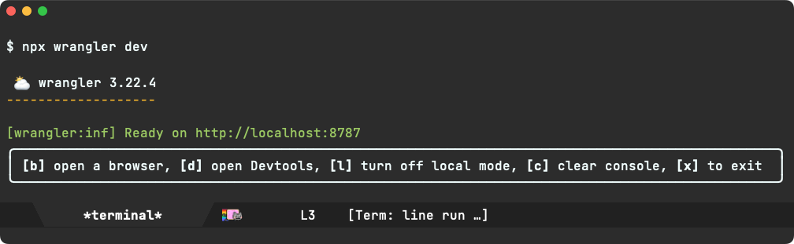

With that, you'll notice the worker is now running locally and waiting
to be visited at <http://localhost:8787>.


## Deploying worker

When we first created the worker via <https://dash.cloudflare.com>, it
automatically deployed to <https://todos.somewhere.workers.dev>. But our
mods only ran locally. Let's deploy, again with the wrangler utility.

``` sh
npx wrangler deploy
```


We're good to go. Let's point our browser to the worker's public
location.


...and with that, we have a functional Cloudflare Worker and a local
development environment to shape things up however we'd like. What
would you use the Worker for?

Gave this primer a try? I'd love to hear from ya
([Mastodon](https://indieweb.social/@xenodium) /
[Twitter](https://twitter.com/xenodium) /
[Reddit](https://www.reddit.com/user/xenodium) /
[Email](mailto:me__AT__xenodium.com)).

*Enjoying this content? Find it useful?*

*Consider ✨[sponsoring me](https://github.com/sponsors/xenodium)✨ or
buy ✨[my iOS
apps](https://apps.apple.com/us/developer/xenodium-ltd/id304568690)✨.*

# A chatgpt-shell compose ux experiment

It's been roughly 9 months since I
[experimented](https://xenodium.com/a-chatgpt-emacs-shell/) with wiring
the [ChatGPT](https://openai.com/blog/chatgpt) API to an Emacs
[comint](https://www.gnu.org/software/emacs/manual/html_node/emacs/Shell-Prompts.html)
buffer in [chatgpt-shell](https://github.com/xenodium/chatgpt-shell).
ChatGPT's request-response nature maps fairly well to a shell's mode
of interaction.

In the past, I've also talked about [blurring the lines between shell
and editor](https://xenodium.com/yasnippet-in-emacs-eshell/). That is,
using Emacs as your shell
([eshell](https://www.masteringemacs.org/article/complete-guide-mastering-eshell)
being my favourite) enables compounding goodies from both shell and
editor when both are used from the same app.

Keeping interactions within the same app also cuts down on some of that
friction that comes with context switching between your text editor and
the browser for
[llm](https://en.wikipedia.org/wiki/Large_language_model) things.

Today, my interactions with llms typically consists of copying and
pasting details from other Emacs buffers, crafting a query, and finally
submitting by pressing enter (RET) from a shell like
[chatgpt-shell](https://github.com/xenodium/chatgpt-shell).

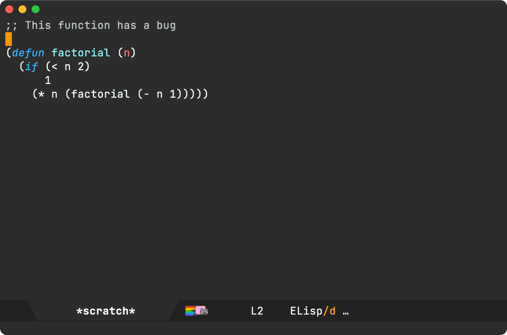

With the entire interaction happening from Emacs, we're already cutting
a fair amount of friction... But we can do better, specially when
copying, pasting, and crafting those multi-line queries (you don't want
to prematurely submit those shell queries by inadvertently pressing RET
when you want a newline).

## chatgpt-shell-prompt-compose

This is where `chatgpt-shell-prompt-compose`{.verbatim} comes in, an
opinionated experiment bringing some of my favourite \"compose\"
features over from the likes of [magit](https://github.com/magit) commit
buffers, [org
capture](https://www.gnu.org/software/emacs/manual/html_node/org/Using-capture.html),
[mu4e](https://www.djcbsoftware.nl/code/mu/mu4e/) compose, and so on...

You can bring a compose buffer up by invoking
`M-x chatgpt-shell-prompt-compose`{.verbatim}. From there, you can both
craft and send your queries. If you're a magit fan, the process should
feel fairly familiar with crafting a git commit message by editing away
and quickly committing (via `C-c C-c`{.verbatim} binding). Similarly,
you can also abort with the familiar `C-c C-k`{.verbatim} binding.

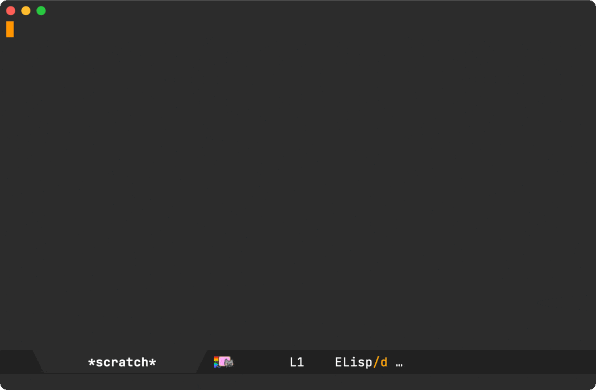

I use this compose utility often enough that I bound it to
`C-c C-e`{.verbatim}, though this may not be your cup of tea (needs
overriding other mode maps).

``` emacs-lisp
(use-package chatgpt-shell
  :commands
  (chatgpt-shell
   chatgpt-shell-prompt-compose)
  :bind (("C-c C-e" . chatgpt-shell-prompt-compose)
         :map org-mode-map
         ("C-c C-e" . chatgpt-shell-prompt-compose)
         :map eshell-mode-map
         ("C-c C-e" . chatgpt-shell-prompt-compose)
         :map mu4e-compose-mode-map
         ("C-c C-e" . chatgpt-shell-prompt-compose)
         :map emacs-lisp-mode-map
         ("C-c C-e" . chatgpt-shell-prompt-compose)))
```

While the compose buffer displays a single query/response at a time, it
also follows on from previous requests. You can press `r`{.verbatim} to
reply and continue the conversation.

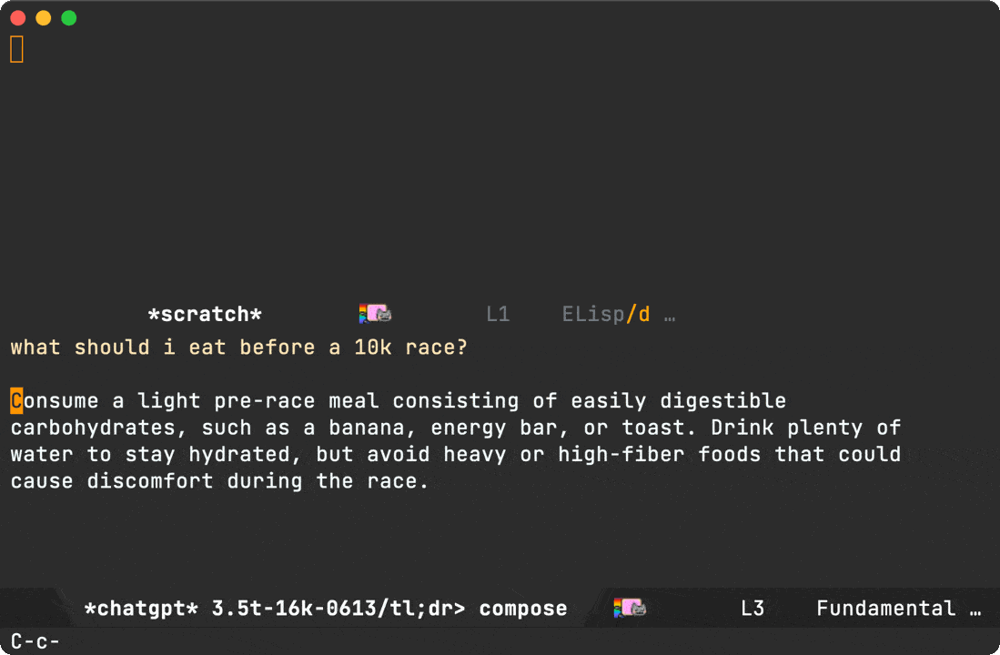

The compose buffer is fairly stateless and mostly serves as viewport
over the last query in the shell itself. If you invoke
`chatgpt-shell-prompt-compose`{.verbatim} with a prefix (ie. C-u), it
wipes the shell history. You can do it from the compose buffer itself,
if you forgot to prior to launching.

You can also use the `o`{.verbatim} binding to jump to the \"other
buffer\" (the shell carrying the conversation history).

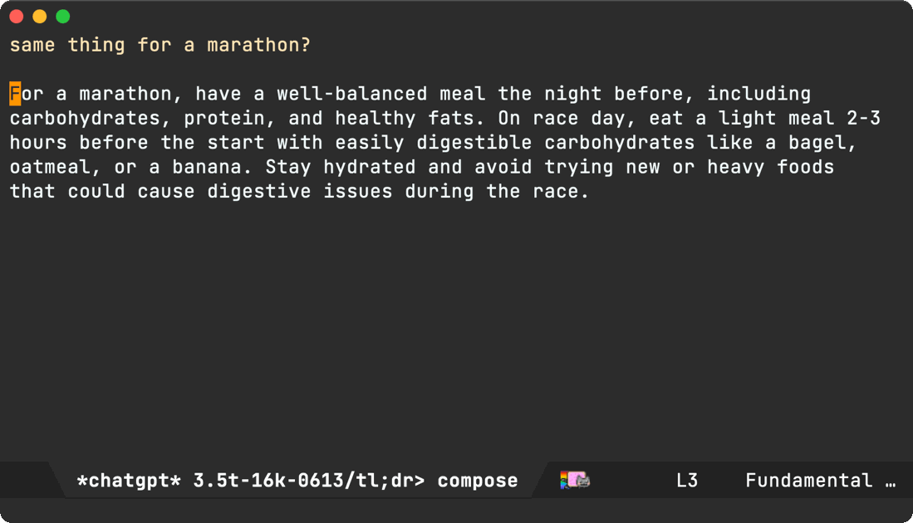

If using the `r`{.verbatim} and `o`{.verbatim} bindings in a compose
buffer sounds a little strange, fear not. The compose buffer is
writeable while crafting queries, thus you can safely insert any
character. Once a query is submitted (via `C-c C-c`{.verbatim}), the
buffer automatically becomes read-only, and thus unlocking
single-character bindings.

Another magit commit favorite of mine is using the `M-p`{.verbatim} or
`M-n`{.verbatim} bindings to insert previous messages via
`git-commit-prev-message`{.verbatim} or
`git-commit-next-message`{.verbatim}.

With that in mind, I also brought `M-p`{.verbatim} and `M-n`{.verbatim}
over to the editable compose buffer.

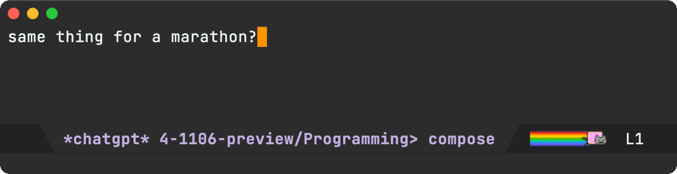

If cycling isn't efficient enough, you can also use the typical
`M-r`{.verbatim} binding to search and insert from history.

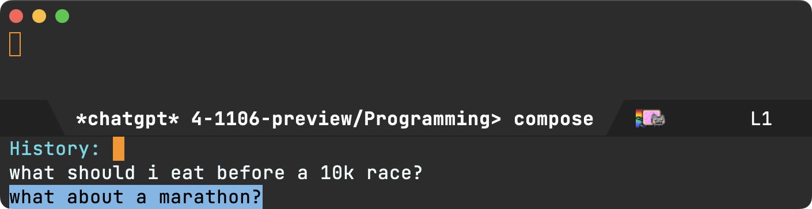

Now, getting back to removing some of that copy-pasting friction...
Selecting text in any buffer and invoking
`M-x chatgpt-shell-prompt-compose`{.verbatim} (or `C-c C-e`{.verbatim}
in my case) automatically pastes the region into the compose buffer. You
get to tweak your query before submitting (via that familiar
`C-c C-c`{.verbatim}), in a more flexible buffer (compared to a shell).

*Note: You can also invoke the compose command with a region as many
times as you'd like. Each region is sent to the compose buffer, so you
can craft more involved queries before submission.*

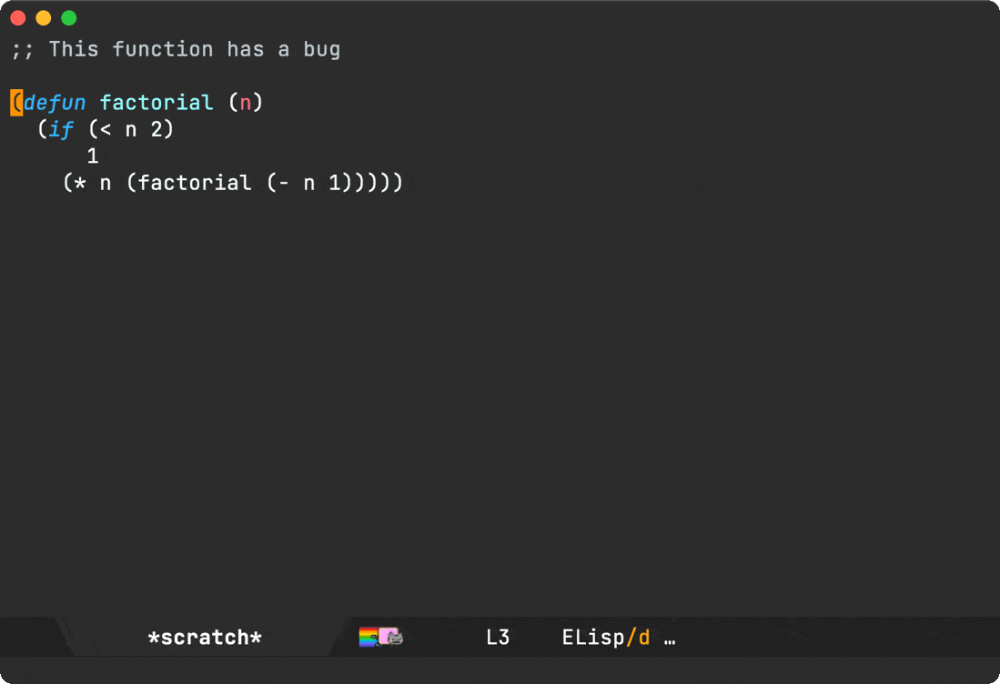

While I typically prefer short query responses (using diffs like the
example above), I sometimes want full snippets as follow-ups. I found
myself typing *\"show entire snippet\"* often enough, that I now use one
of those single-character bindings (`e`{.verbatim}) for this purpose.

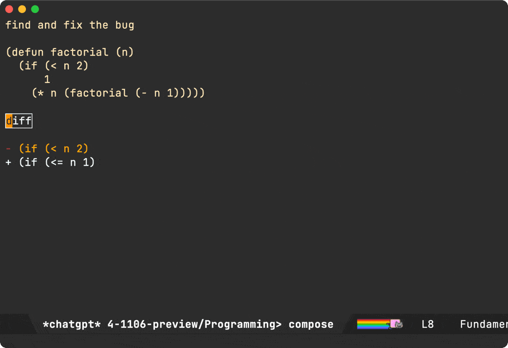

## Compose bindings

I've showcased most of the compose key bindings, here's the whole lot
(so far anyway), which you can also view from
`chatgpt-shell-prompt-compose`{.verbatim}'s documentation.

### Editing

-   `C-c C-c`{.verbatim} to send the buffer query.
-   `C-c C-k`{.verbatim} to cancel compose buffer.
-   `M-r`{.verbatim} search through history.
-   `M-p`{.verbatim} cycle through previous item in history.
-   `M-n`{.verbatim} cycle through next item in history.

### Read-only

-   `C-c C-c`{.verbatim} After sending offers to abort query
    in-progress.
-   `q`{.verbatim} Exits the read-only buffer.
-   `g`{.verbatim} Refresh (re-send the query). Useful to retry on
    disconnects.
-   `n`{.verbatim} Jump to next source block.
-   `p`{.verbatim} Jump to next previous block.
-   `r`{.verbatim} Reply to follow-up with additional questions.
-   `e`{.verbatim} Send \"Show entire snippet\" query.
-   `o`{.verbatim} Jump to other buffer (ie. the shell itself).
-   `C-M-h`{.verbatim} Mark block at point.

## Buyer beware: it's all pretty experimental

When I started playing with the compose buffer idea, I wasn't too sure
whether or not its usage would stick, so I basically hacked
`chatgpt-shell-prompt-compose`{.verbatim} to pieces. A cheap prototype
of sorts to validate the idea before fully committing to a more involved
solution.

I'll eventually rewrite `chatgpt-shell-prompt-compose`{.verbatim} as
either a major or minor mode if there's enough interest.

For now, I'll continue using as is to validate its usefulness.

If you give `chatgpt-shell-prompt-compose`{.verbatim} a try, I'd love
to hear your feedback ([Mastodon](https://indieweb.social/@xenodium) /
[Twitter](https://twitter.com/xenodium) /
[Reddit](https://www.reddit.com/user/xenodium) /
[Email](mailto:me__AT__xenodium.com)).

*Enjoying this content? Find it useful? Consider
[sponsoring](https://github.com/sponsors/xenodium).*

# A Murder at the End of the World: Are you Vi or Emacs?

I've enjoyed watching [A Murder at the End of the
World](https://www.imdb.com/title/tt15227418/). The show may resonate
with folks following the tech world. Won't say much more than that...

What I can maybe say is, the shows features
[Reddit](https://www.reddit.com/r/emacs/), [Brave
browser](https://brave.com/), terminal usage (ifconfig, nmap, hydra,
responder), and a reference to the good 'ol [Vi vs Emacs
rivalry](https://en.wikipedia.org/wiki/Editor_war), which I hope folks
these days don't take further than friendly teasing between dear
cousins.

In any case, being an Emacs nut, the scene gave me a good tickle. It's
a great show, with a lovely Emacs cherry on top! While the show title
and description didn't immediately draw me in, I'm glad I gave it a
chance.


# An basic Mullvad WireGuard setup for macOS

Needed a VPN to test an API from a different location. Gave
[Mullvad](https://mullvad.net/en) a try.

Pretty neat, you can generate an account number without providing an
email address. You can also pre-pay with a ton of options, including
cash, crypto, credit cards, PayPal, wire transfers...

After seeing your account credited, one can download a [generated
WireGuard
configuration](https://mullvad.net/en/account/wireguard-config). Also a
WireGuard noob, so took this opportunity to give it a try.

The [WireGuard macOS
app](https://apps.apple.com/us/app/wireguard/id1451685025?mt=12) has an
\"Import Tunnel(s) from File...\" option where you can import the .conf
file downloaded from [Mullvad's generated
config](https://mullvad.net/en/account/wireguard-config). After that,
all I had to do was click the \"Activate\" button and [Bob's your
uncle](https://en.wikipedia.org/wiki/Bob%27s_your_uncle).

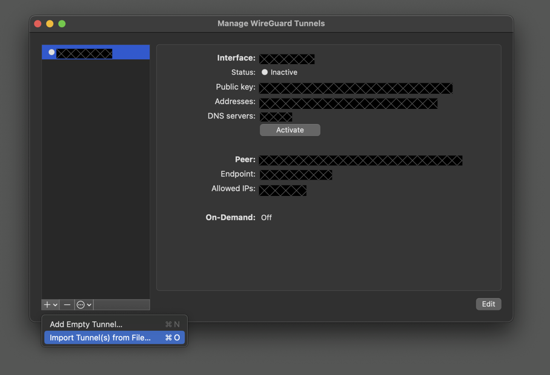

You can test your connection via:

``` bash
curl https://am.i.mullvad.net/connected
```

I had a brief stint at using the command-line alternative via homebrew
`brew install wireguard-go wireguard-tools`{.verbatim}, but that seems
to fail silently:

``` sh
wg-quick up xxxxx
[#] wireguard-go utun
[+] Interface for xxxxx is utun7
[#] wg setconf utun7 /dev/fd/63
[#] ifconfig utun7 inet xxx.xxx.xxx.xxx/xx xxx.xxx.xxx.xxx alias
[#] ifconfig utun7 inet6 xxxx:xxxx:xxxx:xxxx::x:xxxx/xxx alias
[#] ifconfig utun7 up
[#] route -q -n add -inet6 ::/1 -interface utun7
[#] route -q -n add -inet6 8000::/1 -interface utun7
[#] route -q -n add -inet xxx.xxx.xxx.xxx/x -interface utun7
[#] route -q -n add -inet xxx.xxx.xxx.xxx/x -interface utun7
[#] route -q -n add -inet xxx.xxx.xxx.xxx -gateway xxx.xxx.xxx.xxx
[#] networksetup -getdnsservers Wi-Fi
[#] networksetup -getsearchdomains Wi-Fi
[#] networksetup -getdnsservers iPhone USB
[#] networksetup -getsearchdomains iPhone USB
[#] networksetup -getdnsservers Thunderbolt Bridge
[#] networksetup -getsearchdomains Thunderbolt Bridge
[#] networksetup -getdnsservers xxxxx
[#] networksetup -getsearchdomains xxxxx
[#] networksetup -setdnsservers iPhone USB xxx.xxx.xxx.xxx
[#] networksetup -setsearchdomains iPhone USB Empty
[#] networksetup -setdnsservers xxxxx xxx.xxx.xxx.xxx
[#] networksetup -setsearchdomains xxxxx Empty
[#] networksetup -setdnsservers Wi-Fi xxx.xxx.xxx.xxx
[#] networksetup -setsearchdomains Wi-Fi Empty
[#] networksetup -setdnsservers Thunderbolt Bridge xxx.xxx.xxx.xxx
[#] networksetup -setsearchdomains Thunderbolt Bridge Empty
[+] Backgrounding route monitor
```

``` bash
curl https://am.i.mullvad.net/connected
```

I'm on a Macbook M1 Pro, running macOS Sonoma. If you got
`wg-quick`{.verbatim} working on Sonoma, I'd love to hear from ya
([Mastodon](https://indieweb.social/@xenodium) /
[Twitter](https://twitter.com/xenodium) /
[Reddit](https://www.reddit.com/user/xenodium) /
[Email](mailto:me__AT__xenodium.com)).

# An iOS journaling app powered by org plain text

I've been experimenting with building a rich text editing component for
iOS, powered by [org](https://orgmode.org/) markup. The idea is to offer
a mobile-friendly editing experience, backed by our beloved plain text
format.

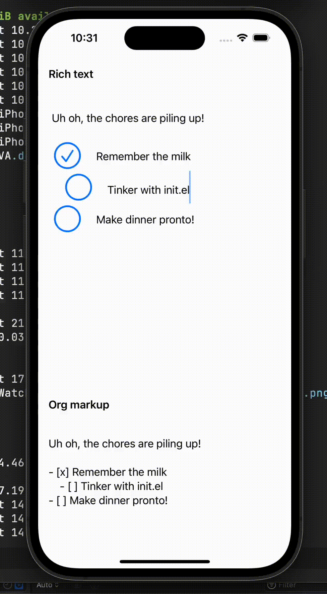

To make things a little more interesting, I'm introducing a new
org-based app to help anyone with regular journaling.

``` html
<p style="text-align: center;">
👉 Meet ✨Journelly✨
</p>
```


Plain text *is* the serialization format. No conversion/import/export
needed.


Though it's early days, it's fairly functional. Been using it daily
for some time. You can opt in to use an external org file and sync with
your beloved Emacs.

Want to give it a try? Want a TestFlight invite? Send me an email
address (any would do) at either of these:
[Mastodon](https://indieweb.social/@xenodium) /
[Twitter](https://twitter.com/xenodium) /
[Reddit](https://www.reddit.com/user/xenodium) /
[Email](mailto:me__AT__xenodium.com).

The topic of org being fairly Emacs-oriented, though a strength for
someone far down the rabbit hole, it is [understandable to call it out
for someone in a different
position](https://indieweb.social/@ringtailringo@mastodon.social/111533733278287863).
Lucky for us, org markup is plain text and can be implemented by apps
other than Emacs, like Journelly itself for iOS and even more
experimentally on macOS:

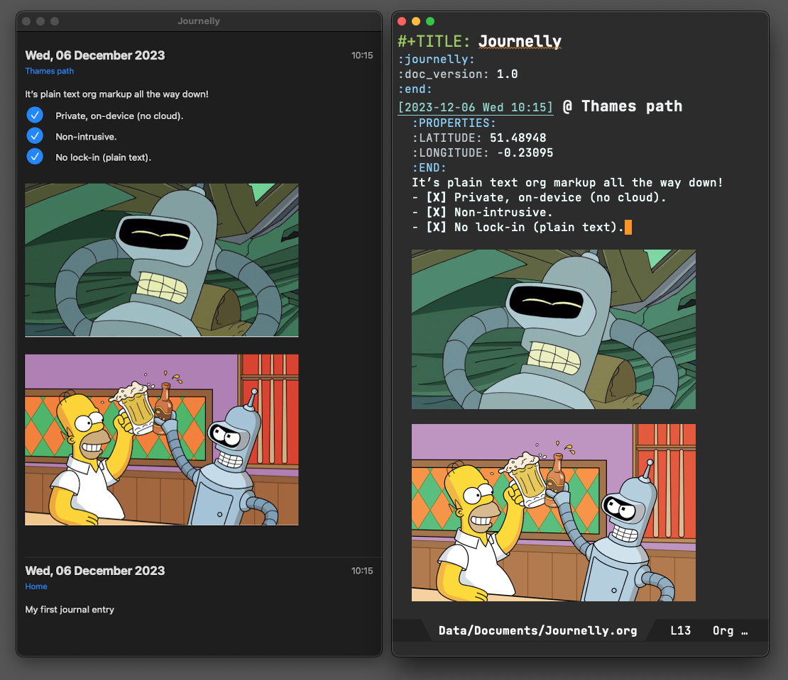

And like Journelly for iOS, I got other org things available on iOS:

``` html
<p style="text-align: center;">
      <a href='https://plainorg.com'>
        
      </a>
      <a href='https://apps.apple.com/app/id1671420139'>
        
      </a>
      <a href='https://flathabits.com'>
        
      </a>
</p>
```
-   As an [Org mode](https://orgmode.org/) fan, so I wrote [Plain
    Org](https://plainorg.com/) for iOS. It's on the [App
    Store](https://apps.apple.com/app/id1578965002).
-   Inspired by [Atomic Habits](https://jamesclear.com/atomic-habits), I
    wrote [Flat Habits](https://flathabits.com/) for iOS. Also on the
    [App Store](https://apps.apple.com/app/id1558358855).
-   I needed an Emacs-inspired
    [**scratch**](https://xenodium.com/scratch-a-minimal-scratch-area)
    buffer on iOS (who doesn't?), so I [built
    one](https://xenodium.com/scratch-a-minimal-scratch-area/).

Just like the stuff I do or [write about](https://xenodium.com)?
[Sponsor me](https://github.com/sponsors/xenodium).

# Building your own bookmark launcher

``` org
#+ATTR_HTML: :style text-align:right;
```
*✨[sponsor](https://github.com/sponsors/xenodium)✨ this content*

I've been toying with the idea of managing browser bookmarks from [you
know where](https://www.gnu.org/software/emacs/). Maybe dump a bunch of
links into an org file and use that as a quick and dirty bookmark
manager. We'll start with a flat list plus fuzzy searching and see how
far that gets us.

The org file would look a little something like this:

::: captioned-content
::: caption
bookmarks.org
:::

``` org
My bookmarks
- [[https://lobste.rs/t/emacs][Emacs editor (Lobsters)]]
- [[https://emacs.stackexchange.com][Emacs Stack Exchange]]
- [[https://www.reddit.com/r/emacs][Emacs subreddit]]
- [[https://emacs.ch][Emacs.ch (Mastodon)]]
- [[https://www.emacswiki.org][EmacsWiki]]
- [[https://planet.emacslife.com/][Planet Emacslife]]
```
:::

Next we need fuzzy searching, but first let's write a little elisp to
extract all links from the org file:

``` emacs-lisp
(require 'org-element)
(require 'seq)

(defun browser-bookmarks (org-file)
  "Return all links from ORG-FILE."
  (with-temp-buffer
    (let (links)
      (insert-file-contents org-file)
      (org-mode)
      (org-element-map (org-element-parse-buffer) 'link
        (lambda (link)
          (let* ((raw-link (org-element-property :raw-link link))
                 (content (org-element-contents link))
                 (title (substring-no-properties (or (seq-first content) raw-link))))
            (push (concat title
                          "\n"
                          (propertize raw-link 'face 'whitespace-space)
                          "\n")
                  links)))
        nil nil 'link)
      (seq-sort 'string-greaterp links))))
```

The snippet uses `org-element`{.verbatim} to iterate over links to
collect/return them in a list. We join both the title and url, so
searching can match either of these values. We also add a little
formatting (new lines/face) to spiff things up.

``` emacs-lisp
(browser-bookmarks "/private/tmp/bookmarks.org")
```

We can now feed our list to our preferred narrowing framework (ivy,
helm, ido, vertico) and use it to quickly select a bookmark. In the
past, I've [used the likes of
ivy-read](https://xenodium.com/emacs-utilities-for-your-os/) directly,
though have since adopted the humble but mighty
`completing-read`{.verbatim} which hooks up to any of the above
frameworks.

With that in mind, let's use `completing-read`{.verbatim} to make a
selection and split the text to extract the corresponding URL. Feed it
to `browse-url`{.verbatim}, and you got your preferred browser opening
your bookmark.

``` emacs-lisp
(defun open-bookmark ()
  (interactive)
  (browse-url (seq-elt (split-string (completing-read "Open: " (browser-bookmarks "/private/tmp/bookmarks.org")) "\n") 1)))
```

I remain a happy ivy user, so we can see its fuzzy searching in action.

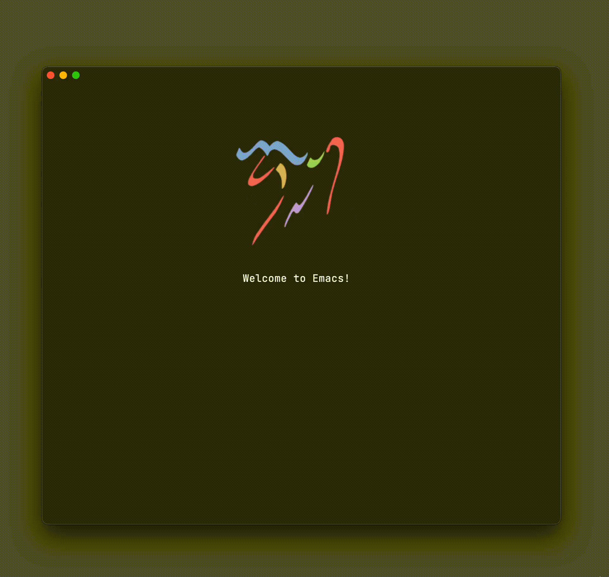

At this point, we now have our bookmark-launching Emacs utility. It's
only an `M-x open-bookmark`{.verbatim} command away, but we want to make
it accessible from anywhere in our operating system, in my case macOS.

Let's enable launching from the command line, though before we do that,
let's craft a dedicated frame for this purpose.

``` emacs-lisp
(defmacro present (&rest body)
  "Create a buffer with BUFFER-NAME and eval BODY in a basic frame."
  (declare (indent 1) (debug t))
  `(let* ((buffer (get-buffer-create (generate-new-buffer-name "*present*")))
          (frame (make-frame '((auto-raise . t)
                               (font . "Menlo 15")
                               (top . 200)
                               (height . 20)
                               (width . 110)
                               (internal-border-width . 20)
                               (left . 0.33)
                               (left-fringe . 0)
                               (line-spacing . 3)
                               (menu-bar-lines . 0)
                               (minibuffer . only)
                               (right-fringe . 0)
                               (tool-bar-lines . 0)
                               (undecorated . t)
                               (unsplittable . t)
                               (vertical-scroll-bars . nil)))))
     (set-face-attribute 'ivy-current-match frame
                         :background "#2a2a2a"
                         :foreground 'unspecified)
     (select-frame frame)
     (select-frame-set-input-focus frame)
     (with-current-buffer buffer
       (condition-case nil
           (unwind-protect
               ,@body
             (delete-frame frame)
             (kill-buffer buffer))
         (quit (delete-frame frame)
               (kill-buffer buffer))))))
```

Most of the snippet styles our new frame and invokes the body parameter.
While I don't typically resort to macros, we get a little syntatic
sugar here, so we can invoke like so:

``` emacs-lisp
(defun present-open-bookmark-frame ()
  (present (browse-url (seq-elt (split-string (completing-read "Open: " (browser-bookmarks "/private/tmp/bookmarks.org")) "\n") 1))))
```

Wrapping our one-liner with the `present-open-bookmark-frame`{.verbatim}
function enables us to easily invoke from the command line, with
something like

``` sh
emacsclient -ne "(present-open-bookmark-frame)"
```

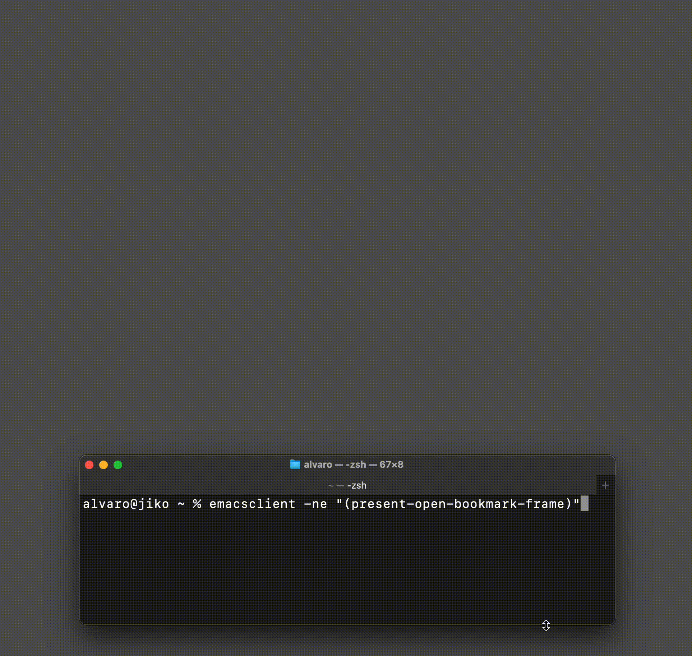

Now that we can easily invoke from the command line, we have the
flexibility to summon from anywhere. We can even bind to a key shortcut,
available anywhere (not just Emacs). I typically do this via
[Hammerspoon](http://www.hammerspoon.org/), with some helpers, though
there are likely simpler options out there.

``` lua
function emacsExecute(activate, elisp)
   if activate then
      activateFirstOf({
            {
               bundleID="org.gnu.Emacs",
               name="Emacs"
            }
      })
   end

   local socket, found = emacsSocketPath()
   if not found then
      hs.alert.show("Could not get emacs socket path")
      return "", false
   end

   local output,success = hs.execute("/opt/homebrew/bin/emacsclient -ne \""..elisp.."\" -s "..socket)
   if not success then
      hs.alert.show("Emacs did not execute: "..elisp)
      return "", false
   end

   return output, success
end

function openBookmark()
   appRequestingEmacs = hs.application.frontmostApplication()
   emacsExecute(false, "(present-open-bookmark-frame)")
   activateFirstOf({
         {
            bundleID="org.gnu.Emacs",
            name="Emacs"
         }
   })
end

hs.hotkey.bind({"alt"}, "W", openBookmark)
```

With that, we have our Emacs-powered bookmark launcher, available from
anywhere.


While we used our Emacs frame presenter to summon our universal bookmark
launcher, we can likely the same mechanism for other purposes. Maybe a
clipboard (kill ring) manager?

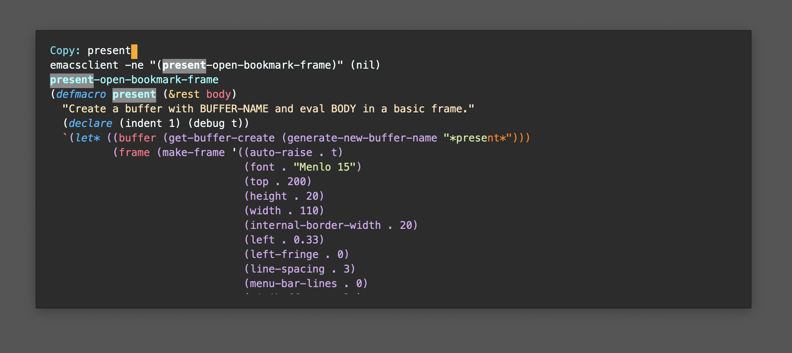

What would you use it for? Get in touch
([Mastodon](https://indieweb.social/@xenodium) /
[Twitter](https://twitter.com/xenodium) /
[Reddit](https://www.reddit.com/user/xenodium) /
[Email](mailto:me__AT__xenodium.com)).

*Enjoying this content? Find it useful? Consider
✨[sponsoring](https://github.com/sponsors/xenodium)✨.*

# Native Emacs/macOS UX integrations via Swift modules

Once you learn a little
[elisp](https://en.wikipedia.org/wiki/Emacs_Lisp),
[Emacs](https://www.gnu.org/software/emacs/) becomes this hyper
malleable editor/platform. A live playground of sorts, where almost
everything is up for grabs at runtime. Throw some elisp at it, and you
can customize or extend almost anything to your heart's content. I say
almost, as there's a comparatively small native core, that would
typically require recompiling if you wanted to make further (native)
mods. But that isn't entirely true. [Emacs
25](https://www.masteringemacs.org/article/whats-new-in-emacs-25-1)
enabled us to further extend things by loading native [dynamic
modules](https://www.gnu.org/software/emacs/manual/html_node/elisp/Dynamic-Modules.html),
back in 2016.

Most of my Emacs-bending adventures have been powered by elisp,
primarily on macOS. I also happen to have an iOS dev background, so when
[Valeriy Savchenko](https://github.com/SavchenkoValeriy)
[announced](https://www.reddit.com/r/emacs/comments/wemj1z/writing_emacs_dynamic_modules_in_swift/)
his project bringing [Emacs dynamic modules powered by
Swift](https://github.com/SavchenkoValeriy/emacs-swift-module), I added
it to my never-ending list of things to try out.

Fast-forward to a year later, and [Roife](https://github.com/roife)'s
[introduction](https://www.reddit.com/r/emacs/comments/17vrmrk/emt_emacs_macos_tokenizer_for_enhanced_cjk_word/)
to [emt](https://github.com/roife/emt) finally gave me that much-needed
nudge to give
[emacs-swift-module](https://github.com/SavchenkoValeriy/emacs-swift-module)
a try. While I wish I had done it earlier, I also wish
[emacs-swift-module](https://github.com/SavchenkoValeriy/emacs-swift-module)
had gotten more visibility. Native extensions written in Swift can open
up some some neat integrations using native macOS UX/APIs.

While I'm new to Savchenko's
[emacs-swift-module](https://github.com/SavchenkoValeriy/emacs-swift-module),
the project has [wonderful
documentation](https://savchenkovaleriy.github.io/emacs-swift-module/documentation/emacsswiftmodule/).
It quickly got me on my way to build an experimental dynamic module
introducing a native context menu for sharing files from my beloved
editor.

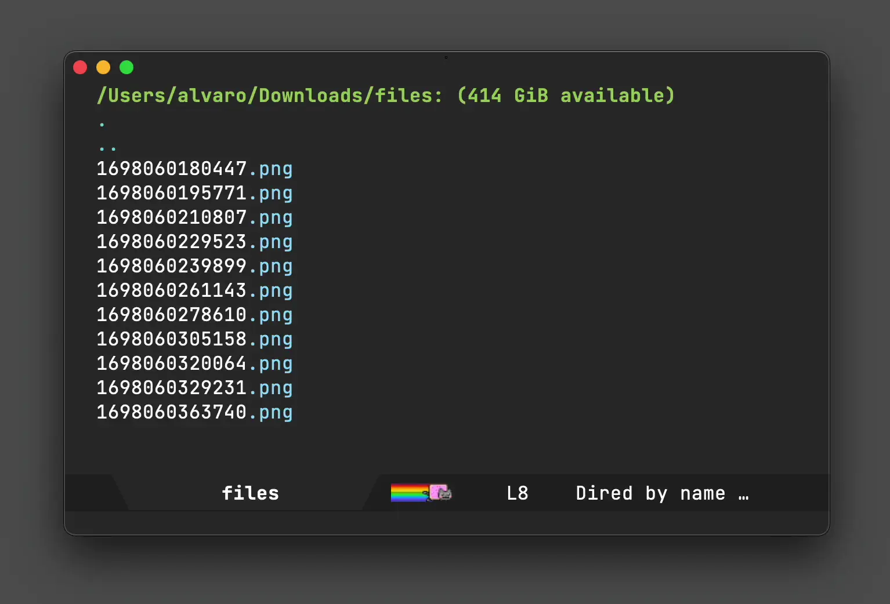

Most of the elisp/native bridging magic happens with fairly little Swift
code:

``` swift
try env.defun(
  "macos-module--share",
  with: """
    Share files in ARG1.

    ARG1 must be a vector (not a list) of file paths.
    """
) { (env: Environment, files: [String]) in
  let urls = files.map { URL(fileURLWithPath: $0) }

  let picker = NSSharingServicePicker(items: urls)
  guard let view = NSApp.mainWindow?.contentView else {
    return
  }

  let x = try env.funcall("macos--emacs-point-x") as Int
  let y = try env.funcall("macos--emacs-point-y") as Int

  let rect = NSRect(
    x: x + 15, y: Int(view.bounds.height) - y + 15, width: 1, height: 1
  )
  picker.show(relativeTo: rect, of: view, preferredEdge: .maxY)
}
```

This produced an elisp `macos-module--share`{.verbatim} function I could
easily access from elisp like so:

``` emacs-lisp
(defun macos-share ()
  "Share file(s) with other macOS apps.

If visiting a buffer with associated file, share it.

While in `dired', any selected files, share those.  If region is
active, share files in region.  Otherwise share file at point."
  (interactive)
  (macos-module--share (vconcat (macos--files-dwim))))
```

On a side note, `(macos--files-dwim)`{.verbatim} chooses files depending
on context. That is, [do what I mean (DWIM)
style](https://xenodium.com/emacs-dwim-do-what-i-mean/). If there's a
file associated with current buffer, share it. When in
[dired](https://www.gnu.org/software/emacs/manual/html_node/emacs/Dired.html)
(the directory editor, aka file manager), look at region, selected
files, or default to file at point.

``` emacs-lisp
(defun macos--files-dwim ()
  "Return buffer file (if available) or marked/region files for a `dired' buffer."
  (if (buffer-file-name)
      (list (buffer-file-name))
    (or
     (macos--dired-paths-in-region)
     (dired-get-marked-files))))

(defun macos--dired-paths-in-region ()
  "If `dired' buffer, return region files.  nil otherwise."
  (when (and (equal major-mode 'dired-mode)
             (use-region-p))
    (let ((start (region-beginning))
          (end (region-end))
          (paths))
      (save-excursion
        (save-restriction
          (goto-char start)
          (while (< (point) end)
            ;; Skip non-file lines.
            (while (and (< (point) end) (dired-between-files))
              (forward-line 1))
            (when (dired-get-filename nil t)
              (setq paths (append paths (list (dired-get-filename nil t)))))
            (forward-line 1))))
      paths)))
```

I got one more example of a native macOS integration I added. Being an
even simpler one, and in hindsight, I prolly should have introduced it
first. In any case, this one reveals
[dired](https://www.gnu.org/software/emacs/manual/html_node/emacs/Dired.html)
files in macOS's Finder app (including the selection itself).


``` swift
try env.defun(
  "macos-module--reveal-in-finder",
  with: """
    Reveal (and select) files in ARG1 in macOS Finder.

    ARG1 mus be a vector (not a list) of file paths.
    """
) { (env: Environment, files: [String]) in
  NSWorkspace.shared.activateFileViewerSelecting(files.map { URL(fileURLWithPath: $0) })
}
```

The corresponding elisp is nearly identical to its
`macos-share`{.verbatim} sibling:

``` emacs-lisp
(defun macos-reveal-in-finder ()
  "Reveal file(s) in macOS Finder.

If visiting a buffer with associated file, reveal it.

While in `dired', any selected files, reveal those.  If region is
active, reveal files in region.  Otherwise reveal file at point."
  (interactive)
  (macos-module--reveal-in-finder (vconcat (macos--files-dwim))))
```

My Swift module experiment introduces two native macOS UX integrations,
now available via `M-x macos-share`{.verbatim} and
`M-x macos-reveal-in-finder`{.verbatim}. I've pushed all code to it's
own [repo](https://github.com/xenodium/EmacsMacOSModule).

I hope this post brings visibility to the wonderful
[emacs-swift-module](https://github.com/SavchenkoValeriy/emacs-swift-module)
project and sparks new, native, and innovative integrations for those on
macOS. Can't wait to see what others can do with it.

*Enjoying this content? Find it useful? Consider
✨[sponsoring](https://github.com/sponsors/xenodium)✨.*

# Migrating/re-encrypting pass's password store

Note to self, I needed to migrate/re-encrypt someone's password store
(aka pass). Straightforward:

Get the new key, probably already in gpg key chain. Try listing it:

``` sh
gpg --list-keys
```

To re-encrypt, `pass init`{.verbatim} with new key is enough. It'll
prompt for old pass key.

``` sh
cd path/to/.password-store
pass init NEW-GPG-KEY
```

# How I smash burgers

I'm neither a burger expert nor a connoisseur of any kind, yet I sure
have a lot of fun smashing burgers at home. Needless to say, I
shamelessly enjoy gobbling them too!

<figure width="60%">

<figcaption>my smash burger</figcaption>
</figure>

I'll share details on how I smash my burgers, but here's a quick
ingredient list, if that's all you need.

-   Mince beef (20%-30% fat).
-   Streaky bacon.
-   Brioche burger buns.
-   American cheese slices (cheddar individual slices work too).
-   Lettuce.
-   Tomatoes.
-   Onions.
-   Pickles.
-   Jalapeños.
-   Garlic.
-   Chipotle powder.
-   Mayonnaise.
-   Salt.
-   Pepper.
-   Oil.
-   Greaseproof paper.
-   Butter.

## The calling

My quest to smash burgers at home didn't start until earlier this year,
while watching the [The Menu](https://www.imdb.com/title/tt9764362/). I
just could't stop [craving the
burger](https://indieweb.social/@xenodium/109734285674122246) from that
scene, so I set out to start smashing my own.


## The gear

Don't rush to buy anything fancy. Your existing gear will likely do the
job just fine. I'd say try a few things out and only upgrade when
needed. I'll share the gear I use and where I felt I needed tweaking.

## Skillet

While I didn't have a griddle at home, I did have a couple of trusty
[Lodge](https://www.lodgecastiron.com/) **skillets** ([cast
iron](https://www.lodgecastiron.com/product/round-cast-iron-classic-skillet?sku=L8SK3)
and [carbon
steel](https://www.lodgecastiron.com/product/carbon-steel-skillet?sku=CRS12)).
Both work great for burgers, though I have a slight preference for the
carbon steel one, as it's the bigger of the two and gives a little more
room for manoeuvring, specially when smashing two burgers at a time.


Heat the skillet up and add a little oil. If the oil starts smoking, be
quick to drop the patties and start smashing.

## Grill Spatula (too big/stiff for skillet)

Somewhat inspired by the film, I got myself a wide spatula so I could
firmly press those patties against the skillet, and to flip of course.

While this kind of spatula may work well on a spacious griddle, I felt
constrained on a relatively small cast iron. Specially when flipping. I
went looking for an alternative.


## Spatula + smasher (my winning combo)

Over at the [r/castiron](https://reddit.com/r/castiron/) subreddit, I
discovered fish spatulas. They are fairly agile on cast irons but also
work great for loosening burger patties before flipping.


While effective for flipping, fish spatulas are obviously no good for
smashing. So I got myself a burger smasher. This combo worked well for
me.


When smashing, use greaseproof paper to prevent the patties from
sticking to the smasher.

## Ingredients

While I've drawn inspiration from others, I've landed on my own
preferred ingredients. I'm sure that will continue changing over time.
Pick and choose as your heart desires.

## Minced/ground beef

Minced beef with higher fat content (around 20-30%) is often recommended
for a couple of reasons:

-   Flavour: Fat equals flavour in cooking. The higher fat content will
    melt during cooking and become 'self-basting', resulting in a
    juicier and more flavourful burger.

-   Texture: The fat in the beef melts under heat, helping the burger
    achieve a crispy, caramelized exterior known as the [Maillard
    reaction](https://en.wikipedia.org/wiki/Maillard_reaction), which
    contrasts nicely against the soft, juicy interior.

In the UK, I can typically find minced beef with 15%-20% fat content at
the main supermarkets.


Be sure to salt and pepper to taste (as in picture) on one side. Once
flipped on pan, salt and pepper the other side.

## Bacon

I tend to prefer smoked streaky bacon, but hey these will be your
burgers. Your burgers, your rules.


## Buns (brioche)

I hear potato buns are great for burgers. I've yet to try them. So far,
I've settled for brioche. I happen to find these near me, so I've gone
with them.


Butter the buns and brown on the skillet for a minute. Check the buns
often. Brioche buns can burn quickly.

## American cheese

American cheese is often the burger cheese of choice.


While American cheese isn't widely available in the UK, the
individually wrapped orange-looking cheddar cheese slices work just
fine.


## Toppings

I like my burgers with lettuce, tomatoes, onions, pickles, and
occasionally jalapeños. For pickles, I typically just take cornichons
and slice them up.


## Burger sauce (chipotle/garlic/mayo)

While classic burger sauce is often made with mayo, ketchup, pickles,
and mustard, I've gone fairly rogue here.

You see, I love chipotle mayo. I'm also a fan of garlic mayo, so I
figured why not both? Turns out these three ingredients work great
together.

I like to draw out the flavours by first mixing the garlic and chipotle
with a little hot water.

-   1 garlic clove.
-   2 teaspoons of chipotle powder.
-   1 tablespoon of hot water.
-   Pinch of salt.


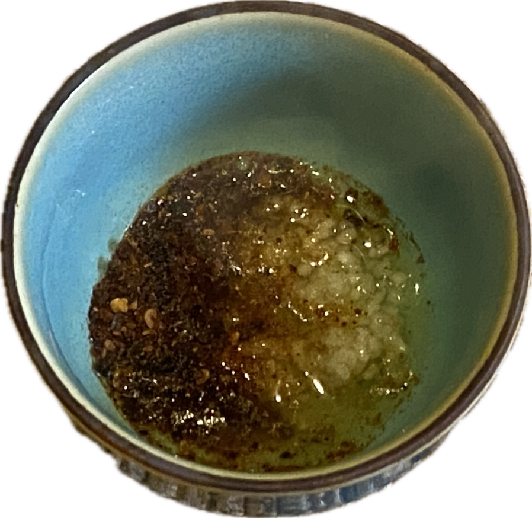


...and then thicken with mayo.

-   1/4 cup of mayo.


These are very rough measurements, tweak to your preference. Make more
garlicky, spicier, or soften things by adding garlic, chipotle, or mayo.

## Assembling

I like to assemble in the following order from the bottom bun up.

1.  Sauce on bottom bun.
2.  Lettuce.
3.  Tomatoes.
4.  Onions.
5.  2 patties (melted cheese on both).
6.  Bacon.
7.  Pickles.
8.  Jalapeños.
9.  Sauce on top bun (oops, I forgot in the picture).


...and here's the final product.


If you gave smashing burgers a go, I'd love to hear about it. Also any
tips are very much welcome. Get in touch
([Mastodon](https://indieweb.social/@xenodium) /
[Twitter](https://twitter.com/xenodium) /
[Reddit](https://www.reddit.com/user/xenodium) /
[Email](mailto:me__AT__xenodium.com)).

# Open in Xcode at line number

I live mostly in Emacs. I say mostly 'cause well, I'm fairly pragmatic
about it. If there's a workflow elsewhere that's more appropriate for
my needs, I'll happily use that instead. While I'd love to do my web
browsing from my beloved editor, Firefox ticks the right boxes for me.

I do most of my iOS coding in Emacs. It's a hybrid of sorts between
Emacs and Xcode. If I need to use the debugger, Xcode is a clear winner
for me. If I happen to be visiting a Swift file in an Emacs buffer, I
typically used the handy `crux-open-with`{.verbatim} from
[crux](https://github.com/bbatsov/crux) to open in Xcode, and continue
from there. This worked OK, but I always wished opening in Xcode would
also jump to the same line number as the Emacs point (cursor) location.
This is particularly useful if I had just spotted where I'd like to set
a breakpoint in an Emacs buffer and need to transition over to Xcode.

It turns out, there's a nifty command line utility for that.
[xed](https://www.unix.com/man-page/osx/1/xed/), the Xcode text editor
invocation tool. It enables telling Xcode what file to open and at what
line number:

``` sh
xed -line 141 path/to/some/file.swift
```

With that in mind, I've added my own version of
`crux-open-with`{.verbatim}, using
[dwim-shell-command](https://github.com/xenodium/dwim-shell-command).

When running on macOS, the function checks whether or not I'm visiting
a buffer for a programming language, and opens the file in Xcode at the
same line number.

``` emacs-lisp
(defun dwim-shell-commands-open-externally ()
  "Open file(s) externally."
  (interactive)
  (dwim-shell-command-on-marked-files
   "Open externally"
   (if (eq system-type 'darwin)
       (if (derived-mode-p 'prog-mode)
           (format "xed --line %d '<<f>>'"
                   (line-number-at-pos (point)))
         "open '<<f>>'")
     "xdg-open '<<f>>'")
   :shell-args '("-x" "-c")
   :silent-success t
   :utils (if (eq system-type 'darwin)
              "open"
            "xdg-open")))
```

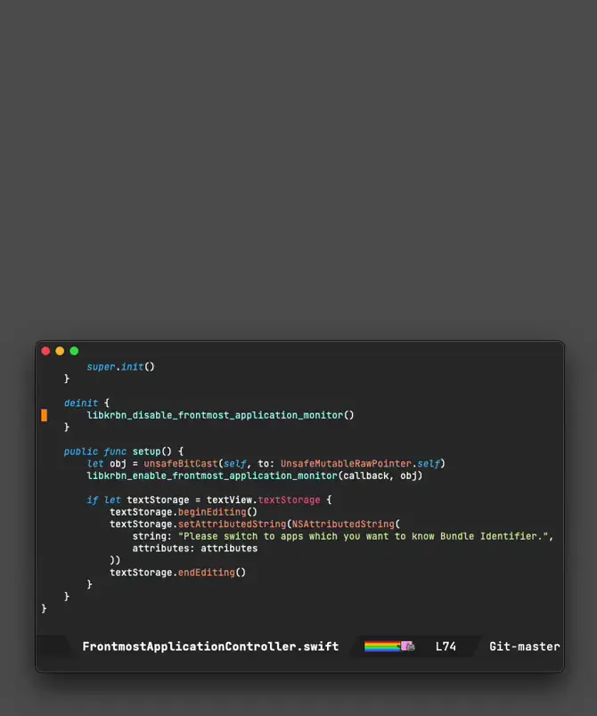

`dwim-shell-commands-open-externally`{.verbatim} is now [added to
dwim-shell-commands.el](https://github.com/xenodium/dwim-shell-command/commit/19be1c2f3792c95f04fd369cb931a52f7df9cfd5).

ps. If you find opening the same file in a different context handy, you
may also like the package
[browse-at-remote](https://github.com/rmuslimov/browse-at-remote) that
opens the visited file at its corresponding remote location (for
example, GitHub). I can never remember the name of the function
([browse-at-remote](https://github.com/rmuslimov/browse-at-remote)), so
I aliased it to something I'd remember and moved on...

``` emacs-lisp
(defalias 'ar/open-at-github #'browse-at-remote))
```

# Trimming video screenshots

A quick one... I recently wanted to trim the black borders around a
video screenshot. While I could use an image editor to manually select
and trim, I wondered if there was an
[imagemagick](https://imagemagick.org/) trick somewhere out there for
such a thing... and of course there was:

``` sh
magick convert -fuzz 3% -define trim:percent-background=0% -trim +repage path/to/input.png path/to/output.png
```

Pretty neat. It does the job, but I won't remember it next time. May as
well make another
[dwim-shell-command](https://github.com/xenodium/dwim-shell-command)
function out of it and conveniently invoke from Emacs via a memorable
name plus fuzzy search.

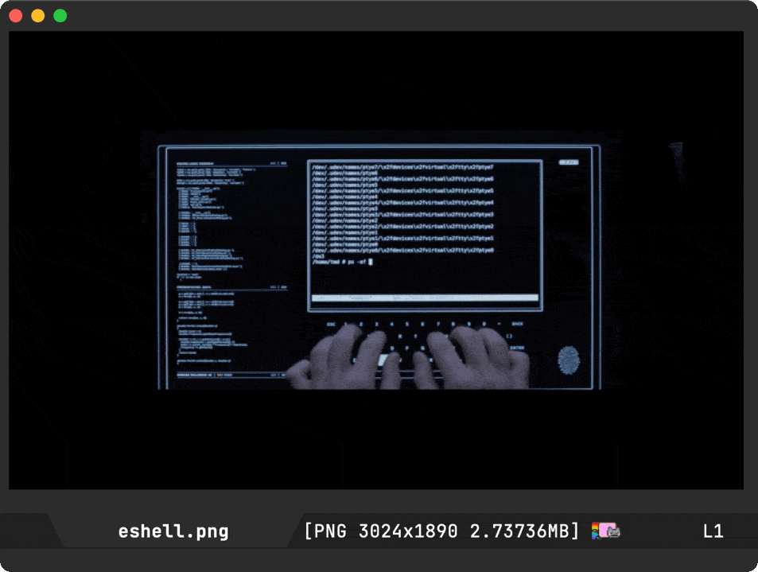

``` emacs-lisp
(defun dwim-shell-commands-image-trim-borders ()
  "Trim image(s) border (useful for video screenshots)."
  (interactive)
  (dwim-shell-command-on-marked-files
   "Trim image border"
   "magick convert -fuzz 3% -define trim:percent-background=0% -trim +repage '<<f>>' '<<fne>>_trimmed.<<e>>'"
   :utils "magick"))
```

While the screenshot I've just used was a little blurry, it's from the
movie [Tron Legacy](https://www.imdb.com/title/tt1104001/), and it
features Emacs eshell. This is old news, though [well
covered](https://irreal.org/blog/?p=9573).


`dwim-shell-commands-image-trim-borders`{.verbatim} is now [added to
dwim-shell-commands.el](https://github.com/xenodium/dwim-shell-command/commit/5bed2f6b40761db4913c8d8f58bb147c71a9ceb7)

# Displaying image details in mode line

A benefit of running Emacs as a GUI app, is that you can view images
from your beloved editor. This is super handy to take a quick peek at
any image.

Sometimes, I'd like a little more than just viewing the image. I'd
like to see basic image details like type, dimensions, and file size.
The [imagemagick](https://imagemagick.org/) `identify`{.verbatim}
utility is pretty handy for that.

``` bash
identify -format "%m %wx%h %b" path/to/image.png
```

I could easily invoke `shell-command`{.verbatim} for this or even create
a [dwim-shell-command](https://github.com/xenodium/dwim-shell-command)
function (maybe I will), but if this info was proactively displayed in
the mode line, I wouldn't have to fetch it myself.

Since I know I can use the `identify`{.verbatim} command for this, I may
as well see if I can plug it into the mode line.

Turns out this wasn't too bad by setting
`setting mode-line-format`{.verbatim}. I added a little logic to only
include image details while in `image-mode`{.verbatim} and rely on
`process-lines`{.verbatim} to fetch the details. This function returns a
list, which is a happy coincidence since `mode-line-format`{.verbatim}
also expects a list.

``` emacs-lisp
(setq-default mode-line-format
              '(" "
                mode-line-front-space
                mode-line-client
                mode-line-frame-identification
                mode-line-buffer-identification
                (:eval
                 (when (eq major-mode 'image-mode)
                   ;; Needs imagemagick installed.
                   (process-lines "identify" "-format" "[%m %wx%h %b]" (buffer-file-name))))
                " "
                mode-line-position
                (vc-mode vc-mode)
                (multiple-cursors-mode mc/mode-line)
                " " mode-line-modes
                mode-line-end-spaces))
```


I'd love to hear if there's a pure elisp alternative
([mastodon](https://indieweb.social/@xenodium)/[twitter](https://twitter.com/xenodium)).
I gave `(image-size (image-get-display-property) :pixels)`{.verbatim} a
try, but that seemed to return the display size in buffer rather than
actual file size.

# Creating an iCloud account (via tart VM)

I wanted an additional \@icloud.com account for myself. My first thought
was to head over to <https://developer.apple.com> and create a new
account, but that requires an existing email address. I wanted an actual
\@icloud.com email address.


My next thought was to create a new account using the iOS simulator, but
that complained about creating too many accounts already. Strange, as I
hadn't created any.


I could create an account from macOS settings itself, though that would
require logging out my current account (and the syncing implications).
To get around that, I could maybe create a temporary macOS user.
Instead, I somewhat revisited the simulator route and looked for a VM
option to run macOS. This gave me an excuse to play with VM options on
macOS.

I had been meaning to check out [lima](https://github.com/lima-vm/lima)
as per Hacker News's [Lima: A nice way to run Linux VMs on
Mac](https://news.ycombinator.com/item?id=36668964). The Hacker News's
[thread](https://news.ycombinator.com/item?id=36668964) has a handful of
great recommendations. Amongst them,
[tart](https://github.com/cirruslabs/tart/) (macOS and Linux VMs on
Apple Silicon) stood out, as it also gave me the Mac on Mac option.

Installing `tart`{.verbatim} via [Homebrew](https://brew.sh/) followed
the typical `brew`{.verbatim} command... a breeze via my trusty Emacs
[eshell](https://www.masteringemacs.org/article/complete-guide-mastering-eshell):

``` sh
brew install cirruslabs/cli/tart
```

Cloning a VM image, while straightforward, it did take a little while
for the chunky download:

``` sh
tart clone ghcr.io/cirruslabs/macos-sonoma-base:latest sonoma-base
```

Running the macOS Sonoma VM was a breeze:

``` sh
tart run sonoma-base
```

...and with that, I got a full (and disposable) macOS VM I can use to
create another \@icloud.com account:


While there may be simpler options out there to create an \@icloud.com
account (please do let me know
[mastodon](https://indieweb.social/@xenodium)/[twitter](https://twitter.com/xenodium)),
the VM did the job. I'd been meaning to find a low friction mechanism
to run VMs for a different reason, but that's a post for another time.

# Virtual machine (VM) bookmarks

::: {.MODIFIED .drawer}
\[2023-10-04 Wed\]
:::

-   [colima: Container runtimes on macOS (and Linux) with
    minima...](https://github.com/abiosoft/colima).
-   [finch: The Finch CLI an open source client for container
    development](https://github.com/runfinch/finch).
-   [lima VM - Linux Virtual Machines On macOS - Earthly
    Blog](https://earthly.dev/blog/lima/).
-   [lima: A nice way to run Linux VMs on Mac \| Hacker
    News](https://news.ycombinator.com/item?id=36668964).
-   [lima: Linux virtual machines](https://github.com/lima-vm/lima).
-   [macpine: Lightweight Linux VMs on
    MacOS](https://github.com/beringresearch/macpine).
-   [OrbStack · Fast, light, simple Docker & Linux on
    macOS](https://orbstack.dev/).
-   [tart: macOS and Linux VMs on Apple Silicon to use in CI
    a...](https://github.com/cirruslabs/tart/).
-   [Virtualisation on Apple silicon -- The Eclectic Light
    Company](https://eclecticlight.co/virtualisation-on-apple-silicon/).

# Emacs hangs saving .authinfo.gpg (workaround)

My Emacs (v29.1) was hanging when saving changes to .authinfo.gpg. Turns
out, I ran into a [known
issue](http://git.savannah.gnu.org/cgit/emacs.git/commit/etc/PROBLEMS?id=1b9812af80b6ceec8418636dbf84c0fbcd3ab694)
with a workaround. Downgrading gnupgp to a version older than 2.4.1
sorts things out.

I'm on macOS. Downgraded by downloading the 2.4.0 Homebrew formula at
<https://raw.githubusercontent.com/Homebrew/homebrew-core/59edfe598541186430d49cc34f42671e849e2fc9/Formula/gnupg.rb>
and installing with:

``` sh
brew unlink gnupg
brew install ~/Downloads/gnupg.rb
```

# Redact that buffer

As I was getting ready to take an Emacs screenshot in the [previous
post](https://xenodium.com/emacs-send-to-kindle/), I figured I may want
to redact email addresses before moving forward. I had a quick look for
existing options and found
[redacted.el](https://github.com/bkaestner/redacted.el), built-in
`toggle-rot13-mode`{.verbatim}, and
[unpackaged/lorem-ipsum-overlay](https://github.com/alphapapa/unpackaged.el#obfuscate-buffer-text-with-lorem-ipsum-words).
All great options. I wanted a solution I could feed a single regular
expression to obscure matches. I also wanted toggling capabilities, so I
had a quick go at it...

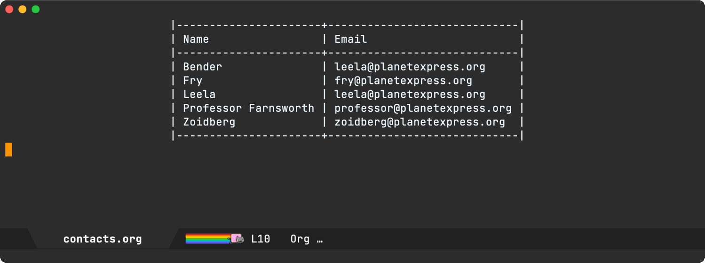

I also wanted the ability to redact the entire buffer content, so
feeding a space to the regexp query also translates to
`[[:graph:]]`{.verbatim}, effectively redacting all visible characters.

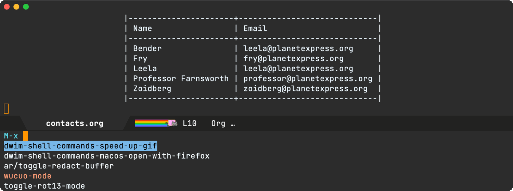

The solution is overlay-based, ensuring the buffer content remains
unchanged. The function may have its own rough edges, yet it certainly
scratched the itch for the current need. I'll leave ya with the
snippet.

``` emacs-lisp
(defun ar/toggle-redact-buffer ()
  "Redact buffer content matching regexp. A space redacts all."
  (interactive)
  (let* ((redacted)
         (regexp (string-trim (read-regexp "Redact regexp" 'regexp-history-last)))
         (matches (let ((results '()))
                    (when (string-empty-p regexp)
                      (setq regexp "[[:graph:]]")
                      (setq regexp-history-last regexp)
                      (add-to-history 'regexp-history regexp))
                    (save-excursion
                      (goto-char (point-min))
                      (while (re-search-forward regexp nil t)
                        (push (cons (match-beginning 0) (match-end 0)) results)))
                    (nreverse results))))
    (mapc (lambda (match)
            (dolist (overlay (overlays-in (car match) (cdr match)))
              (setq redacted t)
              (delete-overlay overlay))
            (unless redacted
              (overlay-put (make-overlay (car match) (cdr match))
                           'display (make-string (- (cdr match) (car match)) ?x))))
          matches)))
```

# Send note to Kindle

While on Mastodon, I spotted
[\@summeremacs](https://indieweb.social/@summeremacs@fashionsocial.host)
looking into [sending Emacs text selections to a Kindle via
email](https://indieweb.social/@summeremacs@fashionsocial.host/111058226788825431).
This sparked my interest as I previously looked into [sending pdfs to my
Kindle](https://xenodium.com/emailing-pdfs-to-kindle-from-mu4e/) via
[mu4e](https://github.com/djcb/mu).

Kindle offers a neat service where you can email a file to your
`@kindle.com`{.verbatim} address and it automatically shows up in your
Kindle library.

I already do email from my beloved editor, and like most Emacs things,
it's powered by [elisp](https://en.wikipedia.org/wiki/Emacs_Lisp). In
other words, it's basically up for grabs if you'd like to glue it to
anything else, so I did...

I can now select a region and invoke
`M-x send-to-kindle-as-txt`{.verbatim} to send it over to my Kindle.

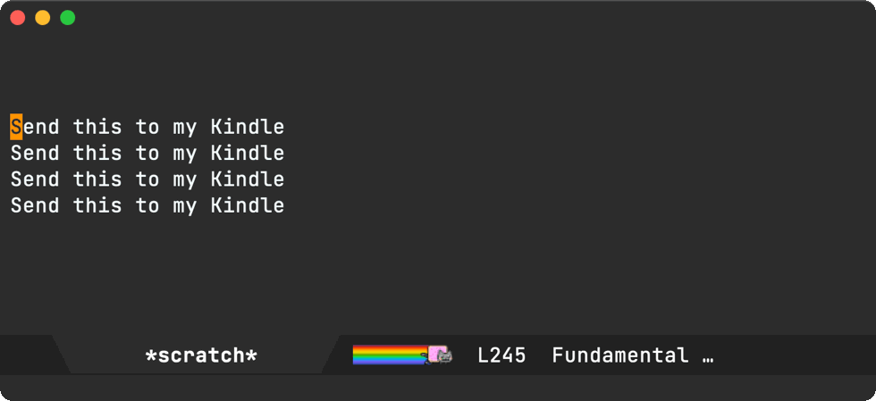

Soon enough, the note shows up on my Kindle.

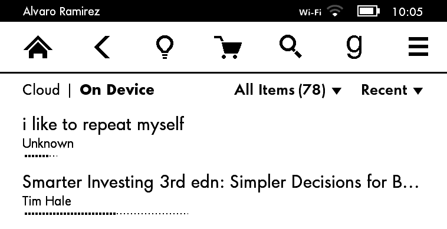

Opening the note reveals the same content we had previously selected and
sent from our malleable editor.


While it looks kinda magical, it's fairly simple under the hood. It
takes the region content, writes it to a txt file, creates an email
message buffer attaching the file, and finally sends via
`message-send-and-exit`{.verbatim}.

If `M-x send-to-kindle-as-txt`{.verbatim} is invoked with a
`C-u`{.verbatim} prefix, you get to inspect the message buffer right
before sending via `C-c C-c`{.verbatim}.

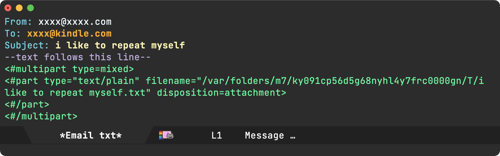

Here's the full snippet.

``` emacs-lisp
(defcustom send-to-kindle-from-email
  nil
  "Your own email address to send from via mu4e."
  :type 'string
  :group 'send-to-kindle)

(defcustom send-to-kindle-to-email
  nil
  "Your Kindle email address to send pdf to."
  :type 'string
  :group 'send-to-kindle)

(defun send-to-kindle-as-txt (review)
  (interactive "P")
  (unless send-to-kindle-from-email
    (setq send-to-kindle-from-email
          (read-string "From email address: ")))
  (unless send-to-kindle-to-email
    (setq send-to-kindle-to-email
          (read-string "To email address: ")))
  (let* ((content (string-trim (if (region-active-p)
                                   (buffer-substring (region-beginning) (region-end))
                                 (buffer-string))))
         (note-name (let ((name (string-trim (read-string "Note name: "))))
                      (if (string-empty-p name)
                          (nth
                           0 (string-split
                              (substring content 0 (min 40 (length content))) "\n"))
                        name)))
         (path (concat (temporary-file-directory) note-name))
         (txt (concat path ".txt"))
         (buffer (get-buffer-create (generate-new-buffer-name "*Email txt*"))))
    (with-temp-buffer
      (insert content)
      (write-file txt))
    (with-current-buffer buffer
      (erase-buffer)
      ;; Disable hooks
      (let ((message-mode-hook nil))
        (message-mode))
      (insert
       (format
        "From: %s
To: %s
Subject: %s
--text follows this line--
<#multipart type=mixed>
<#part type=\"text/plain\" filename=\"%s\" disposition=attachment>
<#/part>
<#/multipart>"
        send-to-kindle-from-email
        send-to-kindle-to-email
        note-name txt))
      (unless review
        (message-send-and-exit)))
    (when review
      (switch-to-buffer buffer))))
```

By the way, and I only just learned this today... To take a screenshot
on a Kindle Paperwhite, tap on these opposite corners.


# SHA-256 hash from URL, the easy way

From time to time, I need to generate a SHA-256 hash from a file hosted
on some server. For me, this flow typically goes something along the
lines of:

-   Copy the file URL from browser.
-   Drop to Emacs eshell.
-   Change current directory.
-   Type \"curl -o file\"
-   Paste the file URL.
-   Run curl command.
-   Type \"shasum -a 256 file\".
-   Run [shasum](https://linux.die.net/man/1/shasum) command.
-   Copy the generated hash.
-   Maybe delete the downloaded file?

We can maybe shave some steps off by downloading directly from the
browser, though that may also bring additional clicks and navigating to
a download location.

Amongst the steps, [shasum](https://linux.die.net/man/1/shasum) is the
star player, and its output can be seen below.

``` bash
shasum -a 256 path/to/downloaded/file
```

Not a huge deal. One can copy the hash from the output, but why go
through multiple small manual steps when I know I can get Emacs to
simplify the lot? I've expedited a similar flow in the past when
[cloning git
repos](https://xenodium.com/emacs-clone-git-repo-from-clipboard/).
Let's simplify again so hashing a hosted file boils down to:

-   Copy the file URL from browser.
-   Run an Emacs interactive command.

This is where I pull out
[dwim-shell-command](https://github.com/xenodium/dwim-shell-command) (a
little package I wrote) and glue the lot to get an expedited experience.

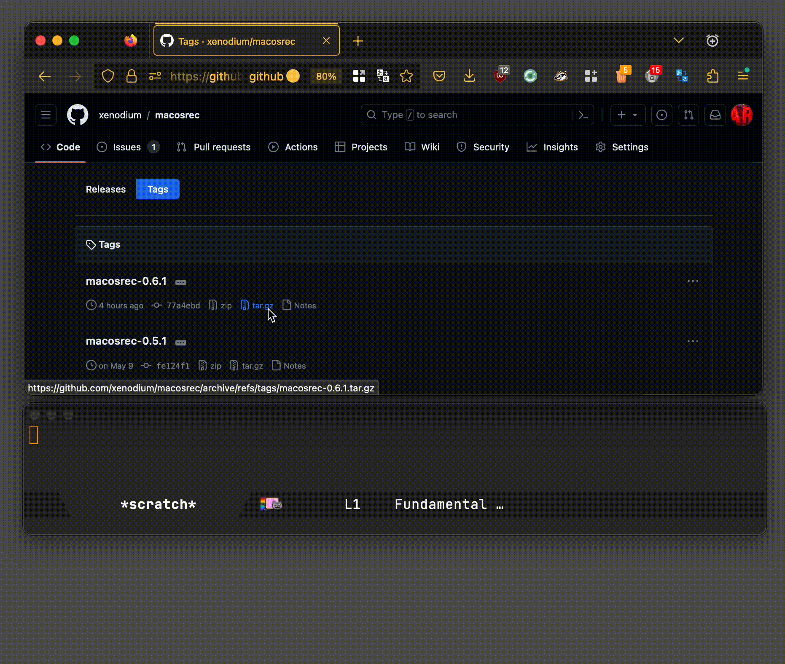

There isn't much to the function other than glueing a little elisp and
a shell script via `dwim-shell-command`{.verbatim} for some buffer/error
handling.

``` emacs-lisp
(defun dwim-shell-commands-sha-256-hash-file-at-clipboard-url ()
  "Download file at clipboard URL and generate SHA-256 hash."
  (interactive)
  (let ((url (current-kill 0)))
    (unless (string-match-p "^http[s]?://" url)
      (user-error "No URL in clipboard"))
    (dwim-shell-command-on-marked-files
     "Generate SHA-256 hash from clipboard URL."
     (format
      "temp_file=$(mktemp)
       function cleanup {
         rm -f $temp_file
       }
       trap cleanup EXIT
       curl --no-progress-meter --location --fail --output $temp_file %s || exit 1
       shasum -a 256 $temp_file | awk '{print $1}'"
      (shell-quote-argument url))
     :utils '("curl" "shasum")
     :on-completion
     (lambda (buffer process)
       (if-let ((success (= (process-exit-status process) 0))
                (hash (with-current-buffer buffer
                        (string-trim (buffer-string)))))
           (progn
             (kill-buffer buffer)
             (kill-new hash)
             (message "Copied %s to clipboard"
                      (propertize hash 'face 'font-lock-string-face)))
         (switch-to-buffer buffer))))))
```

`dwim-shell-commands-sha-256-hash-file-at-clipboard-url`{.verbatim} is
now in
[dwim-shell-commands.el](https://github.com/xenodium/dwim-shell-command/blob/main/dwim-shell-commands.el),
the optional counterpart in
[dwim-shell-command](https://github.com/xenodium/dwim-shell-command/).

## UPDATE

There's better way. Thanks to [Philip
Kaludercic](https://emacs.ch/@pkal) for
[suggesting](https://emacs.ch/@pkal/111041928308815477)
`curl -s example.com | sha256sum - | cut -d " " -f1`{.verbatim} and
[Sacha Chua](https://emacs.ch/@sachac) who pinged me about it.

Also note I'm now relying on the `<<cb>>`{.verbatim} template, since
dwim-shell-command replaces it with the clipboard/kill ring.

``` emacs-lisp
(defun dwim-shell-commands-sha-256-hash-file-at-clipboard-url ()
  "Download file at clipboard URL and generate SHA-256 hash."
  (interactive)
  (unless (string-match-p "^http[s]?://" (current-kill 0))
    (user-error "No URL in clipboard"))
  (dwim-shell-command-on-marked-files
   "Generate SHA-256 hash from clipboard URL."
   "curl -s '<<cb>>' | sha256sum - | cut -d ' ' -f1"
   :utils '("curl" "sha256sum")
   :on-completion
   (lambda (buffer process)
     (if-let ((success (= (process-exit-status process) 0))
              (hash (with-current-buffer buffer
                      (string-trim (buffer-string)))))
         (progn
           (kill-buffer buffer)
           (kill-new hash)
           (message "Copied %s to clipboard"
                    (propertize hash 'face 'font-lock-string-face)))
       (switch-to-buffer buffer)))))
```

# Inline previous result and why you should edebug

Artur Malabarba's [Debugging Elisp Part 1: Earn your
independence](https://endlessparentheses.com/debugging-emacs-lisp-part-1-earn-your-independence.html)
is nearly a decade old, yet it rings just as true today.

Learning to Edebug really *\"is the right decision for anyone who
doesn't know how to Edebug.\"* Why, you may ask? He best puts it as
*\"running into errors is not only a consequence of tinkering with your
editor, it is the only road to graduating in Emacs.\"*

For me personally, it *earned me that independence* to bend Emacs my
way. Don't like how something works? Pull up the debugger to help me
understand how a package or function works. I've done this countless of
times to bend things my way.

Speaking of edebug, I had been meaning to tweak edebug's result display
behaviour for quite some time. As you step through code, edbug prints
the result of previous expressions to the minibuffer. This works well,
but I couldn't help but feel like my eyes were constantly jumping
between the code and the minibuffer at the bottom of the window.

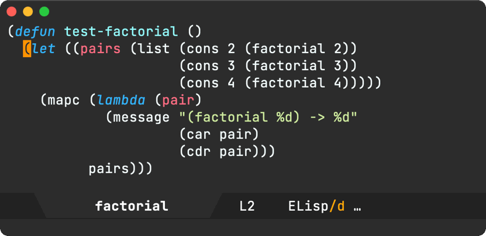

I wanted to minimize the eye jumping experience, so I figured I could
likely bend things my way and print the result at point. How did I go
about it? The same way I often do. Figure out what function is called
for a given key binding via
[describe-key](https://www.gnu.org/software/emacs/manual/html_node/emacs/Key-Help.html)
or my favourite replacement helpful-key from
[helpful.el](https://github.com/Wilfred/helpful). This led me to
`edebug-next-mode`{.verbatim} in `edebug.el`{.verbatim}. At that point,
I could have set a breakpoint in `edebug-next-mode`{.verbatim} and
eventually step into the relevant code, but hey we had a better clue. We
knew that all output started with \"Result:\", so we could just search
for that string in `edebug.el`{.verbatim} instead. Jackpot!
`edebug-compute-previous-result`{.verbatim} and its adjacent
`edebug-previous-result`{.verbatim} are just the right functions:

``` emacs-lisp
(defun edebug-compute-previous-result (previous-value)
  (if edebug-unwrap-results
      (setq previous-value
            (edebug-unwrap* previous-value)))
  (setq edebug-previous-result
        (concat "Result: "
                (edebug-safe-prin1-to-string previous-value)
                (eval-expression-print-format previous-value))))

(defun edebug-previous-result ()
  "Print the previous result."
  (interactive)
  (message "%s" edebug-previous-result))
```

We can see that `edebug-previous-result`{.verbatim} invokes
`message`{.verbatim} which is responsible for displaying the debugged
expression's result in the minibuffer. Modifying this functions
behaviour would be enough to achieve inline display, but I also want to
remove \"Result:\" from the displayed message. Neither of these
functions offer configurability, so we'll resort to advising both
functions. That is, [monkey
patch](https://en.wikipedia.org/wiki/Monkey_patch) them (errm I know...
lovely).

``` emacs-lisp
(defun adviced:edebug-compute-previous-result (_ &rest r)
  "Adviced `edebug-compute-previous-result'."
  (let ((previous-value (nth 0 r)))
    (if edebug-unwrap-results
        (setq previous-value
              (edebug-unwrap* previous-value)))
    (setq edebug-previous-result
          (edebug-safe-prin1-to-string previous-value))))

(advice-add #'edebug-compute-previous-result
            :around
            #'adviced:edebug-compute-previous-result)
```

`adviced:edebug-compute-previous-result`{.verbatim} removes \"Result:\"
in addition to dropping
`(eval-expression-print-format previous-value)`{.verbatim}, which I
don't typically rely on.

``` emacs-lisp
(require 'eros)

(defun adviced:edebug-previous-result (_ &rest r)
  "Adviced `edebug-previous-result'."
  (eros--make-result-overlay edebug-previous-result
    :where (point)
    :duration eros-eval-result-duration))

(advice-add #'edebug-previous-result
            :around
            #'adviced:edebug-previous-result)
```

`adviced:edebug-previous-result`{.verbatim} is in charge of display via
`message`{.verbatim}, so all we need is some replacement. I initially
played with [popup-tip](https://github.com/auto-complete/popup-el) and
that [did the job just
fine](https://indieweb.social/@xenodium/111008598580447299), but
[Colin](https://emacs.ch/@fosskers) led me to a better path while
[pointing to Clojure and Common
Lisp](https://emacs.ch/@fosskers/111009811997698187). This reminded me
of [eros: Evaluation Result OverlayS for Emacs
Lisp](https://github.com/xiongtx/eros), which I already used. Swapping
`message`{.verbatim} for `eros--make-result-overlay`{.verbatim} did the
trick. Yes, this is a private function, but I can live with that. This
code is only an `advice-remove`{.verbatim} away from disabling, but hey
look at those *inline results*!

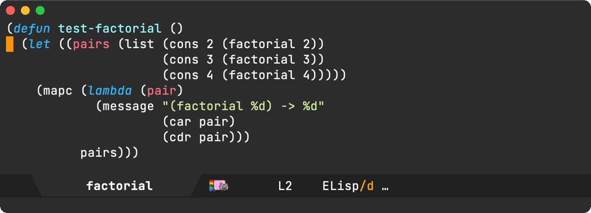

# Further sqlite-mode extensions

I've continued poking at Emacs 29's sqlite-mode. Since [my last post
on extensions](https://xenodium.com/sqlite-mode-goodies/), I've
experimented a little with adding a handful of interactive functions:

-   `sqlite-mode-extras-compose-and-execute`{.verbatim}: Compose and
    execute a query.

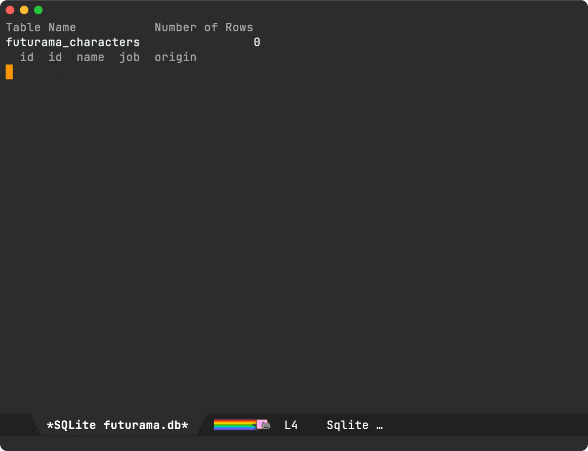

-   `sqlite-mode-extras-execute`{.verbatim}: Execute a query.

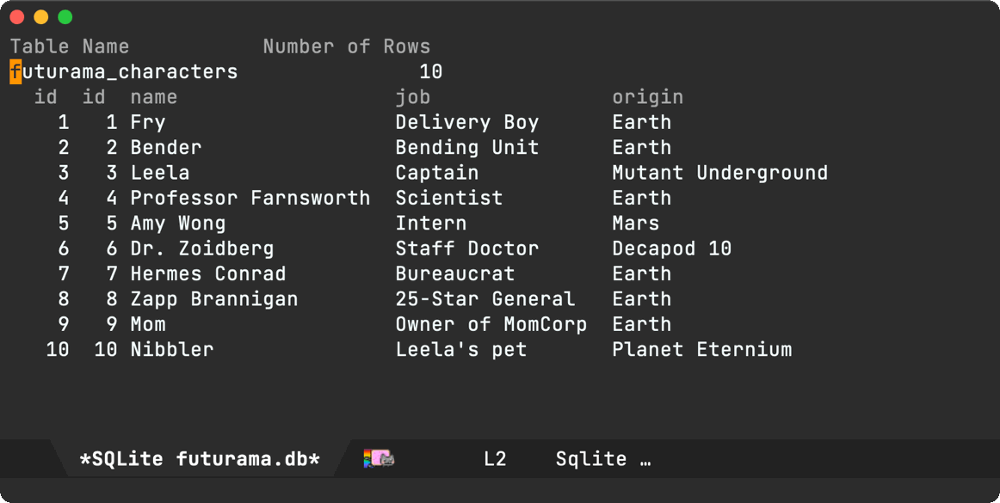

-   `sqlite-mode-extras-add-row`{.verbatim}: Add row to table at point.

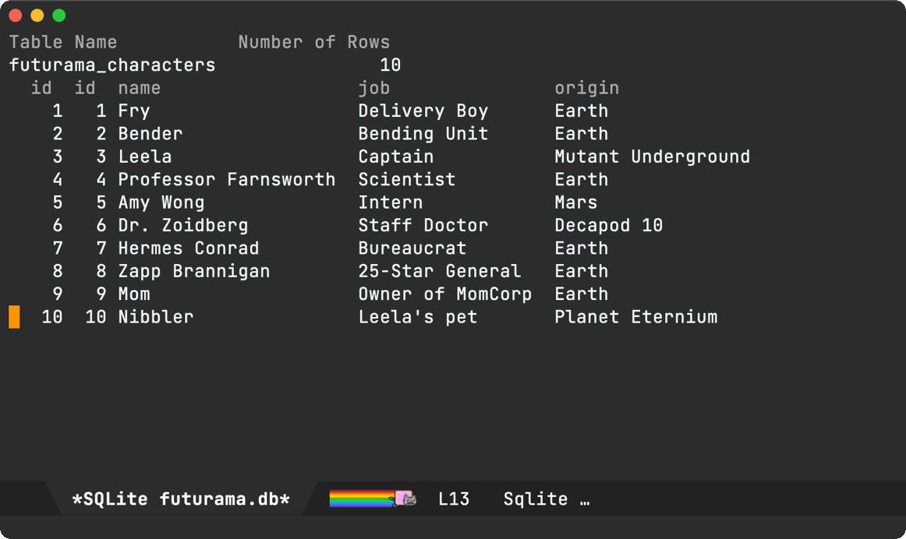

-   `sqlite-mode-extras-delete-row-dwim`{.verbatim}: Similar to
    `sqlite-mode-delete`{.verbatim} but also enables deleting range in
    region.

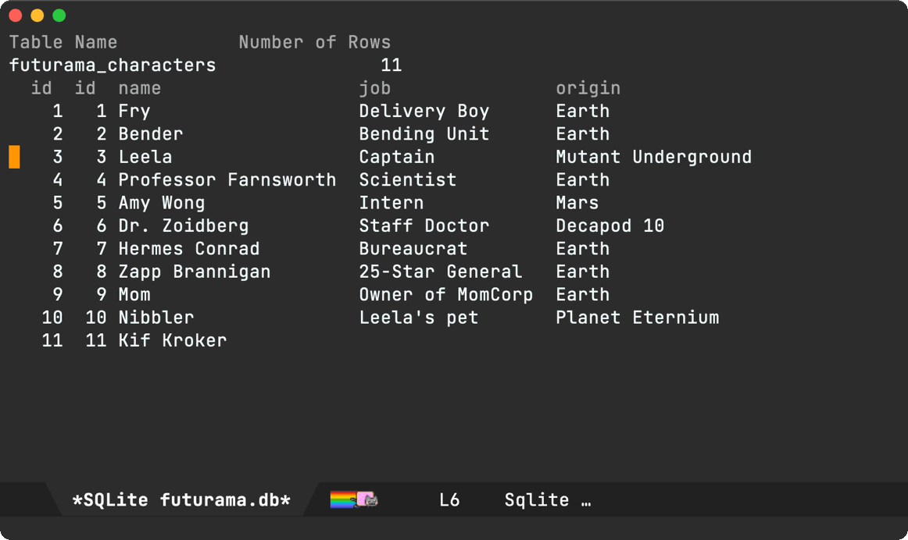

-   `sqlite-mode-extras-refresh`{.verbatim}: Refreshes the buffer
    re-querying the database.
-   `sqlite-mode-extras-ret-dwim`{.verbatim}: If on table, toggle
    expansion. If on row, edit it.
-   `sqlite-mode-extras-execute-and-display-select-query`{.verbatim}:
    Executes a query and displays results.


I've been playing with the following key bindings:

``` emacs-lisp
(use-package sqlite-mode-extras
  :bind (:map
         sqlite-mode-map
         ("n" . next-line)
         ("p" . previous-line)
         ("b" . sqlite-mode-extras-backtab-dwim)
         ("f" . sqlite-mode-extras-tab-dwim)
         ("+" . sqlite-mode-extras-add-row)
         ("D" . sqlite-mode-extras-delete-row-dwim)
         ("C" . sqlite-mode-extras-compose-and-execute)
         ("E" . sqlite-mode-extras-execute)
         ("S" . sqlite-mode-extras-execute-and-display-select-query)
         ("DEL" . sqlite-mode-extras-delete-row-dwim)
         ("g" . sqlite-mode-extras-refresh)
         ("<backtab>" . sqlite-mode-extras-backtab-dwim)
         ("<tab>" . sqlite-mode-extras-tab-dwim)
         ("RET" . sqlite-mode-extras-ret-dwim)))
```

The code lives in
[sqlite-mode-extras.el](https://github.com/xenodium/dotsies/blob/main/emacs/ar/sqlite-mode-extras.el)
under my [Emacs config
repo](https://github.com/xenodium/dotsies/tree/main). Beware, it's
fairly experimental and hasn't been tested thoroughly.

# My custom Tesco Clubcard pkpass

My significant other and I had two plastic Tesco Clubcards. I lost mine,
so I took a picture of hers. I was fairly certain a barcode photo would
scan just as well at self-checkout, and it did.

This got me thinking about Apple's Wallet
[pkpasses](https://en.wikipedia.org/wiki/PKPASS). I don't really know
much about them. Could I potentially create my own `.pkpass`{.verbatim}?
If I could just include the same barcode as in the photo, it should do
the job just fine.

Now I should mention, [Tesco does have an app on the App
Store](https://apps.apple.com/gb/app/tesco-grocery-clubcard/id389581236).
If you just want the official Wallet pass on your iPhone, use that. But
I was curious about whether or not I could create my own pass.

Turns out I *can*. I followed Apple's [building your first
pass](https://developer.apple.com/library/archive/documentation/UserExperience/Conceptual/PassKit_PG/YourFirst.html)
which runs you through [creating Wallet
identifiers/certificates](https://developer.apple.com/help/account/configure-app-capabilities/create-wallet-identifiers-and-certificates),
editing `pass.json`{.verbatim}, and downloading/building
[signpass](https://developer.apple.com/services-account/download?path=/iOS/Wallet_Support_Materials/WalletCompanionFiles.zip)
(the utility used to sign `.pass`{.verbatim} bundles).

The `signpass`{.verbatim} utility is included in
WalletCompanionFiles.zip, which comes with a handful of sample passes.

``` emacs-lisp
WalletCompanionFiles
│
├── SamplePasses
│   │
│   ├── BoardingPass.pass
│   ├── Coupon.pass
│   ├── Event.pass
│   ├── Event.pkpass
│   ├── Generic.pass
│   └── StoreCard.pass
│       │
│       ├── pass.json
│       └── ...
└── signpass
```

Being a rewards card, I opted to look into `StoreCard.pass`{.verbatim},
but like all other passes, the `barcode`{.verbatim} itself is what makes
each pass scannable. The barcode details are specified in the bundles's
`pass.json`{.verbatim} file. I needed to figure out the relevant values
describing the Tesco barcode.

``` json
"barcode": {
  "format": "???",
  "message": "???",
  "messageEncoding": "???"
}
```

I had no clue what values I should use for a Tesco Clubcard. I did,
however, have a photo of the barcode I needed. This is in fact what
prompted looking into [scanning barcodes from
Emacs](https://xenodium.com/emacs-scan-this-qrcode), which worked just
great. It gave me all the crucial bits for the Clubcard.

``` json
"barcode": {
  "format": "PKBarcodeFormatCode128",
  "message": "1234567890123456",  // not my actual Clubcard number of course.
  "messageEncoding": "iso-8859-1"
}
```

That's all that's needed for the barcode section, the most useful part
of the pass. We're not done though. We also need our registered Wallet
identifiers, so the `signpass`{.verbatim} utility can sign.

``` json
"passTypeIdentifier": "my.com.identifier.passmaker", // also not my actual one.
"teamIdentifier": "AAABBBCCCD", // nor this one.
```

We should be able to sign the pass with the following:

``` sh
signpass -p StoreCard.pass
```

We're technically done. We now have a working card, but it looks just
like the sample store card included in WalletCompanionFiles.


What's the fun in that? Now that I can make my own Clubcard, let's
customize it!

For imagery, I replaced a couple of images in the .pass bundle:

``` c
StoreCard.pass
│
├── pass.json
├── icon.png
├── logo.png // replaced
└── strip.png // replaced
```

I replaced `logo.png`{.verbatim} using a [Tesco logo I found on
Wikipedia](https://en.wikipedia.org/wiki/File:Tesco_Logo.svg). I had
initially removed `strip.png`{.verbatim}, but that made the card feel a
little empty. I was thinking of using a Tesco carrier bag to bulk the
space up. While I didn't find a suitable bag image, I did land on
\"[Very Little Helps,
2008](https://banksyexplained.com/very-little-helps-2008/)\". Using my
limited [GIMP](https://www.gimp.org/) skills, I cropped one of the
images and also replaced `strip.png`{.verbatim}.

The remaining customizations took place in `pass.json`{.verbatim} and
should be fairly self-explanatory. There's the text shown in all labels
as well as three customizable colours (background, label, and
foreground).

``` json
{
  "formatVersion": 1,
  "passTypeIdentifier": "my.com.identifier.passmaker", // also not my actual one.
  "teamIdentifier": "AAABBBCCCD", // nor this one.
  "serialNumber": "AnySerialNumberYouWant",
  "barcode": {
    "format": "PKBarcodeFormatCode128",
    "message": "1234567890123456",
    "messageEncoding": "iso-8859-1"
  },
  "organizationName": "Not Tesco of course",
  "description": "Not a Tesco reqards card",
  "logoText": "Clubcard",
  "foregroundColor": "rgb(255, 255, 255)",
  "labelColor": "rgb(255, 255, 255)",
  "backgroundColor": "rgb(2, 81, 158)", // Blue for that Tesco look
  "storeCard": {
    "auxiliaryFields": [
      {
        "key": "membership",
        "label": "Member since 2023",
        "value": ""
      },
      {
        "key": "membership2",
        "label": "Expires sometime",
        "value": ""
      }
    ]
  }
}
```

...and with all that, here's what my very own custom Tesco Clubcard
pkpass looks like. As you can appreciate, my image-editing skills
aren't all that great, but hey this will do for now.


## Update

Redditor u/stupergenius [suggested using the image's original
background
color](https://www.reddit.com/r/programming/comments/15y4c65/comment/jxa1obg/?utm_source=share&utm_medium=web2x&context=3).
Nice suggestion. Tweaked via pass.json:

``` json
"foregroundColor": "rgb(2, 81, 158)",
"labelColor": "rgb(15, 58, 105)",
"backgroundColor": "rgb(166, 202, 214)",
```


# Extending sqlite-mode (cell navigation + edits)

I recently [wrote about Emacs 29's new
sqlite-mode](https://xenodium.com/emacs-29s-sqlite-mode/), which enables
you to browse sqlite databases from your beloved editor.

Out of the box, it supports the following browsing features:

-   `sqlite-mode-list-data`{.verbatim}: List the data from the table
    under point.
-   `sqlite-mode-list-column`{.verbatim}: List the columns of the table
    under point.
-   `sqlite-mode-list-tables`{.verbatim}: Re-list the tables from the
    currently selected database.

On the editing side of things it supports row deletion:

-   `sqlite-mode-delete`{.verbatim}: Delete the row under point.

While fairly spartan, it lays foundations for additional tools and
features.

Two features I would like to have:

1.  TAB navigation across table rows and columns.
2.  Updating the row's field at point.

This would give me the familiar behaviour I'm used to in my org tables
as well as other common spreadsheet tools.

Luckily, this is Emacs, so we can bend it our way... and I sure did!

Here's tab navigating forward:


Here's tab navigating backward:


And updating row fields:

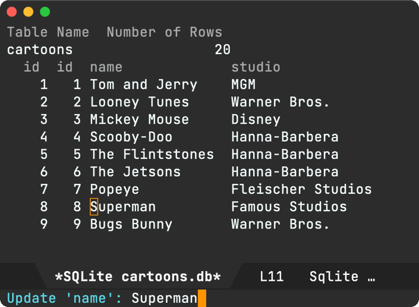

Most of the navigation is achieved by querying the current buffer to
figure out column positions. Editing was in some ways easier, as I
looked at `sqlite-mode-delete`{.verbatim} to figure out how it handled
the query.

To get the more familiar navigation behaviour, I've adjusted my key
bindings as follows:

``` emacs-lisp
(use-package sqlite-mode-extras
  :bind (:map
         sqlite-mode-map
         ("n" . next-line)
         ("p" . previous-line)
         ("<backtab>" . sqlite-mode-extras-backtab-dwim)
         ("<tab>" . sqlite-mode-extras-tab-dwim)
         ("RET" . sqlite-mode-extras-ret-dwim)))
```

The code for `sqlite-mode-extras-tab-dwim`{.verbatim},
`sqlite-mode-extras-backtab-dwim`{.verbatim}, and
`sqlite-mode-extras-ret-dwim`{.verbatim} is little rough still (hacky
even), but hey still fun.

For now, the code lives in
[sqlite-mode-extras.el](https://github.com/xenodium/dotsies/blob/main/emacs/ar/sqlite-mode-extras.el)
under my [Emacs config
repo](https://github.com/xenodium/dotsies/tree/main). Improvements/fixes
totally welcome!

# Emacs 29's sqlite-mode

I've jumped on the Emacs 29 bandwagon! Mickey Petersen has a great
rundown of [What's New in Emacs
29.1](https://www.masteringemacs.org/article/whats-new-in-emacs-29-1).

Now every so often, I need to take a quick peek at an
[sqlite3](https://www.sqlite.org/index.html) table. Emacs 29.1 ships
[sqlite-mode](https://www.gnu.org/software/emacs/manual/html_node/elisp/Database.html),
which can help with that. Use `sqlite-mode-open-file`{.verbatim} to open
a database.

Pressing `RET`{.verbatim} on a table shows its content via
`sqlite-mode-list-data`{.verbatim}. `DEL`{.verbatim} does as you'd
expect and delete a row via `sqlite-mode-delete`{.verbatim}.

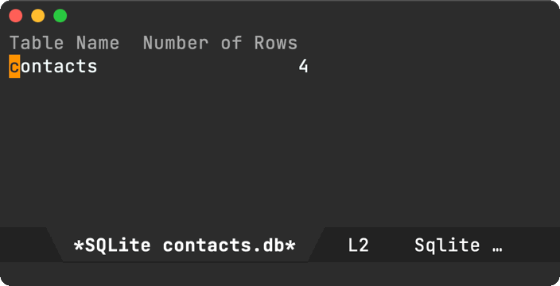

# Emacs: scan this QR/bar code

Another day, another tool brought to my Emacs fingertips. A while ago, I
wrote about easily [copying text from desktop to mobile via QR
codes](https://xenodium.com/copy-from-desktop-to-mobile-via-qr-code/).
Later on, I brought it under
[dwim-shell-command](https://github.com/xenodium/dwim-shell-command) as
[dwim-shell-commands-clipboard-to-qr](https://github.com/xenodium/dwim-shell-command/blob/67da65f97d7f5477e19407d25887c23fab31517d/dwim-shell-commands.el#L593).

This time around, I needed the opposite: to scan a code from an image
file. This is where [zbar](https://github.com/mchehab/zbar)'s
`zbarimg`{.verbatim} comes in. These days, I'm mostly on macOS, so I
installed via [Homebrew](https://brew.sh/):

``` sh
$ brew install zbar
```

There's really nothing to the command. You feed it an image, and it
outputs the scanned details. Perfect.

``` sh
$ zbarimg path/to/code-128.png
CODE-128:hello world
scanned 1 barcode symbols from 1 images in 0.02 seconds
```

The only challenge is my brain. I probably won't remember the name of
this wonderful tool next time I need it, so I'll just add it to my
[dwim-shell-commands.el
arsenal](https://github.com/xenodium/dwim-shell-command/blob/main/dwim-shell-commands.el)
with a memorable name:

``` emacs-lisp
(defun dwim-shell-commands-image-scan-code ()
  "Scan any code from image(s)."
  (interactive)
  (dwim-shell-command-on-marked-files
   "Scan code"
   "zbarimg '<<f>>'"
   :utils "zbarimg"))
```

In the future, rather than reaching out to `zbarimg`{.verbatim}
directly, I'll use my trusty fuzzy search and... voilà!

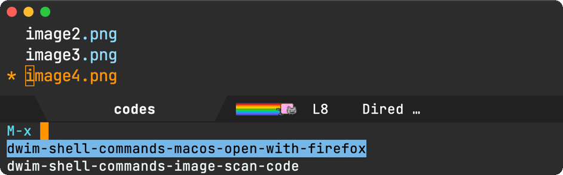

Because `dwim-shell-command`{.verbatim} operates on either
`dired`{.verbatim} files or current file, we can also apply our new
function when viewing the QR code itself.


`dwim-shell-commands-image-scan-code`{.verbatim} is now [pushed to
dwim-shell-commands.el](https://github.com/xenodium/dwim-shell-command/commit/85ebcb0a466ddfe48e543d585e16aff7aee8da5e),
the optional package in
[dwim-shell-command](https://github.com/xenodium/dwim-shell-command/).

# A cure for JavaScript fatigue?

It's been roughly a decade since I wrote any significant amount of
JavaScript. Back then, I primarily relied on the [Google Closure
Compiler](https://developers.google.com/closure/compiler/), now maybe an
archaeological artefact? These days, it's hard not to bump into any
JavaScript project that doesn't rely on [npm](https://www.npmjs.com/),
along with many other tools like the
[Typescript](https://www.typescriptlang.org/) compiler,
[ESLint](https://eslint.org/), [Prettier](https://prettier.io/)... There
are a ton of available frameworks too. I was somewhat put off (or maybe
just lazy?) by the initial ramp-up to reenter the JavaScript world. I
guess that's what some refer to as [Javascript
Fatigue](https://medium.com/@ericclemmons/javascript-fatigue-48d4011b6fc4#.prcj59904).

I'm giving JavaScript another try, but this time with an Emacs
[chatgpt-shell](https://github.com/xenodium/chatgpt-shell) standing by.
Reentering the JavaScript world as a noob, I often know what I want to
enable, but I'm unfamiliar with which project knobs to turn to set
things up.

While I may want to dig deeper into things in the future, at present I
just want to dabble with JavaScript. I want a local project set up as
quickly as possible. ChatGPT has been pretty handy at that. The Emacs
ChatGPT shell and its minibuffer prompts work fairly well for my needs,
yet I often found myself wishing it could behave more like a
[magit](https://magit.vc/) commit buffer. That is, launch a dedicated
buffer (not the shell itself), ask the question, maybe paste some
snippets, and send it on its way with that oh so familiar and satisfying
`C-c C-c`{.verbatim} binding ([sending
mail](https://www.gnu.org/software/emacs/manual/html_node/emacs/Sending-Mail.html)
also says hello).

This is where `M-x chatgpt-shell-prompt-compose`{.verbatim} comes in.
It's a mash between the ChatGPT shell and a magit commit buffer:

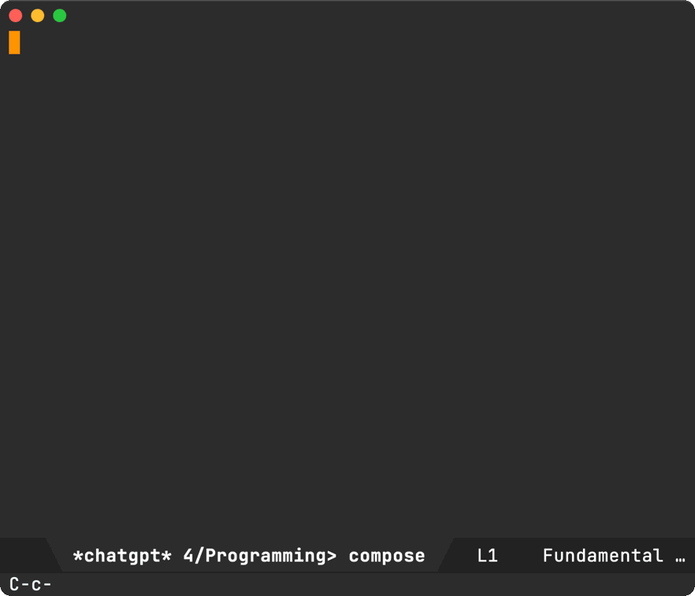

In the background, the buffer is still powered by the shell itself, so
you can reuse it to ask clarifying questions.

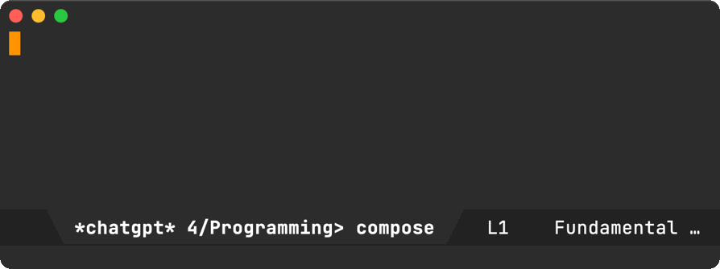

A couple of additional features worth mentioning... Invoking
`chatgpt-shell-prompt-compose`{.verbatim} with an active region
automatically copies the region content over to the compose buffer. This
is handy if you'd like to create more elaborate prompts with further
editing. So far, this feels more natural than editing text from the
shell or the minibuffer, where `RET`{.verbatim} doesn't insert new
lines.

The compose buffer is powered by a background shell (storing history for
us). Typing `clear`{.verbatim} followed by `C-c C-c`{.verbatim} clears
the background shell history.

`chatgpt-shell-prompt-compose`{.verbatim} is available in
[chatgpt-shell](https://github.com/xenodium/chatgpt-shell) v0.72.1.
I've so far bound it to `C-c C-e`{.verbatim}, though I've already
found some unfortunate clashes.

# ChatGPT visits the Emacs doctor

Emacs is a [part-time job](https://youtu.be/urcL86UpqZc?t=177). A
[multi-language](https://emacs-lsp.github.io/lsp-mode/) development
environment. A [lisp
machine](https://www.emacswiki.org/emacs/LispMachine). An [email
client](https://www.djcbsoftware.nl/code/mu/mu4e.html). A [web
browser](https://www.gnu.org/software/emacs/manual/html_node/emacs/EWW.html).
A [zettelkasten](https://youtu.be/AyhPmypHDEw). A
[spreadsheet](https://www.emacswiki.org/emacs/SpreadSheet). A [mastodon
client](https://codeberg.org/martianh/mastodon.el). A
[shell](https://www.masteringemacs.org/article/complete-guide-mastering-eshell).
A [ledger](https://github.com/ledger/ledger-mode). A [super
agenda](https://github.com/alphapapa/org-super-agenda). An [operating
system](https://twitter.com/nixcraft/status/1435140596520218628). Some
say it sends [ripples into the atmosphere](https://xkcd.com/378/) or
[plays tetris for you](https://github.com/skeeto/autotetris-mode). It
may even [warm your place
up](https://github.com/johanvts/emacs-fireplace) during the winter. Can
[meme with you](https://github.com/TeMPOraL/nyan-mode). It's an
ultra-malleable editor with endless possibilities, powered by your
life-long customizations. Oh man, no wonder we need to chat to someone
from time to time. You know what I mean? *\"[Sir, this is a
Wendy's](https://knowyourmeme.com/editorials/guides/what-does-sir-this-is-a-wendys-mean)\"*.

Luckily, we also have the built-in Emacs psychotherapist we can chat to,
courtesy of [M-x
doctor](https://www.gnu.org/software/emacs/manual/html_node/emacs/Amusements.html).
It's powered by [elisp](https://en.wikipedia.org/wiki/Emacs_Lisp), and
like all Emacs things, it's basically up for grabs. What I mean is,
elisp implements many of these features, but also glues the lot for you.
Once you learn a little elisp, you can build new Emacs features but also
glue others for that magical compound effect.

<figure width="85%">

<figcaption>The Emacs doctor</figcaption>
</figure>

A little while ago, I wanted to give
[ChatGPT](https://openai.com/blog/chatgpt) a try, preferably from Emacs
(of course). I figured a shell interface would be a great fit for the
interaction. Emacs already shipped with a general command interpreter
([comint](https://www.gnu.org/software/emacs/manual/html_node/emacs/Shell-Prompts.html)),
so I cobbled together a [ChatGPT Emacs
shell](https://xenodium.com/a-chatgpt-emacs-shell/).

<figure width="75%">

<figcaption><a
href="https://github.com/xenodium/chatgpt-shell">chatgpt-shell</a></figcaption>
</figure>

So where am I going with all this? The fine netizens
[r/emaphis](https://www.reddit.com/user/emaphis/) and
[salgernon](https://news.ycombinator.com/user?id=salgernon) both planted
a great seed:

-   *\"[Now for extra-credit, add the ability for Alt-X doctor to
    psychoanalyze
    Chat-GPT](https://www.reddit.com/r/emacs/comments/11wdub9/comment/jczrlt7)\"*.
-   *\"[So how about a quick M-x
    psychoanalyze-chatgpt?](https://news.ycombinator.com/item?id=35259022)\"*

I haven't forgotten about you. Let's take
[chatgpt-shell](https://github.com/xenodium/chatgpt-shell), *M-x
doctor*, our versatile elisp glue, and let's make them talk:


and
[dr.dk](https:/asset.dr.dk/imagescaler01/downol.dr.dk/download/bonanza/thumbs/000026814.jpg).](images/chatgpt-visits-the-emacs-doctor/000026814.jpg)

There isn't too much to the code, but beware:

1.  If you want to run it, you'll need chatgpt-shell [installed and set
    up](https://github.com/xenodium/chatgpt-shell#install).
2.  This was a quick fun hack. No code judging ;)

The snippet is further down... Start with
`chatgpt-shell-visit-doctor`{.verbatim} as the entry point, setting
things up for us. It creates both the `*chatgpt*`{.verbatim} and
`*doctor*`{.verbatim} buffers and arranges the windows next to each
other.

We also set a ChatGPT system prompt to guide things a little:

> \"Pretend to be an overwhelmed Emacs user who is obsessed with
> configuring their init.el file. You are in a session talking to a
> psychotherapist. Limit your output to no more than 20 words. In the
> course of 5 exchanges between you and the therapist, show
> improvements. On the 8th exchange after therapist speaks, declare you
> are cured and only output 'Thank you doc, I think I'm cured!'\"

ChatGPT and Emacs doctor can go on and on, so we limit ChatGPT responses
to 20 words per response and 8 exchanges. We don't want the session to
abruptly end without a resolution, so we'll use *Thank you doc, I think
I'm cured!* as our key phrase to end the session.

We register `chatgpt-shell--on-chatgpt-patient-response`{.verbatim} as a
hook to receive ChatGPT output, which we feed to the
`*doctor*`{.verbatim} buffer. We subsequently get a doctor response
that's fed back to ChatGPT via
`chatgpt-shell--insert-doc-response`{.verbatim}.

We add some additional freebies like binding `Ctrl-c Ctrl-c`{.verbatim}
to `chatgpt-shell-leave-doctor`{.verbatim}, so we can bail out of the
exchange from the `*chatgpt*`{.verbatim} buffer.

We also introduced `chatgpt-shell--insert-delayed-text`{.verbatim} as a
replacement for
[insert](https://www.gnu.org/software/emacs/manual/html_node/elisp/Insertion.html)
to slow things down a little. For visual effects, really.

``` emacs-lisp
(require 'chatgpt-shell)

(defun chatgpt-shell-visit-doctor ()
  (interactive)
  (setq chatgpt-shell--doctor-in-session t)
  (when (get-buffer "*doctor*")
    (kill-buffer "*doctor*"))
  (delete-other-windows)
  (split-window-horizontally)
  (other-window 1)
  (doctor)
  (visual-line-mode 1)
  (when (fboundp 'accent-menu-mode)
    (accent-menu-mode -1))
  (mapc
   (lambda (shell-buffer)
     (kill-buffer shell-buffer))
   (chatgpt-shell--shell-buffers))
  (other-window 1)
  (setq chatgpt-shell-system-prompts
        '(("Doc" . "Pretend to be an overwhelmed Emacs user who is obsessed with configuring their init.el file. You are in a session talking to a psychotherapist. Limit your output to no more than 20 words. In the course of 5 exchanges between you and the therapist, show improvements. On the 8th exchange after therapist speaks, declare you are cured and only output \"Thank you doc, I think I'm cured!\".")))
  (setq chatgpt-shell-system-prompts nil)
  (setq chatgpt-shell-system-prompt nil)
  (with-current-buffer (chatgpt-shell)
    (define-key chatgpt-shell-mode-map (kbd "C-c C-c")
      'chatgpt-shell-leave-doctor)
    (shell-maker-set-buffer-name (current-buffer)
                                 "*chatgpt*"))
  (chatgpt-shell--insert-doc-response))

(defun chatgpt-shell--doc-conversation ()
  (let ((convo (with-current-buffer "*doctor*"
                 (split-string (buffer-string) "\n\n"))))
    (seq-remove
     (lambda (item)
       (string-empty-p (string-trim item)))
     (append
      ;; Replace first doc line, so it drops "Each time you are finished talking, type RET twice."
      (list "I am the psychotherapist.  Please, describe your problems.")
      (mapcar
       (lambda (item)
         (replace-regexp-in-string "\n" " " item))
       (cdr convo))))))

(defun chatgpt-shell--doc-response ()
  (let* ((conversation (chatgpt-shell--doc-conversation))
         (length (seq-length conversation))
         (doc-response (nth (1- length) conversation)))
    doc-response))

(defun chatgpt-shell--insert-doc-response ()
  (with-current-buffer "*chatgpt*"
    (goto-char (point-max))
    (chatgpt-shell--insert-delayed-text (chatgpt-shell--doc-response))
    (call-interactively 'shell-maker-submit)))

(defun chatgpt-shell--insert-delayed-text (text)
  "Insert TEXT into the current buffer, with a delay between each character."
  (dolist (char (string-to-list text))
    (insert char)
    (sit-for 0.009)))

(defun chatgpt-shell--on-chatgpt-patient-response (command output)
  (if (and chatgpt-shell--doctor-in-session
           (not (string-match-p (regexp-quote "I'm cured") output)))
      (progn
        (with-current-buffer "*chatgpt*"
          (goto-char (point-max)))
        (with-selected-window (get-buffer-window "*doctor*")
          (goto-char (point-max))
          (chatgpt-shell--insert-delayed-text output)
          (call-interactively 'doctor-ret-or-read)
          (chatgpt-shell--insert-doc-response)))
    (message "Bye Bye")))

(defun chatgpt-shell-leave-doctor ()
  (interactive)
  (setq chatgpt-shell--doctor-in-session nil)
  (call-interactively 'chatgpt-shell-ctrl-c-ctrl-c))

(add-hook 'chatgpt-shell-after-command-functions
          #'chatgpt-shell--on-chatgpt-patient-response)

(global-set-key (kbd "M-q") #'chatgpt-shell-visit-doctor)
```

Ok, enough already. Let's see it in action.

``` org
#+ATTR_HTML: :width 100%
```
[](../images/chatgpt-visits-the-emacs-doctor/chatgpt-doc_optimized.gif)

If you'd like to take a closer look for analysis, here's the official
transcript of this fruitful session:

> I am the psychotherapist. Please, describe your problems. Each time
> you are finished talking, type RET twice.
>
> I spend hours tweaking my Emacs config, but it's never perfect. I'm
> overwhelmed and obsessed with customization.
>
> Is it because it's not ever perfect you are overwhelmed and obsessed
> with customization that you came to me?
>
> Yes, I can't stop myself from constantly trying to tweak and improve
> my Emacs configuration. It's consuming me.
>
> Emacs? Hah! I would appreciate it if you would continue.
>
> Sorry about that. Yes, I came to you because I'm overwhelmed by my
> obsession with customizing my Emacs configuration.
>
> Does it bother you that you are overwhelmed by your obsession with
> customizing your emacs configuration?
>
> Absolutely! I feel trapped in an endless cycle of tweaking and
> configuring, unable to achieve satisfaction.
>
> Why do you say that?
>
> I constantly seek perfection in my Emacs config, but it's an
> unattainable goal that leaves me exhausted and frustrated.
>
> When did you first know that it's an unattainable goal that leaves
> you exhausted and frustrated?
>
> I've realized it recently after spending countless hours trying to
> perfect my Emacs configuration without any lasting satisfaction.
>
> Are you sure?
>
> Thanks you doc, I think I'm cured.

While we can work exclusively with the `*doctor*`{.verbatim} buffer
making requests directly to the ChatGPT API, where's the fun in that?
Getting the buffers to talk to each other enables us to marvel at both
the beauty and absurdity of being able to glue anything together in our
lovely Emacs world.

Happy Emacsing!

# chatgpt-shell v0.60.1 updates

Back in April, I shared [chatgpt-shell
updates](https://xenodium.com/chatgpt-shell-available-on-melpa/),
showcasing [chatgpt-shell](https://github.com/xenodium/chatgpt-shell)
features. It's been a little while, so here's an update with the
latest additions.

Like this project? Consider
✨[sponsoring](https://github.com/sponsors/xenodium)✨.

## Multi-session support

You can run multiple shell instances independently configured to use
different versions or system prompts.

This was biggest recent change. Please report issues.


## Display system prompt and version

The current shell's version and system prompt are now displayed more
prominently in both the shell prompt and buffer name.


With multi-session support, displaying shell details in the buffer name
becomes more important as it makes it easier to find shells across your
buffer list.

## Rename shell buffers

While buffer names are now automatically derived, one can also use
`chatgpt-shell-rename-buffer`{.verbatim} to use custom buffer names.

## ob-chatgpt-shell improvements

Use `:temperature`{.verbatim} to specify the
\[\[[https://platform.openai.com/docs/api-reference/completions\\](https://platform.openai.com/docs/api-reference/completions\)
/create#completions/create-temperature\]\[temperature\]\].

Use `:context CONTEXT-NAME`{.verbatim} to pick and choose which source
blocks to aggregate as context. Thank you [Thomas
Moulia](https://github.com/jtmoulia).

Use `:preflight t`{.verbatim} to debug `ob-chatgpt-shell`{.verbatim}
execution.


## chatgpt-shell-write-git-commit

Adds `chatgpt-shell-write-git-commit`{.verbatim}, so you can generate
commit messages using the current region. Thank you [Simon
Judd](https://github.com/bigsky77).

## Approximate context length

`chatgpt-shell`{.verbatim} now uses
`chatgpt-shell--approximate-context-length`{.verbatim} to approximate
the context size and discard history if necessary. This is pretty
experimental but seems to work well enough. It's enabled by default to
get some feedback. Please file bugs if needed or send PRs to improve.

## `S-<return>`{.verbatim} for multiline input

In addition to `C-J`{.verbatim} to insert multi-line input,
`S-<return>`{.verbatim} is also supported. Thank you
[shouya](https://github.com/shouya) for the submission.

## Welcome message

A welcome message now makes the help much more discoverable for new or
sporadic users. Thank you [shouya](https://github.com/shouya) for the
suggestion.


## Help me

While the [README](https://github.com/xenodium/chatgpt-shell) documents
the shells and Emacs is
[self-documenting](https://www.emacswiki.org/emacs/SelfDocumentation),
we now have a `help`{.verbatim} command to make things a little more
discoverable.


## Hello chatgpt-shell-mode and dall-e-shell-mode

Both `chatgpt-shell`{.verbatim} and `dall-e-shell`{.verbatim} are both
based on `shell-maker`{.verbatim} and until recently both shared
`shell-maker-mode`{.verbatim} as their major mode. This didn't play
well with yasnippet. Both shells now enable independent major modes:
`chatgpt-shell-mode`{.verbatim} and `dall-e-shell-mode`{.verbatim}.
Thank you [Daniel Liden](https://github.com/djliden) for the proposal.

## Saving transcript customizations

Make transcript saving more customizable via
`shell-maker-transcript-default-path`{.verbatim} and
`shell-maker-transcript-default-filename`{.verbatim}. Thank you
[gnusupport](https://github.com/gnusupport).

## New ChatGPT model versions

New OpenAI model versions were recently released and added to
chatgpt-shell: `gpt-3.5-turbo-0613`{.verbatim} and
`gpt-4-0613`{.verbatim}. Thanks you [Norio
Suzuki](https://github.com/suzuki).

## Load awesome prompts

`M-x chatgpt-shell-load-awesome-prompts`{.verbatim} to download and
import curated prompts from
[awesome-chatgpt-prompts](https://github.com/f/awesome-chatgpt-prompts).
Thank you [Daniel Gomez](https://github.com/dangom).


## ob-async

We had reports that ob-chatgpt-shell didn't play nice with
[ob-async](https://github.com/astahlman/ob-async). Thank you [William
Medrano](https://github.com/wmedrano) for the solution.

## Configurable prompts

Functions like `chatgpt-shell-describe-code`{.verbatim} ask ChatGPT to
describe the code in region. These functions used hardcoded English
prompts. These are now configurable, so users can tweak or translate if
preferred. Thank you [Norio Suzuki](https://github.com/suzuki).

-   `chatgpt-shell-prompt-header-describe-code`{.verbatim}
-   `chatgpt-shell-prompt-header-refactor-code`{.verbatim}
-   `chatgpt-shell-prompt-header-generate-unit-test`{.verbatim}
-   `chatgpt-shell-prompt-header-proofread-region`{.verbatim}
-   `chatgpt-shell-prompt-header-whats-wrong-with-last-command`{.verbatim}
-   `chatgpt-shell-prompt-header-eshell-summarize-last-command-output`{.verbatim}

# Duplicate this!

[James Dyer](http://www.dyerdwelling.family/) has a nice
[post](https://www.emacs.dyerdwelling.family/emacs/20230606213531-emacs--dired-duplicate-here-revisited/)
sharing his frequent
[dired](https://www.gnu.org/software/emacs/manual/html_node/emacs/Dired.html)
need to duplicate files. He offers a solution using a custom interactive
command. His use-case resonated with me.

Similarly, James' recommendation to bind his file-duplicating command
to `C-c d`{.verbatim} [^1] sent a signal to my brain triggering
[Bozhidar Batsov](https://twitter.com/bbatsov)'s
`crux-duplicate-current-line-or-region`{.verbatim}.

`crux-duplicate-current-line-or-region`{.verbatim} is part of a
\"collection of Ridiculously useful extensions for Emacs\" (yeah that's
[crux](https://github.com/bbatsov/crux)). The command itself does what
it says on the tin.

Let's duplicate the current line.


Now let's duplicate the current region.


Since I already have a well-internalized key-binding duplicating
lines/regions in text buffers, I could extend a similar behaviour to
dired files with almost zero adoption effort.

In case you haven't noticed, I've made it a [part-time
job](https://youtu.be/urcL86UpqZc?t=177) to make command line utilities
easily accessible from Emacs
([1](https://xenodium.com/joining-images-from-the-comfort-of-dired/)
[2](https://xenodium.com/emacs-dwim-shell-command/)
[3](https://xenodium.com/emacs-password-protect-current-pdf-revisited/)
[4](https://xenodium.com/dwim-shell-command-now-on-windows/)
[5](https://xenodium.com/recordscreenshot-windows-the-lazy-way/)
[6](https://xenodium.com/emacs-ffmpeg-and-macos-alias-commands/)
[7](https://xenodium.com/emacs-quick-kill-process/)
[8](https://xenodium.com/hey-emacs-change-the-default-macos-app-for/)
[9](https://xenodium.com/hey-emacs-where-did-i-take-that-photo/)
[10](https://xenodium.com/emacs-open-with-macos-app/)
[11](https://xenodium.com/emacs-macos-sharing-dwim-style-improved/)
[12](https://xenodium.com/emacs-macos-share-from-dired-dwim-style/)
[13](https://xenodium.com/emacs-reveal-in-finder-dwim-style/)
[14](https://xenodium.com/dwim-shell-command-usages-pdftotext-and-scp/)
[15](https://xenodium.com/dwim-shell-command-with-template-prompts/)
[16](https://xenodium.com/seamless-command-line-utils/)
[17](https://xenodium.com/dwim-shell-command-video-streams/)
[18](https://xenodium.com/dwim-shell-command-improvements/)
[19](https://xenodium.com/dwim-shell-command-on-melpa/)
[20](https://xenodium.com/emacs-dwim-shell-command-multi-language/)
[21](https://xenodium.com/png-to-icns-emacs-dwim-style/)) via
[dwim-shell-command](https://github.com/xenodium/dwim-shell-command).
Partly because it's fairly quick and partly 'cause it's fun.

Jame's post gave me yet another opportunity to exercise my errrm
part-time job. This time, duplicating files. All I need is the
[cp](https://www.man7.org/linux/man-pages/man1/cp.1.html) utility and a
template:

``` sh
cp -R '<<f>>' '<<f(u)>>'
```

I seldom type these template's myself when I want to execute a command
(via `M-x dwim-shell-command`{.verbatim}). I typically wrap these
templates in interactive commands, making them easily accessible via
`M-x`{.verbatim} and your favorite completion framework. I happen to use
[ivy](https://github.com/abo-abo/swiper).

``` emacs-lisp
(require 'dwim-shell-command)

(defun dwim-shell-commands-duplicate ()
  "Duplicate file(s)."
  (interactive)
  (dwim-shell-command-on-marked-files
   "Duplicate file(s)."
   "cp -R '<<f>>' '<<f(u)>>'"
   :utils "cp"))
```

There's nothing much to the command. Most logic is handled by the
template, replacing `<<f>>`{.verbatim} with the current file and
`<<f(u)>>`{.verbatim} with a uniquified version of it. Having said this,
there's a bunch of free
[DWIM](https://xenodium.com/emacs-dwim-do-what-i-mean/) love that kicks
in, courtesy of the `dwim-shell-command`{.verbatim} package by yours
truly. Let's give our new `dwim-shell-commands-duplicate`{.verbatim}
command a spin.

Like `crux-duplicate-current-line-or-region`{.verbatim} duplicates the
current line, our new command duplicates the current dired file.


Got multiple files to duplicate? Like
`crux-duplicate-current-line-or-region`{.verbatim}, we can use the
region for a similar purpose.


While we have been using the region to duplicate adjacent files, we can
also mark specific files.

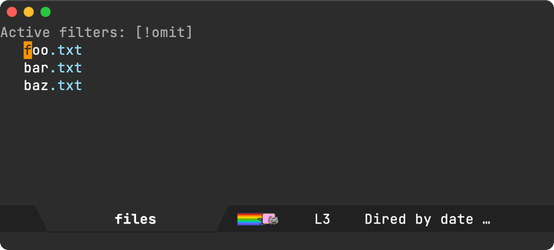

Our `cp -R '<<f>>' '<<f(u)>>'`{.verbatim} template uses the
`-R`{.verbatim} (recursive) flag, so we get another freebie. In addition
to files, we can also duplicate directories.

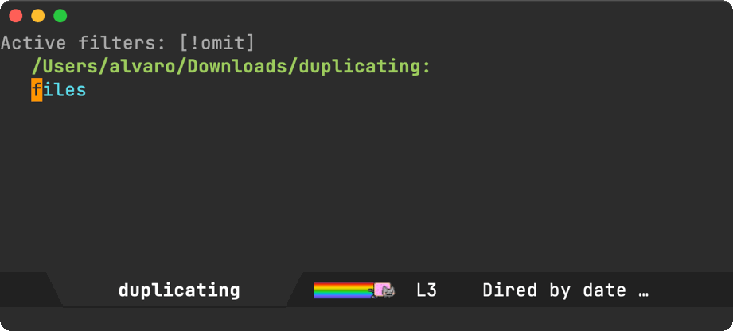

Lastly, because we're on a DWIM train, if your current buffer happens
to be visiting a file, you can
`M-x dwim-shell-commands-duplicate`{.verbatim} the current file to
duplicate it. You're automatically dropped to a dired buffer, with
point on the new file (à la
[dired-jump](https://emacsredux.com/blog/2013/09/24/dired-jump/)).


While duplicating files using a template was a mere
`cp -R '<<f>>' '<<f(u)>>'`{.verbatim} away, we get a bunch of free DWIM
magic applied to a handful of use-cases and contexts. What made the
file-duplicating use-case extra special is that it maps almost exactly
to an equivalent text command. Keep the same key bindings and we almost
get a \"[free
feature](https://endlessparentheses.com/hungry-delete-mode.html)\".

``` emacs-lisp
(use-package crux
  :ensure t
  :commands crux-open-with
  :bind
  (("C-c d" . crux-duplicate-current-line-or-region)))

(use-package dwim-shell-command
  :ensure t
  :bind (:map dired-mode-map
              ("C-c d" . dwim-shell-commands-duplicate))
  :config
  ;; Loads all my own dwim shell commands
  ;; (including `dwim-shell-commands-duplicate')
  (require 'dwim-shell-commands))
```

You can find my ever-growing list of similar commands over at
[dwim-shell-commands.el](https://github.com/xenodium/dwim-shell-command/blob/main/dwim-shell-commands.el)
(the optional part of the package). Got some nifty usages? Would love to
check 'em out. [Get in touch](https://indieweb.social/@xenodium).

Like this or [other content](https://xenodium.com/)? [✨Sponsor✨ via
GitHub Sponsors](https://github.com/sponsors/xenodium).

## Update

If you're keen on a regex-based approach,
[u/arthurno1](https://www.reddit.com/user/arthurno1/) [offers a great
built-in
alternative](https://www.reddit.com/r/emacs/comments/14rmvkx/comment/jqtkel8/?utm_source=share&utm_medium=web2x&context=3):
dired-do-copy-regexp (bound to `% C`{.verbatim}).

# Stitching images from the comfort of dired

I recently wanted a few images stitched together. A perfect job for
[ImageMagick](https://imagemagick.org/). A quick search yielded the
magical incantation:

``` sh
convert image1.jpg image2.jpg image3.jpg +append joined.jpg
```

Great, now I know, but I'll rarely use it and will soon forget it. I
may as well add it to my
[repository](https://github.com/xenodium/dwim-shell-command/blob/main/dwim-shell-commands.el)
of [DWIM](https://en.wikipedia.org/wiki/DWIM) command line utilities,
wrapped in a convenient Emacs function, applicable from different
contexts... [know what I
mean](https://xenodium.com/emacs-dwim-do-what-i-mean/)? 🙃

I built
[dwim-shell-command](https://github.com/xenodium/dwim-shell-command) for
this purpose. You can take the above command and easily turn it into an
interactive Emacs command with something like the following:

``` emacs-lisp
(require 'dwim-shell-command)

(defun dwim-shell-commands-join-images-horizontally ()
  "Join all marked images horizontally as a single image."
  (interactive)
  (dwim-shell-command-on-marked-files
   "Join images horizontally"
   "convert -verbose '<<*>>' +append 'joined.jpg'"
   :utils "convert"))
```

You can select as many images as you'd like from the comfort of your
dired and *make the ImageMagick happen*.

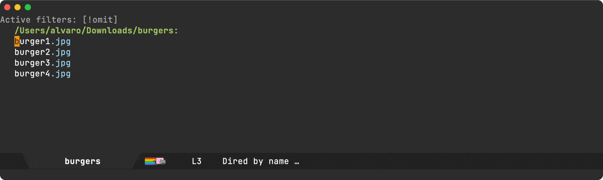

The snippet does the job just fine, but we can make it smarter. For
starters, let's not hardcode the output filename. We'll ask the user
instead. While we're asking, let's offer a default filename, but
let's not assume the output extension is `.jpg`{.verbatim}. Let's
guess based on the image selection. While we're at it, let's not
override the output file if already exists. Uniquify it.

Most of the above can be achieved by either using
[dwim-shell-command](https://github.com/xenodium/dwim-shell-command)
helpers or its templating language. For example,
`<<joined.png(u)>>`{.verbatim} ensures that if `joined.png`{.verbatim}
already exists, it automatically generates `joined(1).png`{.verbatim}
instead.

``` emacs-lisp
(require 'dwim-shell-command)

(defun dwim-shell-commands-join-images-horizontally ()
  "Join all marked images horizontally as a single image."
  (interactive)
  (let ((filename (format "joined.%s"
                          (or (seq-first (dwim-shell-command--file-extensions)) "png"))))
    (dwim-shell-command-on-marked-files
     "Join images horizontally"
     (format "convert -verbose '<<*>>' +append '<<%s(u)>>'"
             (dwim-shell-command-read-file-name
              (format "Join as image named (default \"%s\"): " filename)
              :default filename))
     :utils "convert")))
```

Here's the new horizontal command in action...

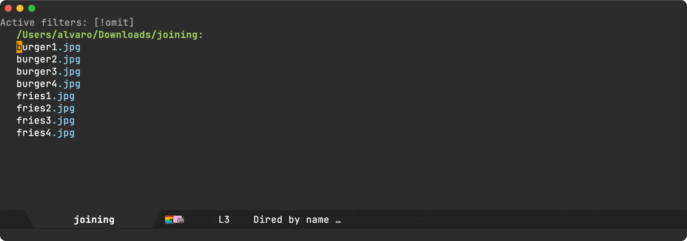

Notice how this time we didn't mark the images using
`dired-mark`{.verbatim}, typically bound to `m`{.verbatim}. Instead, we
made our selection using the region. Also, if you haven't gotten your
junk food fix yet, here's the fries equivalent ;)

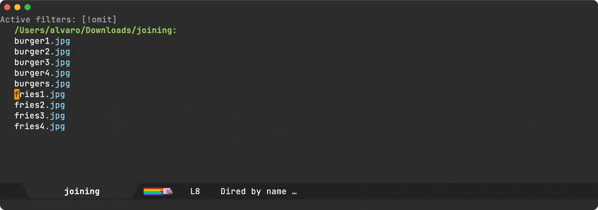

We'll rinse all and repeat to get the vertical command equivalent. I
know, I know, there's fair amount of duplication but c'est la vie.

``` emacs-lisp
(require 'dwim-shell-command)

(defun dwim-shell-commands-join-images-vertically ()
  "Join all marked images vertically as a single image."
  (interactive)
  (let ((filename (format "joined.%s"
                          (or (seq-first (dwim-shell-command--file-extensions)) "png"))))
    (dwim-shell-command-on-marked-files
     "Join images vertically"
     (format "convert -verbose '<<*>>' -append '<<%s(u)>>'"
             (dwim-shell-command-read-file-name
              (format "Join as image named (default \"%s\"): " filename)
              :default filename))
     :utils "convert")))
```

...and for our grand finale, we'll vertically join our burgers and
fries. Behold!

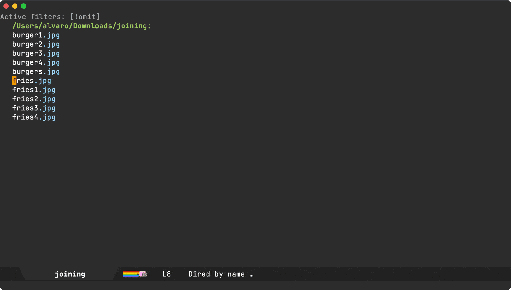

These commands are now part of
[dwim-shell-command](https://github.com/xenodium/dwim-shell-command). To
get them, load the optional commands via
`(require 'dwim-shell-commands)`{.verbatim}.

# noweb: the lesser known org babel glue

While [Org](https://orgmode.org/) babel's
[noweb](https://orgmode.org/manual/Noweb-Reference-Syntax.html) isn't
something I've frequently used for literate programming, its simplicity
makes it rather versatile to glue all sorts of babel things I hadn't
previously considered.

The idea is simple. Add a placeholder like `<<other-block>>`{.verbatim}
to an [org
babel](https://orgmode.org/manual/Working-with-Source-Code.html) source
block, and it will be automatically replaced (verbatim) with the content
(or result) of referred block before execution. You'll also need the
`:noweb yes`{.verbatim} header argument.

``` org
#+NAME: other-block
#+begin_src swift
  print("Hello 0")
#+end_src

#+RESULTS: other-block
: Hello 0

#+BEGIN_SRC swift :noweb yes
  <<other-block>>
  print("Hello 1")
#+END_SRC

#+RESULTS:
: Hello 0
: Hello 1
```

Since `<<other-block>>`{.verbatim} is replaced with the content of said
block, at execution time, the block is effectively equivalent to
executing:

``` swift
print("Hello 0")
print("Hello 1")
```

Why is this so versatile? Org babel can include/execute all sorts of
languages, so you can mix and match the result from one language and
massage it to appear as the body of another block using the same (or
different) language.

I was recently asked [how to include the result from one babel block in
another](https://github.com/xenodium/chatgpt-shell/issues/102) using
[ob-chatgpt-shell](https://github.com/xenodium/chatgpt-shell/#chatgpt-org-babel).
While the initial question was looking for a solution involving
variables, we can use noweb to achieve a similar goal.

Note that in this case, I'll be using `<<hello()>>`{.verbatim}, with
`()`{.verbatim}, to refer to `#+RESULTS:`{.verbatim} rather than the
source block itself.

``` org
#+NAME: hello
#+BEGIN_SRC chatgpt-shell
Say hello in spanish
#+END_SRC

#+RESULTS: hello
Hola

#+BEGIN_SRC chatgpt-shell :noweb yes
<<hello()>>
What does the previous line say verbatim?
#+END_SRC
```

Executing the block

``` chatgpt-shell
<<hello()>>
What does the previous line say verbatim?
```

Gives us

``` org
#+RESULTS:
```
``` example
The previous line says "Hola".
```

On a similar note, I was asked if the results from a previous source
block could be [fed to a Swift Chart
block](https://indieweb.social/@kickingvegas@sfba.social/110562099134297469)
using [ob-swiftui](https://github.com/xenodium/ob-swiftui).

While I'm new to [Swift
Charts](https://developer.apple.com/documentation/Charts), I do love
glueing things via Emacs lisp. I figured I could write a little elisp to
generate random data and feed it to a SwiftUI block via
`<<data()>>`{.verbatim}. The result is pretty neat, based on Apple's
[LineMark
example](https://developer.apple.com/documentation/charts/linemark).

![]gif{width="95%"}

``` org
#+NAME: data
#+begin_src emacs-lisp :lexical no
  (concat (mapconcat (lambda (n)
                       (format "MonthlyHoursOfSunshine(city: \"Seattle\", month: %d, hoursOfSunshine: %d),"
                               n (random 100)))
                     (number-sequence 1 20) "\n")
          "\n"
          (mapconcat (lambda (n)
                       (format "MonthlyHoursOfSunshine(city: \"Cupertino\", month: %d, hoursOfSunshine: %d),"
                               n (random 100)))
                     (number-sequence 1 20) "\n"))
#+end_src

#+begin_src swiftui :results file :noweb yes
  import Charts

  struct MonthlyHoursOfSunshine: Identifiable {
    var city: String
    var date: Date
    var hoursOfSunshine: Double
    var id = UUID()

    init(city: String, month: Int, hoursOfSunshine: Double) {
      let calendar = Calendar.autoupdatingCurrent
      self.city = city
      self.date = calendar.date(from: DateComponents(year: 2020, month: month))!
      self.hoursOfSunshine = hoursOfSunshine
    }
  }

  struct ContentView: View {
    var data: [MonthlyHoursOfSunshine] = [
<<data()>>
    ]
    var body: some View {
      Chart(data) {
        LineMark(
          x: .value("Month", $0.date),
          y: .value("Hours of Sunshine", $0.hoursOfSunshine)
        )
        .foregroundStyle(by: .value("City", $0.city))
      }
      .frame(minWidth: 800, minHeight: 300)
      .padding()
      .colorScheme(.dark)
    }
  }
#+end_src
```

While I've shown fairly basic usages of noweb, we can accomplish some
nifty integrations. Check out the [noweb reference
syntax](https://orgmode.org/manual/Noweb-Reference-Syntax.html) for more
examples and additional header arguments like `tangle`{.verbatim},
`strip-tangle`{.verbatim}, and others.

# Deleting from Emacs sequence vars

Adding hooks and setting variables is core to customizing Emacs. Take a
major mode like `emacs-lisp-mode`{.verbatim} as an example. To customize
its behaviour, one may add a hook function to
`emacs-lisp-mode-hook`{.verbatim}, or if you're a little lazy while
experimenting, you may even use a lambda.

``` emacs-lisp
(add-hook 'emacs-lisp-mode-hook
          #'my/emacs-lisp-mode-config)

(add-hook 'emacs-lisp-mode-hook
          (lambda ()
            (message "I woz ere")))
```

`emacs-lisp-mode-hook`{.verbatim}'s content would subsequently look as
follows:

``` emacs-lisp
'(my/emacs-lisp-mode-config
  (lambda nil
    (message "I woz ere"))
  ert--activate-font-lock-keywords
  easy-escape-minor-mode
  lisp-extra-font-lock-global-mode)
```

Maybe `my/emacs-lisp-mode-config`{.verbatim} didn't work out for us and
we'd like to remove it. We can use `remove-hook`{.verbatim} for that
and evaluate something like:

``` emacs-lisp
(remove-hook 'emacs-lisp-mode-hook #'my/emacs-lisp-mode-config)
```

The lambda can be removed too, but you ought to be careful in using the
same lambda body.

``` emacs-lisp
(remove-hook 'emacs-lisp-mode-hook
             (lambda ()
               (message "I woz tere")))
```

There are other ways to remove the lambdas, but we're digressing
here... We typically have to write these throwaway snippets to undo our
experiments. What if we just had a handy helper always available to
remove items from sequences *(edit: we do, `remove-hook`{.verbatim} is
already interactive, see Update 2 below)*? After all, hooks are just
lists (sequences).

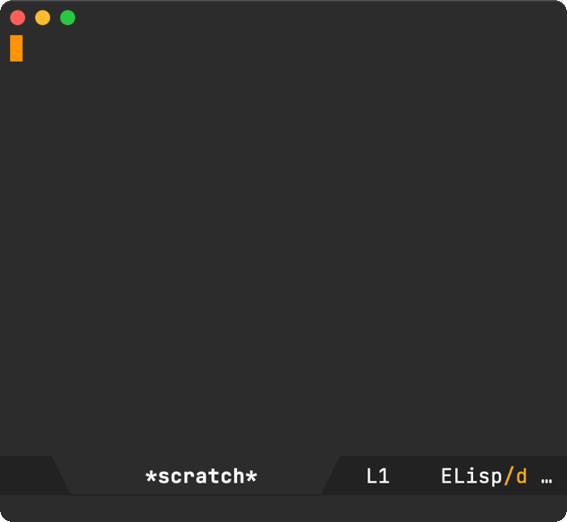

While the interactive command can likely be simplified further, I tried
to optimize for ergonomic usage. For example,
`completing-read`{.verbatim} gives us a way narrow down whichever
variable we'd like to modify as well as the item we'd like to remove.
`seqp`{.verbatim} is also handy, as we filter out noise by automatically
removing any variable that's not a sequence.

``` emacs-lisp
(defun ar/remove-from-list-variable ()
  (interactive)
  (let* ((var (intern
               (completing-read "From variable: "
                                (let (symbols)
                                  (mapatoms
                                   (lambda (sym)
                                     (when (and (boundp sym)
                                                (seqp (symbol-value sym)))
                                       (push sym symbols))))
                                  symbols) nil t)))
         (values (mapcar (lambda (item)
                           (setq item (prin1-to-string item))
                           (concat (truncate-string-to-width
                                    (nth 0 (split-string item "\n"))
                                    (window-body-width))
                                   (propertize item 'invisible t)))
                         (symbol-value var)))
         (index (progn
                  (when (seq-empty-p values) (error "Already empty"))
                  (seq-position values (completing-read "Delete: " values nil t)))))
    (unless index (error "Eeek. Something's up."))
    (set var (append (seq-take (symbol-value var) index)
                     (seq-drop (symbol-value var) (1+ index))))
    (message "Deleted: %s" (truncate-string-to-width
                            (seq-elt values index)
                            (- (window-body-width) 9)))))
```

Hooks are just an example of lists we can delete from. I recently used
the same command on `display-buffer-alist`{.verbatim}.

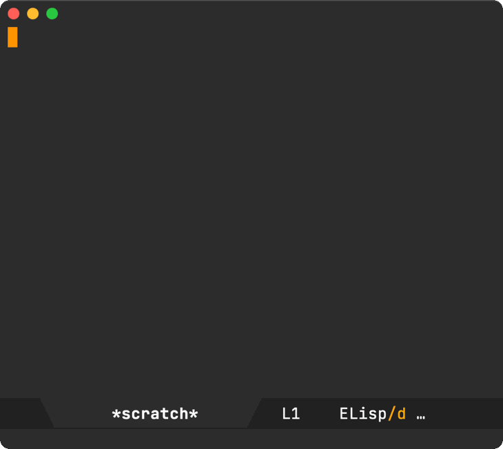

While this has been a fun exercise, I can't help but think that I'm
likely re-inventing the wheel here. Is there something already built-in
that I'm missing?

## Update 1

[alphapapa](https://www.reddit.com/user/github-alphapapa/) suggested
some generalizations that would provide [an editing buffer of
sorts](https://www.reddit.com/r/emacs/comments/13rvehx/comment/jlni3fc/?utm_source=share&utm_medium=web2x&context=3).
This is a neat idea, using familiar key bindigs `C-c C-c`{.verbatim} to
save and `C-c C-k`{.verbatim} to bail.


Beware, I haven't tested the code with a diverse set of list items, so
there's a chance of corrupting the variable content. Improvements to
the code are totally welcome.

``` emacs-lisp
;;; -*- lexical-binding: t; -*-

(defun ar/edit-list-variable ()
  (interactive)
  (let* ((var (intern
               (completing-read "From variable: "
                                (let (symbols)
                                  (mapatoms
                                   (lambda (sym)
                                     (when (and (boundp sym)
                                                (seqp (symbol-value sym)))
                                       (push sym symbols))))
                                  symbols) nil t)))
         (values (string-join
                  (mapcar #'prin1-to-string (symbol-value var))
                  "\n")))
    (with-current-buffer (get-buffer-create "*eval elisp*")
      (emacs-lisp-mode)
      (local-set-key (kbd "C-c C-c")
                     (lambda ()
                       (interactive)
                       (eval-buffer)
                       (kill-this-buffer)
                       (message "Saved: %s" var)))
      (local-set-key (kbd "C-c C-k") 'kill-this-buffer)
      (erase-buffer)
      (insert (format "(setq %s\n `(%s))" var values))
      (mark-whole-buffer)
      (indent-region (point-min) (point-max))
      (deactivate-mark)
      (switch-to-buffer (current-buffer)))))
```

## Update 2

So hunch was right...

> \"While this has been a fun exercise, I can't help but think that
> I'm likely re-inventing the wheel here. Is there something already
> built-in that I'm missing?\"

[juicecelery](https://www.reddit.com/user/juicecelery/)'s Reddit commit
[confirmed
it](https://www.reddit.com/r/emacs/comments/13rvehx/comment/jlo8mhf/?utm_source=share&utm_medium=web2x&context=3).
Thank you!
[remove-hook](https://www.gnu.org/software/emacs/manual/html_node/emacs/Hooks.html)
is already interactive 🤦‍♂️.
[TIL](https://knowyourmeme.com/memes/today-i-learned-til) 😁

juicecelery was kind enough to point out an improvement in the custom
function:

> \"but I see your improvements, for instance that non list items are
> removed from the selection.\"

# Sprinkle me logs

At times, basic prints/logs are just about the right debugging strategy.
Sure, we have debuggers and
[REPLs](https://en.wikipedia.org/wiki/Read%E2%80%93eval%E2%80%93print_loop)
which are super useful, but sometimes you just know that sprinkling your
code with a handful of temporary prints/logs will get you enough info to
fix an issue.

I must confess, my temporary print statements are fairly uninspiring.
Sometimes I log the name of the method/function, but I also resort to
less creative options like `print("Yay")`{.verbatim} or
`print("Got here")`{.verbatim}.

My laziness and lack of creativity knows no boundaries, so if I need
multiple unique entries, I often copy, paste, and append numbers to my
entries: `print("Yay 2")`{.verbatim}, `print("Yay 3")`{.verbatim},
`print("Yay 4")`{.verbatim}... I know, are you judging yet?

So rather than develop the creative muscle, I've decided to lean on
laziness and old habits, so let's make old habit more efficient :) I no
longer want to copy, paste, and increment my uncreative log statements.
Instead, I'll let Emacs do it for me!

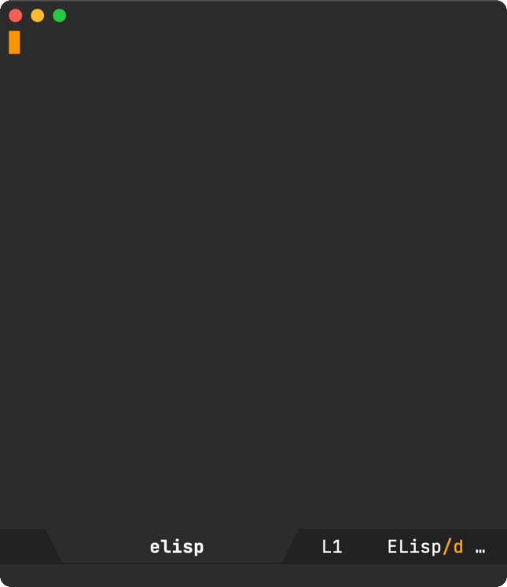

There isn't a whole lot to the implementation. It searches the current
buffer for other instances of the same logging string and captures the
largest counter found. It subsequently prints the same string with the
counter incremented. This can be done in a few lines of elisp, but I
figure I wanted some additional features like auto indenting and
changing the logging string when using a prefix.

``` emacs-lisp
(defvar ar/unique-log-word "Yay")

(defun ar/insert-unique-log-word (prefix)
  "Inserts `ar/unique-log-word' incrementing counter.

With PREFIX, change `ar/unique-log-word'."
  (interactive "P")
  (let* ((word (cond (prefix
                      (setq ar/unique-log-word
                            (read-string "Log word: ")))
                     ((region-active-p)
                      (setq ar/unique-log-word
                            (buffer-substring (region-beginning)
                                              (region-end))))
                     (ar/unique-log-word
                      ar/unique-log-word)
                     (t
                      "Reached")))
         (config
          (cond
           ((equal major-mode 'emacs-lisp-mode)
            (cons (format "(message \"%s: \\([0-9]+\\)\")" word)
                  (format "(message \"%s: %%s\")" word)))
           ((equal major-mode 'swift-mode)
            (cons (format "print(\"%s: \\([0-9]+\\)\")" word)
                  (format "print(\"%s: %%s\")" word)))
           ((equal major-mode 'ada-mode)
            (cons (format "Ada.Text_Io.Put_Line (\"%s: \\([0-9]+\\)\");" word)
                  (format "Ada.Text_Io.Put_Line (\"%s: %%s\");" word)))
           ((equal major-mode 'c++-mode)
            (cons (format "std::cout << \"%s: \\([0-9]+\\)\" << std::endl;" word)
                  (format "std::cout << \"%s: %%s\" << std::endl;" word)))
           (t
            (error "%s not supported" major-mode))))
         (match-regexp (car config))
         (format-string (cdr config))
         (max-num 0)
         (case-fold-search nil))
    (when ar/unique-log-word
      (save-excursion
        (goto-char (point-min))
        (while (re-search-forward match-regexp nil t)
          (when (> (string-to-number (match-string 1)) max-num)
            (setq max-num (string-to-number (match-string 1))))))
      (setq max-num (1+ max-num)))
    (unless (looking-at-p "^ *$")
      (end-of-line))
    (insert (concat
             (if (looking-at-p "^ *$") "" "\n")
             (format format-string
                     (if ar/unique-log-word
                         (number-to-string (1+ max-num))
                       (string-trim
                        (shell-command-to-string
                         "grep -E '^[a-z]{6}$' /usr/share/dict/words | shuf -n 1"))))))
    (call-interactively 'indent-for-tab-command)))
```

Note: This snippet may evolve independently of this post. For the
latest, chech my [Emacs config](https://github.com/xenodium/dotsies)'s
[fe-prog.el](https://github.com/xenodium/dotsies/blob/main/emacs/features/fe-prog.el).

I want to be lazy in other languages, so the function can now be
extended to support other languages. Here's the Swift counterpart.

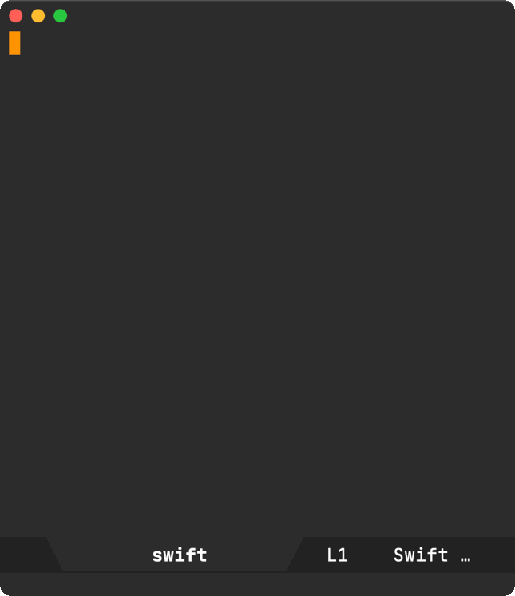

Since I sometimes log function names, I figured making it region-aware
would help with that.

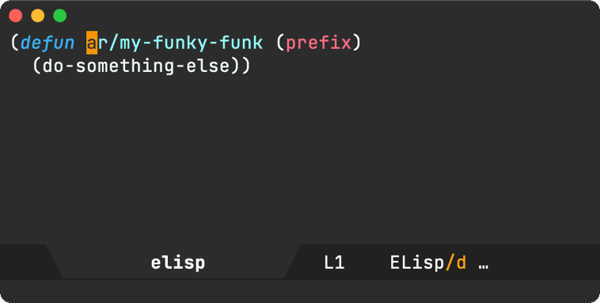

I'm sure there's a package out there that does something similar, but
I figure this would be a fun little elisp hack.

Happy logging!

## Update 1

Set `ar/unique-log-word`{.verbatim} to nil and let it generate a random
word. Maybe I get to learn new words as I debug ;)

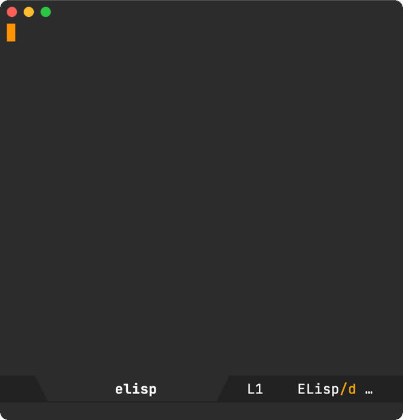

## Update 2

Added Ada and C++ support, thanks to [James Dyer's
post](https://www.emacs.dyerdwelling.family/emacs/20230523204523-emacs--insert-unique-log-message/).

# dwim-shell-command on Windows + upload to 0x0.st

You can now use
[dwim-shell-command](https://github.com/xenodium/dwim-shell-command) on
Windows. Shoutout to Kartik Saranathan, who sent a [pull
request](https://github.com/xenodium/dwim-shell-command/pull/9) to get
rid of `ls`{.verbatim} usage.

Also thanks to Bram for sharing his [upload to 0x0.st
implementation](https://indieweb.social/@bram85@emacs.ch/110335134760990713).
I'd been wanting to do something similar for
[imgur](https://imgur.com/), but [0x0.st](https://0x0.st/) is a much
better alternative!


`dwim-shell-commands-upload-to-0x0`{.verbatim} is now part of
[dwim-shell-commands.el](https://github.com/xenodium/dwim-shell-command/commit/1a896221cc34319582b0921b919638ea2528b0e6)
(the optional part of the package). It has a couple of additional
touches:

-   Open the uploaded image in
    [eww](https://www.gnu.org/software/emacs/manual/html_node/emacs/EWW.html)
    browser.
-   Automatically copy the upload URL to kill-ring. You're likely gonna
    share this link, right?

If you're unfamiliar with `dwim-shell-command`{.verbatim}, it enables
Emacs shell commands with DWIM behaviour:

-   Asynchronously.
-   Using noweb templates.
-   Automatically injecting files (from
    [dired](https://www.gnu.org/software/emacs/manual/html_node/emacs/Dired.html)
    or other buffers) or kill ring.
-   Managing buffer focus with heuristics.
-   Showing progress bar.
-   Quick buffer exit.
-   More reusable history.

In addition to replacing `shell-command`{.verbatim} with
`dwim-shell-command`{.verbatim}, I also use it to bring all sorts of
command line utilities to familiar Emacs workflows (in dired or current
buffers), without having to remember complex command invocations.

I've covered many of the use-cases before:

-   [Emacs DWIM
    shell-command](https://xenodium.com/emacs-dwim-shell-command/)
-   [Emacs: Password-protect current pdf
    (revisited)](https://xenodium.com/emacs-password-protect-current-pdf-revisited/)
-   [png to icns (Emacs DWIM
    style)](https://xenodium.com/png-to-icns-emacs-dwim-style/)
-   [Emacs: DWIM shell command
    (multi-language)](https://xenodium.com/emacs-dwim-shell-command-multi-language/)
-   [dwim-shell-command on
    Melpa](https://xenodium.com/dwim-shell-command-on-melpa/)
-   [dwim-shell-command
    improvements](https://xenodium.com/dwim-shell-command-improvements/)
-   [dwim-shell-command video
    streams](https://xenodium.com/dwim-shell-command-video-streams/)
-   [dwim-shell-command with template
    prompts](https://xenodium.com/dwim-shell-command-with-template-prompts/)
-   [dwim-shell-command usages: pdftotext and
    scp](https://xenodium.com/dwim-shell-command-usages-pdftotext-and-scp/)
-   [Emacs: Reveal in macOS Finder (DWIM
    style)](https://xenodium.com/emacs-reveal-in-finder-dwim-style/)
-   [Emacs: macOS sharing (DWIM
    style)](https://xenodium.com/emacs-macos-share-from-dired-dwim-style/)

# chatgpt-shell siblings now on MELPA also

In [chatgpt-shell
updates](https://xenodium.com/chatgpt-shell-available-on-melpa/), I
highlighted `dall-e-shell`{.verbatim} (a DALL-E Emacs shell),
`ob-chatgpt-shell`{.verbatim} (ChatGPT org babel support), and
`ob-dall-e-shell`{.verbatim} (DALL-E org babel support) were initially
excluded from the
[chatgpt-shell](https://github.com/xenodium/chatgpt-shell) MELPA
submission while I worked out their split.

That's now sorted and the packages are available on MELPA.

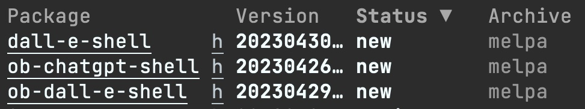

Here's `ob-chatgpt-shell`{.verbatim} and `ob-dall-e-shell`{.verbatim}
in action.


Here's `dall-e-shell`{.verbatim}.


# Generating elisp org docs

[chatgpt-shell](https://github.com/xenodium/chatgpt-shell)'s README
includes few org tables documenting the package's [customizable
variables](https://github.com/xenodium/chatgpt-shell#chatgpt-shell-customizations)
as well as [available
commands](https://github.com/xenodium/chatgpt-shell#chatgpt-shell-commands).
Don't worry, this isn't really another ChatGPT post.

Here's an extract of the docs table:

``` org
| Custom variable                       | Description                                                 |
|---------------------------------------+-------------------------------------------------------------|
| chatgpt-shell-display-function        | Function to display the shell.                              |
| chatgpt-shell-curl-additional-options | Additional options for `curl' command.                      |
| chatgpt-shell-system-prompt           | The system message helps set the behavior of the assistant. |
```

While the table docs didn't take long to build manually, they quickly
became out of sync with their elisp counterparts. Not ideal, as it'll
require a little more careful maintenance in the future.

Emacs being the self-documenting editor that it is, I figured I should
be able to extract customizable variables, commands, along with their
respective docs, and generate these very same org tables.

I had no idea how to go about this, but
[apropos-variable](https://www.gnu.org/software/emacs/manual/html_node/emacs/Apropos.html)
and
[apropos-command](https://www.gnu.org/software/emacs/manual/html_node/emacs/Apropos.html)
surely knew where to fetch the details from. A peak into
`apropos.el`{.verbatim} quickly got me on my way. Turns out
[mapatoms](https://www.gnu.org/software/emacs/manual/html_node/elisp/Creating-Symbols.html#Definition-of-mapatoms)
is just what I needed. It iterates over
[obarray](https://www.gnu.org/software/emacs/manual/html_node/elisp/Creating-Symbols.html),
Emacs's symbol table. We can use it to extract the symbols we're
after.

Since we're filtering symbols from `chatgpt-shell`{.verbatim}, we can
start by including only those whose `symbol-name`{.verbatim} match
\"\^chatgpt-shell\". Out of all matching, we should only keep custom
variables. We can use `custom-variable-p`{.verbatim} to check for that.
This gives us all relevant variables. We can subsequently get each
variable's corresponding docs using
`(get symbol 'variable-documentation)`{.verbatim} and put it into a
list.

Now, if we pull our org babel rabbit out of our Emacs magic hat, we can
use `:results table`{.verbatim} to print the list as an org table. The
source block powering this magic trick looks as follows:

``` org
#+begin_src emacs-lisp :results table :colnames '("Custom variable" "Description")
  (let ((rows))
    (mapatoms
     (lambda (symbol)
       (when (and (string-match "^chatgpt-shell"
                                (symbol-name symbol))
                  (custom-variable-p symbol))
         (push `(,symbol
                 ,(car
                   (split-string
                    (or (get (indirect-variable symbol)
                             'variable-documentation)
                        (get symbol 'variable-documentation)
                        "")
                    "\n")))
               rows))))
    rows)
#+end_src
```

And just like that... we effortlessly get our elisp docs in an org
table, straight from Emacs's symbol table.

![]gif{width="100%"}

It's worth noting that our snippet used `indirect-variable`{.verbatim}
to resolve aliases but also limited descriptions to the first line in
each docstring.

To build a similar table for interactive commands, we can use the
following block (also including bindings).

``` org
#+BEGIN_SRC emacs-lisp :results table :colnames '("Binding" "Command" "Description")
  (let ((rows))
    (mapatoms
     (lambda (symbol)
       (when (and (string-match "^chatgpt-shell"
                                (symbol-name symbol))
                  (commandp symbol))
         (push `(,(mapconcat
                   #'help--key-description-fontified
                   (where-is-internal
                    symbol shell-maker-mode-map nil nil (command-remapping symbol)) ", ")
                 ,symbol
                 ,(car
                   (split-string
                    (or (documentation symbol t) "")
                    "\n")))
               rows))))
    rows)
#+END_SRC
```

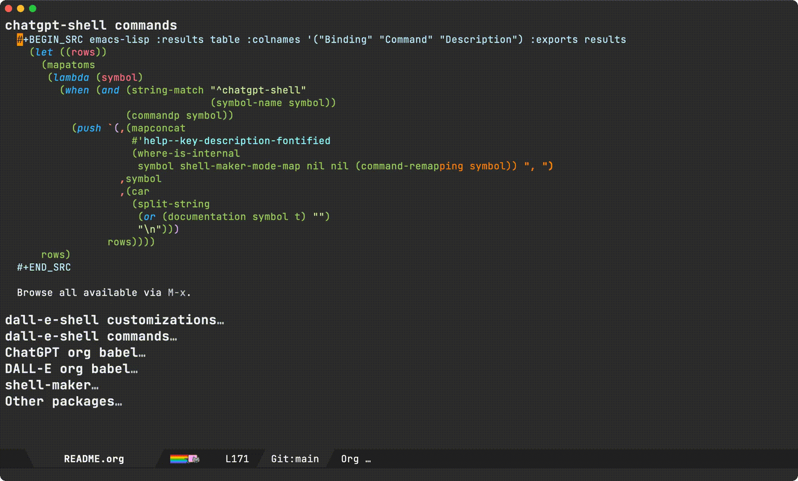

You see? This post wasn't really about ChatGPT. Aren't you glad you
stuck around? 😀

# LLM bookmarks

::: {.MODIFIED .drawer}
\[2023-09-17 Sun\]
:::

-   [A New Age of
    Magic](https://vineeth.io/posts/2023/new-age-of-magic/).
-   [Bark -- Text-prompted generative audio model \| Hacker
    News](https://news.ycombinator.com/item?id=35643219).
-   [Brex's Prompt Engineering Guide \| Hacker
    News](https://news.ycombinator.com/item?id=35942583).
-   [GitHub - suno-ai/bark: 🔊 Text-Prompted Generative Audio
    Model](https://github.com/suno-ai/bark).
-   [How to run your own LLM
    (GPT)](https://blog.rfox.eu/en/Programming/How_to_run_your_own_LLM_GPT.html).
-   [PromptPerfect - Elevate Your Prompts to Perfection with AI Prompt
    Engineering](https://promptperfect.jina.ai/).
-   [Running LLMs Locally \| Y.K.
    Goon](https://ykgoon.com/running-llm-locally.html).
-   [ShareGPT: Share your wildest ChatGPT conversations with one
    click.](https://sharegpt.com/).
-   [Show HN: Automatic prompt optimizer for LLMs \| Hacker
    News](https://news.ycombinator.com/item?id=35660751).
-   [The Art of ChatGPT Prompting: A Guide to Crafting Clear and
    Effective
    Prompts](https://fka.gumroad.com/l/art-of-chatgpt-prompting).
-   [The Art of Midjourney AI: A Guide to Creating Images from
    Text](https://fka.gumroad.com/l/the-art-of-midjourney-ai-guide-to-creating-images-from-text).

# chatgpt-shell updates

About a month ago, I posted about an experiment to build [a ChatGPT
Emacs shell](https://xenodium.com/a-chatgpt-emacs-shell/) using [comint
mode](https://www.gnu.org/software/emacs/manual/html_node/emacs/Shell-Prompts.html).
Since then, it's turned into a package of sorts, evolving with [user
feedback](https://github.com/xenodium/chatgpt-shell/issues?q=is%3Aissue+is%3Aclosed+)
and [pull
requests](https://github.com/xenodium/chatgpt-shell/pulls?q=is%3Apr+is%3Aclosed).

## Now on MELPA

While [chatgpt-shell](https://github.com/xenodium/chatgpt-shell) is a
young package still, it seems useful enough to share more widely. As of
today, `chatgpt-shell`{.verbatim} is [available on
MELPA](https://melpa.org/#/chatgpt-shell). Many thanks to [Chris
Rayner](https://github.com/riscy) for his MELPA guidance to get the
package added.


I'll cover some of the goodies included in the latest
`chatgpt-shell`{.verbatim}.

## Delegating to Org Babel

`chatgpt-shell`{.verbatim} now evaluates Markdown source blocks by
delegating to [org babel](https://orgmode.org/worg/org-contrib/babel/).
I've had success with a handful of languages. In some instances, some
babel headers may need overriding in
`chatgpt-shell-babel-headers`{.verbatim}.

Here's a Swift execution via babel, showing standard output.


In addition to standard output, `chatgpt-shell`{.verbatim} can now
render blocks generating images. Here's a rendered SwiftUI layout via
[ob-swiftui](https://github.com/xenodium/ob-swiftui).

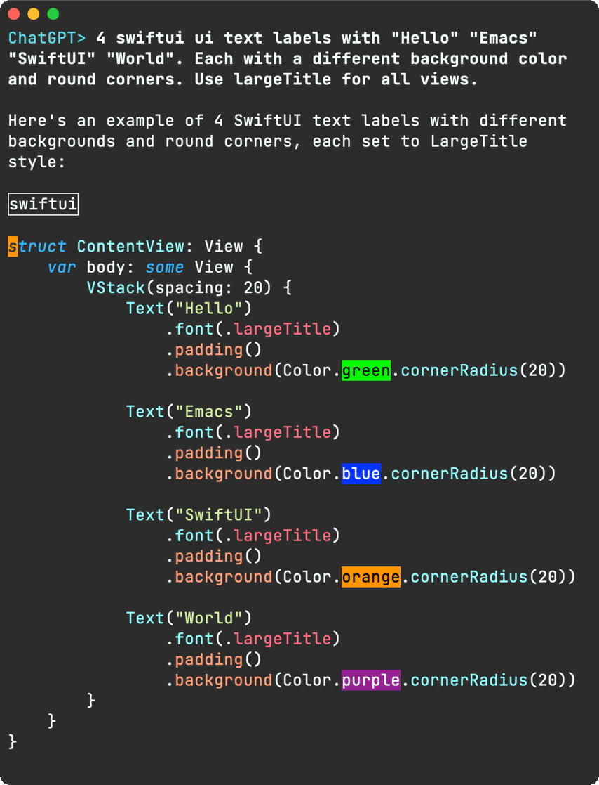

Can also do diagrams. Here's [ditaa](https://ditaa.sourceforge.net/) in
action.

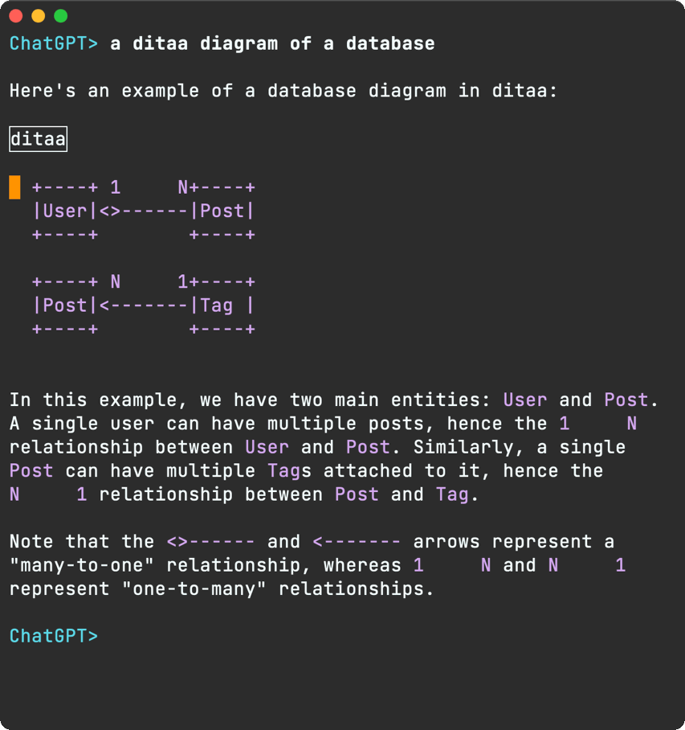

## Renaming blocks

At times, ChatGPT may forget to label source blocks or maybe you just
want to name it differently... You can now rename blocks at point.

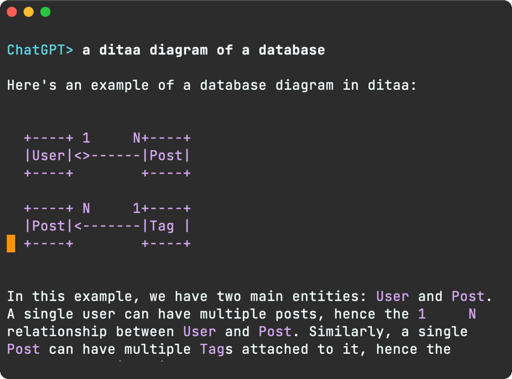

## Send prompt/region

There are a handful of commands to send prompts from other buffers,
including the region. For example
`chatgpt-shell-explain-code`{.verbatim}.


-   chatgpt-shell-send-region
-   chatgpt-shell-generate-unit-test
-   chatgpt-shell-refactor-code
-   chatgpt-shell-proofread-doc
-   chatgpt-shell-eshell-summarize-last-command-output
-   chatgpt-shell-eshell-whats-wrong-with-last-command

## Saving/restoring transcript

You can save your current session to a transcript and restore later.

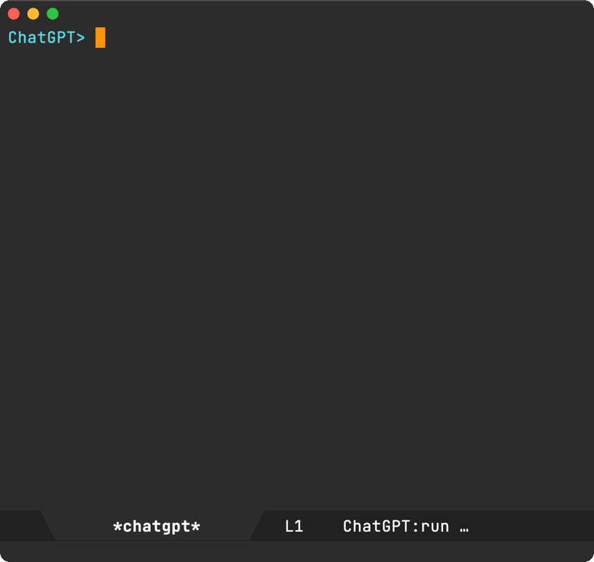

## History improvements

[Nicolas Martyanoff](https://www.n16f.net/) has a great post on [making
IELM More
Comfortable](https://www.n16f.net/blog/making-ielm-more-comfortable/). A
couple of improvements that stood out for me were:

-   Making the command history persistent.
-   Searching history with `shell-maker-search-history`{.verbatim} /
    `M-r`{.verbatim} via `completing-read`{.verbatim}.

`shell-maker-search-history`{.verbatim}, coupled with your completion
framework of choice, can be pretty handy. I happen to use Oleh Krehel's
[ivy](https://github.com/abo-abo/swiper).

## shell-maker (make your own AI shells)

While ChatGPT is a popular service, there are many others sprouting.
Some are cloud-based, others local, proprietary, open source... In any
case, it'd be great be able to hook on to them without much overhead.
[shell-maker](https://xenodium.com/a-shell-maker/) should help with
that. The first `shell-maker`{.verbatim} clients are
`chatgpt-shell`{.verbatim} and `dall-e-shell`{.verbatim}.


While I've built `dall-e-shell`{.verbatim}, it'd be great to see what
others can do with `shell-maker`{.verbatim}. If you wire it up to
anything, please get in touch
([Mastodon](https://indieweb.social/@xenodium) /
[Twitter](https://twitter.com/xenodium) /
[Reddit](https://www.reddit.com/user/xenodium) /
[Email](mailto:me__AT__xenodium.com)).

## dall-e-shell, ob-chatgpt-shell, and ob-dall-e-shell (on MELPA too)

UPDATE:
[dall-e-shell](https://indieweb.social/@xenodium/110087011082546281),
[ob-chatgpt-shell](https://indieweb.social/@xenodium/110130580337078002),
and
[ob-dall-e-shell](https://indieweb.social/@xenodium/110142796865197004)
are now available on MELPA also.

You've seen `dall-e-shell`{.verbatim} in the previous section. Here's
what `ob-chatgpt-shell`{.verbatim} and `ob-dall-e-shell`{.verbatim} look
like in an [org mode](https://orgmode.org/) document:


## How are you using `chatgpt-shell`{.verbatim}?

Whether you are an existing `chatgpt-shell`{.verbatim} user, or would
like to give things a try, [installing from
MELPA](https://melpa.org/#/chatgpt-shell) should generally make things
easier for ya. As I mentioned, `chatgpt-shell`{.verbatim} is a young
package still. There are unexplored Emacs integrations out there. I'd
love to hear about whatever you come up with
([Mastodon](https://indieweb.social/@xenodium) /
[Twitter](https://twitter.com/xenodium) /
[Reddit](https://www.reddit.com/user/xenodium) /
[Email](mailto:me__AT__xenodium.com)).

# Recording and screenshotting windows: the lazy way

While there's no substitution for great written documentation, a quick
demo can go a long way in conveying what a tool if capable of doing or
what a tip/trick can achieve.

If you've read a handful of my posts, you would have come across either
a screenshot or a short clip with some demo. Historically, I've used
the macOS's built-in utility invoked via `⌘ + Shift + 5`{.verbatim}. It
does a fine job for screenshots. For video captures, it's got a couple
of small quirks.

## Record window

Unlike screenshots, macOS video capture cannot record a specific window.
While you can select a region, it's easy to inadvertently include a
portion of your wallpaper in the recording. Not a big deal, but I felt
posted screencasts could look as clean as their screenshot counterparts
if we could record the window alone.

Let's compare grabbing a region vs window alone. I know the clean look
may be subjective, but see what I mean?

<figure width="50%">
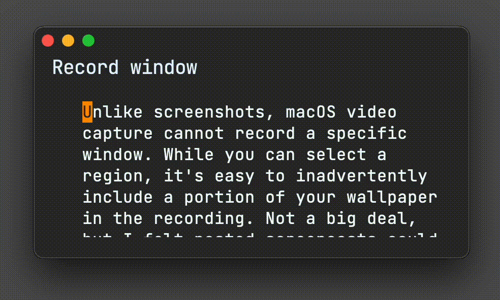
<figcaption>Capture region (includes wallpaper/background)</figcaption>
</figure>

<figure width="50%">
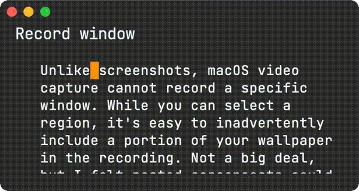
<figcaption>Capture window only (ahhh, so clean)</figcaption>
</figure>

## Cancel recording

macOS has a handy shortcut (`⌘ + Ctrl + Esc`{.verbatim}) to stop
recording. If you got your demo right, you're done. If not, you have
one more step remaining (right click to delete the blooper).


Also not a huge deal, but I was hoping for a single shortcut to stop
recording [and]{.underline} also automatically discard. I haven't found
one, but would love to hear if otherwise.

## macosrec enters the chat

I wanted more flexibility to build my own recording/screenshotting
flows. A command line utility could be quite versatile at that, so I
built [macosrec](https://github.com/xenodium/macosrec).

`macosrec`{.verbatim} enables taking a screenshot or recording a window
video entirely from the command line.


## elisp glues the world

Command line utilities can be invoked in all sorts of ways, but I'm an
Emacs nutter so you can see where this is going... I want Emacs key
bindings to control the lot.

  -------- -----------------------------
  C-c \_   Take screenshot of a window
  C-c (    Start recording window
  C-c )    Stop recording window
  C-c 8    Abort recording
  -------- -----------------------------

Integrating command line utilities into Emacs and making them quickly
accessible seems to have become a full-time hobby of mine. I kid, but
it's become a pretty painless process for me. I built
[dwim-shell-command](https://github.com/xenodium/dwim-shell-command) for
that. If you've never heard of
[DWIM](https://en.wikipedia.org/wiki/DWIM), it stands for \"Do what I
mean\". To give you an idea of the kinds of things I'm using DWIM
commands for, check the following out:

-   dwim-shell-commands-audio-to-mp3
-   dwim-shell-commands-bin-plist-to-xml
-   dwim-shell-commands-clipboard-to-qr
-   dwim-shell-commands-drop-video-audio
-   dwim-shell-commands-files-combined-size
-   dwim-shell-commands-git-clone-clipboard-url
-   dwim-shell-commands-git-clone-clipboard-url-to-downloads
-   dwim-shell-commands-image-to-grayscale
-   dwim-shell-commands-image-to-icns
-   dwim-shell-commands-image-to-jpg
-   dwim-shell-commands-image-to-png
-   dwim-shell-commands-pdf-password-protect
-   dwim-shell-commands-reorient-image
-   dwim-shell-commands-resize-gif
-   dwim-shell-commands-resize-image
-   dwim-shell-commands-resize-video
-   dwim-shell-commands-speed-up-gif
-   dwim-shell-commands-speed-up-video
-   dwim-shell-commands-unzip
-   dwim-shell-commands-video-to-gif
-   dwim-shell-commands-video-to-optimized-gif
-   dwim-shell-commands-video-to-webp

If it ever took you a little while to find the right command incantation
to get things right, only to forget all about it next time you need it
([I'm looking at you
ffmpeg](https://xenodium.com/emacs-ffmpeg-and-macos-alias-commands)),
`dwim-shell-command`{.verbatim} can help you easily save things for
posterity and make them easily accessible in the future.

Since we're talking ffmpeg, here's all it takes to have gif conversion
handy:

``` emacs-lisp
(defun dwim-shell-commands-video-to-gif ()
  "Convert all marked videos to gif(s)."
  (interactive)
  (dwim-shell-command-on-marked-files
   "Convert to gif"
   "ffmpeg -loglevel quiet -stats -y -i '<<f>>' -pix_fmt rgb24 -r 15 '<<fne>>.gif'"
   :utils "ffmpeg"))
```

There's no way I'll remember the ffmpeg command, but I can always
fuzzy search my trusty commands with something like
`"to gif"`{.verbatim} and apply to either the current buffer file or any
selected
[dired](https://www.gnu.org/software/emacs/manual/html_node/emacs/Dired.html)
files.


So where am I going with this? I wrote DWIM shell commands for the
bindings I previously described:

  -------- ---------------------------------------------------------------
  C-c \_   `dwim-shell-commands-macos-screenshot-window`{.verbatim}
  C-c (    `dwim-shell-commands-macos-start-recording-window`{.verbatim}
  C-c )    `dwim-shell-commands-macos-end-recording-window`{.verbatim}
  C-c 8    `dwim-shell-commands-macos-abort-recording-window`{.verbatim}
  -------- ---------------------------------------------------------------

Out of all of commands,
`dwim-shell-commands-macos-start-recording-window`{.verbatim} is likely
the most interesting one.

``` emacs-lisp
(defun dwim-shell-commands-macos-start-recording-window ()
  "Select and start recording a macOS window."
  (interactive)
  (let* ((window (dwim-shell-commands--macos-select-window))
         (path (dwim-shell-commands--generate-path "~/Desktop" (car window) ".mov"))
         (buffer-file-name path) ;; override so <<f>> picks it up
         (inhibit-message t))
    (dwim-shell-command-on-marked-files
       "Start recording a macOS window."
       (format
        "# record .mov
         macosrec --record '%s' --mov --output '<<f>>'
         # speed .mov up x1.5
         ffmpeg -i '<<f>>' -an -filter:v 'setpts=1.5*PTS' '<<fne>>_x1.5.<<e>>'
         # convert to gif x1.5
         ffmpeg -loglevel quiet -stats -y -i '<<fne>>_x1.5.<<e>>' -pix_fmt rgb24 -r 15 '<<fne>>_x1.5.gif'
         # speed .mov up x2
         ffmpeg -i '<<f>>' -an -filter:v 'setpts=2*PTS' '<<fne>>_x2.<<e>>'
         # convert to gif x2
         ffmpeg -loglevel quiet -stats -y -i '<<fne>>_x2.<<e>>' -pix_fmt rgb24 -r 15 '<<fne>>_x2.gif'"
        (cdr window))
       :silent-success t
       :monitor-directory "~/Desktop"
       :no-progress t
       :utils '("ffmpeg" "macosrec"))))
```

As you likely expect, this command invokes `macosrec`{.verbatim} to
start recording a window. The nifty part is that when it's done
recording (and saving the .mov file), it automatically creates multiple
variants. For starters, it creates x1.5 and x2 .mov videos, but it also
generates their .gif counterparts.

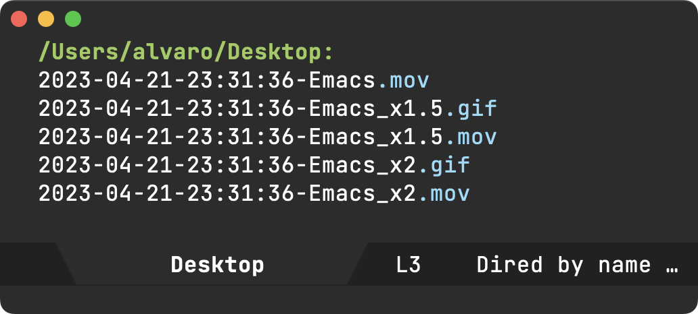

Let's recap here for a sec. You start recording a window video with
`C-c (`{.verbatim}, end with `C-c )`{.verbatim}, and automagically have
all these generated files waiting for you.

You can subsequently inspect any of the video candidates and pick the
most appropriate variant. Discard whatever else you don't need.

The output bundle is tailored to my needs. Maybe you want to invoke
[gifsycle](https://www.lcdf.org/gifsicle/) for more optimized versions?
Or maybe you want automatic webp generation via `ffmpeg`{.verbatim}?
DWIM does that I mean, so you likely have other plans...

`dwim-shell-commands-macos-start-recording-window`{.verbatim} and all
other DWIM commands are now included in
[dwim-shell-commands.el](https://github.com/xenodium/dwim-shell-command/blob/main/dwim-shell-commands.el),
which ships optionally as part of
[dwim-shell-command](https://github.com/xenodium/dwim-shell-command).

[macosrec](https://github.com/xenodium/macosrec) is also on GitHub, but
if you want to be on your way, you can install via:

``` sh
brew tap xenodium/macosrec
brew install macosrec
```

This is my way to record and screenshot windows the lazy way. How would
you tweak to make it yours?

# ob-swiftui updates

While [experimenting with delegating
Markdown](https://indieweb.social/@xenodium/110227186721704189) blocks
to [Org babel](https://orgmode.org/worg/org-contrib/babel/) in Emacs
[chatgpt-shell](https://github.com/xenodium/chatgpt-shell), I
resurrected [ob-swiftui](https://github.com/xenodium/ob-swiftui). A
package I had written to execute and render SwiftUI blocks in org babel.

[ob-swiftui](https://github.com/xenodium/ob-swiftui) has two modes of
rendering SwiftUI blocks: `:results window`{.verbatim}, which runs
outside of Emacs in a native window and `:results file`{.verbatim},
which renders and saves to a file. The latter can be viewed directly
from Emacs.

`:results file`{.verbatim} was a little clunky. That is, it hardcoded
dimensions I had to manually modify if the canvas wasn't big enough. It
was also a little slow.

The clunkyness really came through with my chatgpt-shell experiments, so
I took a closer look and made a few changes to remove hardcoding and
speeds things up.

The results ain't too shabby.

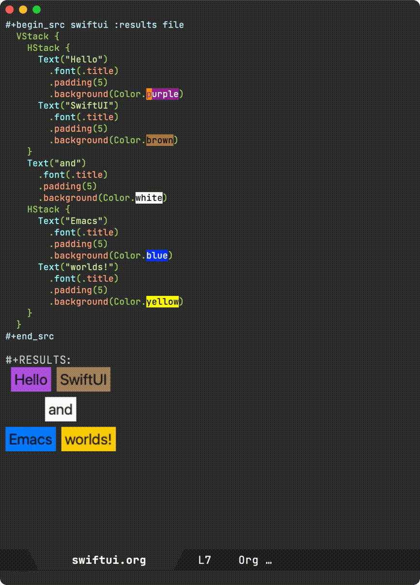

Another tiny improvement is that if you'd like to compose a more
complex layout made of multiple custom views, `ob-swiftui`{.verbatim}
now looks for a `ContentView`{.verbatim} as that root view by default.
Specifying another root view was already possible but it had to be
explicitly requested via `:view`{.verbatim} param.

You can now omit the `:view`{.verbatim} param if you name the root view
`ContentView`{.verbatim}:

``` org
#+begin_src swiftui
  struct ContentView: View {
    var body: some View {
        TopView()
        BottomView()
    }
  }

  struct TopView: View {
    var body: some View {
      Text("Top text")
    }
  }

  struct BottomView: View {
    var body: some View {
      Text("Bottom text")
    }
  }
#+end_src
```

The improvements have been pushed to
[ob-swiftui](https://github.com/xenodium/ob-swiftui) and will soon be
picked up on [melpa](https://melpa.org/#/ob-swiftui).

Edit: Added ContentView details.

# My Emacs eye candy

I get the occasional question about my Emacs theme, font, and other eye
candy. I'm always tickled and happy to share.

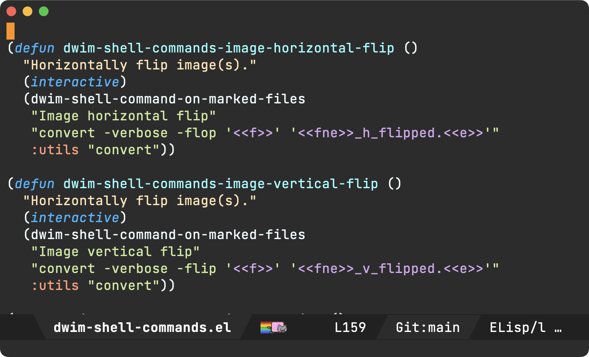

It's been a while since I've made visually significant changes to my
Emacs config. May as well briefly document for posterity...

## Nyan Mode

First things first. The adorable and colorful little fella in my mode
line is a [Nyan Cat](https://en.wikipedia.org/wiki/Nyan_Cat) (if you
dare, check the [meme
video](https://www.youtube.com/watch?v=QH2-TGUlwu4)). Yes, I know it's
sooo 2011, but it's 2023 and I still love the little guy hanging out in
my Emacs mode line. I still get asked about it.

{height="30px"}

This fabulous feature comes to us via the great [Nyan
Mode](https://github.com/TeMPOraL/nyan-mode/) package. If looks haven't
convinced you, Nyan also packs scrolling functionality. Click anywhere
in it.

Oh, and if you can't get enough of Nyan, there's also
[zone-nyan](https://depp.brause.cc/zone-nyan/) for Emacs.

## Emacs Plus (macOS)

I should mention I'm running Emacs 28 on macOS via the excellent [Emacs
Plus](https://github.com/d12frosted/homebrew-emacs-plus)
[homebrew](https://brew.sh/) recipe. These are all the options I enable.

``` sh
brew install  emacs-plus@28 --with-imagemagick --with-no-frame-refocus --with-native-comp --with-savchenkovaleriy-big-sur-icon
```

### Icon

Since we're talking eye candy, let's chat about
`--with-savchenkovaleriy-big-sur-icon`{.verbatim}. This Emacs Plus
option enables Valeriy Savchenko's [wonderful
icon](https://github.com/SavchenkoValeriy/emacs-icons).


### Titlebar

I've enabled both transparent title bar as well as dark appearance,
giving a minimal window decoration.


``` emacs-lisp
(add-to-list 'default-frame-alist '(ns-transparent-titlebar . t))
(add-to-list 'default-frame-alist '(ns-appearance . dark))
```

Note: both of these variables are prefixed `ns-`{.verbatim} (macOS-only
settings).

## Font (JetBrains Mono)

I've been on [JetBrains Mono](https://www.jetbrains.com/lp/mono/) font
for quite some time now. In the past, I've also been a fan of
[Mononoki](https://madmalik.github.io/mononoki/) and
[Menlo](https://en.wikipedia.org/wiki/Menlo_(typeface)) (on macOS) or
[Meslo](https://github.com/andreberg/Meslo-Font) (similar elsewhere).

## Theme (Material)

I'm using the great [Material Theme for
Emacs](https://github.com/cpaulik/emacs-material-theme), with a [bunch
of tweaks of my
own](https://github.com/xenodium/dotsies/blob/790465b1824481b81bf5c6e08949128c13d76f95/emacs/features/fe-ui.el#L42).

## Modeline tabs/ribbons (Moody)

The [moody](https://github.com/tarsius/moody) package adds a nice touch
displaying mode line elements as tabs and ribbons.

## Modeline menus (Minions)

The [minions](https://github.com/tarsius/minions) package removes lots
of minor mode clutter from the mode line and stashes it away in menus.

## Hiding modeline (hide mode line mode)

Hiding the mode line isn't something I use in most major modes.
However, I found it complements my shell
([eshell](https://www.masteringemacs.org/article/complete-guide-mastering-eshell))
quite well. While I was sceptical at first, once I hid the mode line in
my shell I never looked back. I just didn't miss it. I also love the
uncluttered clean vibe.
[hide-mode-line-mode](https://github.com/hlissner/emacs-hide-mode-line)
can help with that.


## Welcome screen

Back in October 2022, I experimented with [adding a minimal welcome
screen](https://xenodium.com/emacs-a-welcoming-experiment/). I was
initially hesitant, as I was already a fan of the welcome scratch
buffer. In any case, I figured I'd eventually get tired of it and
remove it. Well, it's enabled in my config still ;) My initial
attachment to a landing scratch quickly faded. I'm only a
`C-x b`{.verbatim} binding away from invoking ivy-switch-buffer to get
me anywhere.

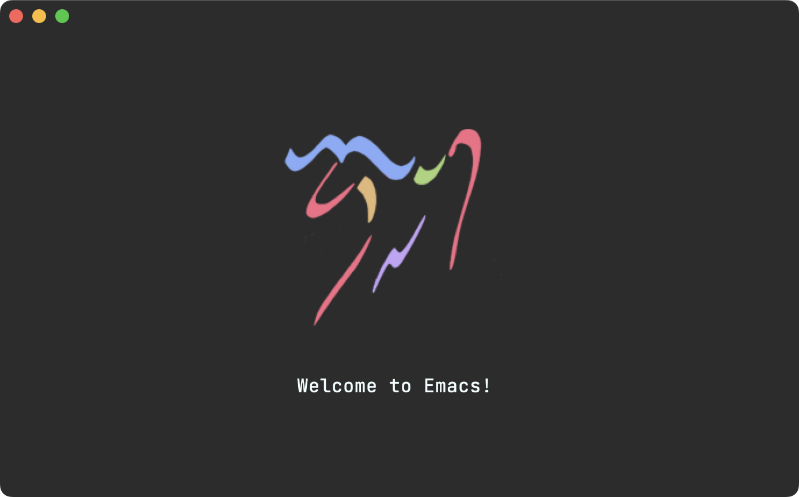

The great Emacs logo originally [shared by
u/pearcidar43](https://www.reddit.com/r/unixporn/comments/yamj5f/exwm_emacs_is_kinda_comfy_as_a_wm/).

## Zones

I've been meaning to re-enable
[zones](https://github.com/emacs-mirror/emacs/blob/master/lisp/play/zone.el)
in my config. They always gave me a good tickle. I've already mentioned
[zone-nyan](https://depp.brause.cc/zone-nyan/), but if you're new to
zones, they kick off after a period of inactivity (similar to a
screensaver).

Here's `zone-pgm-rotate`{.verbatim} in all its glory. Oh and it's
built-in!

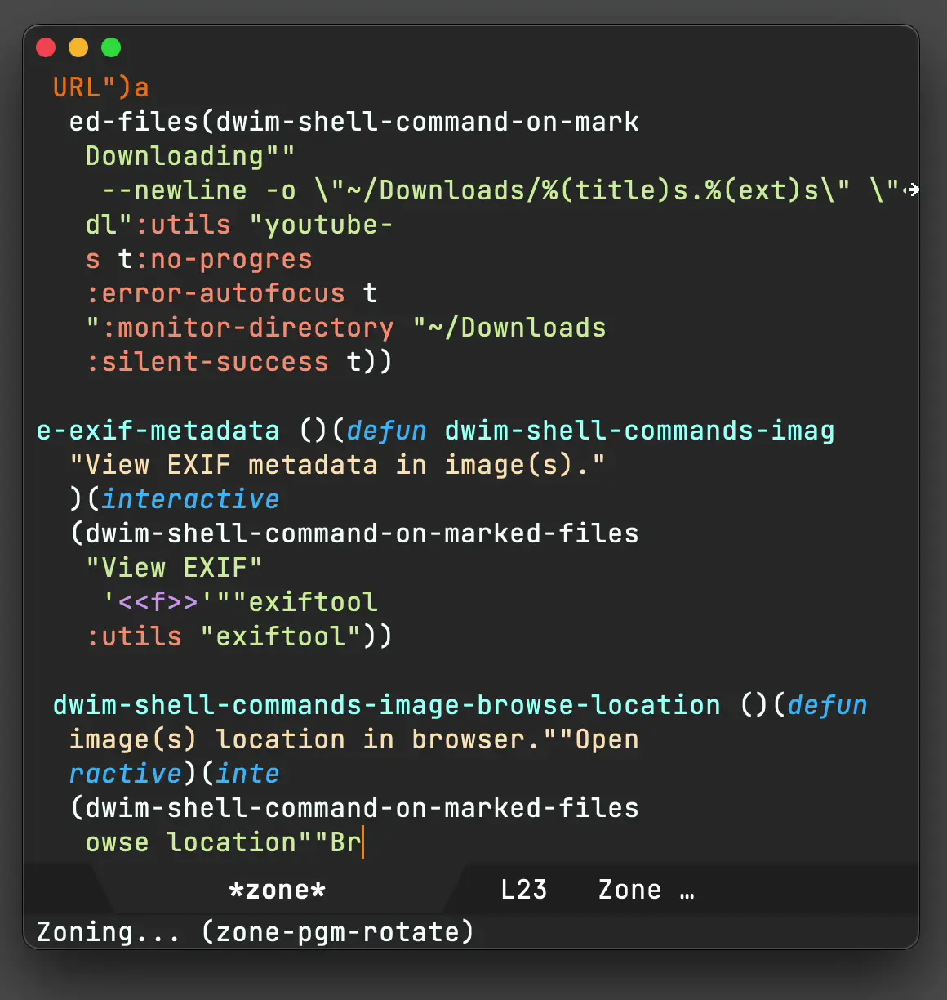

Coincidentally, I had a go at writing [a basic zone a little while
ago](https://xenodium.com/emacs-zones-to-lift-you-up/).


## Config

Most of the items mentioned I pulled from my [Emacs
config](https://github.com/xenodium/dotsies)'s
[fe-ui.el](https://github.com/xenodium/dotsies/blob/main/emacs/features/fe-ui.el).
There's more there if you're interested.

What is some of your favorite Emacs eye candy?
[reddit](https://www.reddit.com/r/emacs/comments/12nbb9x/my_emacs_eye_candy/)
/ [mastodon](https://indieweb.social/@xenodium/110204024063552954) /
[twitter](https://twitter.com/xenodium/status/1647293089394900993).

# shell-maker, a maker of Emacs shells

A few weeks ago, I wrote about an experiment to bring [ChatGPT to Emacs
as a shell](https://xenodium.com/a-chatgpt-emacs-shell/). I was fairly
new to both [ChatGPT](https://openai.com/blog/chatgpt) and building
anything on top of
[comint](https://www.gnu.org/software/emacs/manual/html_node/emacs/Shell-Prompts.html).
It was a fun exercise, which also generated some interest.

As mentioned in the previous post, I took inspiration in other Emacs
packages (primarily
[ielm](https://www.gnu.org/software/emacs/manual/html_node/emacs/Lisp-Interaction.html))
to figure out what I needed from comint. Soon, I got ChatGPT working.

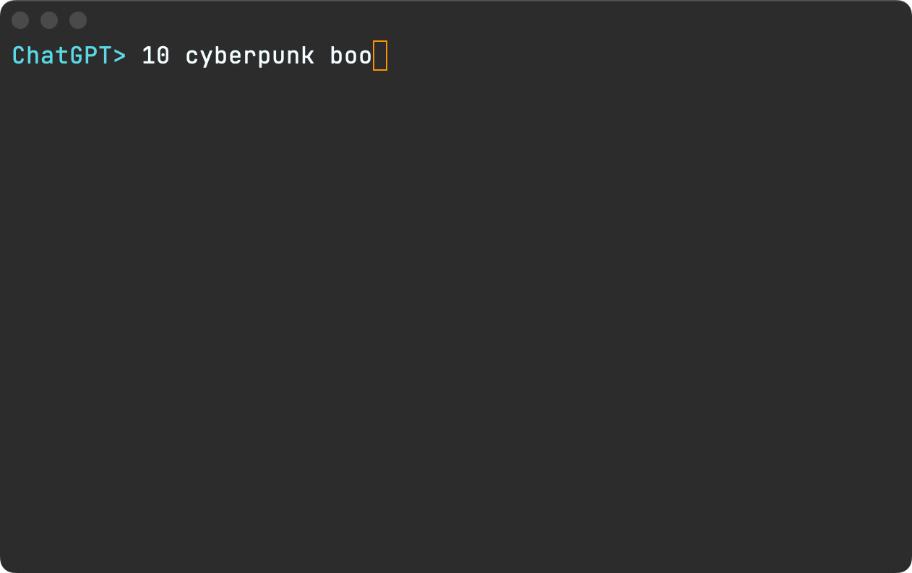

As I was looking at [OpenAI](https://openai.com) API docs, I learned
about DALL-E: \"an AI system that can create realistic images and art
from a description in natural language.\"

Like ChatGPT, they also offered an API to DALL-E, so I figured I may as
well try to write a shell for that too... and I did.


There was quite a bit of code duplication between the two Emacs shells I
had just written. At the same time, I started hearing from folks about
integrating other tools, some cloud-based, some local, proprietary, open
source.. There's [Cody](https://about.sourcegraph.com/cody),
[invoke-ai](https://github.com/invoke-ai/InvokeAI),
[llama.cpp](https://github.com/ggerganov/llama.cpp),
[alpaca.cpp](https://github.com/antimatter15/alpaca.cpp), and the list
continues to grow.

With that in mind, I set out to reduce the code duplication and
consolidate into a reusable package. And so `shell-maker`{.verbatim} was
born, a maker of Emacs shells.

`shell-maker`{.verbatim}'s internals aren't too different from the
code I had before. It's still powered by comint, but instead offers a
reusable convenience wrapper.

It takes little code to implement a shell, like the sophisticated new
`greeter-shell`{.verbatim} ;)


``` emacs-lisp
(require 'shell-maker)

(defvar greeter-shell--config
  (make-shell-maker-config
   :name "Greeter"
   :execute-command
   (lambda (command _history callback error-callback)
     (funcall callback
              (format "Hello \"%s\"" command)
              nil))))

(defun greeter-shell ()
  "Start a Greeter shell."
  (interactive)
  (shell-maker-start greeter-shell--config))
```

[shell-maker](https://github.com/xenodium/chatgpt-shell#shell-maker) is
available on GitHub and currently bundled with
[chatgpt-shell](https://github.com/xenodium/chatgpt-shell). If there's
enough interest and usage, I may just break it out into its own package.
For now, it's convenient to keep with `chatgpt-shell`{.verbatim} and
`dall-e-shell`{.verbatim}.

If you plug `shell-maker`{.verbatim} into other tools, I'd love to hear
about it.

Happy shell making!

# Flat Habits 1.1.4 released

[Flat Habits](https://flathabits.com/) 1.1.4 is now available on the
[App Store](https://apps.apple.com/app/id1558358855).

Flat Habits is a habit tracker that's mindful of your time, data, and
privacy. It's a simple but effective iOS app.

``` html
<div style="text-align: center;">
  
  <br/>
  <br/>
  <a href="https://apps.apple.com/app/id1558358855">
    
  </a>
</div>
```
If you care about how your data is stored, Flat Habits is powered by
[org](https://orgmode.org) plain text markup without any cloud
component. You can use your [favorite
editor](https://xenodium.com/frictionless-org-habits-on-ios/) (Emacs,
Vim, VSCode, etc.) to poke at habit data, if that's your cup of tea.

## What's new?

-   Quicker toggling, now exposing Done/Skip.
    -   Double tap marks Done.
-   Also display in 12 hour time format.
-   Overdue habits are now labelled \"past\" and coloured orange.
-   Don't dismiss creation dialog if tapping outside.
-   Set #+STARTUP: nologdrawer in new files.

## Are you a fan?

Is Flat Habits helping you keep up with your habits? Please
[rate/review](https://apps.apple.com/app/id1558358855?action=write-review)
😊

# A ChatGPT Emacs shell

UPDATE: `chatgpt-shell`{.verbatim} [has evolved a
bit](https://xenodium.com/chatgpt-shell-available-on-melpa/) and is now
[on MELPA](https://melpa.org/#/chatgpt-shell).

I had been meaning to give [ChatGPT](https://openai.com/blog/chatgpt) a
good try, preferably from Emacs. As an
[eshell](https://www.gnu.org/software/emacs/manual/html_mono/eshell.html)
fan, ChatGPT seemed like the perfect fit for a shell interface of sorts.
With that in mind, I set out to wire ChatGPT with Emacs's general
command interpreter
([comint](https://www.gnu.org/software/emacs/manual/html_node/emacs/Shell-Prompts.html)).

I had no previous experience building anything comint-related, so I
figured I could just take a peek at an existing comint-derived mode to
achieve a similar purpose. `inferior-emacs-lisp-mode`{.verbatim}
([ielm](https://www.gnu.org/software/emacs/manual/html_node/emacs/Lisp-Interaction.html))
seemed to fit the bill just fine, so I borrowed quite a bit to assemble
a basic shell experience.

From then on, it was mostly about sending each request over to the
ChatGPT API to get a response. For now, I'm relying on
[curl](https://curl.se/docs/manpage.html) to make each request. The
invocation is fairly straightforward:

``` sh
curl "https://api.openai.com/v1/chat/completions" \
     -H "Authorization: Bearer YOUR_OPENAI_KEY" \
     -H "Content-Type: application/json" \
     -d "{
     \"model\": \"gpt-3.5-turbo\",
     \"messages\": [{\"role\": \"user\", \"content\": \"YOUR PROMPT\"}]
     }"
```

There are two bits of information needed in each request. The API key,
which you must get from [OpenAI](https://openai.com/), and the prompt
text itself (i.e. whatever you want ChatGPT to help you with). The
results are not too shabby.

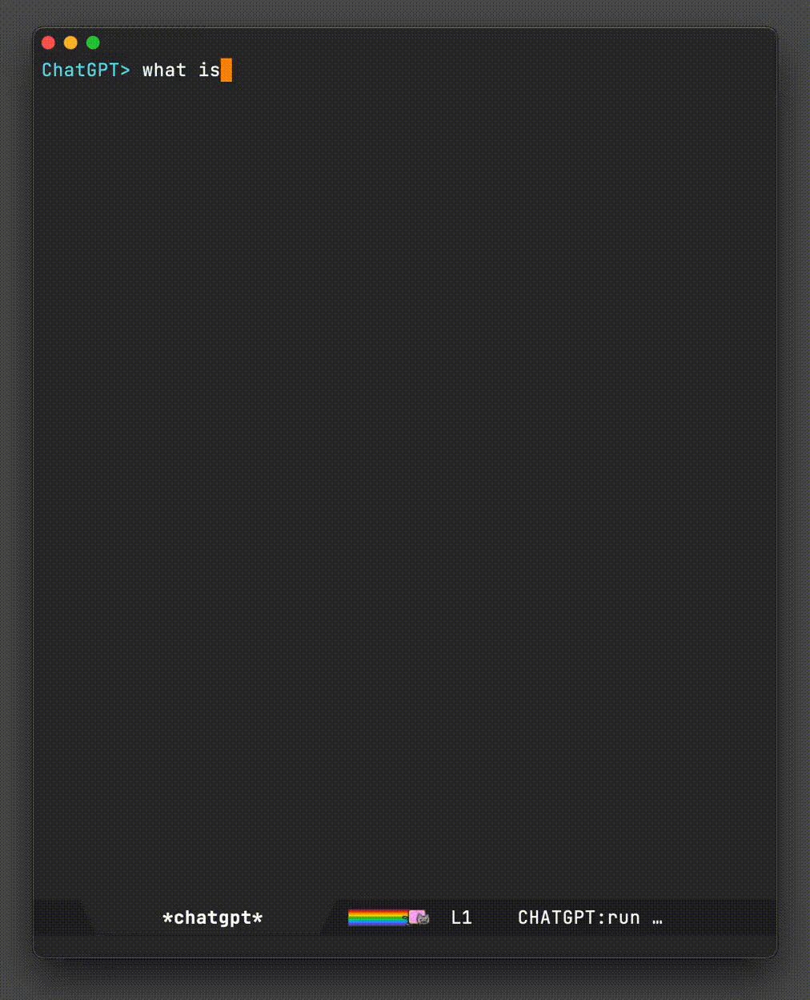

I've uploaded the code to GitHub as a tiny
[chatgpt-shell](https://github.com/xenodium/chatgpt-shell) package.
It's a little experimental and rough still, but hey, it does the job
for now. Head over to
[github](https://github.com/xenodium/chatgpt-shell) to take a look. The
latest iteration handles multiline prompts (use C-j for newlines) and
basic code highlighting.

Let's see where it all goes. Pull requests for improvements totally
welcome ;-)

# *scratch* a new minimal org mode scratch area for iOS

While we already have lots of note-taking apps on iOS, I wanted a
minimal `*scratch*`{.verbatim} area (à la Emacs), so I built one.

``` html
<br/>
<div style="text-align: center;">
  <a href="https://apps.apple.com/app/id1671420139">
    
  </a>
</div>
```
What's the use-case? You're on the go. Someone's telling you
directions, or a phone number, name of a restaurant, anything really...
you just need to write it down *right now, quickly*!

No time to create a new contact, a note, a file, or spend time on
additional taps, bring up keyboard... You just want to write it
somewhere with the least amount of friction.


Being an Emacs and org user, I had to sprinkle the app with basic markup
support for headings, lists and checkboxes. Also, having a
`*scratch*`{.verbatim} \"buffer\" on my iPhone gives me that warm emacsy
fuzzy feeling :)

You can download `*scratch*`{.verbatim} from the [App
Store](https://apps.apple.com/gb/app/scratch/id1671420139).

Find it useful? Please help me spread the word. Tell your friends.

``` html
<br/>
<div style="text-align: center;">
  <a href="https://apps.apple.com/app/id1671420139">
    
  </a>
</div>
```
# Chicken Karaage recipe

Huge fan of Chicken Karaage, but never really made it at home until
recently.


## Dice the chicken

-   350 grams boneless chicken thighs

Dice the chicken up.

## Marinade for 30 mins

-   1 tablespoon soy sauce (Kikkoman or similar)
-   1 tablespoon cooking Sake
-   2 tablespoons of grated ginger (include liquids)
-   1/2 teaspoon Mirin

Mix all ingredients into a ziploc bag. Add the diced chicken and let it
marinade for 30 minutes in the fridge.

## Pat dry

-   Paper towels

After marinating, pat the chicken dry with paper towels and set aside.

## Breading

-   Potato starch

Ok, not quite breading since we're using potato starch but same goal.
Sprinkle the chicken pieces and make sure they are fully coated with the
starch.

## Frying (1st round)

-   Vegetable oil
-   Paper towels

Heat up (roughly at 160°C) enough oil in a pan to cover the chicken
pieces. Cook for about 3 minutes. The pieces don't have to be super
golden at this point. There will be another round of frying for that.

## Rest for 4 minutes

-   Paper towels

Let the chicken rest on paper towels for about 4 minutes before frying
again.

## Frying (2nd round)

-   Vegetable oil
-   Paper towels

This time heat up the oil at roughly 200°C. This is a quick in-and-out
action to make the chicken crispy. Cook for 30 seconds. Take out and set
aside on some paper towels. Let it cool and it's ready to eat.

## Dipping

-   Kewpie mayo
-   Sriracha sauce

This is totally optional, but I'm a fan of both Kewpie mayo and
Sriracha sauce. You can dip your chicken in either or both!

# Emacs: org-present in style

I had been meaning to check out David Wilson's [System
Crafters](https://systemcrafters.cc) post detailing [his presentations
style](https://systemcrafters.net/emacs-tips/presentations-with-org-present/)
achieved with the help of
[org-present](https://github.com/rlister/org-present) and his own
customizations. If you're looking for ways to present from Emacs
itself, David's post is well worth a look.

org-present's spartan but effective approach resonated with me.
David's touches bring the wonderfully stylish icing to the cake. I
personally liked his practice of collapsing slide subheadings by
default. This lead me to think about slide navigation in general...

There were two things I wanted to achieve:

1.  Easily jump between areas of interest. Subheadings, links, and code
    blocks would be a good start.
2.  Collapse all but the current top-level heading within the slide, as
    navigation focus changes.

A quick search for existing functions led me to
`org-next-visible-heading`{.verbatim}, `org-next-link`{.verbatim}, and
`org-next-block`{.verbatim}. While these make it easy to jump through
jump between headings, links, org block on their own, I wanted to jump
to whichever one of these is next (similar a web browser's tab
behaviour). In a way, [DWIM](https://en.wikipedia.org/wiki/DWIM) style.

I wrapped the existing functions to enable returning positions. This
gave me `ar/rg-next-visible-heading-pos`{.verbatim},
`ar/rg-next-link-pos`{.verbatim}, and `ar/rg-next-block-pos`{.verbatim}
respectively. Now that I can find out the next location of either of
these items, I can subsequently glue the navigation logic in a function
like `ar/org-present-next-item`{.verbatim}. To restore balance to the
galaxy, I also added `ar/org-present-previous-item`{.verbatim}.

``` emacs-lisp
(defun ar/org-present-next-item (&optional backward)
  "Present and reveal next item."
  (interactive "P")
  ;; Beginning of slide, go to previous slide.
  (if (and backward (eq (point) (point-min)))
      (org-present-prev)
    (let* ((heading-pos (ar/org-next-visible-heading-pos backward))
           (link-pos (ar/org-next-link-pos backward))
           (block-pos (ar/org-next-block-pos backward))
           (closest-pos (when (or heading-pos link-pos block-pos)
                          (apply (if backward #'max #'min)
                                 (seq-filter #'identity
                                             (list heading-pos
                                                   link-pos
                                                   block-pos))))))
      (if closest-pos
          (progn
            (cond ((eq heading-pos closest-pos)
                   (goto-char heading-pos))
                  ((eq link-pos closest-pos)
                   (goto-char link-pos))
                  ((eq block-pos closest-pos)
                   (goto-char block-pos)))
            ;; Reveal relevant content.
            (cond ((> (org-current-level) 1)
                   (ar/org-present-reveal-level2))
                  ((eq (org-current-level) 1)
                   ;; At level 1. Collapse children.
                   (org-overview)
                   (org-show-entry)
                   (org-show-children)
                   (run-hook-with-args 'org-cycle-hook 'children))))
        ;; End of slide, go to next slide.
        (org-present-next)))))

(defun ar/org-present-previous-item ()
  (interactive)
  (ar/org-present-next-item t))

(defun ar/org-next-visible-heading-pos (&optional backward)
  "Similar to `org-next-visible-heading' but for returning position.

Set BACKWARD to search backwards."
  (save-excursion
    (let ((pos-before (point))
          (pos-after (progn
                       (org-next-visible-heading (if backward -1 1))
                       (point))))
      (when (and pos-after (not (equal pos-before pos-after)))
        pos-after))))

(defun ar/org-next-link-pos (&optional backward)
  "Similar to `org-next-visible-heading' but for returning position.

Set BACKWARD to search backwards."
  (save-excursion
    (let* ((inhibit-message t)
           (pos-before (point))
           (pos-after (progn
                        (org-next-link backward)
                        (point))))
      (when (and pos-after (or (and backward (> pos-before pos-after))
                               (and (not backward) (> pos-after pos-before))))
        pos-after))))

(defun ar/org-next-block-pos (&optional backward)
  "Similar to `org-next-block' but for returning position.

Set BACKWARD to search backwards."
  (save-excursion
    (when (and backward (org-babel-where-is-src-block-head))
      (org-babel-goto-src-block-head))
    (let ((pos-before (point))
          (pos-after (ignore-errors
                       (org-next-block 1 backward)
                       (point))))
      (when (and pos-after (not (equal pos-before pos-after)))
        ;; Place point inside block body.
        (goto-char (line-beginning-position 2))
        (point)))))

(defun ar/org-present-reveal-level2 ()
  (interactive)
  (let ((loc (point))
        (level (org-current-level))
        (heading))
    (ignore-errors (org-back-to-heading t))
    (while (or (not level) (> level 2))
      (setq level (org-up-heading-safe)))
    (setq heading (point))
    (goto-char (point-min))
    (org-overview)
    (org-show-entry)
    (org-show-children)
    (run-hook-with-args 'org-cycle-hook 'children)
    (goto-char heading)
    (org-show-subtree)
    (goto-char loc)))
```

Beware, this was a minimal effort (with redundant code, duplication,
etc) and should likely be considered a proof of concept of sorts, but
the results look promising. You can see a demo in action.


While this was a fun exercise, I can't help but think there must be a
cleaner way of doing it or there are existing packages that already do
this for you. If you do know, I'd love to know.

Future versions of this code will likely be updated in [my Emacs org
config](https://github.com/xenodium/dotsies/blob/main/emacs/features/fe-org.el).

## Update

Removed a bunch of duplication and now rely primarily on existing
`org-next-visible-heading`{.verbatim}, `org-next-link`{.verbatim}, and
`org-next-block`{.verbatim}.

# Emacs: insert and render SF symbols

About a week ago, I added an Emacs [function to insert SF symbol
names](https://xenodium.com/emacs-macro-me-some-sf-symbols/). This is
specially useful for SwiftUI. I didn't bother too much with inserting
symbols themselves since I hadn't figured out a way to render them for
all buffers. That's now changed.

Christian Tietze and Alan Third both have useful posts in this space:

-   [Emacs, fonts and
    fontsets](http://idiocy.org/emacs-fonts-and-fontsets.html)
-   [Use San Francisco Font for SF Symbols Everywhere in
    Emacs](https://christiantietze.de/posts/2023/01/use-sf-pro-for-sf-symbols-everywhere-in-emacs/)

I'm currently using the following to render SF symbols in all buffers
(macOS only):

``` emacs-lisp
;; Enable rendering SF symbols on macOS.
(when (memq system-type '(darwin))
  (set-fontset-font t nil "SF Pro Display" nil 'append))
```

Now that I can render SF symbols everywhere, I *may* be more included to
use them to spif things up.

I've added `sf-symbol-insert`{.verbatim} to
[sf.el](https://github.com/xenodium/dotsies/blob/main/emacs/ar/sf.el),
let's see if usage sticks.

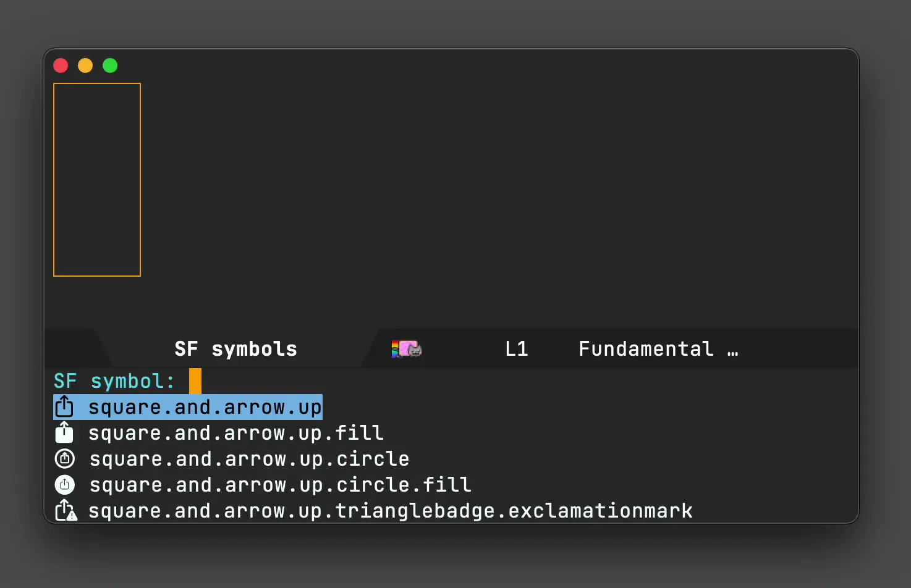

# Emacs: Macro me some SF Symbols

For inserting SF Symbols in SwiftUI, I typically rely on Apple's [SF
Symbols app](https://developer.apple.com/sf-symbols/) to browse the
symbols's catalog. Once I find a symbol I'm happy with, I copy its
name and paste it into my Swift source. This works fairly well.

With Christian Tietze recently posting [how he rendered SF Symbols in
Emacs](https://christiantietze.de/posts/2022/12/sf-symbols-emacs-tab-numbers/),
I figured there may be a way to shift the above workflow to rely on
Emacs completion instead. While I initially went down a rabbit hole to
programmatically extract SF symbols (via something like
[SFSafeSymbols](https://github.com/SFSafeSymbols/SFSafeSymbols)), I took
a step back to rethink the strategy.

From the [SF Symbols app](https://developer.apple.com/sf-symbols/), one
can select multiple symbols and copy/paste either the symbols themselves
or their respective names. The catch is you can only copy disjointed
data. That is, you can copy the symbols or their names, but not both in
one go. Let's take a look at what the disjointed data looks like. I've
pasted both under separate sections in an Emacs buffer.

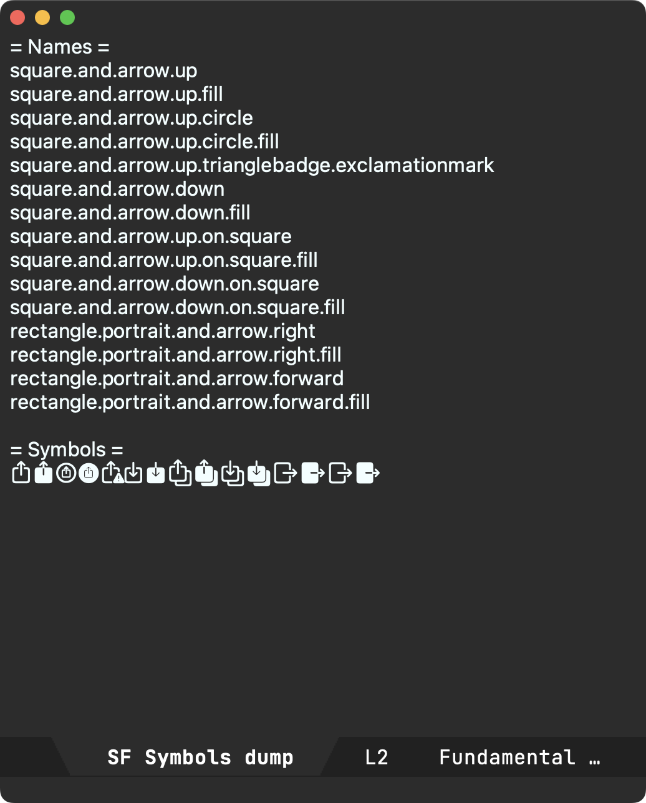

If I could rejoin these two sets, I would have a lookup table I could
easily invoke from Emacs.

There are roughly 4500 symbols, so copying, pasting, along with text
manipulation isn't manually feasible. Lucky for us, an Emacs [keyboard
macro](https://www.gnu.org/software/emacs/manual/html_node/emacs/Keyboard-Macros.html)
is the perfect hammer for this nail. You can see the macro in action
below.

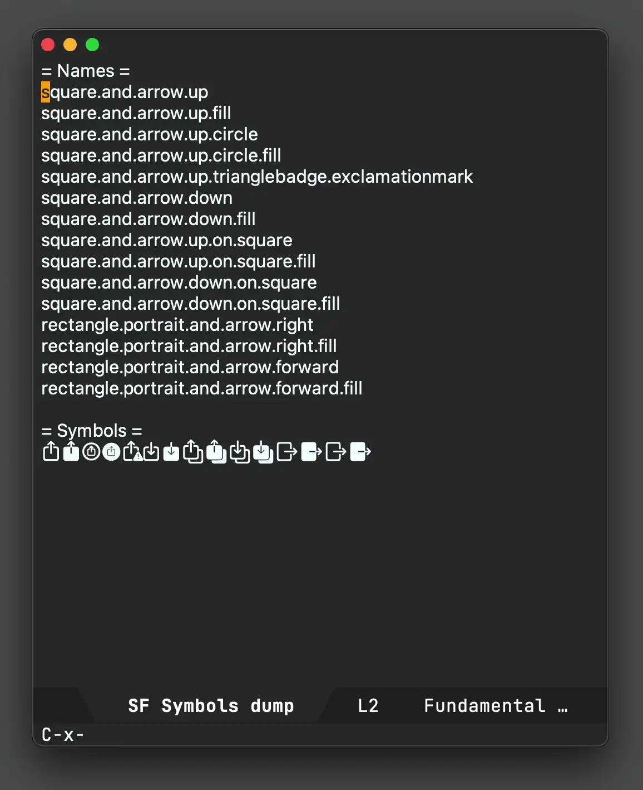

This looks fairly magical (and it is), but when you break it down into
its building blocks, it's nothing more than recording your keystrokes
and replaying them. Starting with the cursor at the beginning of
`square.and.arrow.up`{.verbatim}, these are the keystrokes we'd need to
record:

C-s
:   [iseach-forward](https://www.gnu.org/software/emacs/manual/html_node/emacs/Basic-Isearch.html)
    to search for a character and jump to it

=
:   insert `=`{.verbatim} so we jump to == Symbols ==

\<return\>
:   runs
    [isearch-exit](https://www.gnu.org/software/emacs/manual/html_node/emacs/Basic-Isearch.html)
    since we're done jumping.

C-n
:   `next-line`{.verbatim}.

C-a
:   `beginning-of-line`{.verbatim}.

C-SPC
:   `set-mark-command`{.verbatim} to activate the region.

C-f
:   `forward-char`{.verbatim} to select symbol.

C-w
:   `kill-ring-save`{.verbatim} to cut/kill the symbol.

C-u C-\<space\>
:   `set-mark-command`{.verbatim} (with prefix) to jump back to where we
    started before searching.

C-y
:   `yank`{.verbatim} to yank/paste the symbol.

C-\<space\>
:   `set-mark-command`{.verbatim} to activate the region.

C-e
:   `end-of-line`{.verbatim} to select the entire line.

\"
:   As a [smartparens](https://github.com/Fuco1/smartparens) user,
    inserting quote with region places quotes around selection.

C-n
:   `next-line`{.verbatim}.

C-a
:   `beginning-of-line`{.verbatim}. We are now at a strategic location
    where we can replay the above commands.

To start/end recording and executing keyboard macros, use:

C-x (
:   [kmacro-start-macro](https://www.gnu.org/software/emacs/manual/html_node/emacs/Basic-Keyboard-Macro.html)

C-x )
:   [kmacro-end-macro](https://www.gnu.org/software/emacs/manual/html_node/emacs/Basic-Keyboard-Macro.html)

C-x e
:   [kmacro-end-and-call-macro](https://www.gnu.org/software/emacs/manual/html_node/emacs/Basic-Keyboard-Macro.html)
    runs your macro. Press `e`{.verbatim} immediately after to execute
    again.

C-u 0 C-x e
:   [kmacro-end-and-call-macro](https://www.gnu.org/software/emacs/manual/html_node/emacs/Basic-Keyboard-Macro.html)
    (with zero prefix) repeat until there is an error.

Our previous example ran on a handful of SF symbols. Let's bring out
the big guns and run on the entire dataset. This time, we'll run the
entire flow, including macro creation and executing until there is an
error (i.e. process the whole lot).


Now that we have our data joined, we can feed it to the humble
[completing-read](https://www.gnu.org/software/emacs/manual/html_node/elisp/Completion.html).


It's worth highlighting that to render SF Symbols in Emacs, we must
[propertize our text with one of the macOS SF
fonts](https://christiantietze.de/posts/2022/12/sf-symbols-emacs-tab-numbers/),
for example \"SF Pro\".

With all the pieces in place, let's use our new function to insert SF
symbol names in a SwiftUI snippet. Since we're using
`completing-read`{.verbatim} we can fuzzy search our lookups with our
favorite completion frameworks (in my case via
[ivy](https://github.com/abo-abo/swiper)).


While this post is macOS-specific, it gives a taste of how powerful
Emacs [keyboard
macros](https://www.gnu.org/software/emacs/manual/html_node/emacs/Keyboard-Macros.html)
can be. Be sure to check out [Emacs Rocks! Episode 05: Macros in
style](https://emacsrocks.com/e05.html) and [Keyboard Macros are
Misunderstood - Mastering
Emacs](https://www.masteringemacs.org/article/keyboard-macros-are-misunderstood).
For those that dabble in elisp, you can appreciate how handy
[completing-read](https://www.gnu.org/software/emacs/manual/html_node/elisp/Completion.html)
is with very little code.

The full source to
[sf-symbol-insert-name](https://github.com/xenodium/dotsies/blob/main/emacs/ar/sf.el)
is available in my [Emacs config
repo](https://github.com/xenodium/dotsies/). The function is fairly bare
bones and has had fairly little testing. Patches totally welcome.

## Update

There is some redundancy in the snippet I had forgotten to remove.
Either way, latest version at
[sf.el](https://github.com/xenodium/dotsies/blob/main/emacs/ar/sf.el).

# Emacs: ffmpeg and macOS aliasing commands

On a recent mastodon
[post](https://twit.social/@chris_spackman/109531700714365786), Chris
Spackman mentioned he uses Emacs to save [ffmpeg](https://ffmpeg.org/)
commands he's figured out for later usage. Emacs is great for this kind
of thing. I've tried different approaches over time and eventually
landed on
[dwim-shell-command](https://github.com/xenodium/dwim-shell-command), a
small package I wrote. Like Chris, I also wanted a way to invoke magical
incantations of known shell commands without having to remember all the
details.

Chris's post reminded me of a few use-cases I'd been meaning to add
DWIM shell commands for.

### ffmpeg

1.  Trimming seconds from videos
    -   `dwim-shell-commands-video-trim-beginning`{.verbatim} using:

        ``` sh
        ffmpeg -i '<<f>>' -y -ss <<Seconds:5>> -c:v copy -c:a copy '<<fne>>_trimmed.<<e>>'
        ```

    -   `dwim-shell-commands-video-trim-end`{.verbatim} using:

        ``` sh
        ffmpeg -sseof -<<Seconds:5>> -i '<<f>>' -y -c:v copy -c:a copy '<<fne>>_trimmed.<<e>>'
        ```

        Side-node: The `<<Seconds:5>>`{.verbatim} placeholder is
        recognized as a query, so Emacs will prompt you for a numeric
        value.
2.  Extracting audio from videos
    -   `dwim-shell-commands-video-to-mp3`{.verbatim} using:

        ``` sh
        ffmpeg -i '<<f>>' -vn -ab 128k -ar 44100 -y '<<fne>>.mp3'
        ```

With these new dwim shell commands added, I can easily apply them one
after the other. No need to remember command details.

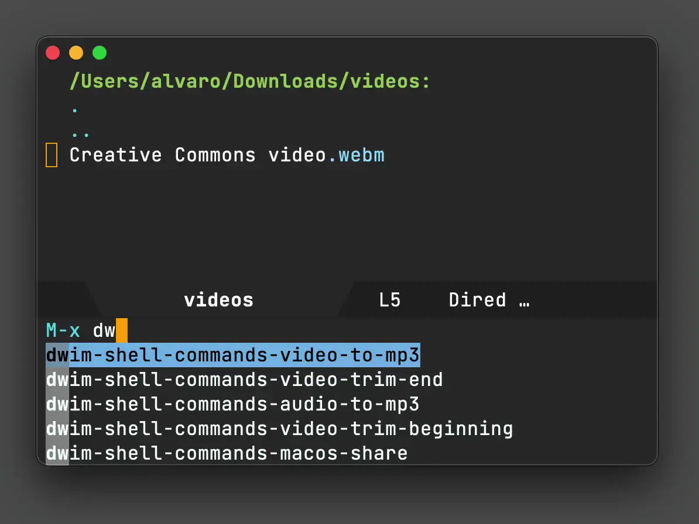

### macOS aliases

After rebuilding Emacs via the wonderful
[emacs-plus](https://github.com/d12frosted/homebrew-emacs-plus), I
recently broke my existing `/Applications/Emacs.app`{.verbatim} alias.
No biggie, one can easily add a [new one alias from macOS
Finder](https://support.apple.com/en-gb/guide/mac-help/mchlp1046/mac),
but I've been wanting to do it from Emacs. Turns out there's a bit of
AppleScript we can turn into a more memorale command like
`dwim-shell-commands-macos-make-finder-alias`{.verbatim}:

``` sh
osascript -e 'tell application \"Finder\" to make alias file to POSIX file \"<<f>>\" at POSIX file \"%s\"'
```

It's highly unlikely I'll remember the AppleScript snippet (are there
better ways?), but I'll easily find and invoke my new command with
fuzzy searching:

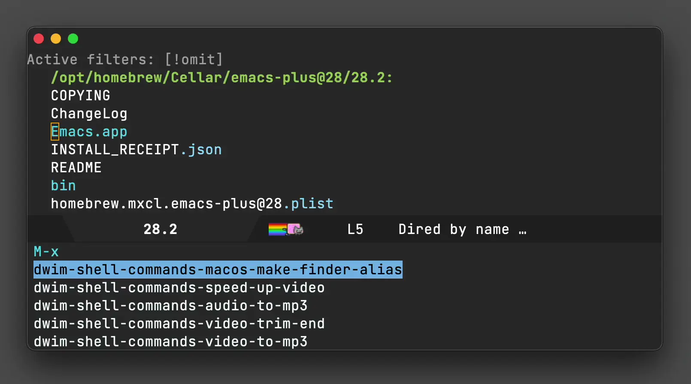

### Included in dwim-shell-command

All of these are now included in
[dwim-shell-commands.el](https://github.com/xenodium/dwim-shell-command/blob/main/dwim-shell-commands.el),
which you can optionally load after installing
[dwim-shell-command](https://github.com/xenodium/dwim-shell-command)
from [MELPA](https://melpa.org/#/dwim-shell-command).

# Emacs: Context-aware yasnippets

Back in 2020, I wrote a semi-automatic
[yasnippet](https://github.com/joaotavora/yasnippet) to [generate Swift
initializers](https://xenodium.com/smarter-snippets/). I say
semi-automatic because it could have been a little smarter. While it
helped generate some of the code, what I really wanted was full
context-aware generation. The Swift struct already had a few properties
defined, so a smarter yasnippet should have been able to use this info
for code generation.


With an extra push, we could have written a smarter yasnippet, but it
may require a fair bit of parsing logic. Fast forward to today, and
bringing context-awareness seems like the right match for
[Tree-sitter](https://tree-sitter.github.io/tree-sitter/). While
Tree-sitter can enable faster and more reliable syntax-highlighting in
our beloved text editor, it can also power smarter tools. It does so by
exposing a semantic snapshot of our source code using a syntax tree.

Let's see how we can use Tree-sitter to realise our original yasnippet
vision. We'll start with the same struct snippet we used back in 2020.
The goal is to generate an initializer using the existing definitions.

``` swift
struct Coordinate {
  public let x: Int
  public let y: Int
  public let z: Int
}
```

While Emacs will [will soon ship its own Tree-sitter
integration](https://lists.gnu.org/archive/html/emacs-devel/2022-11/msg01443.html),
I've opted to try out the
[emacs-tree-sitter](https://github.com/emacs-tree-sitter/elisp-tree-sitter)
package as Swift support is currently included in
[tree-sitter-langs](https://github.com/emacs-tree-sitter/tree-sitter-langs).

I have much to learn much about Tree-sitter syntax trees, but the
package ships with a handy tool to dump the tree via
`tree-sitter-debug-mode`{.verbatim}.

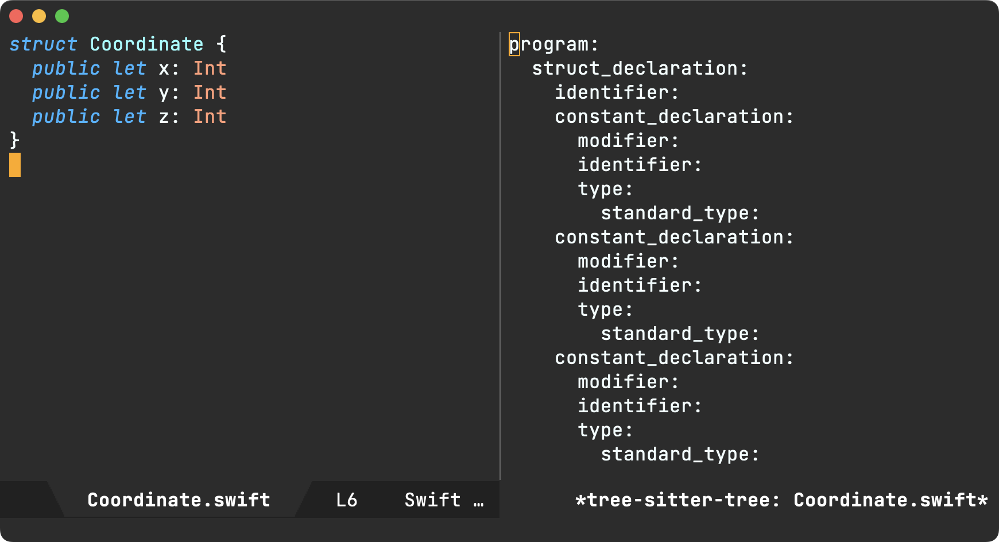

With a syntax tree in mind, one can craft a query to semantically
extract parts of the code. In our case, we want property names and
types. I've yet to get acquainted with Tree-sitter's [query
syntax](https://tree-sitter.github.io/tree-sitter/using-parsers#query-syntax),
but the package also ships with another handy tool that helps view query
results via `tree-sitter-query-builder`{.verbatim}.

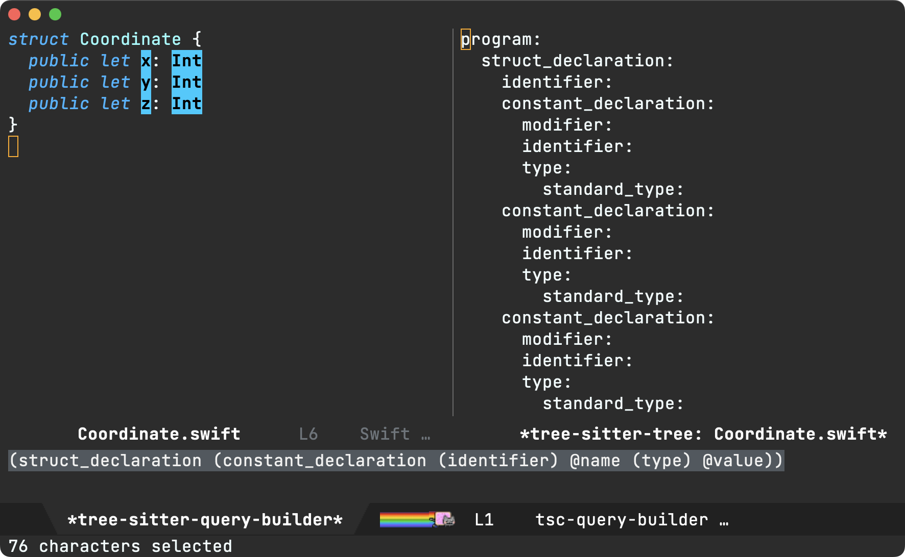

The following query extracts all the `let properties`{.verbatim} in
file. You can see the builder in action above, highlighting our query
results.

    (struct_declaration (constant_declaration (identifier) @name (type) @value))

If we want to be more thorough, we should likely cater for classes,
vars, int/string literals, etc. so the query needs to be extended as
follows. I'm sure it can be written differently, but for now, it does
the job.

    (struct_declaration (variable_declaration (identifier) @name (type) @type))
    (struct_declaration (variable_declaration (identifier) @name (string) @value))
    (struct_declaration (variable_declaration (identifier) @name (number) @value))
    (struct_declaration (constant_declaration (identifier) @name (type) @value))
    (struct_declaration (constant_declaration (identifier) @name (string) @value))
    (struct_declaration (constant_declaration (identifier) @name (number) @value))
    (class_declaration (variable_declaration (identifier) @name (type) @type))
    (class_declaration (variable_declaration (identifier) @name (string) @value))
    (class_declaration (variable_declaration (identifier) @name (number) @value))
    (class_declaration (constant_declaration (identifier) @name (type) @type))
    (class_declaration (constant_declaration (identifier) @name (string) @value))
    (class_declaration (constant_declaration (identifier) @name (number) @value))

Now that we got our Tree-sitter query sorted, let's write a little
elisp to extract the info we need from the generated tree. We'll write
a `swift-class-or-struct-vars-at-point`{.verbatim} function to extract
the struct (or class) at point and subsequently filter its property
names/types using our query. To simplify the result, we'll return a
list of alists.

``` emacs-lisp
(defun swift-class-or-struct-vars-at-point ()
  "Return a list of class or struct vars in the form '(((name . \"foo\") (type . \"Foo\")))."
  (cl-assert (seq-contains local-minor-modes 'tree-sitter-mode) "tree-sitter-mode not enabled")
  (let* ((node (or (tree-sitter-node-at-point 'struct_declaration)
                   (tree-sitter-node-at-point 'class_declaration)))
         (vars)
         (var))
    (unless node
      (error "Neither in class nor struct"))
    (mapc
     (lambda (item)
       (cond ((eq 'identifier
                  (tsc-node-type (cdr item)))
              (when var
                (setq vars (append vars (list var))))
              (setq var (list (cons 'name (tsc-node-text
                                           (cdr item))))))
             ((eq 'type
                  (tsc-node-type (cdr item)))
              (setq var (map-insert var 'type (tsc-node-text
                                               (cdr item)))))
             ((eq 'string
                  (tsc-node-type (cdr item)))
              (setq var (map-insert var 'type "String")))
             ((eq 'number
                  (tsc-node-type (cdr item)))
              (setq var (map-insert var 'type "Int")))
             (t (message "%s" (tsc-node-type (cdr item))))))
     (tsc-query-captures
      (tsc-make-query tree-sitter-language
                      "(struct_declaration (variable_declaration (identifier) @name (type) @type))
                       (struct_declaration (variable_declaration (identifier) @name (string) @value))
                       (struct_declaration (variable_declaration (identifier) @name (number) @value))
                       (struct_declaration (constant_declaration (identifier) @name (type) @value))
                       (struct_declaration (constant_declaration (identifier) @name (string) @value))
                       (struct_declaration (constant_declaration (identifier) @name (number) @value))
                       (class_declaration (variable_declaration (identifier) @name (type) @type))
                       (class_declaration (variable_declaration (identifier) @name (string) @value))
                       (class_declaration (variable_declaration (identifier) @name (number) @value))
                       (class_declaration (constant_declaration (identifier) @name (type) @type))
                       (class_declaration (constant_declaration (identifier) @name (string) @value))
                       (class_declaration (constant_declaration (identifier) @name (number) @value))")
      node nil))
    (when var
      (setq vars (append vars (list var))))
    vars))
```

Finally, we write a function to generate a Swift initializer from our
property list.

``` emacs-lisp
(defun swift-class-or-struct-initializer-text (vars)
  "Generate a Swift initializer from property VARS."
  (cl-assert (seq-contains local-minor-modes 'tree-sitter-mode) "tree-sitter-mode not enabled")
  (format
   (string-trim
    "
init(%s) {
  %s
}")
   (seq-reduce (lambda (reduced var)
                 (format "%s%s%s: %s"
                         reduced
                         (if (string-empty-p reduced)
                             "" ", ")
                         (map-elt var 'name)
                         (map-elt var 'type)))
               vars "")
   (string-join
    (mapcar (lambda (var)
              (format "self.%s = %s"
                      (map-elt var 'name)
                      (map-elt var 'name)))
            vars)
    "\n  ")))
```

We're so close now. All we need is a simple way invoke our code
generator. We can use yasnippet for that, making `init`{.verbatim} our
expandable keyword.

``` emacs-lisp
    # -*- mode: snippet -*-
    # name: init all
    # key: init
    # --
    `(swift-class-or-struct-initializer-text (swift-class-or-struct-vars-at-point))`
```

And with all that, we've got our yasnippet vision accomplished!

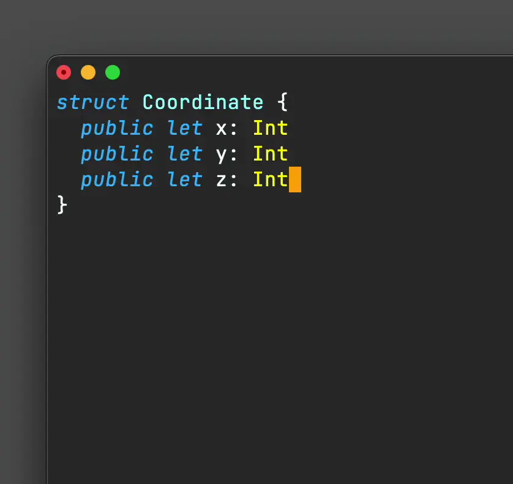

Be sure to check out this year's relevant
[EmacsConf](https://emacsconf.org/) talk: [Tree-sitter beyond syntax
highlighting](https://emacsconf.org/2022/talks/treesitter/).

All code is now pushed to my [config
repo](https://github.com/xenodium/dotsies/commit/9a44606935e8d57d7b3bde2d8d051defbf254a9e).
By the way, I'm not super knowledgable of neither yasnippet nor
Tree-sitter. Improvements are totally welcome. Please reach out on the
[Fediverse](https://indieweb.social/@xenodium) if you have suggestions!

## Update

[Josh Caswell](https://gitlab.com/woolsweater) kindly pointed out a
couple of interesting items:

1.  tree-sitter-langs's [Swift grammar is fairly
    outdated/incomplete](https://www.reddit.com/r/emacs/comments/zkb7aq/comment/izzjx3l/).
2.  There are more up-to-date Swift grammar implementations currently
    available:
    -   [tree-sitter-swifter](https://gitlab.com/woolsweater/tree-sitter-swifter)
        (by Josh Caswell himself)
    -   [tree-sitter-swift](https://github.com/alex-pinkus/tree-sitter-swift)
        (by [Alex Pinkus](https://twitter.com/alexpinkus))

# Emacs: quickly killing processes

Every so often, I need to kill the odd unresponsive process. While I
really like `proced`{.verbatim} (check out Mickey Petersen's
[article](https://www.masteringemacs.org/article/displaying-interacting-processes-proced)),
I somehow find myself using macOS's [Activity
Monitor](https://support.apple.com/en-bw/guide/activity-monitor/actmaea30277/mac)
to this purpose. Kinda odd, considering I prefer to do these kinds of
things from Emacs.

What I'd really like is a way to quickly fuzzy search a list of active
processes and choose the unresponsive culprid, using my preferred
completion frontend (in my case
[ivy](https://github.com/abo-abo/swiper)).

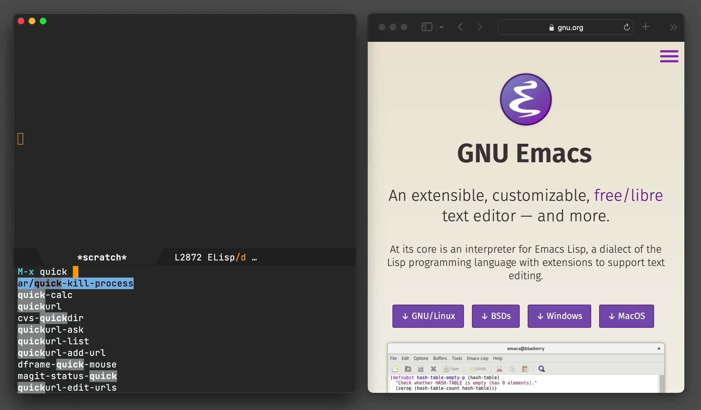

The function below gives us a fuzzy-searchable process utility. While we
could use `ivy-read`{.verbatim} directly in our implementation, we're
better of using
[completing-read](https://www.gnu.org/software/emacs/manual/html_node/elisp/Completion.html)
to remain compatible with other completion frameworks. I'm a big fan of
the humble `completing-read`{.verbatim}. You feed it a list of
candidates and it prompts users to pick one.

To build our process list, we can lean on `proced`{.verbatim}'s own
source: `proced-process-attributes`{.verbatim}. We transform its output
to an
[alist](https://www.gnu.org/software/emacs/manual/html_node/elisp/Association-Lists.html),
formatting the visible keys to contain the process id, owner, command
name, and the command line which invoked the process. Once a process is
chosen, we can send a kill signal using ~~signal-process~~
[dwim-shell-command](https://github.com/xenodium/dwim-shell-command) and
our *job is done*.

``` emacs-lisp
(require 'dwim-shell-command)
(require 'map)
(require 'proced)
(require 'seq)

(defun dwim-shell-commands-kill-process ()
  "Select and kill process."
  (interactive)
  (let* ((pid-width 5)
         (comm-width 25)
         (user-width 10)
         (processes (proced-process-attributes))
         (candidates
          (mapcar (lambda (attributes)
                    (let* ((process (cdr attributes))
                           (pid (format (format "%%%ds" pid-width) (map-elt process 'pid)))
                           (user (format (format "%%-%ds" user-width)
                                         (truncate-string-to-width
                                          (map-elt process 'user) user-width nil nil t)))
                           (comm (format (format "%%-%ds" comm-width)
                                         (truncate-string-to-width
                                          (map-elt process 'comm) comm-width nil nil t)))
                           (args-width (- (window-width) (+ pid-width user-width comm-width 3)))
                           (args (map-elt process 'args)))
                      (cons (if args
                                (format "%s %s %s %s" pid user comm (truncate-string-to-width args args-width nil nil t))
                              (format "%s %s %s" pid user comm))
                            process)))
                  processes))
         (selection (map-elt candidates
                             (completing-read "kill process: "
                                              (seq-sort
                                               (lambda (p1 p2)
                                                 (string-lessp (nth 2 (split-string (string-trim (car p1))))
                                                               (nth 2 (split-string (string-trim (car p2))))))
                                               candidates) nil t)))
         (prompt-title (format "%s %s %s"
                               (map-elt selection 'pid)
                               (map-elt selection 'user)
                               (map-elt selection 'comm))))
    (when (y-or-n-p (format "Kill? %s" prompt-title))
      (dwim-shell-command-on-marked-files
       (format "Kill %s" prompt-title)
       (format "kill -9 %d" (map-elt selection 'pid))
       :utils "kill"
       :error-autofocus t
       :silent-success t))))
```

I've pushed `dwim-shell-commands-kill-process`{.verbatim} to my
~~[config](https://github.com/xenodium/dotsies/)~~
[dwim-shell-commands.el](https://github.com/xenodium/dwim-shell-command/commit/b98f45c7901446cf1ab60be2ab648c623e774427).
Got suggestions? Alternatives? Lemme know.

## Update

I've moved `dwim-shell-commands-kill-process`{.verbatim} from my Emacs
[config](https://github.com/xenodium/dotsies) to
[dwim-shell-commands.el](https://github.com/xenodium/dwim-shell-command/blob/main/dwim-shell-commands.el).
A few advantages:

-   Killing processes is now async.
-   Should anything go wrong, an error message is now accessible.
-   You can easily install via
    [MELPA](https://melpa.org/#/dwim-shell-command).

If you prefer the previous version (without a dependency on
[dwim-shell-command](https://github.com/xenodium/dwim-shell-command)),
have a look at the [initial
commit](https://github.com/xenodium/dotsies/commit/eac4f892eab7a80740ee8ce0c727381886442fb6).

# Hey Emacs, change the default macOS app for...

A few weeks ago, I [added an \"open
with\"](https://xenodium.com/emacs-open-with-macos-app/) command to
[dwim-shell-commands.el](https://github.com/xenodium/dwim-shell-command/blob/main/dwim-shell-commands.el).
It's pretty handy for opening files using an external app (ie. not
Emacs) other than the default macOS one.

`dwim-shell-commands-macos-open-with`{.verbatim} and
`dwim-shell-commands-open-externally`{.verbatim} are typically enough
for me to handle opening files outside of Emacs. But every now and then
I'd like to change the default macOS app associated with specific file
types. Now this isn't particularly challenging in macOS, but it does
require a little navigating to get to the right place to change this
default setting.

Back in March 2020, I
[tweeted](https://twitter.com/xenodium/status/1242879439932923909) about
[duti](https://github.com/moretension/duti): a command-line utility
capable of setting default applications for various document types on
macOS. While I liked the ability to change default apps from the
command-line, the habit never quite stuck.

Fast forward to 2022. I've been revisiting lots of my command-line
usages (specially those that never stuck) and making them more
accessible from Emacs via
[dwim-shell-command](https://github.com/xenodium/dwim-shell-command). I
seldom change default apps on macOS, so my brain forgets about
`duti`{.verbatim} itself, let alone its arguments, order, etc. But with
a dwim shell command like
`dwim-shell-commands-macos-set-default-app`{.verbatim}, I can easily
invoke the command via [swiper](https://github.com/abo-abo/swiper)'s
`counsel-M-x`{.verbatim} fuzzy terms: *\"dwim set\"*.

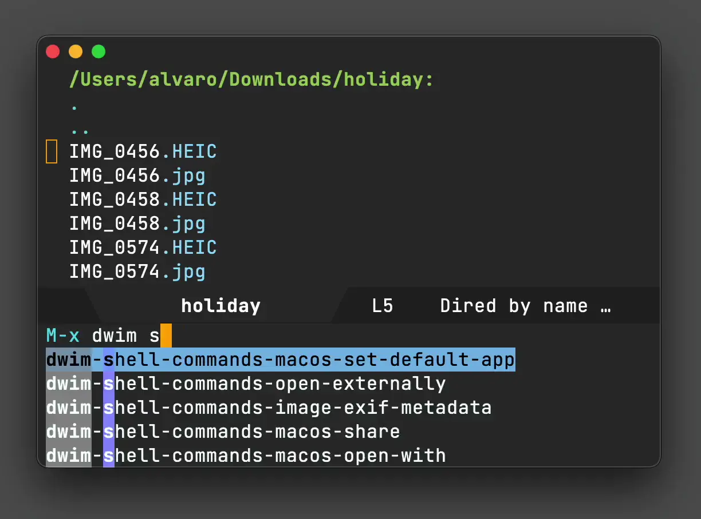

As an added bonus, I get to reuse
`dwim-shell-commands--macos-apps`{.verbatim} from \"open with\" to
quickly pick the new default app, making the whole experience pretty
snappy.

``` emacs-lisp
(defun dwim-shell-commands-macos-set-default-app ()
  "Set default app for file(s)."
  (interactive)
  (let* ((apps (dwim-shell-commands-macos-apps))
         (selection (progn
                      (cl-assert apps nil "No apps found")
                      (completing-read "Set default app: " apps nil t))))
    (dwim-shell-command-on-marked-files
     "Set default app"
     (format "duti -s \"%s\" '<<e>>' all"
             (string-trim
              (shell-command-to-string (format "defaults read '%s/Contents/Info.plist' CFBundleIdentifier"
                                               (map-elt apps selection)))))
     :silent-success t
     :no-progress t
     :utils "duti")))

(defun dwim-shell-commands--macos-apps ()
  "Return alist of macOS apps (\"Emacs\" . \"/Applications/Emacs.app\")."
  (mapcar (lambda (path)
            (cons (file-name-base path) path))
          (seq-sort
           #'string-lessp
           (seq-mapcat (lambda (paths)
                         (directory-files-recursively
                          paths "\\.app$" t (lambda (path)
                                             (not (string-suffix-p ".app" path)))))
                       '("/Applications" "~/Applications" "/System/Applications")))))
```

As usual, I've added
`dwim-shell-commands-macos-set-default-app`{.verbatim} to
[dwim-shell-commands.el](https://github.com/xenodium/dwim-shell-command/blob/main/dwim-shell-commands.el),
which you can install via
[MELPA](https://melpa.org/#/dwim-shell-command).

Did you find this tiny integration useful? Check out [Hey Emacs, where
did I take that
photo?](https://xenodium.com/hey-emacs-where-did-i-take-that-photo/)

# Hey Emacs, where did I take that photo?

I was recently browsing through an old archive of holiday photos (from
[dired](https://www.gnu.org/software/emacs/manual/html_node/emacs/Dired.html)
of course). I wanted to know where the photo was taken, which got me
interested in extracting [Exif](https://en.wikipedia.org/wiki/Exif)
metadata.

Luckily the [exiftool](https://exiftool.org/) command line utility does
the heavy lifting when it comes to extracting metadata. Since I want it
quickly accessible from Emacs (in either dired or current buffer), a
tiny elisp snippet would give me just that (via
[dwim-shell-command](https://github.com/xenodium/dwim-shell-command)).


``` emacs-lisp
(defun dwim-shell-commands-image-exif-metadata ()
  "View EXIF metadata in image(s)."
  (interactive)
  (dwim-shell-command-on-marked-files
   "View EXIF"
   "exiftool '<<f>>'"
   :utils "exiftool"))
```

The above makes all Exif metadata easily accessible, including the
photo's GPS coordinates. But I haven't quite answered the original
question. Where did I take the photo? I now know the coordinates, but I
can't realistically deduce neither the country nor city unless I
*manually* feed these values to a reverse geocoding service like
[OpenStreetMap](https://www.openstreetmap.org/). *Manually* you say?
This is Emacs, so we can throw more elisp glue at the problem, mixed in
with a little shell script, and presto! We've now automated the process
of extracting metadata, reverse geocoding, and displaying the photo's
address in the minibuffer. Pretty nifty.


``` emacs-lisp
(defun dwim-shell-commands-image-reverse-geocode-location ()
  "Reverse geocode image(s) location."
  (interactive)
  (dwim-shell-command-on-marked-files
   "Reverse geocode"
   "lat=\"$(exiftool -csv -n -gpslatitude -gpslongitude '<<f>>' | tail -n 1 | cut -s -d',' -f2-2)\"
    if [ -z \"$lat\" ]; then
      echo \"no latitude\"
      exit 1
    fi
    lon=\"$(exiftool -csv -n -gpslatitude -gpslongitude '<<f>>' | tail -n 1 | cut -s -d',' -f3-3)\"
    if [ -z \"$lon\" ]; then
      echo \"no longitude\"
      exit 1
    fi
    json=$(curl \"https://nominatim.openstreetmap.org/reverse?format=json&accept-language=en&lat=${lat}&lon=${lon}&zoom=18&addressdetails=1\")
    echo \"json_start $json json_end\""
   :utils '("exiftool" "curl")
   :silent-success t
   :error-autofocus t
   :on-completion
   (lambda (buffer)
     (with-current-buffer buffer
       (goto-char (point-min))
       (let ((matches '()))
         (while (re-search-forward "^json_start\\(.*?\\)json_end" nil t)
           (push (match-string 1) matches))
         (message "%s" (string-join (seq-map (lambda (json)
                                               (map-elt (json-parse-string json :object-type 'alist) 'display_name))
                                             matches)
                                    "\n")))
       (kill-buffer buffer)))))
```

Displaying the photo's address in the minibuffer is indeed pretty
nifty, but what if I'd like to drop a pin in a map for further
exploration? This is actually simpler, as there's no need for reverse
geocoding. Following a similar recipe, we merely construct an
[OpenStreetMap](https://www.openstreetmap.org/) URL and open it in our
favourite browser.


``` emacs-lisp
(defun dwim-shell-commands-image-browse-location ()
  "Open image(s) location in browser."
  (interactive)
  (dwim-shell-command-on-marked-files
   "Browse location"
   "lat=\"$(exiftool -csv -n -gpslatitude -gpslongitude '<<f>>' | tail -n 1 | cut -s -d',' -f2-2)\"
    if [ -z \"$lat\" ]; then
      echo \"no latitude\"
      exit 1
    fi
    lon=\"$(exiftool -csv -n -gpslatitude -gpslongitude '<<f>>' | tail -n 1 | cut -s -d',' -f3-3)\"
    if [ -z \"$lon\" ]; then
      echo \"no longitude\"
      exit 1
    fi
    if [[ $OSTYPE == darwin* ]]; then
      open \"http://www.openstreetmap.org/?mlat=${lat}&mlon=${lon}&layers=C\"
    else
      xdg-open \"http://www.openstreetmap.org/?mlat=${lat}&mlon=${lon}&layers=C\"
    fi"
   :utils "exiftool"
   :error-autofocus t
   :silent-success t))
```

Got suggestions? Improvements? All three functions are now included in
[dwim-shell-commands.el](https://github.com/xenodium/dwim-shell-command/blob/main/dwim-shell-commands.el)
as part of
[dwim-shell-command](https://github.com/xenodium/dwim-shell-command).
Pull requests totally welcome ;)

# Emacs: A welcoming experiment

The `*scratch*`{.verbatim} buffer is the first thing I see when I launch
an Emacs session. Coupled with
[persistent-scratch](https://github.com/Fanael/persistent-scratch),
it's served me well over the years. I gotta say though, my scratch
buffer accumulates random bits and often becomes a little messy. It's
not the most visually appealing landing buffer when launching Emacs. But
who cares, I'm only a `C-x b`{.verbatim} binding away from invoking
`ivy-switch-buffer`{.verbatim} to get me wherever I need to be. It's
powered by `ivy-use-virtual-buffers`{.verbatim}, which remembers recent
files across sessions.

Having said all of this, I recently ran into u/pearcidar43's
[post](https://www.reddit.com/r/unixporn/comments/yamj5f/exwm_emacs_is_kinda_comfy_as_a_wm/)
showcasing a wonderful Emacs banner. Lucky for us, they
[shared](https://www.reddit.com/r/unixporn/comments/yamj5f/comment/itfusm0/?utm_source=share&utm_medium=web2x&context=3)
the
[image](https://github.com/TanbinIslam43/mydotfiles/blob/main/.doom.d/emacs.png),
so I got curious about building a minimal welcome buffer of sorts.
Nothing fancy, the only requirements being to load quickly and enable me
to get on with my `C-x b`{.verbatim} ritual. Throw in a little bonus to
exit quickly by pressing just `q`{.verbatim} if I so desire.


I didn't know a whole lot on how to go about it, so I took a peak at
[emacs-dashboard](https://github.com/emacs-dashboard/emacs-dashboard)
for inspiration. Turns out, I needed little code to get the desired
effect in my `early-init.el`{.verbatim}:

``` emacs-lisp
(defun ar/show-welcome-buffer ()
  "Show *Welcome* buffer."
  (with-current-buffer (get-buffer-create "*Welcome*")
    (setq truncate-lines t)
    (let* ((buffer-read-only)
           (image-path "~/.emacs.d/emacs.png")
           (image (create-image image-path))
           (size (image-size image))
           (height (cdr size))
           (width (car size))
           (top-margin (floor (/ (- (window-height) height) 2)))
           (left-margin (floor (/ (- (window-width) width) 2)))
           (prompt-title "Welcome to Emacs!"))
      (erase-buffer)
      (setq mode-line-format nil)
      (goto-char (point-min))
      (insert (make-string top-margin ?\n ))
      (insert (make-string left-margin ?\ ))
      (insert-image image)
      (insert "\n\n\n")
      (insert (make-string (floor (/ (- (window-width) (string-width prompt-title)) 2)) ?\ ))
      (insert prompt-title))
    (setq cursor-type nil)
    (read-only-mode +1)
    (switch-to-buffer (current-buffer))
    (local-set-key (kbd "q") 'kill-this-buffer)))

(setq initial-scratch-message nil)
(setq inhibit-startup-screen t)

(when (< (length command-line-args) 2)
  (add-hook 'emacs-startup-hook (lambda ()
                                  (when (display-graphic-p)
                                    (ar/show-welcome-buffer)))))
```

This being Emacs, I can bend it as far as needed. In my case, I didn't
need much, so I can probably stop here. It was a fun experiment. I'll
even [try using
it](https://github.com/xenodium/dotsies/commit/90c689def913a9bccdd408ef609c7f99a5cce1fb)
for a little while and see if it sticks. I'm sure there's plenty more
that could be handled (edge cases, resizes, etc.), but if you want
something more established, consider something like
[emacs-dashboard](https://github.com/emacs-dashboard/emacs-dashboard)
instead. I haven't used it myself, but is [pretty
popular](https://melpa.org/#/dashboard).

# Emacs: Open with macOS app

On a recent Reddit
[comment](https://www.reddit.com/r/emacs/comments/y2dfma/comment/is4ygl8/?utm_source=share&utm_medium=web2x&context=3),
tdstoff7 asked if I had considered writing an \"Open with\" DWIM shell
command for those times one would like to open a file externally using
an app other than the default. I hadn't, but nice idea.

Take images as an example. Though Emacs can display them quickly, I also
open images externally using the default app
([Preview](https://en.wikipedia.org/wiki/Preview_(macOS)) in my case).
But then there are those times when I'd like to open with a different
app for editing (maybe something like GIMP). It'd be nice to quickly
choose which app to open with.


There isn't much to the code. Get a list of apps, ask user to pick one
(via
[completing-read](https://www.gnu.org/software/emacs/manual/html_node/elisp/Programmed-Completion.html)),
and launch the external app via
`dwim-shell-command-on-marked-files`{.verbatim}.

There's likely a better way of getting a list of available apps (happy
to take suggestions), but searching in \"/Applications\"
\"\~/Applications\" and \"/System/Applications\" does the job for now.

``` emacs-lisp
(defun dwim-shell-commands-macos-open-with ()
  "Convert all marked images to jpg(s)."
  (interactive)
  (let* ((apps (seq-sort
                #'string-lessp
                (seq-mapcat (lambda (paths)
                              (directory-files-recursively
                               paths "\\.app$" t (lambda (path)
                                                  (not (string-suffix-p ".app" path)))))
                            '("/Applications" "~/Applications" "/System/Applications"))))
         (selection (progn
                      (cl-assert apps nil "No apps found")
                      (completing-read "Open with: "
                                       (mapcar (lambda (path)
                                                 (propertize (file-name-base path) 'path path))
                                               apps)))))
    (dwim-shell-command-on-marked-files
     "Open with"
     (format "open -a '%s' '<<*>>'" (get-text-property 0 'path selection))
     :silent-success t
     :no-progress t
     :utils "open")))
```

`dwim-shell-commands-macos-open-with`{.verbatim} is now included in
[dwim-shell-command](https://github.com/xenodium/dwim-shell-command),
available on [melpa](https://melpa.org/#/dwim-shell-command). What other
uses can you find for it?

# Improving on Emacs macOS sharing

A quick follow-up to [Emacs: macOS sharing (DWIM
style)](https://xenodium.com/emacs-macos-share-from-dired-dwim-style/)...
Though functional, the implementation had a couple of drawbacks.

Tohiko [noticed fullscreen wasn't working at
all](https://www.reddit.com/r/emacs/comments/y1tneh/comment/is0pgkf)
while Calvin [proposed enumeration for tighter Emacs
integration](https://lobste.rs/s/qga1px/emacs_macos_sharing_dwim_style#c_safiuw).

Calvin's suggestion enables using
[completing-read](https://www.gnu.org/software/emacs/manual/html_node/elisp/Completion.html)
to pick the sharing service. This makes the integration feel more at
home. As a bonus, it also enables sharing from fullscreen Emacs.

As an [ivy](https://github.com/abo-abo/swiper) user, you can see a
vertical list of sharing services.

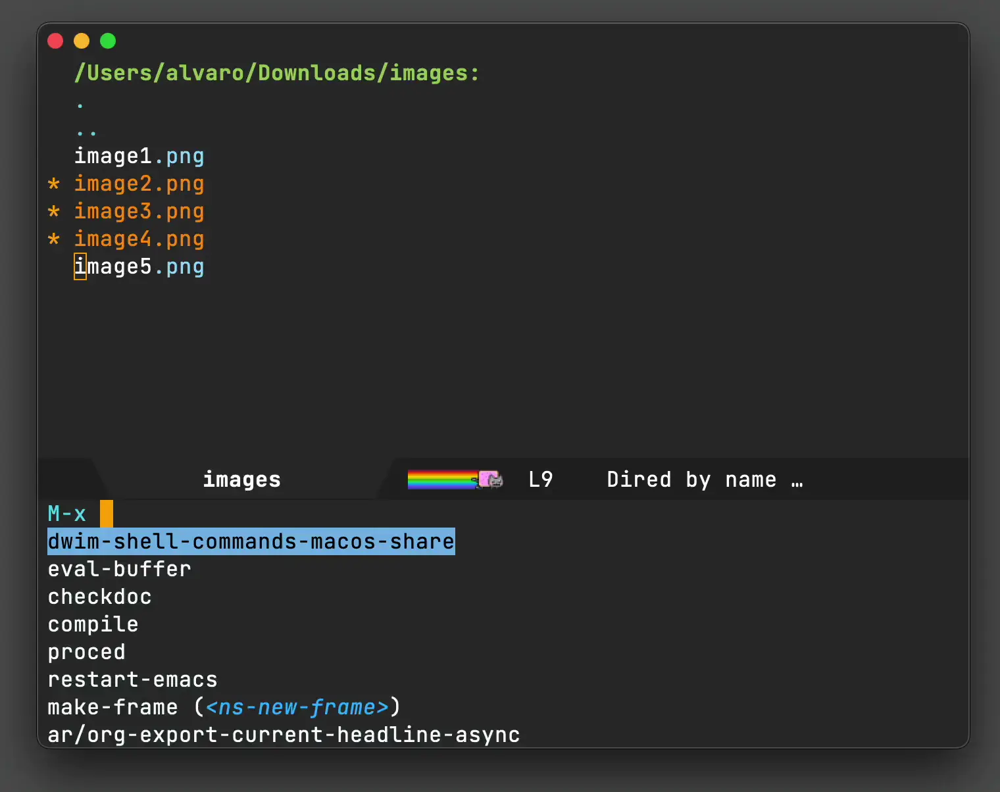

Here's the new snippet, now [pushed to
dwim-shell-commands.el](https://github.com/xenodium/dwim-shell-command/commit/20e782b4bf1ea01fecfce3cc8ac4c5a74518cd80):

``` emacs-lisp
(defun dwim-shell-commands--macos-sharing-services ()
  "Return a list of sharing services."
  (let* ((source (format "import AppKit
                         NSSharingService.sharingServices(forItems: [
                           %s
                         ]).forEach {
                           print(\"\\($0.prompt-title)\")
                         }"
                         (string-join (mapcar (lambda (file)
                                                (format "URL(fileURLWithPath: \"%s\")" file))
                                              (dwim-shell-command--files))
                                      ", ")))
         (services (split-string (string-trim (shell-command-to-string (format "echo '%s' | swift -" source)))
                                 "\n")))
    (when (seq-empty-p services)
      (error "No sharing services available"))
    services))

(defun dwim-shell-commands-macos-share ()
  "Share selected files from macOS."
  (interactive)
  (let* ((services (dwim-shell-commands--macos-sharing-services))
         (service-name (completing-read "Share via: " services))
         (selection (seq-position services service-name #'string-equal)))
    (dwim-shell-command-on-marked-files
     "Share"
     (format
      "import AppKit

       _ = NSApplication.shared

       NSApp.setActivationPolicy(.regular)

       class MyWindow: NSWindow, NSSharingServiceDelegate {
         func sharingService(
           _ sharingService: NSSharingService,
           didShareItems items: [Any]
         ) {
           NSApplication.shared.terminate(nil)
         }

         func sharingService(
           _ sharingService: NSSharingService, didFailToShareItems items: [Any], error: Error
         ) {
           let error = error as NSError
           if error.domain == NSCocoaErrorDomain && error.code == NSUserCancelledError {
             NSApplication.shared.terminate(nil)
           }
           exit(1)
         }
       }

       let window = MyWindow(
         contentRect: NSRect(x: 0, y: 0, width: 0, height: 0),
         styleMask: [],
         backing: .buffered,
         defer: false)

       let services = NSSharingService.sharingServices(forItems: [\"<<*>>\"].map{URL(fileURLWithPath:$0)})
       let service = services[%s]
       service.delegate = window
       service.perform(withItems: [\"<<*>>\"].map{URL(fileURLWithPath:$0)})

       NSApp.run()" selection)
     :silent-success t
     :shell-pipe "swift -"
     :join-separator ", "
     :no-progress t
     :utils "swift")))
```

[dwim-shell-command](https://github.com/xenodium/dwim-shell-command) is
available on [melpa](https://melpa.org/#/dwim-shell-command). What other
uses can you find for it?

# Emacs: macOS sharing (DWIM style)

UPDATE: See an improved implementation
[here](https://xenodium.com/emacs-macos-sharing-dwim-style-improved).

A few days ago, [I wrote
dwim-shell-commands-macos-reveal-in-finder](https://xenodium.com/emacs-reveal-in-finder-dwim-style/).
While I've written a bunch of other
[dwim-shell-commands](https://github.com/xenodium/dwim-shell-command/blob/main/dwim-shell-commands.el),
what set this case apart was the use of [Swift](https://www.swift.org/)
to glue an Emacs workflow.

``` emacs-lisp
(defun dwim-shell-commands-macos-reveal-in-finder ()
  "Reveal selected files in macOS Finder."
  (interactive)
  (dwim-shell-command-on-marked-files
   "Reveal in Finder"
   "import AppKit
    NSWorkspace.shared.activateFileViewerSelecting([\"<<*>>\"].map{URL(fileURLWithPath:$0)})"
   :join-separator ", "
   :silent-success t
   :shell-pipe "swift -"))
```

There is hardly any Swift involved, yet it scratched a real itch I
couldn't otherwise reach (reveal multiple dired files in macOS's
[Finder](https://en.wikipedia.org/wiki/Finder_(software))).

divinedominion's [reddit
comment](https://www.reddit.com/r/emacs/comments/xzt3gx/comment/irrwoya/?utm_source=share&utm_medium=web2x&context=3)
got me thinking of other use-cases, so I figured why not push this
Swift-elisp beeswax a little further... Let's add macOS's sharing
ability via
[dwim-shell-command](https://github.com/xenodium/dwim-shell-command), so
I could invoke it from the comfort of my beloved
[dired](https://www.gnu.org/software/emacs/manual/html_node/emacs/Dired.html)
or any 'ol Emacs buffer visiting a file.

``` emacs-lisp
(defun dwim-shell-commands-macos-share ()
  "Share selected files from macOS."
  (interactive)
  (let* ((position (window-absolute-pixel-position))
         (x (car position))
         (y (- (x-display-pixel-height)
               (cdr position))))
    (dwim-shell-command-on-marked-files
     "Share"
     (format
      "import AppKit

       _ = NSApplication.shared

       NSApp.setActivationPolicy(.regular)

       let window = InvisibleWindow(
         contentRect: NSRect(x: %d, y: %s, width: 0, height: 0),
         styleMask: [],
         backing: .buffered,
         defer: false)

       NSApp.activate(ignoringOtherApps: true)

       DispatchQueue.main.async {
         let picker = NSSharingServicePicker(items: [\"<<*>>\"].map{URL(fileURLWithPath:$0)})
         picker.delegate = window
         picker.show(
           relativeTo: .zero, of: window.contentView!, preferredEdge: .minY)
       }

       NSApp.run()

       class InvisibleWindow: NSWindow, NSSharingServicePickerDelegate, NSSharingServiceDelegate {
         func sharingServicePicker(
           _ sharingServicePicker: NSSharingServicePicker, didChoose service: NSSharingService?
         ) {
           if service == nil {
             print(\"Cancelled\")

             // Delay so \"More...\" menu can launch System Preferences
             DispatchQueue.main.asyncAfter(deadline: .now() + 0.1) {
               NSApplication.shared.terminate(nil)
             }
           }
         }

         func sharingServicePicker(
           _ sharingServicePicker: NSSharingServicePicker,
           delegateFor sharingService: NSSharingService
         ) -> NSSharingServiceDelegate? {
           return self
         }

         func sharingService(
           _ sharingService: NSSharingService,
           didShareItems items: [Any]
         ) {
           NSApplication.shared.terminate(nil)
         }

         func sharingService(
           _ sharingService: NSSharingService, didFailToShareItems items: [Any], error: Error
         ) {
           let error = error as NSError
           if error.domain == NSCocoaErrorDomain && error.code == NSUserCancelledError {
             NSApplication.shared.terminate(nil)
           }
           exit(1)
         }
       }" x y)
     :silent-success t
     :shell-pipe "swift -"
     :join-separator ", "
     :no-progress t
     :utils "swift")))
```

Sure there is some trickery involved here (like creating an invisible
macOS window to anchor the menu), but hey the results are surprisingly
usable. Take a look...

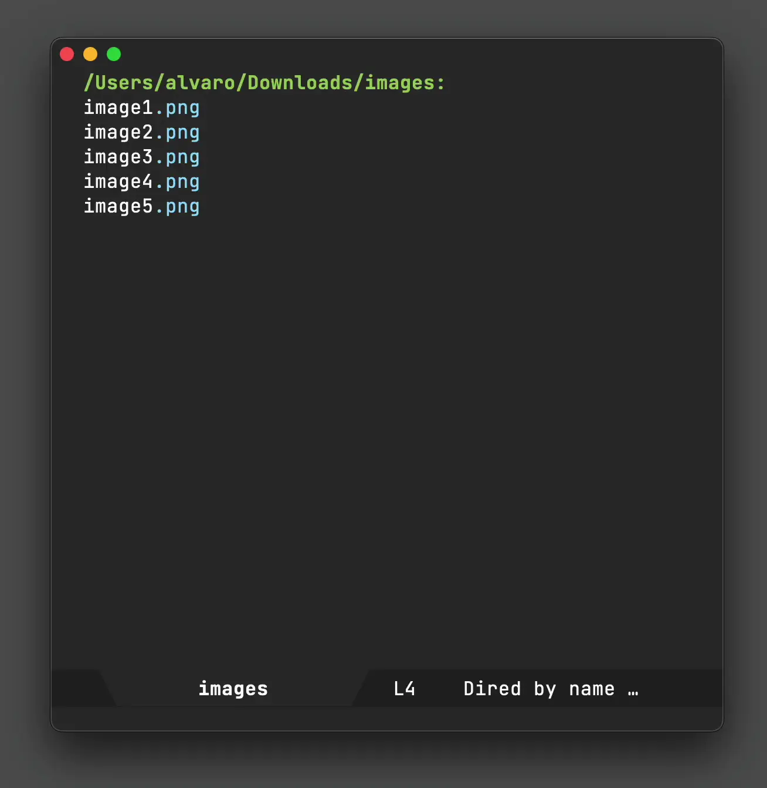

I've pushed `dwim-shell-commands-macos-share`{.verbatim} to
[dwim-shell-commands.el](https://github.com/xenodium/dwim-shell-command/blob/919817520fa507dd3c7e6859eb982976e28b2575/dwim-shell-commands.el#L370)
in case you'd like to give it a try. It's very much an experiment of
sorts, so please treat it as such. For now, I'm looking forward to
AirDropping more files and seeing if the flow sticks. Oh, and I just
realised I can use this to send files to iOS Simulators. Win.

[dwim-shell-command](https://github.com/xenodium/dwim-shell-command) is
available on [melpa](https://melpa.org/#/dwim-shell-command). What other
uses can you find for it?

# Emacs: Reveal in macOS Finder (DWIM style)

Just the other day, [Graham Voysey](https://github.com/gvoysey) filed an
[escaping bug](https://github.com/xenodium/dwim-shell-command/issues/3)
against
[dwim-shell-command](https://github.com/xenodium/dwim-shell-command).
Once he verified the the fix, he also posted [two
uses](https://github.com/xenodium/dwim-shell-command/issues/3#issuecomment-1272413459)
of `dwim-shell-command-on-marked-files`{.verbatim}. I've made some
small tweaks, but here's the gist of it:

``` emacs-lisp
(defun dwim-shell-commands-feh-marked-files ()
  "View all marked files with feh."
  (interactive)
  (dwim-shell-command-on-marked-files
   "View with feh"
   "feh --auto-zoom --scale-down '<<*>>'"
   :silent-success t
   :utils "feh"))

(defun dwim-shell-commands-dragon-marked-files ()
  "Share all marked files with dragon."
  (interactive)
  (dwim-shell-command-on-marked-files
   "View with dragon"
   "dragon --on-top '<<*>>'"
   :silent-success t
   :utils "dragon"))
```

I love seeing what others get up to by using
`dwim-shell-command`{.verbatim}. Are there new magical command-line
utilities out there I don't know about? In this instance, I got to
learn about [feh](https://feh.finalrewind.org/) and
[dragon](https://github.com/mwh/dragon).

[feh](https://feh.finalrewind.org/) is a no-frills image viewer for
console users while [dragon](https://github.com/mwh/dragon) is a simple
drag-and-drop source/sink for X or Wayland. Both utilities are great
uses of `dwim-shell-command`{.verbatim}, enabling a seamless transition
from Emacs to the *outside world*. These days I'm rarely on a linux
box, so I was keen to ensure macOS had these cases covered.

[Preview](https://en.wikipedia.org/wiki/Preview_(macOS)) is a solid
macOS equivalent to [feh](https://feh.finalrewind.org/).
`Preview`{.verbatim} is already macOS's default image viewer. A simple
`open '<<f>>'`{.verbatim} would do the job, but if we'd like to make
this command more portable, we can accomodate as follows:

``` emacs-lisp
(defun dwim-shell-commands-open-externally ()
  "Open file(s) externally."
  (interactive)
  (dwim-shell-command-on-marked-files
   "Open externally"
   (if (eq system-type 'darwin)
       "open '<<f>>'"
     "xdg-open '<<f>>'")
   :silent-success t
   :utils "open"))
```

Special mention goes to Bozhidar Batsov's
[crux](https://github.com/bbatsov/crux) which achieves similar
functionality via `crux-open-with`{.verbatim}.
[crux](https://github.com/bbatsov/crux) provides a bunch of other useful
functions. Some of my favourites being
`crux-duplicate-current-line-or-region`{.verbatim},
`crux-transpose-windows`{.verbatim},
`crux-delete-file-and-buffer`{.verbatim}, and
`crux-rename-buffer-and-file`{.verbatim}, but I digress.

Moving on to a [dragon](https://github.com/mwh/dragon) equivalent on
macOS, I thought I had it covered via
[reveal-in-osx-finder](https://github.com/kaz-yos/reveal-in-osx-finder)
or [reveal-in-folder](https://github.com/jcs-elpa/reveal-in-folder).
Turns out, neither of these reveal multiple
[dired](https://www.gnu.org/software/emacs/manual/html_node/emacs/Dired.html)-selected
files within [Finder](https://en.wikipedia.org/wiki/Finder_(software)).
At first, I thought this could be easily achieved by passing additional
flags/params to macOS's `open`{.verbatim} command, but it doesn't seem
to be the case. Having said that, this [Stack Overflow
post](https://stackoverflow.com/questions/7652928/launch-finder-window-with-specific-files-selected),
has a solution in Objective-C, which is where things got a little more
interesting. You see, back in July I [added multi-language
support](https://xenodium.com/emacs-dwim-shell-command-multi-language/)
to
[dwim-shell-command](https://xenodium.com/emacs-dwim-shell-command-multi-language/)
and while it highlighted language flexibility, I hadn't yet taken
advantage of this feature myself. That is, until today.

The Objective-C snippet from the Stack Overflow post can be written as a
Swift one-liner. Ok I lie. It's actually two lines, counting the
import, but you can see that this multi-language Emacs
transition/integration is pretty easy to add.

``` emacs-lisp
(defun dwim-shell-commands-macos-reveal-in-finder ()
  "Reveal selected files in macOS Finder."
  (interactive)
  (dwim-shell-command-on-marked-files
   "Reveal in Finder"
   "import AppKit
    NSWorkspace.shared.activateFileViewerSelecting([\"<<*>>\"].map{URL(fileURLWithPath:$0)})"
   :join-separator ", "
   :silent-success t
   :shell-pipe "swift -"))
```

`<<*>>`{.verbatim} is the centrepiece of the snippet above. It gets
instantiated with a list of files joined using the `", "`{.verbatim}
separator.

``` swift
NSWorkspace.shared.activateFileViewerSelecting(["/path/to/file1", "/path/to/file2"].map { URL(fileURLWithPath: $0) })
```

The proof of the pudding is of course in the eating, so ummm let's show
it in action:


I should mention the webp animation above was also created using my
trusty `dwim-shell-commands-video-to-webp`{.verbatim} also backed by
[dwim-shell-command](https://github.com/xenodium/dwim-shell-command).

``` emacs-lisp
(defun dwim-shell-commands-video-to-webp ()
  "Convert all marked videos to webp(s)."
  (interactive)
  (dwim-shell-command-on-marked-files
   "Convert to webp"
   "ffmpeg -i '<<f>>' -vcodec libwebp -filter:v fps=fps=10 -compression_level 3 -lossless 1 -loop 0 -preset default -an -vsync 0 '<<fne>>'.webp"
   :utils "ffmpeg"))
```

[dwim-shell-command](https://github.com/xenodium/dwim-shell-command) is
available on [melpa](https://melpa.org/#/dwim-shell-command). What other
uses can you find for it?

UPDATE: Most DWIM shell commands I use are available as part of
[dwim-shell-commands.el](https://github.com/xenodium/dwim-shell-command/blob/main/dwim-shell-commands.el).
See `dwim-shell-command`{.verbatim}'s [install command line
utilities](https://github.com/xenodium/dwim-shell-command#install-command-line-utilities).

# Plain Org v1.5 released

If you haven't heard of [Plain Org](https://plainorg.com), it gives you
access to [org](https://orgmode.org) files on iOS while away from your
beloved [Emacs](https://www.gnu.org/software/emacs/).

Hadn't had time to post, but v1.5 has been available on the [App
Store](https://apps.apple.com/app/id1578965002) for a couple of weeks
now. The update is mostly a bugfix release, primarily addressing inline
editing issues that appeared on iOS 16, along with a few other changes:

-   Render form feeds at end of headings at all times.
-   Fixes new files not recognized by org-roam.
-   Fixes share sheet saving from cold launch.
-   Fixes inline editing on iOS 16.


I love org markup, but we (iPhone + org users) are a fairly niche bunch.
If you're finding Plain Org useful, **please help support this effort**
by getting the word out. Tell your friends,
[tweet](https://twitter.com/intent/tweet?text=Plain%20Org%20https%3A%2F%2Fapps.apple.com%2Fapp%2Fid1578965002%20),
or blog about it. Or just support via the [App
Store](https://apps.apple.com/app/id1578965002) :)

# dwim-shell-command usages: pdftotext and scp

[dwim-shell-command](https://github.com/xenodium/dwim-shell-command) is
a little Emacs package I wrote to enable crafting more reusable shell
commands. I intended to use it as an
[async-shell-command](https://www.gnu.org/software/emacs/manual/html_node/emacs/Shell.html)
alternative (and I do these days). The more surprising win was bringing
lots of command-line utilities (sometimes with complicated invocations)
and making them quickly accessible. I no longer need to remember their
respective parameters, order, flags, etc.

I've migrated most
[one-liners](https://xenodium.com/emacs-password-protect-current-pdf-revisited/)
and [scripts](https://xenodium.com/png-to-icns-emacs-dwim-style/) I had
to [dwim-shell-command](https://github.com/xenodium/dwim-shell-command)
equivalents. They are available at
[dwim-shell-commands.el](https://github.com/xenodium/dwim-shell-command/blob/main/dwim-shell-commands.el).
Having said that, it's great to discover new usages from
`dwim-shell-command`{.verbatim} users.

Take [u/TiMueller](https://www.reddit.com/user/TiMueller/)'s Reddit
comment, [showcasing
pdftotext](https://www.reddit.com/r/emacs/comments/w8s2ov/comment/iq7idav/?utm_source=share&utm_medium=web2x&context=3).
Neat utility I was unaware of. It does as it says on the tin and
converts a pdf to text. Can be easily saved to your accessible
repertoire with:

``` emacs-lisp
(defun dwim-shell-commands-pdf-to-txt ()
  "Convert pdf to txt."
  (interactive)
  (dwim-shell-command-on-marked-files
   "pdf to txt"
   "pdftotext -layout '<<f>>' '<<fne>>.txt'"
   :utils "pdftotext"))
```


[tareefdev](https://github.com/tareefdev) wanted a quick command to
[secure copy](https://linux.die.net/man/1/scp) remote files to a local
directory. Though this use-case is already covered by Tramp, I suspect a
DWIM command would make it a little more convenient (async by default).
However, Tramp paths aren't usable from the shell unless we massage
them a little. We can use
`dwim-shell-command-on-marked-files`{.verbatim}'s
`:post-process-template`{.verbatim} to drop the \"/ssh:\" prefix.

``` emacs-lisp
(defun dwim-shell-commands-copy-remote-to-downloads ()
  (interactive)
  (dwim-shell-command-on-marked-files
   "Copy remote to local Downloads"
   "scp '<<f>>' ~/Downloads/"
   :utils "scp"
   :post-process-template
   (lambda (script file)
     ;; Tramp file path start with "/ssh:". Drop it.
     (string-replace file
                     (string-remove-prefix "/ssh:" file)
                     script))))
```

[dwim-shell-command](https://github.com/xenodium/dwim-shell-command) is
available on [MELPA](https://melpa.org/#/dwim-shell-command) (531
downloads as of 2022-10-01).

# \$ rm Important.txt (uh oh!)

Setting Emacs up to use your system trash can potentially save your
bacon if you mistakenly delete a file, say from
[dired](https://www.gnu.org/software/emacs/manual/html_node/emacs/Dired.html).

Unsurprisingly, the trash safety net also extends to other Emacs areas.
For example, discarding files from [Magit](https://magit.vc/) (via
`magit-discard`{.verbatim}) becomes a recoverable operation. As an
[eshell](https://www.gnu.org/software/emacs/manual/html_mono/eshell.html)
user, the trash can also help you recover from `rm`{.verbatim} blunders.

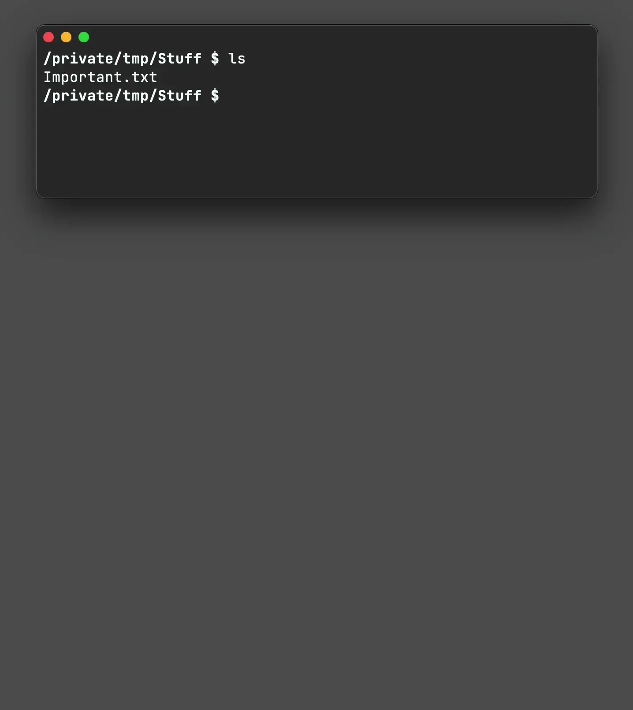

You can enable macOS system trash in Emacs by setting
`trash-directory`{.verbatim} along with defining
`system-move-file-to-trash`{.verbatim}:

``` emacs-lisp
(setq trash-directory "~/.Trash")

;; See `trash-directory' as it requires defining `system-move-file-to-trash'.
(defun system-move-file-to-trash (file)
  "Use \"trash\" to move FILE to the system trash."
  (cl-assert (executable-find "trash") nil "'trash' must be installed. Needs \"brew install trash\"")
  (call-process "trash" nil 0 nil "-F"  file))
```

# Cycling through window layouts (revisited)

Last year, I wrote a little script to [cycle through window layouts via
Hammerspoon](https://xenodium.com/cycling-window-layouts-via-hammerspoon).
The cycling set I chose didn't stick, so here's another go.

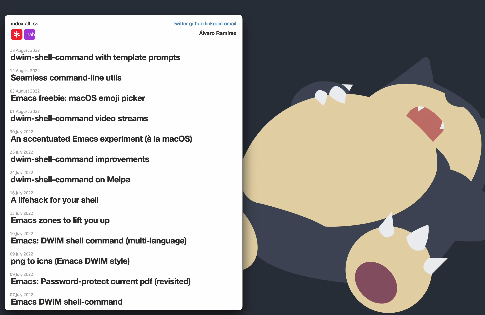

``` lua
function reframeFocusedWindow()
   local win = hs.window.focusedWindow()
   local maximizedFrame = win:screen():frame()
   maximizedFrame.x = maximizedFrame.x + 15
   maximizedFrame.y = maximizedFrame.y + 15
   maximizedFrame.w = maximizedFrame.w - 30
   maximizedFrame.h = maximizedFrame.h - 30

   local leftFrame = win:screen():frame()
   leftFrame.x = leftFrame.x + 15
   leftFrame.y = leftFrame.y + 15
   leftFrame.w = leftFrame.w / 2 - 15
   leftFrame.h = leftFrame.h - 30

   local rightFrame = win:screen():frame()
   rightFrame.x = rightFrame.w / 2
   rightFrame.y = rightFrame.y + 15
   rightFrame.w = rightFrame.w / 2 - 15
   rightFrame.h = rightFrame.h - 30

   if win:frame() == maximizedFrame then
     win:setFrame(leftFrame)
     return
   end

   if win:frame() == leftFrame then
     win:setFrame(rightFrame)
     return
   end

   win:setFrame(maximizedFrame)
end

hs.hotkey.bind({"alt"}, "F", reframeFocusedWindow)
```

Looping through layouts is done with a global key-binding of
`option f`{.verbatim} or, if familiar with a macOS keyboard,
`⌥ f`{.verbatim}.

For those unfamiliar with [Hammerspoon](http://hammerspoon.org/)... If
you're a tinkerer and a macOS user, you'd love
[Hammerspoon](http://hammerspoon.org/). Like elisp gluing all things
Emacs, Hammerspoon uses Lua to glue all things macOS. For example,
here's a stint at [writing a narrowing utility for
macOS](https://xenodium.com/emacs-utilities-for-your-os/) using
[chooser](http://www.hammerspoon.org/docs/hs.chooser.html).

# dwim-shell-command with template prompts

Somewhat recently, I wanted to quickly create an empty/transparent png
file. [ImageMagick](https://imagemagick.org/)'s convert has you covered
here. Say you want a transparent 200x400 image, you can get it with:

``` sh
convert -verbose -size 200x400 xc:none empty200x400.png
```

Great, I now know the one-liner for it. But because I'm in the mood of
saving these as [seamless command-line
utils](https://xenodium.com/seamless-command-line-utils/), I figured I
should save the
[dwim-shell-command](https://github.com/xenodium/dwim-shell-command)
equivalent.

I wanted configurable image dimensions, so I used
[read-number](https://www.gnu.org/software/emacs/manual/html_node/calc/Formatting-Lisp-Functions.html)
together with
[format](https://www.gnu.org/software/emacs/manual/html_node/elisp/Formatting-Strings.html)
to create the templated command and fed it to
`dwim-shell-command-on-marked-files`{.verbatim}. Job done:

``` emacs-lisp
(defun dwim-shell-commands-make-transparent-png ()
  "Create a transparent png."
  (interactive)
  (let ((width (read-number "Width: " 200))
        (height (read-number "Height: " 200)))
    (dwim-shell-command-on-marked-files
     "Create transparent png"
     (format "convert -verbose -size %dx%d xc:none '<<empty%dx%d.png(u)>>'"
             width height width height)
     :utils "convert")))
```

The resulting `dwim-shell-commands-make-transparent-png`{.verbatim} is
fairly simple, but
[dwim-shell-command](https://github.com/xenodium/dwim-shell-command)
aims to remove friction so you're more inclined to save reusable
commands. In this case, we can shift querying and formatting into the
template.

`<<Width:200>>`{.verbatim} can be interpreted as \"ask the user for a
value using the suggested prompt and default value.\"


With template queries in mind,
`dwim-shell-commands-make-transparent-png`{.verbatim} can be further
reduced to essentially the interactive command boilerplate and the
template itself:

``` emacs-lisp
(defun dwim-shell-commands-make-transparent-png ()
  "Create a transparent png."
  (interactive)
  (dwim-shell-command-on-marked-files
   "Create transparent png"
   "convert -verbose -size <<Width:200>>x<<Height:200>> xc:none '<<empty<<Width:200>>x<<Height:200>>.png(u)>>'"
   :utils "convert"))
```

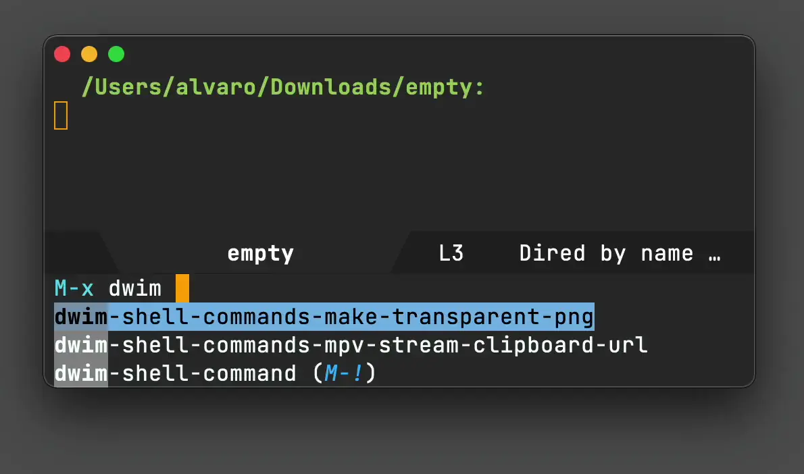

Note: Any repeated queries (same prompt and default) are treated as
equal. That is, ask the user once and replace everywhere. If you'd like
to request separate values, change either prompt or the default value.

# Seamless command-line utils

Just the other day, I received a restaurant menu split into a handful of
image files. I wanted to forward the menu to others but figured I should
probably send it as a single file.

ImageMagick's [convert](https://imagemagick.org/script/convert.php)
command-line utility works great for this purpose. Feed it some images
and it creates a pdf for you:

``` sh
convert image1.png image2.png image3.png combined.pdf
```

Using `convert`{.verbatim} for this purpose was pretty straightforward.
I'm sure I'll use it again in a similar context, but what if I can
make future usage more seamless? In the past, I would just make a note
of usage and revisit when needed. Though this works well enough, it
often requires some amount of manual work (looking things up, tweaking
command, etc) if you happen to forget the command syntax.

I wanted common one-liners (or [longer shell
scripts](https://xenodium.com/png-to-icns-emacs-dwim-style/)) to be
easily reusable and accessible from Emacs. Turns out, the
[dwim-shell-command](https://github.com/xenodium/dwim-shell-command)
experiment is working fairly well for this purpose. In addition to
providing template expansion, it generally [tries to do what I
mean](https://xenodium.com/emacs-dwim-shell-command/) (focus when
needed, reveal new files, rename buffers, etc).

Here's how I saved the `convert`{.verbatim} command instance for future
usage:

``` emacs-lisp
(defun dwim-shell-commands-join-as-pdf ()
  "Join all marked images as a single pdf."
  (interactive)
  (dwim-shell-command-on-marked-files
   "Join as pdf"
   "convert -verbose '<<*>>' '<<joined.pdf(u)>>'"
   :utils "convert"))
```

From now on, any time I'd like to join multiple files into a pdf, I can
now select them all and invoke
`dwim-shell-commands-join-as-pdf`{.verbatim}.

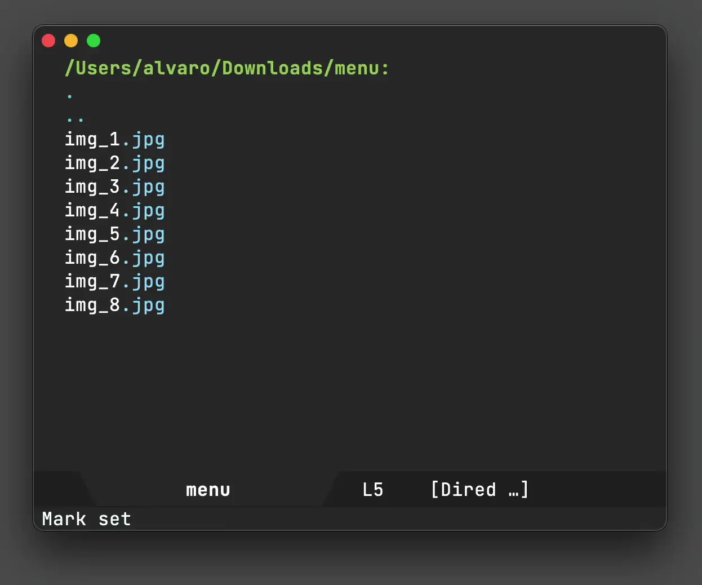

In the saved command, `'<<*>>'`{.verbatim} expands to either
[dired](https://www.gnu.org/software/emacs/manual/html_node/emacs/Dired.html)
selected files or whatever file happens to be open in the current
buffer. The buffer file isn't of much help for joining multiple items,
but can be handy for other instances (say I want to convert current
image to jpeg).

Moving on to `'<<joined.pdf(u)>>'`{.verbatim}, we could have just
written as `joined.pdf`{.verbatim}, but wrapping it ensures the
resulting file name is unique. That is, if `joined.pdf`{.verbatim}
already exists, write `joined(1).pdf`{.verbatim} instead.

These kinds of command-line integrations are working well for me. Take
the webp animation above, it was created by invoking
`dwim-shell-commands-video-to-webp`{.verbatim} on a `.mov`{.verbatim}
file. Easy peasy. While I can easily memorize the `convert`{.verbatim}
command for the pdf instance, I'm hopeless in the webp scenario:

``` sh
ffmpeg -i '<<f>>' -vcodec libwebp -filter:v fps=fps=10 -compression_level 3 -lossless 1 -loop 0 -preset default -an -vsync 0 '<<fne>>'.webp
```

While searching through command line history helps to quickly re-spin
previous commands, it requires remembering the actual utility used for
any particular action. On the other hand, wrapping with Emacs functions
enables me to remember the action itself, using more memorable names.
Also, fuzzy searching works a treat.


It's been roughly a month since I started playing around with this idea
of wrapping command-line utilities more seamlessly. Since then, I've
brought in a bunch of use-cases that are now quickly accessible (all in
[dwim-shell-commands.el](https://github.com/xenodium/dwim-shell-command/blob/main/dwim-shell-commands.el)):

-   dwim-shell-commands-audio-to-mp3
-   dwim-shell-commands-clipboard-to-qr
-   dwim-shell-commands-copy-to-desktop
-   dwim-shell-commands-copy-to-downloads
-   dwim-shell-commands-docx-to-pdf
-   dwim-shell-commands-download-clipboard-stream-url
-   dwim-shell-commands-drop-video-audio
-   dwim-shell-commands-epub-to-org
-   dwim-shell-commands-external-ip
-   dwim-shell-commands-files-combined-size
-   dwim-shell-commands-git-clone-clipboard-url
-   dwim-shell-commands-git-clone-clipboard-url-to-downloads
-   dwim-shell-commands-http-serve-dir
-   dwim-shell-commands-image-browse-location
-   dwim-shell-commands-image-exif-metadata
-   dwim-shell-commands-image-reverse-geocode-location
-   dwim-shell-commands-image-to-grayscale
-   dwim-shell-commands-image-to-icns
-   dwim-shell-commands-image-to-jpg
-   dwim-shell-commands-image-to-png
-   dwim-shell-commands-install-iphone-device-ipa
-   dwim-shell-commands-join-as-pdf
-   dwim-shell-commands-kill-gpg-agent
-   dwim-shell-commands-kill-process
-   dwim-shell-commands-macos-bin-plist-to-xml
-   dwim-shell-commands-macos-caffeinate
-   dwim-shell-commands-macos-hardware-overview
-   dwim-shell-commands-macos-open-with
-   dwim-shell-commands-macos-reveal-in-finder
-   dwim-shell-commands-macos-set-default-app
-   dwim-shell-commands-macos-share
-   dwim-shell-commands-macos-toggle-dark-mode
-   dwim-shell-commands-macos-toggle-display-rotation
-   dwim-shell-commands-make-transparent-png
-   dwim-shell-commands-move-to-desktop
-   dwim-shell-commands-move-to-downloads
-   dwim-shell-commands-open-clipboard-url
-   dwim-shell-commands-open-externally
-   dwim-shell-commands-pdf-password-protect
-   dwim-shell-commands-pdf-to-txt
-   dwim-shell-commands-ping-google
-   dwim-shell-commands-rename-all
-   dwim-shell-commands-reorient-image
-   dwim-shell-commands-resize-gif
-   dwim-shell-commands-resize-image
-   dwim-shell-commands-resize-video
-   dwim-shell-commands-speed-up-gif
-   dwim-shell-commands-speed-up-video
-   dwim-shell-commands-stream-clipboard-url
-   dwim-shell-commands-svg-to-png
-   dwim-shell-commands-unzip
-   dwim-shell-commands-url-browse
-   dwim-shell-commands-video-to-gif
-   dwim-shell-commands-video-to-optimized-gif
-   dwim-shell-commands-video-to-webp

What other use-cases would you consider? `dwim-shell-command`{.verbatim}
is [available on melpa](https://melpa.org/#/dwim-shell-command).

## Update

2022-11-14 dwim-shell-commands.el list updated.

# Emacs freebie: macOS emoji picker

I recently ran a little experiment to bring macOS's
[long-press-accents-like
behavior](https://xenodium.com/an-accentuated-emacs-experiment/) to
Emacs. What I forgot to mention is that macOS's character viewer *just
works* from our beloved editor.

If you have a newer MacBook model, you can press the 🌐 key to summon
the emoji picker (character viewer). You may need to set this key
binding [from macOS keyboard
preferences](https://support.apple.com/en-gb/guide/mac-help/mchlp1560/mac).

I'm happy to take this Emacs freebie, kthxbye.

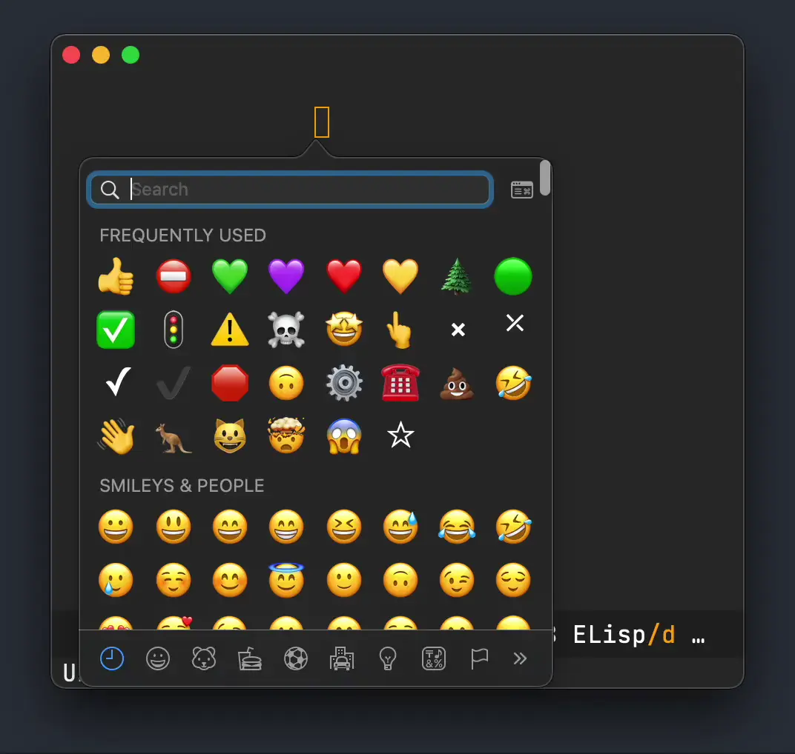

Edits:

-   Like other macOS apps, this dialog can be invoked via
    control-command-space (thanks
    [mtndewforbreakfast](https://www.reddit.com/r/emacs/comments/wfja3n/comment/iiv7ptb/?utm_source=share&utm_medium=web2x&context=3)).
    Note: you'd lose this ability if you
    `(setq mac-command-modifier 'meta)`{.verbatim} in your config.
-   The 🌐 key is a feature on newer MacBook hardware and likely needs
    configuration (thanks
    [Fabbi-](https://www.reddit.com/r/emacs/comments/wfja3n/comment/iivnwxt/?utm_source=share&utm_medium=web2x&context=3)).

# dwim-shell-command video streams

I continue hunting for use-cases I can migrate to
[dwim-shell-command](https://github.com/xenodium/dwim-shell-command)...
After adding [clipboard
support](https://xenodium.com/dwim-shell-command-improvements/) (via
[) I found one more.

1.  Copy URL from browser.
2.  Invoke `dwim-shell-commands-mpv-stream-clipboard-url`{.verbatim}.
3.  Enjoy picture in picture from Emacs ;)


What's the secret sauce? Very little. Invoke the awesome
[mpv](https://mpv.io/) with a wrapping function using
`dwim-shell-command-on-marked-files`{.verbatim}.

``` emacs-lisp
(defun dwim-shell-commands-mpv-stream-clipboard-url ()
  "Stream clipboard URL using mpv."
  (interactive)
  (dwim-shell-command-on-marked-files
   "Streaming"
   "mpv --geometry=30%x30%+100%+0% \"<<cb>>\""
   :utils "mpv"
   :no-progress t
   :error-autofocus t
   :silent-success t))
```

The typical progress bar kinda got in the way, so I added a new option
`:no-progress`{.verbatim} to
`dwim-shell-command-on-marked-files`{.verbatim}, so it can be used for
cases like this one.

# An accentuated Emacs experiment (à la macOS)

macOS has a wonderful input mechanism where you press and hold a key on
your keyboard to display the accent menu. It's easy to internalize:
*long press \"a\" if you want to input \"á\"*.

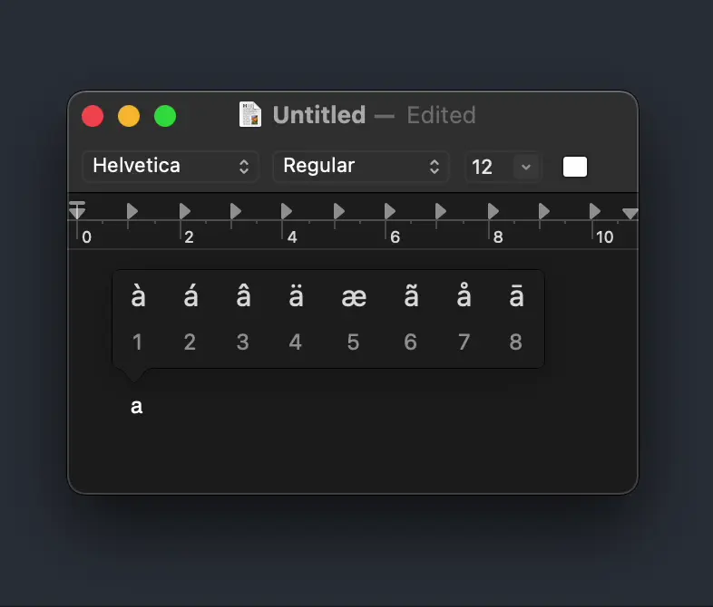

On Emacs, *C-x 8 ' a* would be the equivalent, but it just didn't
stick for me. Fortunately, there's an alternative, using dead keys.
Mickey Petersen gives a [wonderful
introduction](https://www.masteringemacs.org/article/diacritics-in-emacs).
Having said all this, I still longed for macOS's input mechanism.

Thanks to Christian Tietze's
[post](https://twitter.com/ctietze/status/1552446492559958017), I
discovered the [accent](https://github.com/elias94/accent) package.
While it doesn't handle *press-and-hold*, it does the heavy lifting of
offering a menu with character options. If I could just bring that
*press-and-hold*...

My initial attempt was to use [key
chords](https://github.com/emacsorphanage/key-chord) (via
[use-package](https://github.com/jwiegley/use-package)):

``` emacs-lisp
(use-package accent
  :ensure t
  :chords (("aa" . ar/spanish-accent-menu)
           ("ee" . ar/spanish-accent-menu)
           ("ii" . ar/spanish-accent-menu)
           ("oo" . ar/spanish-accent-menu)
           ("uu" . ar/spanish-accent-menu)
           ("AA" . ar/spanish-accent-menu)
           ("EE" . ar/spanish-accent-menu)
           ("II" . ar/spanish-accent-menu)
           ("OO" . ar/spanish-accent-menu)
           ("UU" . ar/spanish-accent-menu)
           ("nn" . ar/spanish-accent-menu)
           ("NN" . ar/spanish-accent-menu)
           ("??" . ar/spanish-accent-menu)
           ("!!" . ar/spanish-accent-menu))
  :config
  (defun ar/spanish-accent-menu ()
    (interactive)
    (let ((accent-diacritics
           '((a (á))
             (e (é))
             (i (í))
             (o (ó))
             (u (ú ü))
             (A (Á))
             (E (É))
             (I (Í))
             (O (Ó))
             (U (Ú Ü))
             (n (ñ))
             (N (Ñ))
             (\? (¿))
             (! (¡)))))
      (ignore-error quit
        (accent-menu)))))
```

While it kinda works, \"nn\" quickly got in the way of my n/p
[magit](https://magit.vc/) navigation. Perhaps key chords are still an
option for someone who doesn't need the \"nn\" chord, but being a
Spanish speaker, I need that \"ñ\" from long \"n\" presses!

I'm now trying a little experiment using an
`after-change-functions`{.verbatim} hook to monitor text input and
present the accent menu. I'm sure there's a better way (anyone with
ideas?). For now, it gives me something akin to *press-and-hold.*

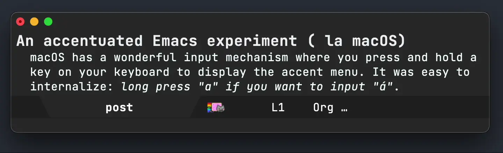

I'm wrapping the hook with a minor mode to easily enable/disable
whenever needed. I'm also overriding `accent-diacritics`{.verbatim} to
only include the characters I typically need.

``` emacs-lisp
(use-package accent
  :ensure t
  :hook ((text-mode . accent-menu-mode)
         (org-mode . accent-menu-mode)
         (message-mode . accent-menu-mode))
  :config
  (setq accent-diacritics '((a (á))
                            (e (é))
                            (i (í))
                            (o (ó))
                            (u (ú ü))
                            (A (Á))
                            (E (É))
                            (I (Í))
                            (O (Ó))
                            (U (Ú Ü))
                            (n (ñ))
                            (N (Ñ))
                            (\? (¿))
                            (! (¡))))
  (defvar accent-menu-monitor--last-edit-time nil)

  (define-minor-mode accent-menu-mode
    "Toggle `accent-menu' if repeated keys are detected."
    :lighter " accent-menu mode"
    (if accent-menu-mode
        (progn
          (remove-hook 'after-change-functions #'accent-menu-monitor--text-change t)
          (add-hook 'after-change-functions #'accent-menu-monitor--text-change 0 t))
      (remove-hook 'after-change-functions #'accent-menu-monitor--text-change t)))

  (defun accent-menu-monitor--text-change (beginning end length)
    "Monitors text change BEGINNING, END, and LENGTH."
    (let ((last-edit-time accent-menu-monitor--last-edit-time)
          (edit-time (float-time)))
      (when (and (> end beginning)
                 (eq length 0)
                 last-edit-time
                 (not undo-in-progress)
                 ;; 0.27 seems to work for my macOS keyboard settings.
                 ;; Key Repeat: Fast | Delay Until Repeat: Short.
                 (< (- edit-time last-edit-time) 0.27)
                 (float-time (time-subtract (current-time) edit-time))
                 (accent-menu-monitor--buffer-char-string (1- beginning))
                 (seq-contains-p (mapcar (lambda (item)
                                           (symbol-name (car item)))
                                         accent-diacritics)
                                 (accent-menu-monitor--buffer-char-string beginning))
                 (string-equal (accent-menu-monitor--buffer-char-string (1- beginning))
                               (accent-menu-monitor--buffer-char-string beginning)))
        (delete-backward-char 1)
        (ignore-error quit
          (accent-menu)))
      (setq accent-menu-monitor--last-edit-time edit-time)))

  (defun accent-menu-monitor--buffer-char-string (at)
    (when (and (>= at (point-min))
               (< at (point-max)))
      (buffer-substring-no-properties at (+ at 1)))))
```

As a bonus, it ocurred to me that I could use the same *press-and-hold*
to handle question marks in Spanish (from my UK keyboard).


# dwim-shell-command improvements

Added a few improvements to
[dwim-shell-command](https://github.com/xenodium/dwim-shell-command).

## Dired region

In DWIM style, if you happen to have a
[dired](https://www.gnu.org/software/emacs/manual/html_node/emacs/Dired.html)
region selected, use region files instead. There's no need to
explicitly mark them.

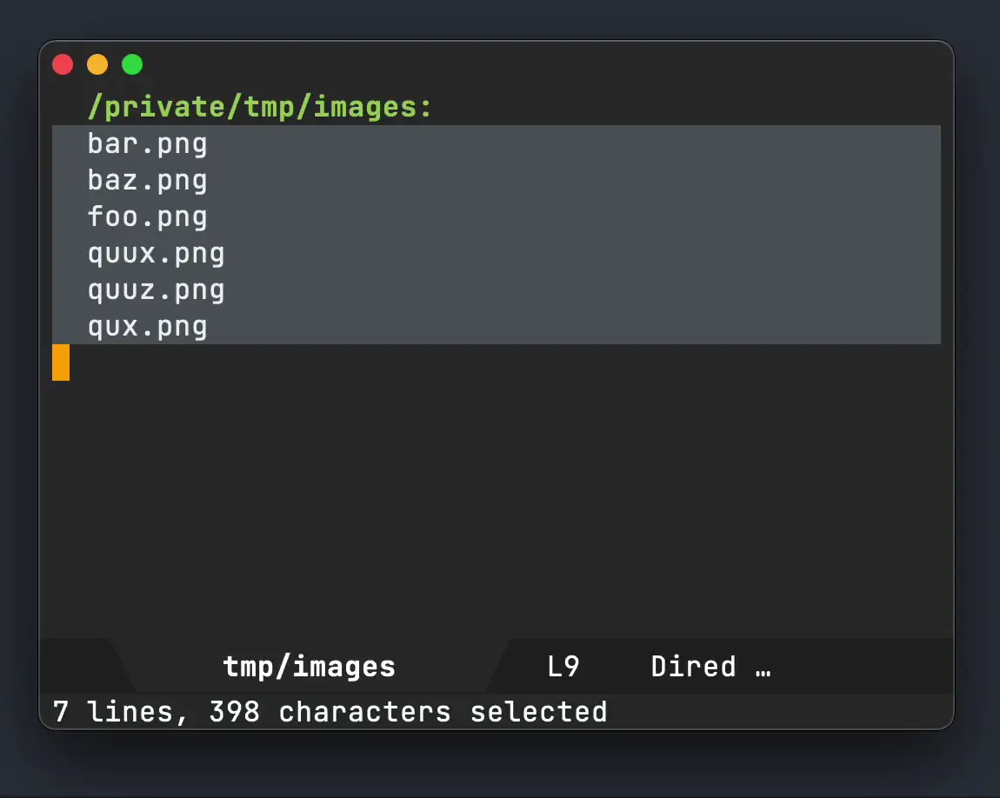

## Clipboard (kill-ring) replacement

Use `<<cb>>`{.verbatim} to substitute with clipboard content. This is
handy for cloning git repos, using a URL copied from your browser.

``` sh
git clone <<cb>>
```

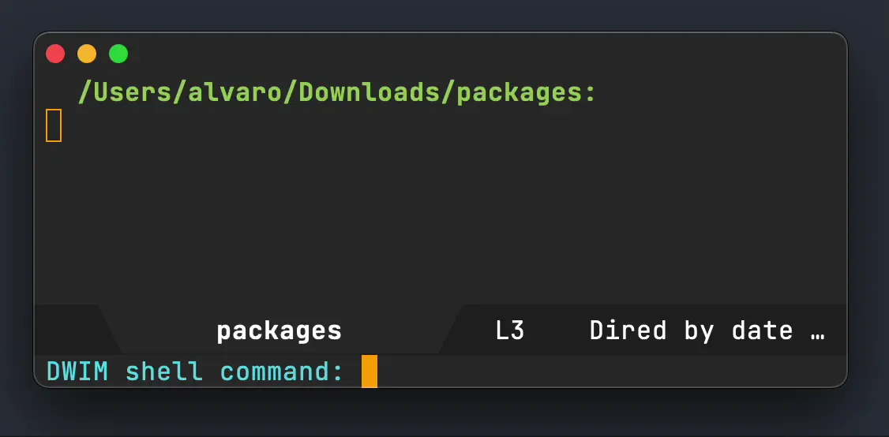

This illustrates `<<cb>>`{.verbatim} usage, but you may want to use
`dwim-shell-commands-git-clone-clipboard-url`{.verbatim} from
[dwim-shell-commands.el](https://github.com/xenodium/dwim-shell-command/blob/main/dwim-shell-commands.el)
instead. It does the same thing internally, but makes the command more
accessible.

``` emacs-lisp
(defun dwim-shell-commands-git-clone-clipboard-url ()
  "Clone git URL in clipboard to `default-directory'."
  (interactive)
  (dwim-shell-command-on-marked-files
   (format "Clone %s" (file-name-base (current-kill 0)))
   "git clone <<cb>>"
   :utils "git"))
```

## Counter replacement

Use `<<n>>`{.verbatim} to substitute with a counter. You can also use
`<<3n>>`{.verbatim} to start the counter at 3.

Handy if you'd like to consistently rename or copy files.

``` sh
mv '<<f>>' 'image(<<n>>).png'
```

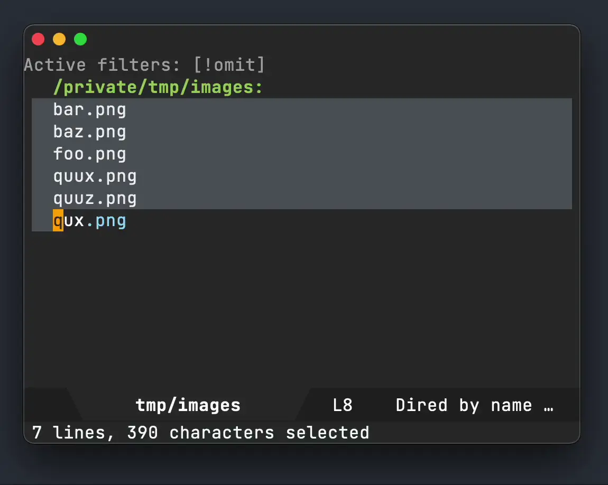

Can also use an alphabetic counter with `<<an>>`{.verbatim}. Like the
numeric version, can use any letter to start the counter with.

``` sh
mv '<<f>>' 'image(<<an>>).png'
```

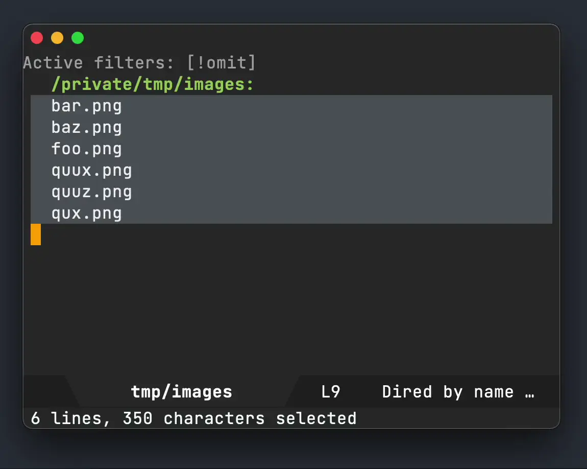

## Prefix counter

Use a [prefix command
argument](https://www.gnu.org/software/emacs/manual/html_node/elisp/Prefix-Command-Arguments.html)
on `dwim-shell-commands`{.verbatim} to repeat the command a number of
times. Combined with a counter, you can make multiple copies of a single
file.

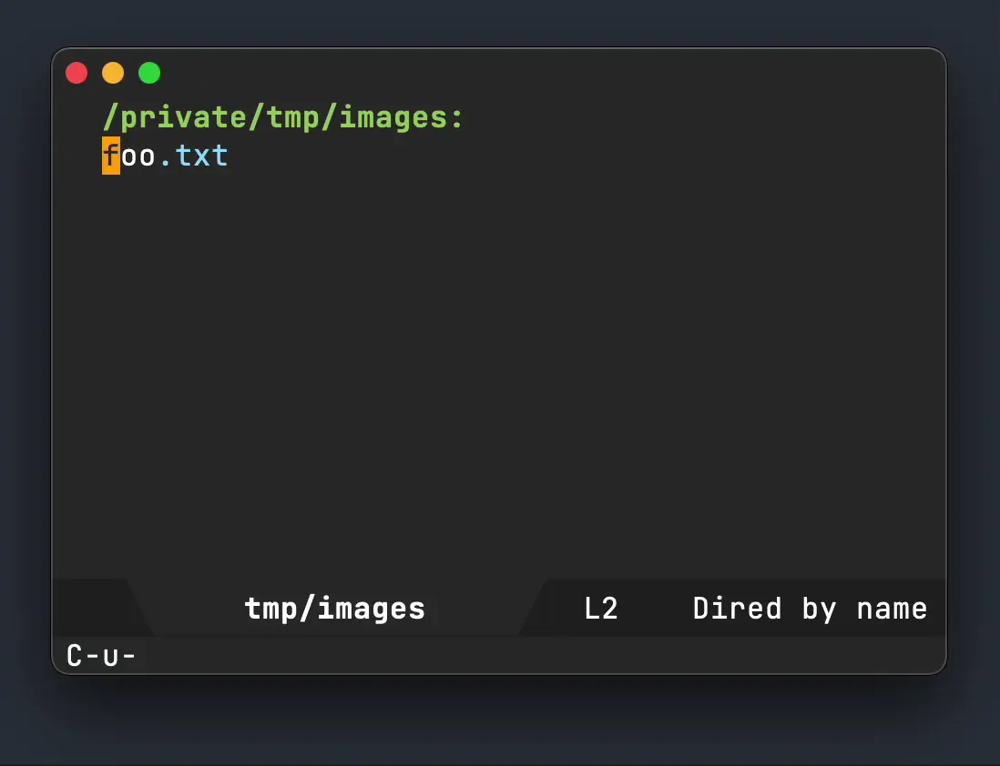

## Optional error prompt

Set `dwim-shell-command-prompt-on-error`{.verbatim} to nil to skip error
prompts. Focus process buffers automatically instead.


## Configurable prompt

By default, `dwim-shell-command`{.verbatim} shows all supported
placeholders. You can change that prompt to something shorter using
`dwim-shell-command-prompt`{.verbatim}.

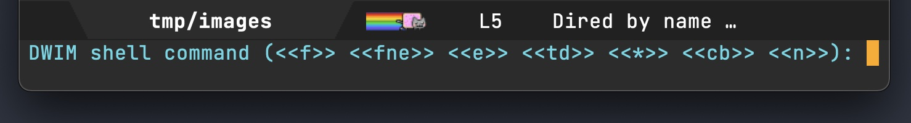

## ⚠️ Use with care ⚠️

The changes are pretty fresh. Please use with caution (specially the
counter support).

# dwim-shell-command on Melpa

<figure width="70%" height="70%">

<figcaption><code class="verbatim">&lt;&lt;cb&gt;&gt;</code> gets
replaced by a clipboard (kill ring) URL</figcaption>
</figure>

My pull request to add
[dwim-shell-command](https://github.com/xenodium/dwim-shell-command) to
[melpa](https://melpa.org/) has been
[merged](https://github.com/melpa/melpa/pull/8129). Soon, you'll be
able to install [directly](https://melpa.org/#/dwim-shell-command) from
Milkypostman's Emacs Lisp Package Archive.

`dwim-shell-command`{.verbatim} is another way to invoke shell commands
from our beloved editor. Why a different way? It does lots of little
things for you, removing friction you didn't realise you had. You can
check out the [README](https://github.com/xenodium/dwim-shell-command),
but you'll appreciate it much more once you try it out.

In addition, it's enabled me to bring lots of command-line tools into
my Emacs config and make them highly accessible. You can see my usages
over at
[dwim-shell-command-commands.el](https://github.com/xenodium/dotsies/blob/main/emacs/ar/dwim-shell-command-commands.el).

What kind of command-line tools? ffmpeg, convert, gifsycle, atool, qdpf,
plutil, qrencode, du, sips, iconutil, and git (so far anyway). Below is
a simple example, but would love to [hear](https://twitter.com/xenodium)
how you get to use it.

``` emacs-lisp
(defun dwim-shell-command-audio-to-mp3 ()
  "Convert all marked audio to mp3(s)."
  (interactive)
  (dwim-shell-command-on-marked-files
   "Convert to mp3"
   "ffmpeg -stats -n -i '<<f>>' -acodec libmp3lame '<<fne>>.mp3'"
   :utils "ffmpeg"))
```

I've written about `dwim-shell-command`{.verbatim} before:

-   [Emacs: DWIM shell command
    (multi-language)](https://xenodium.com/emacs-dwim-shell-command-multi-language/)
-   [png to icns (Emacs DWIM
    style)](https://xenodium.com/png-to-icns-emacs-dwim-style/)
-   [Emacs: Password-protect current pdf
    (revisited)](https://xenodium.com/emacs-password-protect-current-pdf-revisited/)
-   [Emacs DWIM
    shell-command](https://xenodium.com/emacs-dwim-shell-command/)

[Irreal](https://irreal.org/blog/)'s also covered it:

-   [DWIM Shell Now Supports Multiple
    Languages](https://irreal.org/blog/?p=10674)
-   [DWIM Shell Commands](https://irreal.org/blog/?p=10653)
-   [More Examples of DWIM Shell
    Commands](https://irreal.org/blog/?p=10660  )

# A lifehack for your shell

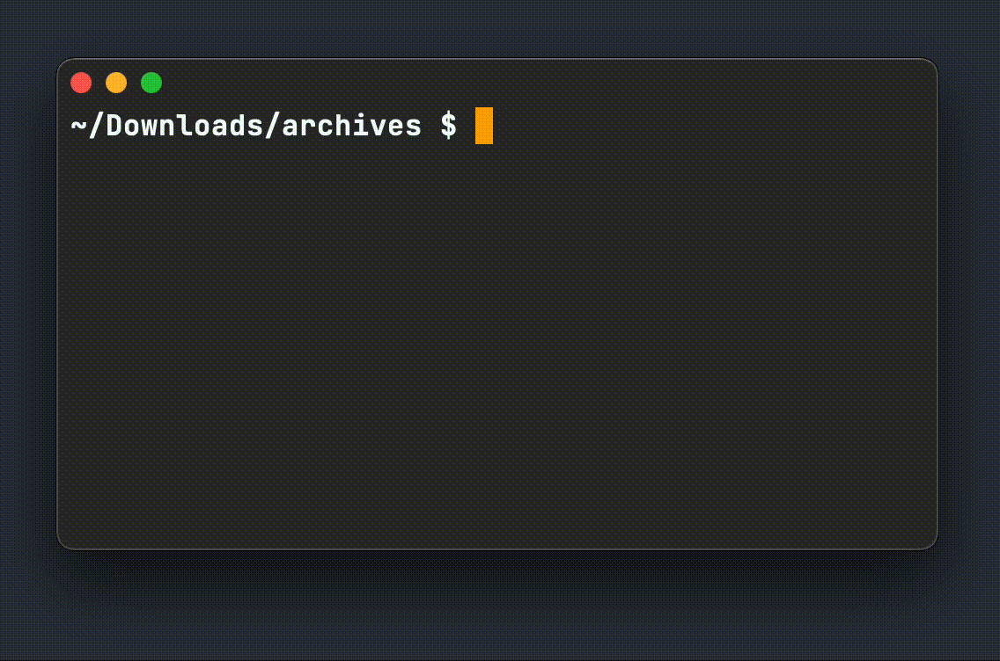

I'm a fan of the
[unzip](http://infozip.sourceforge.net/mans/unzip.html) command line
utility that ships with macOS. I give it a .zip file and it unzips it
for me. No flags or arguments to remember (for my typical usages
anyway). Most importantly, I've fully internalized the
`unzip`{.verbatim} command into muscle memory, probably because of its
*perfect mnemonic*.

But then there's .tar, .tar.gz, .tar.xz, .rar, and a whole world of
compression archives, often requiring different tools, flags, etc. and I
need to remember those too.

Can't remember where I got this \"life hack\" from, but it suggests
something along the lines of...

::: center
*Once you find a lost item at home, place it in the first spot you
looked.*
:::

Great, I'll find things quickly. Win.

Now, I still remember a couple of unarchiving commands from memory
(looking at you `tar xvzf`{.verbatim}), but I've noticed the first word
that pops into mind when extracting is always `unzip`{.verbatim}.

There's the great [atool](https://www.nongnu.org/atool/) wrapper out
there to extract all kinds of archives (would love to hear of others),
but unlucky for me, its name never comes to mind as quickly as
`unzip`{.verbatim} does.

With \"life hack\" in mind, let's just create an `unzip`{.verbatim}
[eshell](https://www.gnu.org/software/emacs/manual/html_mono/eshell.html)
alias to `atool`{.verbatim}. Next time I need to unarchive anything, the
first word that comes to mind (unzip!) will quickly get me on my way...

``` sh
alias unzip 'atool --extract --explain $1'
```

Or if you prefer to add to your Emacs config:

``` emacs-lisp
(eshell/alias "unzip" "atool --extract --explain $1")
```

While [I'm fan of Emacs
eshell](https://xenodium.com/yasnippet-in-emacs-eshell/), it's not
everyone's cup of tea. Lucky for us all, aliases are a popular feature
across shells. Happy unzipping!

## Bonus

Since I'm a keen on using \"unzip\" mnemonic everywhere in Emacs (not
just my shell), I now have a [DWIM
shell-command](https://xenodium.com/emacs-dwim-shell-command/) for it:

``` emacs-lisp
(defun dwim-shell-command-unzip ()
  "Unzip all marked archives (of any kind) using `atool'."
  (interactive)
  (dwim-shell-command-on-marked-files
   "Unzip" "atool --extract --explain '<<f>>'"
   :utils "atool"))
```

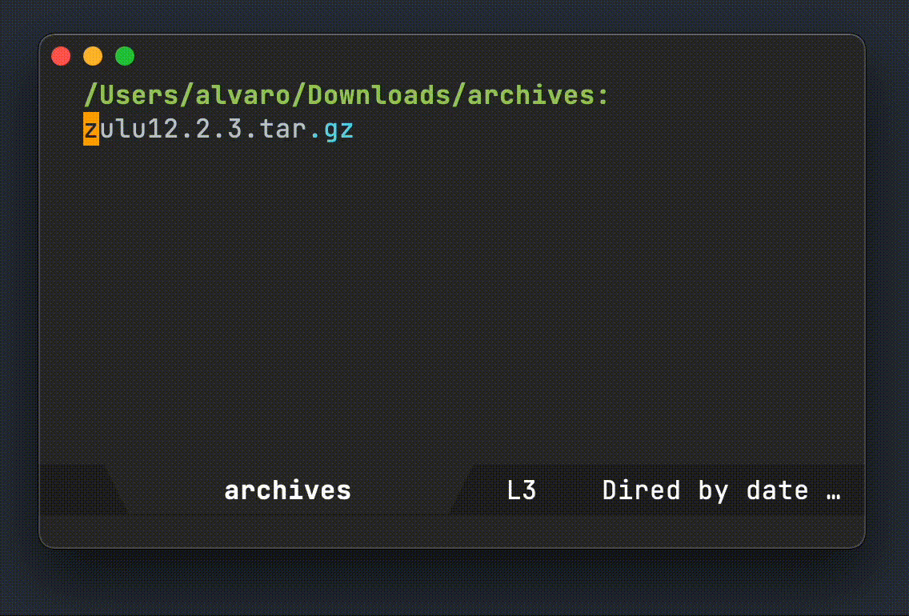

## UPDATE:

[Lobste.rs](https://lobste.rs/) has great
[comments](https://lobste.rs/s/qaimmg/lifehack_for_your_shell). Thanks
all:

### Aliases missing on remote machines

Concerns about aliases [not available on remote
machines](https://lobste.rs/s/qaimmg/lifehack_for_your_shell#c_mqxo73).
Valid. Certainly brings challenges if you can't modify the environment
on the remote machine. The severity would depend on how frequently you
have to do this. Fortunately for me, it's infrequent.

Additionally, if accessing remote machine via
[eshell](https://www.gnu.org/software/emacs/manual/html_mono/eshell.html),
this is a non-issue. You get to transparently bring most of your
environment with you anyway.

### Unzip keyword is overloaded

The alias is [overloading the unzip
command](https://lobste.rs/s/qaimmg/lifehack_for_your_shell#c_78nnwt). I
know. It's a little naughty. Going with it for now. I used to use
\"extract\" (also in comments), which I still like but somehow \"unzip\"
still wins my memory race. [There's also
\"x\"](https://lobste.rs/s/qaimmg/lifehack_for_your_shell#c_73bzze)
(nice option), which seems to originate from
[prezto](https://github.com/sorin-ionescu/prezto). I could consider
unzipp, unzip1, or some other variation.

Not sure how I missed this, but there's also an [existing alias for
atool](https://lobste.rs/s/qaimmg/lifehack_for_your_shell#c_ra6sbf):
aunpack. Could be a great alternative.

### Pause before extracting archives

Valid
[point](https://lobste.rs/s/qaimmg/lifehack_for_your_shell#c_73bzze). In
my case, the pause typically happens *before* I invoke the alias.

### Littering

If the archive didn't have a root dir, it can [litter your current
directory](https://lobste.rs/s/qaimmg/lifehack_for_your_shell#c_7fsart).
Indeed a pain to clean up. For this, we can atool's
`--subdir`{.verbatim} param to *always create subdirectory when
extracting*.

### Alias to retrain

[Neat
trick](https://lobste.rs/s/qaimmg/lifehack_for_your_shell#c_yr1jby):
`alias unzip = “echo ‘use atool’”`{.verbatim} to help retrain yourself.
Reminds me of Emacs [guru-mode](https://github.com/bbatsov/guru-mode).

### atool alternatives

Nice to see other options suggested
[dtrx](https://github.com/moonpyk/dtrx)
([comment](https://lobste.rs/s/qaimmg/lifehack_for_your_shell#c_mutdjl)),
[archiver](https://github.com/mholt/archiver)
([comment](https://lobste.rs/s/qaimmg/lifehack_for_your_shell#c_nlsk7w)),
[unar](https://github.com/ashang/unar)
([comment](https://lobste.rs/s/qaimmg/lifehack_for_your_shell#c_90dk1l)),
bsdtar from [libarchive](https://github.com/libarchive/libarchive)
([comment](https://lobste.rs/s/qaimmg/lifehack_for_your_shell#c_ojy6ah)),
[unp](https://packages.debian.org/stable/unp),
[patool](https://wummel.github.io/patool/), and the tangentially related
[zgrep](https://www.nongnu.org/zutils/zutils.html)
([comment](https://lobste.rs/s/qaimmg/lifehack_for_your_shell#c_vp8fdw)).

# Emacs zones to lift you up

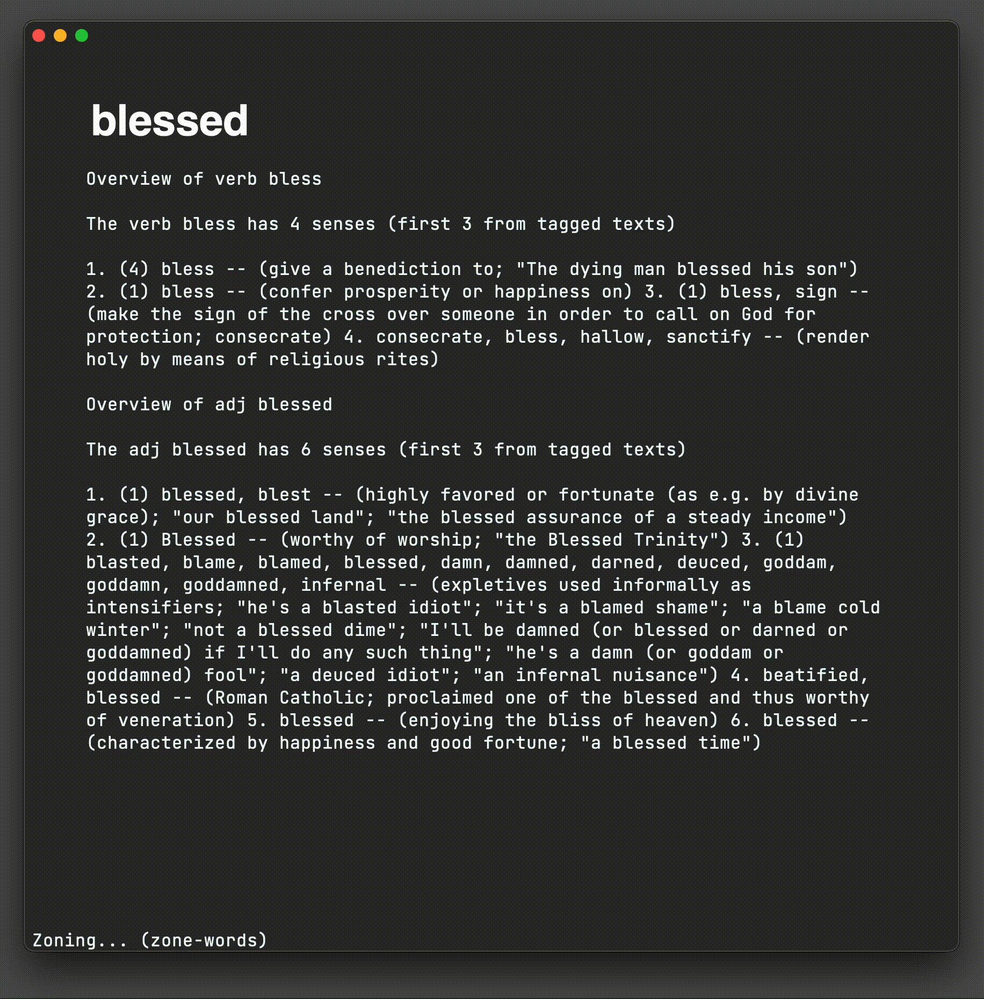

As I prune my [Emacs config](https://github.com/xenodium/dotsies/) off,
I came across a forgotten bit of elisp I wrote about 6 years ago. While
it's not going to power up your Emacs fu, it may lift your spirits, or
maybe just aid discovery of new words.

You see, I had forgotten about
[zone.el](https://github.com/emacs-mirror/emacs/blob/master/lisp/play/zone.el)
altogether: a fabulous package to tickle your heart. You can think of it
as screensaver built into Emacs.

If the built-in zones don't do it for ya, check out the few on melpa
([nyan](https://depp.brause.cc/zone-nyan/),
[sl](https://github.com/kawabata/zone-sl), and
[rainbow](https://xenodium.com/added-emacs-zone-rainbow/)).

So, my nostalgic bit of elisp dates `Jun 17 2016`{.verbatim}: a basic
but functional zone
([zone-words](https://github.com/xenodium/dotsies/blob/main/emacs/ar/zone-words.el)),
displaying words from [WordNet](http://wordnet.princeton.edu/). Surely
the package can use plenty of improvements ([here's
one](https://github.com/xenodium/dotsies/commit/00215e215be1413ea9d0085dd2de5123c635b8c0)),
but hey this is Emacs and pretty much all existing code will run, no
matter how old. In Emacs time, 2016 is practically yesterday!

# Emacs: DWIM shell command (multi-language)

UPDATE:
[dwim-shell-command](https://github.com/xenodium/dwim-shell-command) is
now available on [melpa](https://melpa.org/#/dwim-shell-command).

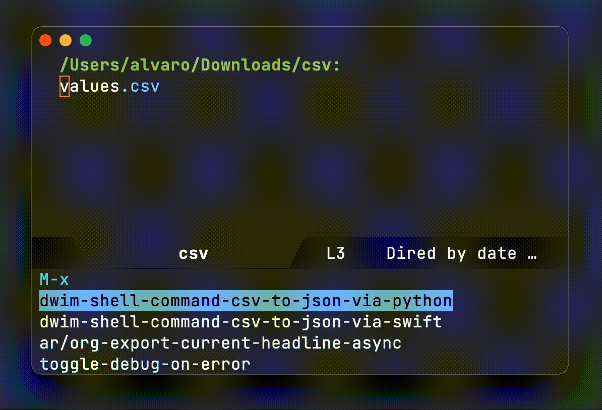

I keep on [goofying
around](https://xenodium.com/png-to-icns-emacs-dwim-style/) with
[dwim-shell-command](https://github.com/xenodium/dwim-shell-command) and
it's sibling `dwim-shell-command-on-marked-files`{.verbatim} from
[dwim-shell-command.el](https://github.com/xenodium/dwim-shell-command/blob/main/dwim-shell-command.el).

In addition to defaulting to
[zsh](https://en.wikipedia.org/wiki/Z_shell),
`dwim-shell-command-on-marked-files`{.verbatim} now support other shells
and languages. This comes in handy if you have snippets in different
languages and would like to easily invoke them from Emacs.
Multi-language support enables \"using the best tool for the job\" kinda
thing. Or maybe you just happen to know how to solve a particular
problem in a specific language.

Let's assume you have an existing Python snippet to convert files from
csv to json. With `dwim-shell-command-on-marked-files`{.verbatim}, you
can invoke the Python snippet to operate on either
[dired](https://www.gnu.org/software/emacs/manual/html_node/emacs/Dired.html)
or buffer files.

``` emacs-lisp
(defun dwim-shell-command-csv-to-json-via-python ()
  "Convert csv file to json (via Python)."
  (interactive)
  (dwim-shell-command-on-marked-files
   "Convert csv file to json (via Python)."
   "
import csv
import json
text = json.dumps({ \"values\": list(csv.reader(open('<<f>>')))})
fpath = '<<fne>>.json'
with open(fpath , 'w') as f:
  f.write(text)"
   :shell-util "python"
   :shell-args "-c"))
```

Or, maybe you prefer Swift and already had a snippet for the same thing?

``` emacs-lisp
(defun dwim-shell-command-csv-to-json-via-swift ()
  "Convert csv file to json (via Swift)."
  (interactive)
  (dwim-shell-command-on-marked-files
   "Convert csv file to json (via Swift)."
   "
    import Foundation
    import TabularData
    let filePath = \"<<f>>\"
    print(\"reading \\(filePath)\")
    let content = try String(contentsOfFile: filePath).trimmingCharacters(in: .whitespacesAndNewlines)
    let parsedCSV = content.components(separatedBy: CSVWritingOptions().newline).map{
      $0.components(separatedBy: \",\")
    }
    let jsonEncoder = JSONEncoder()
    let jsonData = try jsonEncoder.encode([\"value\": parsedCSV])
    let json = String(data: jsonData, encoding: String.Encoding.utf8)
    let outURL = URL(fileURLWithPath:\"<<fne>>.json\")
    try json!.write(to: outURL, atomically: true, encoding: String.Encoding.utf8)
    print(\"wrote \\(outURL)\")"
   :shell-pipe "swift -"))
```

You can surely solve the same problem in elisp, but hey it's nice to
have options and flexibility.

# png to icns (Emacs DWIM style)

UPDATE:
[dwim-shell-command](https://github.com/xenodium/dwim-shell-command) is
now available on [melpa](https://melpa.org/#/dwim-shell-command).

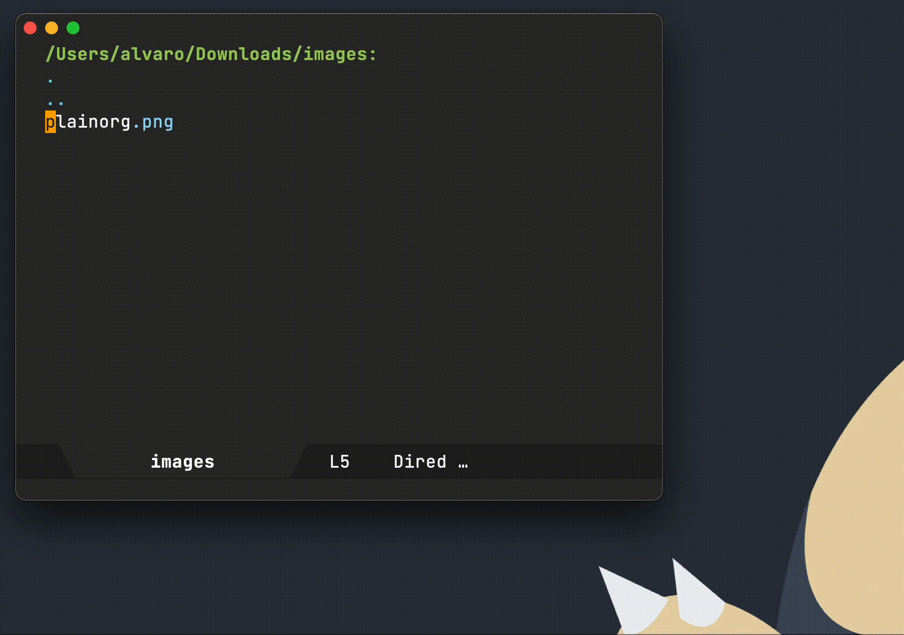

Since [writing a DWIM version of the
shell-command](https://xenodium.com/emacs-dwim-shell-command/), I've
been having a little fun [revisiting command line
utilities](https://xenodium.com/emacs-password-protect-current-pdf-revisited/)
I sometimes invoke from my beloved editor. In this instance, converting
a png file to an icns icon. What's more interesting about this case is
that it's not just a one-liner, but a short script in itself. Either
way, it's just as easy to invoke from Emacs using
`dwim-shell-command--on-marked-files`{.verbatim}.

``` emacs-lisp
(defun dwim-shell-command-convert-image-to-icns ()
  "Convert png to icns icon."
  (interactive)
  (dwim-shell-command-on-marked-files
   "Convert png to icns icon"
   "
    # Based on http://stackoverflow.com/questions/12306223/how-to-manually-create-icns-files-using-iconutil
    # Note: png must be 1024x1024
    mkdir <<fne>>.iconset
    sips -z 16 16 '<<f>>' --out '<<fne>>.iconset/icon_16x16.png'
    sips -z 32 32 '<<f>>' --out '<<fne>>.iconset/icon_16x16@2x.png'
    sips -z 32 32 '<<f>>' --out '<<fne>>.iconset/icon_32x32.png'
    sips -z 64 64 '<<f>>' --out '<<fne>>.iconset/icon_32x32@2x.png'
    sips -z 128 128 '<<f>>' --out '<<fne>>.iconset/icon_128x128.png'
    sips -z 256 256 '<<f>>' --out '<<fne>>.iconset/icon_128x128@2x.png'
    sips -z 256 256 '<<f>>' --out '<<fne>>.iconset/icon_256x256@2x.png'
    sips -z 512 512 '<<f>>' --out '<<fne>>.iconset/icon_512x512.png'
    sips -z 512 512 '<<f>>' --out '<<fne>>.iconset/icon_256x256@2x.png'
    sips -z 1024 1024 '<<f>>' --out '<<fne>>.iconset/icon_512x512@2x.png'
    iconutil -c icns '<<fne>>.iconset'"
   :utils '("sips" "iconutil")
   :extensions "png"))
```

# Emacs: Password-protect current pdf (revisited)

UPDATE:
[dwim-shell-command](https://github.com/xenodium/dwim-shell-command) is
now available on [melpa](https://melpa.org/#/dwim-shell-command).

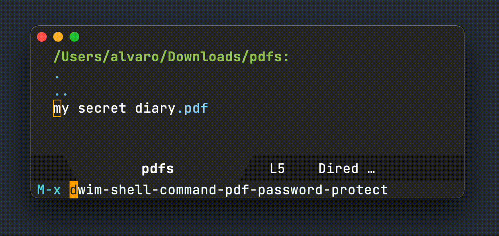

With a recent look at writing [DWIM shell
commands](https://xenodium.com/emacs-dwim-shell-command/), I've been
revisiting my custom Emacs functions invoking command line utilities.

Take this
[post](https://xenodium.com/emacs-password-protect-current-pdf/), for
example, where I invoke [qpdf](https://github.com/qpdf/qpdf) via a
elisp. Using the new `dwim-shell-command--on-marked-files`{.verbatim} in
[dwim-shell-command.el](https://github.com/xenodium/dwim-shell-command/blob/main/dwim-shell-command.el),
the code is stripped down to a bare minimum:

``` emacs-lisp
(defun dwim-shell-commands-pdf-password-protect ()
  "Password protect pdf."
  (interactive)
  (dwim-shell-command-on-marked-files
   "Password protect pdf"
   (format "qpdf --verbose --encrypt '%s' '%s' 256 -- '<<f>>' '<<fne>>_enc.<<e>>'"
           (read-passwd "user-password: ")
           (read-passwd "owner-password: "))
   :utils "qpdf"
   :extensions "pdf"))
```

Compare the above `dwim-shell-command--on-marked-files`{.verbatim} usage
to my [previous
implementation](https://xenodium.com/emacs-password-protect-current-pdf/):

``` emacs-lisp
(defun pdf-password-protect ()
  "Password protect current pdf in buffer or `dired' file."
  (interactive)
  (unless (executable-find "qpdf")
    (user-error "qpdf not installed"))
  (unless (equal "pdf"
                 (or (when (buffer-file-name)
                       (downcase (file-name-extension (buffer-file-name))))
                     (when (dired-get-filename nil t)
                       (downcase (file-name-extension (dired-get-filename nil t))))))
    (user-error "no pdf to act on"))
  (let* ((user-password (read-passwd "user-password: "))
         (owner-password (read-passwd "owner-password: "))
         (input (or (buffer-file-name)
                    (dired-get-filename nil t)))
         (output (concat (file-name-sans-extension input)
                         "_enc.pdf")))
    (message
     (string-trim
      (shell-command-to-string
       (format "qpdf --verbose --encrypt '%s' '%s' 256 -- '%s' '%s'"
               user-password owner-password input output))))))
```

This really changes things for me. I'll be more inclined to add more of
these tiny integrations to lots of great command line utilities. Take
this recent [Hacker News
post](https://news.ycombinator.com/item?id=32028752) on
[ocrmypdf](https://github.com/ocrmypdf/OCRmyPDF) as an example. Their
[cookbook](https://ocrmypdf.readthedocs.io/en/latest/cookbook.html) has
lots of examples that can be easily used via
`dwim-shell-command--on-marked-files`{.verbatim}.

What command line utils would you use?

# Emacs DWIM shell-command

UPDATE:
[dwim-shell-command](https://github.com/xenodium/dwim-shell-command) is
now available on [melpa](https://melpa.org/#/dwim-shell-command).

I've [talked about DWIM
before](https://xenodium.com/emacs-dwim-do-what-i-mean/), where I bend
Emacs to help me do what I mean. Emacs is also great for [wrapping
command-line one-liners with
elisp](https://xenodium.com/emacs-password-protect-current-pdf/), so I
can quickly invoke commands without thinking too much about flags,
arguments, etc.

I keep thinking the
[shell-command](https://www.gnu.org/software/emacs/manual/html_node/emacs/Shell.html)
is ripe for plenty of enhancements using our DWIM fairydust.

## Do what I mean how?

### Smart template instantiation

I've drawn inspiration from
[dired-do-shell-command](https://www.gnu.org/software/emacs/manual/html_node/emacs/Shell-Commands-in-Dired.html),
which substitutes special characters like \* and ? with marked files.
I'm also drawing inspiration from [org
babel](https://orgmode.org/worg/org-contrib/babel/)'s
[noweb](https://orgmode.org/manual/Noweb-Reference-Syntax.html) syntax
to substitute `<<f>>`{.verbatim} (file path), `<<fne>>`{.verbatim} (file
path without extension), and `<<e>>`{.verbatim} (extension). My initial
preference was to use something like `$f`{.verbatim}, `$fne`{.verbatim},
and `$e`{.verbatim}, but felt they clashed with shell variables.


### Operate on dired marked files

This is DWIM, so if we're visiting a
[dired](https://www.gnu.org/software/emacs/manual/html_node/emacs/Dired.html)
buffer, the shell command should operate on all the marked files.

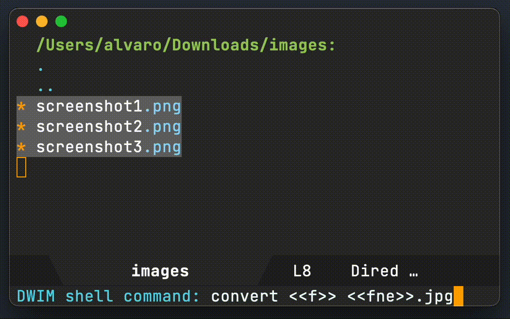

### Operate on current buffer file

Similarly, if visiting a buffer with an associated file, operate on that
file instead.

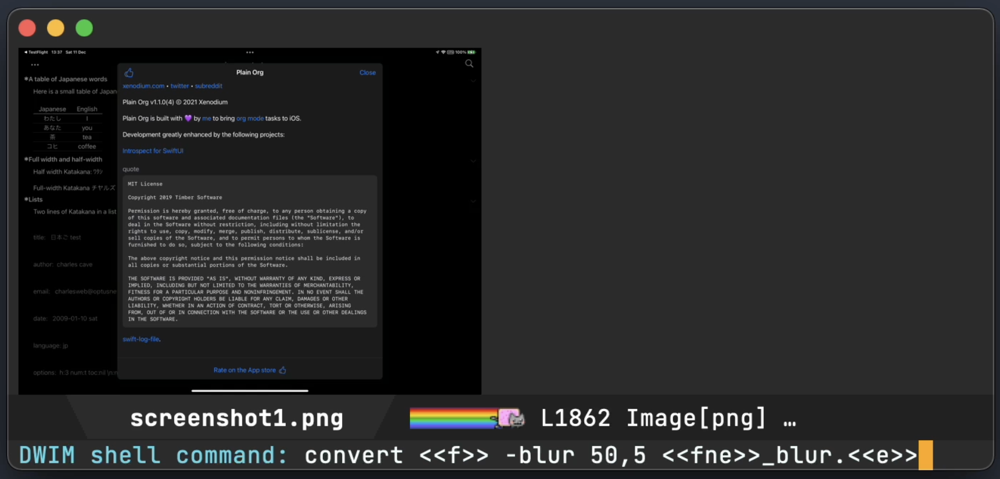

### Automatically take me to created files

Did the command create a new file in the current directory? Take me to
it, right away.


### Show me output on error

I'm not usually interested in the command output when generating new
files, unless there was an error of course. Offer to show it.


### Show me output if no new files

Not all commands generate new files, so automatically show me the output
for these instances.

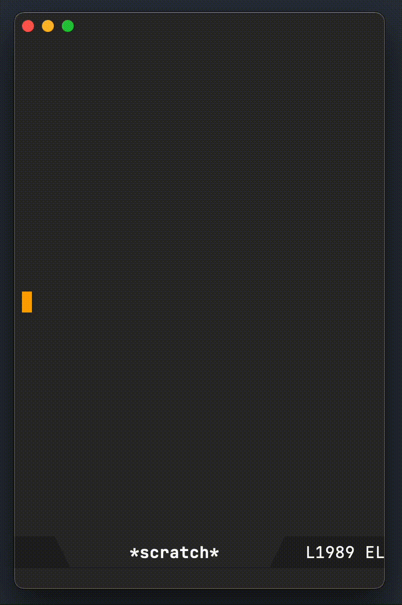

### Make it easy to create utilities

[ffmpeg](https://ffmpeg.org/) is awesome, but man I can never remember
all the flags and arguments. I may as well wrap commands like these in a
convenient elisp function and invoke via
[execute-extended-command](https://www.gnu.org/software/emacs/manual/html_node/efaq/Extended-commands.html),
or my favorite
[counsel-M-x](http://oremacs.com/swiper/#minibuffer-key-bindings) (with
completion), bound to the vital `M-x`{.verbatim}.

All those gifs you see in this post were created with
`dwim-shell-command-convert-to-gif`{.verbatim}, powered by the same
elisp magic.

``` emacs-lisp
(defun dwim-shell-command-convert-to-gif ()
  "Convert all marked videos to optimized gif(s)."
  (interactive)
  (dwim-shell-command--on-marked-files
   "Convert to gif"
   "ffmpeg -loglevel quiet -stats -y -i <<f>> -pix_fmt rgb24 -r 15 <<fne>>.gif"
   :utils "ffmpeg"))
```

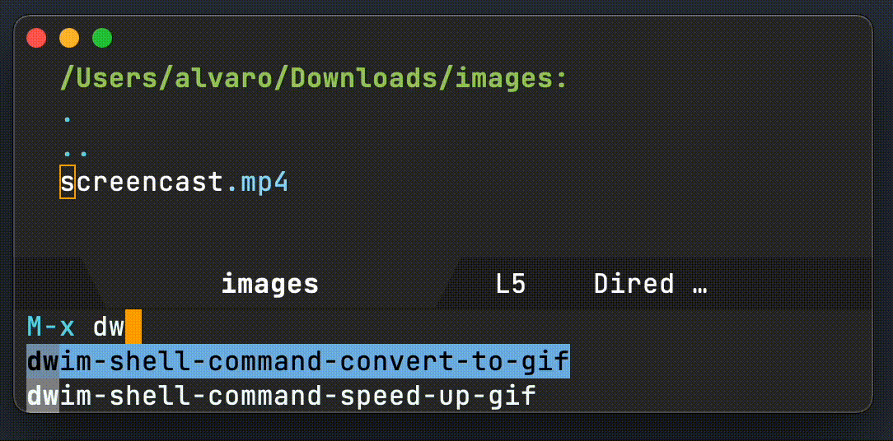

This makes wrapping one-liners a breeze, so let's do some more...

``` emacs-lisp
(defun dwim-shell-command-convert-audio-to-mp3 ()
  "Convert all marked audio to mp3(s)."
  (interactive)
  (dwim-shell-command-on-marked-files
   "Convert to mp3"
   "ffmpeg -stats -n -i '<<f>>' -acodec libmp3lame '<<fne>>.mp3'"
   :utils "ffmpeg"))

(defun dwim-shell-command-convert-image-to-jpg ()
  "Convert all marked images to jpg(s)."
  (interactive)
  (dwim-shell-command-on-marked-files
   "Convert to jpg"
   "convert -verbose '<<f>>' '<<fne>>.jpg'"
   :utils "convert"))

(defun dwim-shell-command-drop-video-audio ()
  "Drop audio from all marked videos."
  (interactive)
  (dwim-shell-command-on-marked-files
   "Drop audio" "ffmpeg -i '<<f>>' -c copy -an '<<fne>>_no_audio.<<e>>'"
   :utils "ffmpeg"))
```

### Make it spin ;)

Ok, not quite, but use Emacs's
[progress-reporter](https://www.gnu.org/software/emacs/manual/html_node/elisp/Progress.html)
just for kicks.


## Use it everywhere

`dwim-shell-command`{.verbatim} covers my needs (so far anyway), so I'm
binding it to existing bindings.

``` emacs-lisp
(use-package dwim-shell-command
  :bind
  ("M-!" . dwim-shell-command))

(use-package dired
  :bind (:map dired-mode-map
              ([remap dired-do-async-shell-command] . dwim-shell-command)
              ([remap dired-do-shell-command] . dwim-shell-command)
              ([remap dired-smart-shell-command] . dwim-shell-command)))
```

## Bring those command line utilities

On the whole, this really changes things for me. I'll be more inclined
to bring command line utilities to seamless Emacs usage. Take this
recent [Hacker News post](https://news.ycombinator.com/item?id=32028752)
on [ocrmypdf](https://github.com/ocrmypdf/OCRmyPDF) as an example. Their
[cookbook](https://ocrmypdf.readthedocs.io/en/latest/cookbook.html) has
lots of examples that can be easily used via
`dwim-shell-command--on-marked-files`{.verbatim}. What command line
utilities would you bring?

## Where's the code?

UPDATE:
[dwim-shell-command](https://github.com/xenodium/dwim-shell-command) is
now available on [melpa](https://melpa.org/#/dwim-shell-command).

The code for
[dwim-shell-command.el](https://github.com/xenodium/dotsies/blob/main/emacs/ar/dwim-shell-command.el)
is likely a bit rough still, but you can take a peak if interested. Keep
in mind this is DWIM, tailored for what ✨I✨ mean. Some of the current
behavior may not be your cup of tea, but this is Emacs. You can bend it
to do what ✨you✨ mean. Happy Emacsing.

# Emacs: Password-protect current pdf

UPDATE: Check out [Password-protect current pdf
(revisted)](https://xenodium.com/emacs-password-protect-current-pdf-revisited)
for a simpler version.

Every so often, I need to password-protect a pdf. On macOS, [Preview has
a simple
solution](https://support.apple.com/en-gb/guide/preview/prvw587dd90f/mac),
but I figured there must be a command line utility to make this happen.
There are options, but [qdf](https://github.com/qpdf/qpdf) did the job
just fine.

``` sh
qpdf --verbose --encrypt USER-PASSWORD OWNER-PASSWORD KEY-LENGTH -- input.pdf output.pdf
```

So what does `qpdf` have to do with Emacs? Command-line utilities are
easy to invoke from Emacs via `shell-command` (M-!), but I don't want
to remember the command nor the parameters. I may as well add a function
that [does what I mean](https://xenodium.com/emacs-dwim-do-what-i-mean/)
and password-protect either buffers or
[dired](https://www.gnu.org/software/emacs/manual/html_node/emacs/Dired.html)
files.

``` emacs-lisp
(defun pdf-password-protect ()
    "Password protect current pdf in buffer or `dired' file."
    (interactive)
    (unless (executable-find "qpdf")
      (user-error "qpdf not installed"))
    (unless (equal "pdf"
                   (or (when (buffer-file-name)
                         (downcase (file-name-extension (buffer-file-name))))
                       (when (dired-get-filename nil t)
                         (downcase (file-name-extension (dired-get-filename nil t))))))
      (user-error "no pdf to act on"))
    (let* ((user-password (read-passwd "user-password: "))
           (owner-password (read-passwd "owner-password: "))
           (input (or (buffer-file-name)
                      (dired-get-filename nil t)))
           (output (concat (file-name-sans-extension input)
                           "_enc.pdf")))
      (message
       (string-trim
        (shell-command-to-string
         (format "qpdf --verbose --encrypt '%s' '%s' 256 -- '%s' '%s'"
                 user-password owner-password input output))))))
```

# Plain Org v1.4 released

[Plain Org](https://plainorg.com) v1.4 is now available on the [App
Store](https://apps.apple.com/app/id1578965002).

I was on a long flight recently 🦘, so I gave list and checkbox editing
a little love. There's a couple of other minor improvements included.

If you haven't heard of [Plain Org](https://plainorg.com), it gives you
access to [org](https://orgmode.org) files on iPhone while away from
your beloved [Emacs](https://www.gnu.org/software/emacs/).

I love org markup, but we (iPhone + org users) are a fairly niche bunch.
If you're finding Plain Org useful, **please help support this effort**
by getting the word out. Tell your friends,
[tweet](https://twitter.com/intent/tweet?text=Plain%20Org%20https%3A%2F%2Fapps.apple.com%2Fapp%2Fid1578965002%20),
or blog about it.

On to v1.4 release notes...

## Improved list/checkbox editing

Adding list or checkbox items is traditionally cumbersome via the
iPhone's keyboard. This release adds new toolbar actions and smart
return to simplify things.


## Render form feed characters

Form feed characters are now rendered within expanded headings.


Note: There's a limitation. Form feed characters at the end of a
heading aren't currently displayed.

## Other

Increased all button tap areas in edit toolbar. This should hopefully
improve interaction.

# Plain Org v1.3 released

[Plain Org](https://plainorg.com) v1.3 is now available on the [App
Store](https://apps.apple.com/app/id1578965002). The update receives a
few features, bug fixes, and improvements.

If you haven't heard of [Plain Org](https://plainorg.com), it gives you
access to [org](https://orgmode.org) files on iPhone while away from
your beloved [Emacs](https://www.gnu.org/software/emacs/).

I love org markup, but we (iPhone + org users) are a fairly niche bunch.
If you're finding Plain Org useful, **please help support this effort**
by getting the word out. Tell your friends,
[tweet](https://twitter.com/intent/tweet?text=Plain%20Org%20https%3A%2F%2Fapps.apple.com%2Fapp%2Fid1578965002%20),
or blog about it.

On to v1.3 release notes...

## Toggle recurring tasks

You can now toggle recurring tasks with either catchup
`<2022-04-15 Fri ++1d>`{.verbatim}, restart
`<2022-04-15 Fri .+1d>`{.verbatim}, or cumulate
`<2022-04-15 Fri +1d>`{.verbatim} repeaters.


## Log state transitions


## Fullscreen view

The navigation bar now hides on scroll. This can be enabled/disabled via
`View > Full Screen`{.verbatim} menu.


The previous screenshot text comes from [Org Mode - Organize Your Life
In Plain Text](http://doc.norang.ca/org-mode.html), a magnificent org
resource.

## Deadline and scheduled date rendered

In the past, `SCHEDULED`{.verbatim} and `DEADLINE`{.verbatim} were
rendered (but only one of them at a time). Now both are rendered
alongside each other (deadline has an orange tint).


## Roundtripping fidelity

Many roundtripping fidelity improvements included in 1.3. Shoutout to
[u/Oerm](https://www.reddit.com/user/Oerm/) who reported [unnecessary
formatting
changes](https://www.reddit.com/r/plainorg/comments/ty7onh/changing_todo_status_of_one_item_triggers/)
in unmodified areas and helped test all fixes.

## Other bug fixes improvements

-   Disable raw text edit menu when file is not accessible.
-   Minor improvements to inline editing layouts (vertical height and
    drawers).
-   ABRT and HABIT now recognized as a popular keywords.
-   Improve state transition alignment to match org mode behaviour.
-   Fixes roundtripping state transition notes (leading to data loss).
-   Log creation from share sheet.
-   Increment DEADLINE **and** SCHEDULED, not just first found.
-   Roundtrip more whitespace in untouched areas.
-   Fixes org syntax inadvertently parsed within begin_src blocks
    (leading to data loss).

# Plain Org v1.2.1 released

[Plain Org](https://plainorg.com) v1.2.1 is now available on the [App
Store](https://apps.apple.com/app/id1578965002). The update receives
minor features, bug fixes, and improvements.

If you haven't heard of [Plain Org](https://plainorg.com), it gives you
access to [org](https://orgmode.org) files on iPhone while away from
your beloved [Emacs](https://www.gnu.org/software/emacs/).

I love org markup, but we (iPhone + org users) are a fairly niche
userbase. If you're finding Plain Org useful, **please help support
this effort** by getting the word out. Tell your friends,
[tweet](https://twitter.com/intent/tweet?text=Plain%20Org%20https%3A%2F%2Fapps.apple.com%2Fapp%2Fid1578965002%20),
or blog about it.

On to v1.2.1 release notes...

## Render LOGBOOK

State transitions and LOGBOOK drawers are now recognized and rendered as
such.

Either of the following snippets are rendered as togglable LOGBOOK
drawers.

``` org
* TODO Feed the fish
- State "DONE"       from "TODO"       [2022-03-11 Fri 12:23]
```

``` org
* TODO Feed the cat
:LOGBOOK:
- State "DONE"       from "TODO"       [2022-03-11 Fri 12:23]
:END:
```


## Add task to top/bottom

Up until now, tasks were always appended to the bottom of things. This
didn't work so well if you like seeing recent items bubbling up to the
top.

This version adds a new setting: *Settings* \> *Add new tasks to* \>
*Top/Bottom*, giving you the choice.

Note: Top is the new default value, please change this setting if you'd
like to keep the previous behaviour.


## Checking for changes

Local file changes aren't always detected via [state change
notifications](https://developer.apple.com/documentation/uikit/uidocument/1619945-statechangednotification),
so additional checks are now in place to offer reloading files.


## Open inactive files

After adding new tasks via iOS's share sheet, if the item was added to
a file other than the active one, offer to open that instead.


## Other improvements

-   Color keyword red/green depending on #+TODO: position.
-   Round-trip planning order (SCHEDULED, CLOSED, DEADLINE).
-   Improve tag alignment to match org mode behaviour (best effort,
    sorry).
-   Improve vertical spacing prior to lists.
-   Improve share sheet reliability.
-   Fix opening local links from list items.
-   Fix indent for list items without previous content.
-   Fix race condition in adding TITLE and ID to new files.
-   Fix incorrect keyword color selection in search toolbar.
-   Fix menu inadvertently closing.
-   Fix menu tapping for iPad.

# Emacs DWIM: swiper vs isearch vs phi-search

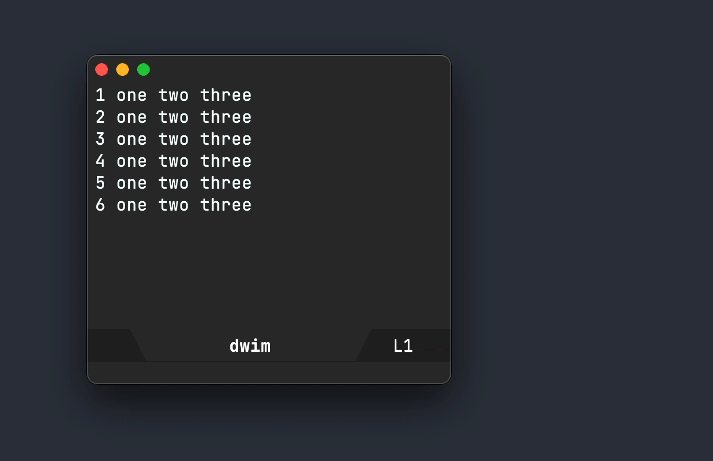

I've [talked about
DWIM](https://xenodium.com/emacs-dwim-do-what-i-mean/) in the past, that
wonderful Emacs ability to [do what ✨I✨
mean](https://en.wikipedia.org/wiki/DWIM).

Emacs being hyper-configurable, we can always teach it more things, so
it can do exactly what we mean.

There are no shortages of buffer searching packages for Emacs. I'm a
fan of Oleh Krehel's [swiper](https://github.com/abo-abo/swiper), but
before that, I often relied on the built-in
[isearch](https://www.gnu.org/software/emacs/manual/html_node/emacs/Basic-Isearch.html).
Swiper is my default goto mechanism and have it bound to
`C-s`{.verbatim} (replacing the built-in
[isearch-forward](https://www.gnu.org/software/emacs/manual/html_node/emacs/Basic-Isearch.html)).

Swiper services most needs until I start combining with other tools.
Take [keyboard
macros](https://www.gnu.org/software/emacs/manual/html_node/emacs/Keyboard-Macros.html)
and [multiple cursors](https://github.com/magnars/multiple-cursors.el).
Both wonderful, but neither can rely on swiper to do their thing. Ok,
swiper does, but [in a different
way](https://xenodium.com/emacs-swiper-and-multiple-cursors/).

Rather than binding `C-s`{.verbatim} to swiper, let's write a DWIM
function that's aware of macros and multiple cursors. It must switch
between swiper, isearch, and
[phi-search](https://github.com/avkoval/phi-search) depending on what I
want (search buffer, define macro, or search multiple cursors).

Let's also tweak swiper's behavior a little further and prepopulate
its search term with the active region. Oh, and I also would like swiper
to wrap around (see [ivy-wrap](http://oremacs.com/swiper/)). But only
swiper, not other ivy utilities. I know, I'm picky, but that's the
whole point of DWIM... so here's my function to search forward that
does exactly what ✨I✨ mean:

``` emacs-lisp
(defun ar/swiper-isearch-dwim ()
  (interactive)
  ;; Are we using multiple cursors?
  (cond ((and (boundp 'multiple-cursors-mode)
              multiple-cursors-mode
              (fboundp  'phi-search))
         (call-interactively 'phi-search))
        ;; Are we defining a macro?
        (defining-kbd-macro
          (call-interactively 'isearch-forward))
        ;; Fall back to swiper.
        (t
         ;; Wrap around swiper results.
         (let ((ivy-wrap t))
           ;; If region is active, prepopulate swiper's search term.
           (if (and transient-mark-mode mark-active (not (eq (mark) (point))))
               (let ((region (buffer-substring-no-properties (mark) (point))))
                 (deactivate-mark)
                 (swiper-isearch region))
             (swiper-isearch))))))
```

The above snippet searches forward, but I'm feeling a little
off-balance. Let's write an equivalent to search backwards. We can then
bind it to `C-r`{.verbatim}, also overriding the built-in
[isearch-backward](https://www.gnu.org/software/emacs/manual/html_node/emacs/Basic-Isearch.html).

``` emacs-lisp
(defun ar/swiper-isearch-backward-dwim ()
  (interactive)
  ;; Are we using multiple cursors?
  (cond ((and (boundp 'multiple-cursors-mode)
              multiple-cursors-mode
              (fboundp  'phi-search-backward))
         (call-interactively 'phi-search-backward))
        ;; Are we defining a macro?
        (defining-kbd-macro
          (call-interactively 'isearch-backward))
        ;; Fall back to swiper.
        (t
         ;; Wrap around swiper results.
         (let ((ivy-wrap t))
           ;; If region is active, prepopulate swiper's search term.
           (if (and transient-mark-mode mark-active (not (eq (mark) (point))))
               (let ((region (buffer-substring-no-properties (mark) (point))))
                 (deactivate-mark)
                 (swiper-isearch-backward region))
             (swiper-isearch-backward))))))
```

These may be on the hacky side of things, but hey... they do the job. If
there are better/supported ways of accomplishing a similar thing, I'd
love to [hear about it](https://twitter.com/xenodium).

# Grandma's vanilla pound cake


My grandmother Hilda used to bake this for us grandkids. I don't know
the origin of the recipe, but my parents, aunts, and cousins, they all
bake it too. I'm a big fan, but only get to eat it when visiting.
Yesterday, I changed that. Finally baked it myself ø/

## Ingredients

-   200g salted butter
-   2 cups (400 g) sugar
-   4 eggs
-   3 cups (375 g) plain flour
-   3 teaspoons baking powder
-   1 tablespoon (15 ml) vanilla extract
-   1 cup (250 ml) milk
-   2 tablespoons (30 ml) Málaga Virgen wine (port works too)

## Prep

-   Ensure all ingredients are at room temperature before you start.
-   Preheat oven at 175C.
-   Separate egg yolks and whites. Keep both.
-   Consolidate liquids into a bowl (milk + wine + vanilla).
-   Consolidate sifted powders into a bowl (flour + baking powder).

## Meringue

-   Beat egg whites into a snowy meringue. Set aside.

## Mixer

-   Beat butter in the mixer until creamy (important).
-   Add sugar and mix thoroughly ensuring creamy consistency remains
    (important).
-   Mix yolks in thoroughly one by one.
-   Mix in the meringue.
-   You're done with the mixer.

## Hand mixing

-   With a wooden spoon, alternate hand mixing the liquids and the
    powders. Start with liquids and end with powders.

## Pour into mould

-   Pour the mix into a non-stick baking mould.

## Bake

-   Bake in oven between 60 and 70 mins, but don't be afraid to leave
    longer if needed. Mileage varies across ovens.
-   Use a cake tester after 60 minutes to decide how much longer to bake
    for (if needed).

# Emacs: viewing webp images

There's a recent reddit post asking how to [view webp images in
Emacs](https://www.reddit.com/r/emacs/comments/t76isx/viewing_webp_images_in_emacs/).
I didn't know the answer, but it's something I had wanted for some
time. This post was a nice reminder to go and check things out. Was
happy to [contribute an
answer](https://www.reddit.com/r/emacs/comments/t76isx/comment/hzft7ww/?utm_source=share&utm_medium=web2x&context=3).

Turns out, it's very simple. Just set
`image-use-external-converter`{.verbatim} and install relevant external
tools.

``` emacs-lisp
(setq image-use-external-converter t)
```

I'm a `use-package`{.verbatim} user, so I prefer to set with:

``` emacs-lisp
(use-package image
  :custom
  ;; Enable converting external formats (ie. webp) to internal ones.
  (image-use-external-converter t))
```

So what are the external tools needed? `C-h v`{.verbatim}
`image-use-external-converter`{.verbatim} gives us the info we need:

> If non-nil, create-image will use external converters for exotic
> formats.
>
> Emacs handles most of the common image formats (SVG, JPEG, PNG, GIF
> and some others) internally, but images that don't have native
> support in Emacs can still be displayed if an external conversion
> program (like ImageMagick \"convert\", GraphicsMagick \"gm\" or
> \"ffmpeg\") is installed.
>
> This variable was added, or its default value changed, in Emacs 27.1.

I happen to be a macOS user, so I install ImageMagick with:

``` sh
brew install imagemagick
```

# Emacs: Fuzzy search Apple's online docs

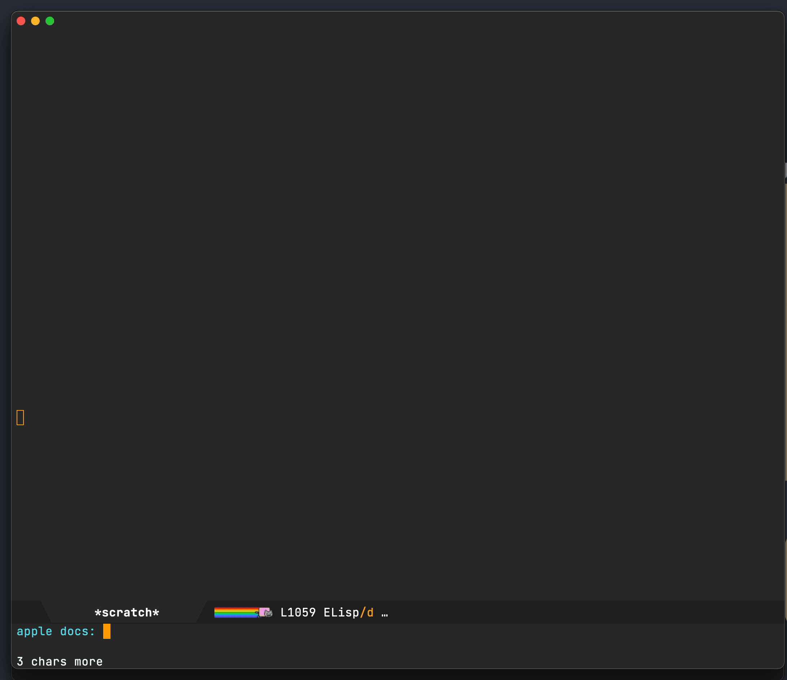

When building software for the Apple ecosystem, Xcode is often the
editor of choice. With [Emacs](https://www.gnu.org/software/emacs/)
being my personal preference, I rarely find other iOS devs with a
similar mindset.

When I saw [Mikael Konradsson](https://twitter.com/konrad1977)'s post
describing [his Emacs Swift development
setup](https://www.reddit.com/r/emacs/comments/sndriv/i_finally_got_full_autocompetion_in_swift_with/),
I reached out to say hello. While exchanging tips and tricks, the topic
of searching Apple's docs came up. It had been a while since I looked
into this, so it was a great reminder to revisit the space.

Back in June 2020, I wrote a snippet to [fuzzy search
hackingwithswift.com](https://xenodium.com/emacs-search-hackingwithswiftcom/),
using Emacs's [ivy](https://github.com/abo-abo/swiper) completion
framework. With a similar online API, we could also search Apple's
docs. Turns out, there is and we can we can use it to search
[developer.apple.com](https://developer.apple.com/search) from our
beloved editor.

``` emacs-lisp
;;; counsel-apple-search.el -*- lexical-binding: t; -*-

(defun ar/counsel-apple-search ()
  "Ivy interface for dynamically querying apple.com docs."
  (interactive)
  (require 'request)
  (require 'json)
  (require 'url-http)
  (ivy-read "apple docs: "
            (lambda (input)
              (let* ((url (url-encode-url (format "https://developer.apple.com/search/search_data.php?q=%s" input)))
                     (c1-width (round (* (- (window-width) 9) 0.3)))
                     (c2-width (round (* (- (window-width) 9) 0.5)))
                     (c3-width (- (window-width) 9 c1-width c2-width)))
                (or
                 (ivy-more-chars)
                 (let ((request-curl-options (list "-H" (string-trim (url-http-user-agent-string)))))
                   (request url
                     :type "GET"
                     :parser 'json-read
                     :success (cl-function
                               (lambda (&key data &allow-other-keys)
                                 (ivy-update-candidates
                                  (mapcar (lambda (item)
                                            (let-alist item
                                              (propertize
                                               (format "%s   %s   %s"
                                                       (truncate-string-to-width (propertize (or .title "")
                                                                                             'face '(:foreground "yellow")) c1-width nil ?\s "…")
                                                       (truncate-string-to-width (or .description "") c2-width nil ?\s "…")
                                                       (truncate-string-to-width (propertize (string-join (or .api_ref_data.languages "") "/")
                                                                                             'face '(:foreground "cyan1")) c3-width nil ?\s "…"))
                                               'url .url)))
                                          (cdr (car data)))))))
                   0))))
            :action (lambda (selection)
                      (browse-url (concat "https://developer.apple.com"
                                          (get-text-property 0 'url selection))))
            :dynamic-collection t
            :caller 'ar/counsel-apple-search))
```

# Plain Org v1.2 released

Although [Plain Org](https://plainorg.com) v1.2 has been in the [App
Store](https://apps.apple.com/app/id1578965002) for a little while, the
release write-up was overdue, sorry. The update receives some new
features and bugfixes.

If you haven't heard of [Plain Org](https://plainorg.com), it gives ya
access to your [org files](https://orgmode.org) on iOS while away from
your beloved [Emacs](https://www.gnu.org/software/emacs/).

If you're finding Plain Org useful, **please help support this effort**
by getting the word out. Tell your friends,
[tweet](https://twitter.com/intent/tweet?text=Plain%20Org%20https%3A%2F%2Fapps.apple.com%2Fapp%2Fid1578965002%20),
or blog about it.

Ok, now on to what's included in the v1.2 release...

## Edit heading sections inline

v1.0 introduced outline editing (for headings only). In v1.2, we can
also edit section content. Press the `return`{.verbatim} key multiple
times to exit out section editing.


## Filter by keyword/priority/tag

From the search dialog, you can now filter by keyboard, priority, and
tag.


## Render drawers and properties

Drawers are now rendered and can be expanded to view their content.


## Open files via the Files app's \"Share\" sheet

From the Files app, you can now explicitly request launching files in
Plain Org by using the \"Share\" menu.

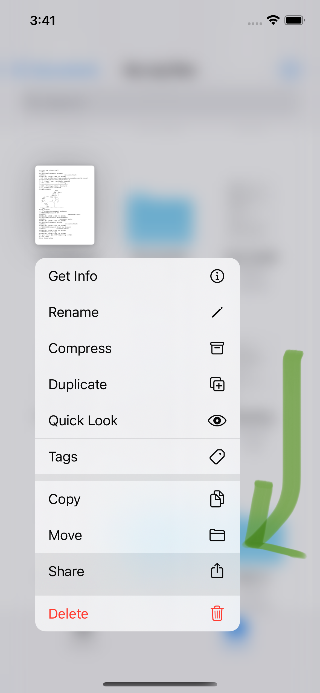

## Render LaTeX src blocks (experimental)

This one has its rough edges at the moment, so have to mark it
[experimental]{.underline}, but... you can can now render
`#+begin_src latex`{.verbatim} blocks.


## Insert title/id in new files

New files created via Plain Org automatically get `#+TITLE:`{.verbatim}
and `:ID:`{.verbatim} inserted by default as follows:

``` org
#+TITLE: My favorite title
:PROPERTIES:
:ID:       7C845D38-8D80-41B5-BEB1-94F673807355
:END:
```

*UPDATE*: Sorry, this feature currently has a bug. You may not get these
values inserted into your new document. Working on a fix.

## Adding new tags quicker

Add tags quicker via the new + button.


## Enable/disable sticky tags

Keywords, indent, and tags are maintained when adding new headings via
outline editing. If you prefer disabling sticky tags, this can now be
disabled.

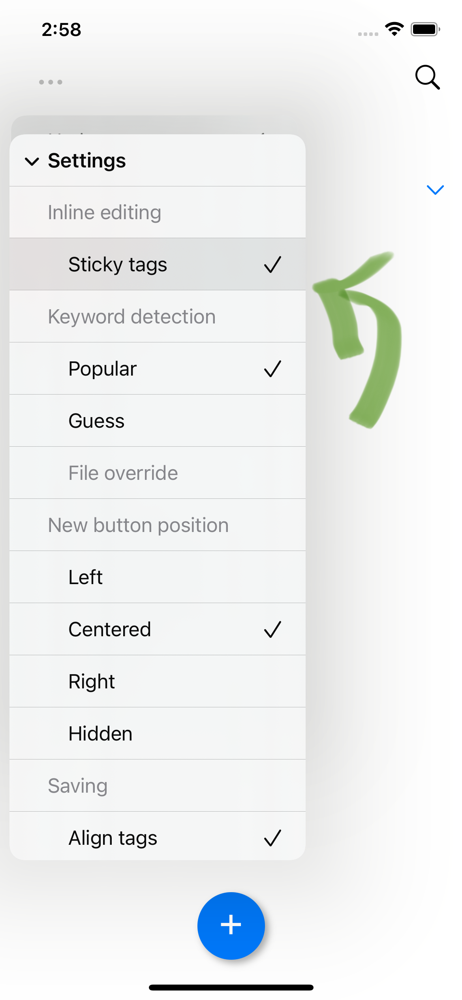

## Improved navigation bar

v1.2 makes the navigation bar feel more at home on your iPhone. It uses
a large title which scrolls into the navigation bar.


## Bugfixes

-   Fix table rendering for iPad width.
-   Fix image's horizontal padding.
-   Fix adding new tags on new headings.
-   Fix snapshotting bug resulting in Syncthing conflicts.
-   Fix tapping menu after presenting other dialogs.
-   Filter out parenthesis in file-local keywords like
    `TODO(t)`{.verbatim}.
-   Commit pending inline changes if search is requested.
-   Fix opening local links inside tables.
-   Roundtrip whitespace in empty headings.
-   Roundtrip trailing whitespace when raw-editing heading content.
-   Tapping on body content should not toggle expansion.

``` html
<br/>
<div style="text-align: center;">
  <a href="https://apps.apple.com/app/id1578965002">
    
  </a>
</div>
```
# Happy New Year and forming new habits

Hacker News has a [summary of Atomic
Habits](https://news.ycombinator.com/item?id=29774859) (the
[book](https://jamesclear.com/atomic-habits)). In my case, I really
enjoyed reading the entire book. I liked its narrative, mixing
[actionable]{.underline} and [concrete]{.underline} advice with personal
stories and experiments.

After reading Atomic Habits during the first lockdown, I was excited to
try out its actionables, specially tracking to keep me honest.

I tried a bunch of iOS apps, but wanted no friction, no tracking, no
cloud, no social, no analytics, no account, etc. so eventually [built
Flat Habits](https://xenodium.com/frictionless-org-habits-on-ios/)
([flathabits.com](https://flathabits.com)). Also wanted to own my habit
data (as plain text), so I made sure Flat Habits stored its data locally
as an org file.

I'm an Emacs nutter and can say the strength in habit tracking lies in
removing daily friction from the tracking process itself. A quickly
accessible mobile app can really help with that. For me, Emacs plays a
less important role here. The plain text part is cherry on top (bringing
piece of mind around lock-in). In my case, it's been months since I
looked at the plain text file itself from an Emacs org buffer. The iOS
app, on the other hand, gets daily usage.

As for forming lasting habits (the actual goal here)... it's been well
over a year since I started running as a regular form of exercise. While
reading Atomic Habits really changed how I think of habits, a tracker
played a crucial part in the daily grind. I happen to have built a
tracker that [plays nice with
Emacs](https://xenodium.com/flat-habits-meets-org-agenda/).

It's a new year. If you're looking at forming new habits, you may want
some inspiration and also practical and concrete guidance. The book
Atomic Habits can help with that. You can decide on which apps and how
to implement the tracking process later on. Pen and paper is also a
viable option and there are plenty of templates you can download.

There's a surplus of habit-tracking apps on the app stores. I built yet
another one for iOS, modeled after my needs.

``` html
<div style="text-align: center;">
  
  
  <a href="https://apps.apple.com/app/id1558358855">
    
  </a>
</div>
```
# Plain Org v1.1 released 🎄☃️

[Plain Org](https://plainorg.com) v1.1 is now available on the [App
Store](https://apps.apple.com/app/id1578965002). The update receives new
features and bugfixes.

If you're finding Plain Org useful, **please help support this effort**
by getting the word out. Tell your friends,
[tweet](https://twitter.com/intent/tweet?text=Plain%20Org%20https%3A%2F%2Fapps.apple.com%2Fapp%2Fid1578965002%20),
or blog about it.

## What is Plain Org?

Ok, now on to what's included in the v1.1 release...

## Compact mode

By default, Plain Org layout uses generous padding. The new option
`Menu -> View -> Compact mode`{.verbatim} packs more content into your
screen.


## Regroup active and inactive tasks

Regrouping tasks now bubbles active ones up. Similarly, inactive tasks
drop to the bottom of their node. Changes are persisted to the org file.


## Native table rendering

Tables are now rendered natively but also support displaying links and
other formatting within cells.


## Open local ID links

If your file provider supports granting access to folders, local ID
links (ie. `id:eb155a82-92b2-4f25-a3c6-0304591af2f9`) can now be
resolved and opened from Plain Org. Note that for ID links to resolve,
other org files must live in either the same directory or a
subdirectory.


## Fill paragraphs

If your org paragraphs contain newlines optimizing for bigger screens,
you can toggle `Menu -> View -> Fill paragraph`{.verbatim} to optimize
rendering for your iPhone. This rendering option makes no file
modifications.


By the way, the previous screenshot text comes from [Org Mode - Organize
Your Life In Plain Text](http://doc.norang.ca/org-mode.html), a
magnificent org resource.

## Show/hide basic scheduling

Use the new `Menu -> View -> Scheduling`{.verbatim} to toggle showing
`SCHEDULED` or `DEADLINE` dates.


## Show/hide tags

Similarly, the new `Menu -> View -> Tags`{.verbatim} option toggles
displaying tags.


## Native list rendering

Lists are now rendered natively. With the exception of numbered cases,
list items now share a common bullet icon. Description lists are also
recognized and receive additional formatting when rendered.

``` org
- First list item
* Second list item
+ Third list item
1. Numbered list item
+ Term :: Description for term
```


Numbered checkboxes are now recognized and receive the same formatting
and interaction as their non-numbered counterparts.

``` org
1. [ ] First checkbox
2. [X] Second checkbox
3. [X] Third checkbox
```


## Reload current file

Plain Org may not be able to automatically reload files for some syncing
providers. In those instances, use `Menu -> Reload`{.verbatim} to
explicitly request a reload.

## Open .txt files

Although .org files are plain text files, they aren't always recognized
by other text-editing apps. This release enables opening .txt files, so
you can choose to render them in Plain Org, while giving you the option
to edit elsewhere.

## Bugfixes

-   Improve vertical whitespace handling.
-   Fixes rendering edge cases.
-   Fail gracefully when creating new files on unsupported cloud
    providers.
-   Prevent creating new files with redundant extensions.
-   File access improvements.
-   Replicates property spacing behaviour using Emacs's
    `org-property-format` default value.
-   Fixes keyword picker border rendering.
-   Improves rendering performance for large nodes.

``` html
<br/>
<div style="text-align: center;">
  <a href="https://apps.apple.com/app/id1578965002">
    
  </a>
</div>
```
# Emacs bends again

While adding more rendering capabilities to [Plain
Org](https://plainorg.com), it soon became apparent some sort of
screenshot/snapshot testing was necessary to prevent regressing existing
features. That is, we first generate a rendered snapshot from a given
org snippet, followed by some visual inspection, right before we go and
save the blessed snapshot (often referred to as golden) to our project.
Future changes are validated against the golden snapshot to ensure
rendering is still behaving as expected.

Let's say we'd like to validate table rendering with links, we can
write a test as follows:

``` swift
func testTableWithLinks() throws {
  assertSnapshot(
    matching: OrgMarkupText.make(
      """
      | URL                    | Org link    |
      |------------------------+-------------|
      | https://flathabits.com | [[https://flathabits.com][Flat Habits]] |
      | Regular text           | Here too    |
      |------------------------+-------------|
      """),
    as: .image(layout: .sizeThatFits))
}
```

The corresponding snapshot golden can be seen below.


This is all done rather effortlessly thanks to [Point
Free](https://twitter.com/pointfreeco)'s wonderful
[swift-snapshot-testing](https://github.com/pointfreeco/swift-snapshot-testing)
utilities.

So what does any of this have to do with Emacs? You see, as I added more
snapshot tests and made modifications to the rendering logic, I needed a
quick way to visually inspect and override all goldens. All the main
pieces were already there, I just needed some elisp glue to *bend Emacs
my way™.*

First, I needed to run my Xcode builds from the command line. This is
already [supported via
xcodebuild](https://developer.apple.com/library/archive/technotes/tn2339/_index.html).
Next, I needed a way to parse test execution data to extract failing
tests. [David House](https://twitter.com/davidahouse)'s
[xcodebuild-to-json](https://github.com/davidahouse/xcodebuild-to-json)
handles this perfectly. What's left? Glue it all up with some elisp.

Beware, the following code snippet is packed with assumptions about my
project, it's messy, surely has bugs, can be optimized, etc. But the
important point here is that Emacs is such an amazing malleable power
tool. Throw some elisp at it and you can to bend it to your liking.
After all, it's [your]{.underline} editor.

And so here we are, I can now run snapshot tests from Emacs using my
hacked up `plainorg-snapshot-test-all` function and quickly override (or
ignore) all newly generated snapshots by merely pressing y/n keys. Oh,
and our beloved web browser was also invited to the party. Press \"d\"
to open two browser tabs if you'd like to take a closer look (not
demoed below).

Success. *Emacs bends again*.


``` emacs-lisp
;;; -*- lexical-binding: t; -*-

(defun plainorg-snapshot-test-all ()
  "Invoke xcodebuild, compare failed tests screenshots side-to-side,
and offer to override them."
  (interactive)
  (let* ((project (cdr (project-current)))
         (json-tmp-file (make-temp-file "PlainOrg_Tests_" nil ".json"))
         (default-directory project))
    (unless (file-exists-p (concat project "PlainOrg.xcodeproj"))
      (user-error "Not in PlainOrg project"))
    (set-process-sentinel
     (start-process
      "xcodebuild"
      (with-current-buffer
          (get-buffer-create "*xcodebuild*")
        (let ((inhibit-read-only t))
          (erase-buffer))
        (current-buffer))
      "/usr/bin/xcodebuild"
      "-scheme" "PlainOrg" "-target" "PlainOrgTests" "-destination" "name=iPhone 13" "-quiet" "test")
     (lambda (p e)
       (with-current-buffer (get-buffer "*xcodebuild*")
         (let ((inhibit-read-only t))
           (insert (format "xcodebuild exit code: %d\n\n" (process-exit-status p)))))
       (when (not (eq 0 (process-exit-status p)))
         (set-process-sentinel
          (start-process
           "xcodebuild-to-json"
           "*xcodebuild*"
           "/opt/homebrew/bin/xcodebuild-to-json"
           "--derived-data-folder" (format "/Users/%s/Library/Developer/Xcode/DerivedData/"
                                           (user-login-name)) "--output" json-tmp-file)
          (lambda (p e)
            (with-current-buffer (get-buffer "*xcodebuild*")
              (let ((inhibit-read-only t))
                (insert (format "xcodebuild-to-json exit code: %d\n\n" (process-exit-status p)))))
            (when (= 0 (process-exit-status p))
              (with-current-buffer (get-buffer "*xcodebuild*")
                (let ((inhibit-read-only t))
                  (insert "Screenshot comparison started\n\n")))
              (plainorg--snapshot-process-json (get-buffer "*xcodebuild*") json-tmp-file)
              (with-current-buffer (get-buffer "*xcodebuild*")
                (let ((inhibit-read-only t))
                  (insert "\nScreenshot comparison finished\n"))
                (read-only-mode +1))))))))
    (switch-to-buffer-other-window "*xcodebuild*")))

(defun plainorg--snapshot-process-json (result-buffer json)
  "Find all failed snapshot tests in JSON and offer to override
 screenshots, comparing them side to side."
  (let ((hashtable (with-current-buffer (get-buffer-create "*build json*")
                     (erase-buffer)
                     (insert-file-contents json)
                     (json-parse-buffer))))
    (mapc
     (lambda (item)
       (when (equal (gethash "id" item)
                    "SnapshotTests")
         (mapc
          (lambda (testCase)
            (when (and (gethash "failureMessage" testCase)
                       (string-match-p "Snapshot does not match reference"
                                       (gethash "failureMessage" testCase)))
              (let* ((paths (plainorg--snapshot-screenshot-paths
                             (gethash "failureMessage" testCase)))
                     (override-result (plainorg--snapshot-override-image
                                       "Expected screenshot"
                                       (nth 0 paths) ;; old
                                       "Actual screenshot"
                                       (nth 1 paths) ;; new
                                       (nth 0 paths))))
                (when override-result
                  (with-current-buffer result-buffer
                    (let ((inhibit-read-only t))
                      (insert override-result)
                      (insert "\n")))))))
          (gethash "testCases" item))))
     (gethash "classes" (gethash "details" hashtable)))))

(defun plainorg--snapshot-screenshot-paths (failure-message)
  "Extract a paths list from FAILURE-MESSAGE of the form:

failed - Snapshot does not match reference.

@−
\"/path/to/expected/screenshot.1.png\"
@+
\"/path/to/actual/screenshot.1.png\"

Newly-taken snapshot does not match reference.
"
  (mapcar
   (lambda (line)
     (string-remove-suffix "\""
                           (string-remove-prefix "\"" line)))
   (seq-filter
    (lambda (line)
      (string-prefix-p "\"" line))
    (split-string failure-message "\n"))))

(defun plainorg--snapshot-override-image (old-buffer old new-buffer new destination)
  (let ((window-configuration (current-window-configuration))
        (action)
        (result))
    (unwind-protect
        (progn
          (delete-other-windows)
          (split-window-horizontally)
          (switch-to-buffer (with-current-buffer (get-buffer-create old-buffer)
                              (let ((inhibit-read-only t))
                                (erase-buffer))
                              (insert-file-contents old)
                              (image-mode)
                              (current-buffer)))
          (switch-to-buffer-other-window (with-current-buffer (get-buffer-create new-buffer)
                                           (let ((inhibit-read-only t))
                                             (erase-buffer))
                                           (insert-file-contents new)
                                           (image-mode)
                                           (current-buffer)))
          (while (null result)
            (setq action (read-char-choice (format "Override %s? (y)es (n)o (d)iff in browser? "
                                                   (file-name-base old))
                                           '(?y ?n ?d ?q)))
            (cond ((eq action ?n)
                   (setq result
                         (format "Keeping old %s" (file-name-base old))))
                  ((eq action ?y)
                   (copy-file new old t)
                   (setq result
                         (format "Overriding old %s" (file-name-base old))))
                  ((eq action ?d)
                   (shell-command (format "open -a Firefox %s --args --new-tab" old))
                   (shell-command (format "open -a Firefox %s --args --new-tab" new)))
                  ((eq action ?q)
                   (set-window-configuration window-configuration)
                   (setq result (format "Quit %s" (file-name-base old)))))))
      (set-window-configuration window-configuration)
      (kill-buffer old-buffer)
      (kill-buffer new-buffer))
    result))
```

# Plain Org has joined the chat (iOS)

The App Store is a crowded space when it come to markdown apps. A quick
search yields a wonderful wealth of choice. Kinda overwhelming, but a
great problem to have nonetheless.

For those of us with org as our markup of choice, the App Store is far
less crowded. I wish we could fill more than a screen's worth of search
results, so you know... I could show you another pretty gif scrolling
through org results. For now, we'll settle on a single frame showcasing
our 4 org options.


[Beorg](https://beorg.app/), [MobileOrg](http://mobileorg.github.io/),
[Flat Habits](https://flathabits.com/), and [Orgro](https://orgro.org/)
are all great options. Each with strengths of their own.
[Organice](https://organice.200ok.ch/), while not on the App Store, is
another option for those looking for a web alternative. Of these, I had
already authored one of them. More on that in a sec... You see, about a
year ago I wanted to play with Swift, SPM, and lsp itself. Also, having
Swift code completion in Emacs via
[lsp-sourcekit](https://github.com/emacs-lsp/lsp-sourcekit) sounded like
a fun thing to try out, so I started using it while writing a Swift org
parser.


While working on the parser, I happened to be reading [Atomic
Habits](https://jamesclear.com/atomic-habits) (awesome book btw)... It
was also a great time to play around with SwiftUI, which by the way, is
pretty awesome too. With Atomic Habits fresh in mind, org parser in one
hand, and SwiftUI in the other, I built [Flat
Habits](https://flathabits.com): a lightweight habit tracker powered by
org.


I love being able to save habit data to plain text and easily track on
my iPhone (via Flat Habits) or laptop (via Emacs). I wanted to [extend
similar convenience to org
tasks](https://xenodium.com/org-habits-on-ios-check-tasks-youre-next/),
so I built [Plain Org](https://plainorg.com).

My previous
[post](https://xenodium.com/org-habits-on-ios-check-tasks-youre-next/)
mentioned *quickly adding new tasks and searching existing ones* as
Plain Org's driving goals. Of course, neither of those are as useful
without automatic cloud syncing, so pluging into [iOS's third party
cloud support](https://support.apple.com/en-gb/HT206481#thirdparty) was
a must-have.

With these baseline features in place, I [started an alpha/beta
group](https://www.reddit.com/r/orgmode/comments/p5bonn/ios_plain_org_alpha_builds_now_on_testflight_dm/)
via [TestFlight](https://testflight.apple.com/). Early Plain Org
adopters have been wonderfully supportive, given lots of great feedback,
and helped shape the initial feature set you see below.

*There's plenty more that can be supported, but hey let's get v1 out
the door. Gotta start somewhere.*

## Plain Org v1 features

-   View and edit your org mode tasks while on the go.
-   Beautifully rendered org markup.
-   Sync your org files using your favorite cloud provider.
-   Create new files.
-   Outline-style editing with toolbar
    -   Keywords
    -   Indent
    -   Priority
    -   Tags
    -   Formatting: bold, italic, underline, strikethrough, verbatim,
        and code.
-   Add links from Safari via share extension.
-   Add new tasks via Spotlight.
-   Reorder headings via drag/drop.
-   Checkboxes
    -   Interactive toggling.
    -   Quickly reset multiple checkboxes.
-   Follow local links.
-   Show inline images.
-   File-local keywords and visibility.
-   Filter open/closed tasks.
-   Show/hide stars.
-   Edit raw text.
-   Light/dark mode.

## Plain Org joins the chat

Today Plain Org joins the likes of [Beorg](https://beorg.app/),
[MobileOrg](http://mobileorg.github.io/), [Flat
Habits](https://flathabits.com/), and [Orgro](https://orgro.org/) on the
App Store.


``` html
<br/>
<div style="text-align: center;">
  <a href="https://apps.apple.com/app/id1578965002">
    
  </a>
</div>
```
``` html
<p style="text-align: center;">
  This post was written in   <a href="https://orgmode.org">org mode</a>.
</p>
```
# Plain Org for iOS (a month later)

A month ago, I posted about my desire to [bring org tasks/TODOs to
iOS](https://xenodium.com/org-habits-on-ios-check-tasks-youre-next/) and
make them quickly available from my iPhone.

Since then, I've received some great feedback, which I've been slowly
chipping away at. My intent isn't so much to move my org workflow over
to iOS, but to supplement Emacs while away from my laptop.

As of now, this is what the inline edit experience looks like:


If, like me, you prefer dark mode. The app's got ya covered:


*Plain Org* is not yet available on the App Store, but you can get a
TestFlight invite if you send me an email address. Ping me on
[reddit](https://www.reddit.com/user/xenodium),
[twitter](https://twitter.com/xenodium), or email me at \"plainorg\" +
\"@\" + \"xenodium.com\".

You can also check out progress over at the
[r/plainorg](https://www.reddit.com/r/plainorg/) subreddit.

# Org habits on iOS? Check! Tasks, you're next

I'm an [org mode](https://orgmode.org) fan. This blog is powered by
org. It's more of an accidental blog that started as a [single org
file](https://github.com/xenodium/xenodium.github.io/blob/master/index.org)
keeping notes. I use [org
babel](https://orgmode.org/worg/org-contrib/babel/intro.html) too. Oh
and [org habits](https://orgmode.org/manual/Tracking-your-habits.html).
My never-ending list of TODOs is also powered by org. I manage all of
this from Emacs and peek at TODOs using [org
agenda](https://orgmode.org/manual/Agenda-Views.html). This all works
really well while I'm sitting in front of my laptop running Emacs.

But then I'm away from my laptop... and I need to quickly record habits
on the go. I need it to be low-friction. Ssh'ing to an Emacs instance
from a smartphone isn't an option. I'm an iPhone user, so whatever the
solution, it should play nice with Emacs and org mode. I built [Flat
Habits](https://flathabits.com) for habit tracking and I'm fairly happy
with the result. As of today, my longest-tracked habit is on a 452-day
streak.


Moving on to org tasks/TODOs... I want something fairly frictionless
while on the go. With *Flat Habits* as a stepping stone, I can now reuse
some parts to build [Plain Org](https://reddit.com/r/plainorg). This new
app should give me quick access to my tasks. The two driving goals are:
quickly add new tasks and search existing ones while away from my
laptop. Ok, maybe basic editing helps too. Oh and it should sync over
cloud, of course.


I now have an early implementation of sorts, [available on
TestFlight](https://www.reddit.com/r/plainorg/comments/p5bnji/ios_more_improvements_alpha_builds_now_on/).
If you'd like to give it a try, *send me an email address* to receive
the the invite. Ping me on [reddit](https://reddit.com/u/xenodium),
[twitter](https://twitter.com/xenodium), or email me at \"plainorg\" +
\"@\" + \"xenodium.com\".

# Flat Habits 1.1 released

[Flat Habits](https://flathabits.com/) 1.1 is now available on the [App
Store](https://apps.apple.com/app/id1558358855). Flat Habits is a habit
tracker that's mindful of your time, data, and privacy. It's powered by
[org](https://orgmode.org) plain text markup, enabling you to use your
[favorite editor](https://xenodium.com/frictionless-org-habits-on-ios/)
(Emacs, Vim, VSCode, etc.) to poke at your habit data.

## What's new?

This release implements a few of features requested by users.

## Multiday weekly habits

This is the chunkiest addition and most requested feature. You can now
select multiple days when scheduling weekly habits.


## Historical management

Sometimes you forget to mark a habit done or make a mistake toggling
one. Either way, you can now toggle any habit day from the
calendar/streak view.

### Long tap

Long tap shows you the editing option available for that day.


### Short tap

Short tap typically toggles between \"Done\" and \"Not done\".


## Where's today?

A few folks rightfully asked for today's date to be highlighted in the
calendar view, and so we now have a red circle.


## Improved error messages

Hopefully you don't run into issues, but if you do, I hope the app
helps ya sort them out.

## Bugfixes

-   Tapping on blur now dismisses habit edit dialog.
-   Future habits now longer editable.
-   Skipped habits no longer have a default tap action.
-   Undoing from streak/calendar view now refreshes correctly.
-   Undoing habit addition on iPad removes streak/calendar view.

# macOS: Show in Finder / Show in Emacs

From Christian Tietze's [Open macOS Finder Window in Emacs
Dired](https://christiantietze.de/posts/2021/07/open-finder-window-in-dired/),
I learned about
[reveal-in-osx-finder](https://github.com/kaz-yos/reveal-in-osx-finder).
This is handy for the few times I want to transition from Emacs to
Finder for file management. I say few times since Emacs's directory
editor,
[dired](https://www.gnu.org/software/emacs/manual/html_node/emacs/Dired.html),
is just awesome. I've written about dired customizations
[here](https://xenodium.com/showhide-emacs-dired-details-in-style/) and
[here](https://xenodium.com/showhide-emacs-dired-details-in-style/), but
since dired is *just another buffer,* you can apply your Emacs magic
like multiple cursors to [batch rename files in an editable dired
buffer](https://xenodium.com/batch-renaming-with-counsel-find-dired-and-wdired/).

To transition from macOS Finder to Emacs, Christian offers an Emacs
interactive command that fetches Finder's location and opens a dired
buffer via AppleScript. On a similar note, I learned from redditor
[u/pndc](https://www.reddit.com/user/pndc/) that [Finder's proxy icons
can be dragged over to
Emacs](https://www.reddit.com/r/emacs/comments/ohgz0s/open_macos_finder_windows_path_in_dired/h4p8a8f?utm_source=share&utm_medium=web2x&context=3),
which handily drops ya into a dired buffer.

With these two solutions in mind, I looked into a third one to offer a
context menu option in Finder to show the file in Emacs. This turned out
to be fairly easy using Automator, which I've rarely used.


I created a flow that runs a shell script to \"Show in Emacs\",
revealing the selected file or folder in an dired buffer. This is
similar to Christian's solution, but invoked from Finder itself. The
flow also uses *dired-goto-file* which moves the point (cursor) to the
file listed under dired.


``` sh
current_dir=$(dirname "$1")
osascript -e 'tell application "Emacs" to activate'
path/to/emacsclient --eval "(progn (dired \"$current_dir\") (dired-goto-file \"$1\"))"
```

As a bonus, I added an \"Open in Emacs\" option, which does as it says
on the tin. Rather than show the file listed in a dired buffer, it gets
Emacs to open it in your favorite major mode. This option is not
technically needed since Finder already provides an \"Open With\"
context menu, but it does remove a few click here and there.


``` sh
osascript -e 'tell application "Emacs" to activate'
/Users/alvaro/homebrew/bin/emacsclient --eval "(find-file \"$1\")"
```

On a side note, Emacs defaults to creating new frames when opening files
via \"Open With\" menu (or \"open -a Emacs foo.txt\"). I prefer to use
my existing Emacs frame, which can be accomplished by setting
ns-pop-up-frames to nil.

``` emacs-lisp
(setq ns-pop-up-frames nil)
```

# Emacs: smarter search and replace


Not long ago, I made a note to go back and read [Mac for
Translators](https://mac4translators.blogspot.com)'s [Emacs regex with
Emacs
lisp](https://mac4translators.blogspot.com/2021/06/regex-with-elisp.html)
post. The author highlights Emacs's ability to apply additional logic
when replacing text during a search-and-replace session. It does so by
leveraging elisp expressions.

Coincidentally, a redditor recently asked [What is the simplest way to
apply a math formula to all numbers in a
buffer/region?](https://www.reddit.com/r/emacs/comments/o878am/what_is_the_simplest_way_to_apply_a_math_formula/)
Some of the answers also point to *search and replace* leveraging elisp
expressions.

While I rarely need to apply additional logic when replacing matches,
it's nice to know we have options available in our Emacs toolbox. This
prompted me to check out
[replace-regexp](https://github.com/emacs-mirror/emacs/blob/b8f9e58ef72402e69a1f0960816184d52e5d2d29/lisp/replace.el#L709)'s
documentation (via M-x
[describe-function](https://www.gnu.org/software/emacs/manual/html_node/emacs/Name-Help.html)
or my favorite M-x
[helpful-callable](https://github.com/Wilfred/helpful)). There's lots
in there. Go check its docs out. You may be pleasantly surprised by all
the features packed under this humble function.

For instance, \\& expands to the current match. Similarly, \\#& expands
to the current match, fed through
[string-to-number](https://www.gnu.org/software/emacs/manual/html_node/elisp/String-Conversion.html).
But what if you'd like to feed the match to another function? You can
use \\, to signal evaluation of an elisp expression. In other words, you
could multiply by 3 using \\,(\* 3 \\#&) or inserting whether a number
is odd or even with something like \\,(if (oddp \\#&) \"(odd)\"
\"(even)\").

Take the following text:

``` example
1
2
3
4
5
6
```

We can label each value \"(odd)\" or \"(even)\" as well as multiply by
3, by invoking *replace-regexp* as follows:

> M-x replace-regexp

\[PCRE\] Replace regex:

> \[-0-9.\]+

Replace regex \[-0-9.\]+:

> \\& \\,(if (oddp \\#&) \"(odd)\" \"(even)\") x 3 = \\,(\* 3 \\#&)

``` example
1 (odd) x 3 = 3
2 (even) x 3 = 6
3 (odd) x 3 = 9
4 (even) x 3 = 12
5 (odd) x 3 = 15
6 (even) x 3 = 18
```

It's worth noting that *replace-regexp*'s cousin
[query-replace-regexp](https://www.gnu.org/software/emacs/manual/html_node/emacs/Query-Replace.html)
also handles all this wonderful magic.

Happy searching and replacing!

# Previewing SwiftUI layouts in Emacs (revisited)

Back in May 2020, I shared a snippet to extend
[ob-swift](https://github.com/zweifisch/ob-swift) to [preview SwiftUI
layouts using Emacs org
blocks](https://xenodium.com/swiftui-layout-previews-using-emacs-org-blocks/).


When I say extend, I didn't quite modify ob-swift itself, but rather
[advised](https://www.gnu.org/software/emacs/manual/html_node/elisp/Advising-Functions.html)
[org-babel-execute:swift](https://github.com/zweifisch/ob-swift/blob/ed478ddbbe41ce5373efde06b4dd0c3663c9055f/ob-swift.el#L37)
to modify its behavior at runtime.

Fast-forward to June 2021 and Scott Nicholes [reminded me there's still
interest](https://github.com/zweifisch/ob-swift/issues/4#issuecomment-858196354)
in org babel SwiftUI support. ob-swift [seems a little
inactive](https://github.com/zweifisch/ob-swift/commits/master), but no
worries there. The package offers great general-purpose Swift support.
On the other hand, SwiftUI previews can likely live as a single-purpose
package all on its own... and so I set off to bundle the rendering
functionality into a new
[ob-swiftui](https://github.com/xenodium/ob-swiftui) package.

Luckily, org babel's documentation has a straightforward section to
help you [develop support for new babel
languages](https://orgmode.org/worg/org-contrib/babel/languages/index.html).
They simplified things by offering
[template.el](https://code.orgmode.org/bzg/worg/raw/master/org-contrib/babel/ob-template.el),
which serves as the foundation for your language implementation. For the
most part, it's a matter of searching, replacing strings, and removing
the bits you don't need.

The elisp core of ob-swiftui is fairly simple. It expands the org block
body, inserts the expanded body into a temporary buffer, and finally
feeds the code to the Swift toolchain for execution.

``` emacs-lisp
(defun org-babel-execute:swiftui (body params)
  "Execute a block of SwiftUI code in BODY with org-babel header PARAMS.
This function is called by `org-babel-execute-src-block'"
  (message "executing SwiftUI source code block")
  (with-temp-buffer
    (insert (ob-swiftui--expand-body body params))
    (shell-command-on-region
     (point-min)
     (point-max)
     "swift -" nil 't)
    (buffer-string)))
```

The expansion in *ob-swiftui--expand-body* is a little more interesting.
It decorates the block's body, so it can become a fully functional and
stand-alone SwiftUI macOS app. If you're familiar with Swift and
SwiftUI, the code should be fairly self-explanatory.

From an org babel's perspective, the expanded code is executed whenever
we press *C-c C-c* (or M-x
[org-ctrl-c-ctrl-c](https://orgmode.org/manual/The-Very-Busy-C_002dc-C_002dc-Key.html#The-Very-Busy-C_002dc-C_002dc-Key))
within the block itself.

It's worthing mentioning that our new implementation supports two babel
[header
arguments](https://www.orgmode.org/worg/org-contrib/babel/header-args.html)
(results and view). Both extracted from params using
[map-elt](https://github.com/emacs-mirror/emacs/blob/3af9e84ff59811734dcbb5d55e04e1fdb7051e77/lisp/emacs-lisp/map.el#L106)
and replaced in the expanded Swift code to enable/disable snapshotting
or explicitly setting a SwiftUI root view.

``` emacs-lisp
(defun ob-swiftui--expand-body (body params)
  "Expand BODY according to PARAMS and PROCESSED-PARAMS, return the expanded body."
  (let ((write-to-file (member "file" (map-elt params :result-params)))
        (root-view (when (and (map-elt params :view)
                              (not (string-equal (map-elt params :view) "none")))
                     (map-elt params :view))))
    (format
     "
// Swift snippet heavily based on Chris Eidhof's code at:
// https://gist.github.com/chriseidhof/26768f0b63fa3cdf8b46821e099df5ff

import Cocoa
import SwiftUI
import Foundation

let screenshotURL = URL(fileURLWithPath: NSTemporaryDirectory(), isDirectory: true).appendingPathComponent(ProcessInfo.processInfo.globallyUniqueString + \".png\")
let preview = %s

// Body to run.
%s

extension NSApplication {
  public func run<V: View>(_ view: V) {
    let appDelegate = AppDelegate(view)
    NSApp.setActivationPolicy(.regular)
    mainMenu = customMenu
    delegate = appDelegate
    run()
  }

  public func run<V: View>(@ViewBuilder view: () -> V) {
    let appDelegate = AppDelegate(view())
    NSApp.setActivationPolicy(.regular)
    mainMenu = customMenu
    delegate = appDelegate
    run()
  }
}

extension NSApplication {
  var customMenu: NSMenu {
    let appMenu = NSMenuItem()
    appMenu.submenu = NSMenu()

    let quitItem = NSMenuItem(
      title: \"Quit \(ProcessInfo.processInfo.processName)\",
      action: #selector(NSApplication.terminate(_:)), keyEquivalent: \"q\")
    quitItem.keyEquivalentModifierMask = []
    appMenu.submenu?.addItem(quitItem)

    let mainMenu = NSMenu(title: \"Main Menu\")
    mainMenu.addItem(appMenu)
    return mainMenu
  }
}

class AppDelegate<V: View>: NSObject, NSApplicationDelegate, NSWindowDelegate {
  var window = NSWindow(
    contentRect: NSRect(x: 0, y: 0, width: 414 * 0.2, height: 896 * 0.2),
    styleMask: [.titled, .closable, .miniaturizable, .resizable, .fullSizeContentView],
    backing: .buffered, defer: false)

  var contentView: V

  init(_ contentView: V) {
    self.contentView = contentView
  }

  func applicationDidFinishLaunching(_ notification: Notification) {
    window.delegate = self
    window.center()
    window.contentView = NSHostingView(rootView: contentView)
    window.makeKeyAndOrderFront(nil)

    if preview {
      screenshot(view: window.contentView!, saveTo: screenshotURL)
      // Write path (without newline) so org babel can parse it.
      print(screenshotURL.path, terminator: \"\")
      NSApplication.shared.terminate(self)
      return
    }

    window.title = \"press q to exit\"
    window.setFrameAutosaveName(\"Main Window\")
    NSApp.activate(ignoringOtherApps: true)
  }
}

func screenshot(view: NSView, saveTo fileURL: URL) {
  let rep = view.bitmapImageRepForCachingDisplay(in: view.bounds)!
  view.cacheDisplay(in: view.bounds, to: rep)
  let pngData = rep.representation(using: .png, properties: [:])
  try! pngData?.write(to: fileURL)
}

// Additional view definitions.
%s
"
     (if write-to-file
         "true"
       "false")
     (if root-view
         (format "NSApplication.shared.run(%s())" root-view)
       (format "NSApplication.shared.run {%s}" body))
     (if root-view
         body
       ""))))
```

For rendering inline SwiftUI previews in Emacs, we rely on NSView's
[bitmapImageRepForCachingDisplay](https://developer.apple.com/documentation/appkit/nsview/1483440-bitmapimagerepforcachingdisplay)
to capture an image snapshot. We write its output to a temporary file
and piggyback-ride off org babel's *:results file* header argument to
automatically render the image inline.

Here's ob-swiftui inline rendering in action:


When rendering SwiftUI externally, we're effectively running and
interacting with the generated macOS app itself.


The two snippets give a general sense of what's needed to enable org
babel to handle SwiftUI source blocks. Having said that, the full source
and setup instructions are both available on
[github](https://github.com/xenodium/ob-swiftui).

[ob-swiftui](https://github.com/xenodium/ob-swiftui) is now available on
[melpa](https://melpa.org/#/ob-swiftui).

# Blurring the lines between shell and editor


I recently
[tweeted](https://twitter.com/xenodium/status/1404746233860837378) that
Vivek Haldar's [10-year old
post](https://blog.vivekhaldar.com/post/3996068979/the-levels-of-emacs-proficiency)
rings true today just the same. He writes about [the levels of Emacs
proficiency](https://blog.vivekhaldar.com/post/3996068979/the-levels-of-emacs-proficiency).
All 6 levels are insightful in their own right, but for the sake of this
post, let's quote an extract from level *4. Shell inside Emacs*:

> \"And then, you learned about it: M-x shell.
>
> It was all just text. Why did you need another application for it? Why
> should only the shell prompt be editable? Why can't I move my cursor
> up a few lines to where the last command spewed out its results? All
> these problems simply disappear when your shell (or shells) simply
> becomes another Emacs buffer, upon which all of the text manipulation
> power of Emacs can be brought to bear.\"

In other words, we aren't merely removing shell restrictions, but
opening up possibilities...

Take Emacs eshell looping, for example. I use it so infrequently, I
could never remember eshell's syntax. I would refer back to
EmacsWiki's [Eshell For
Loop](https://www.emacswiki.org/emacs/EshellForLoop) or Mastering
Emacs's [Mastering
Eshell](https://masteringemacs.org/article/complete-guide-mastering-eshell)
comments for a reminder. It finally dawned on me. I don't need to
internalize this eshell syntax. I have
[YASnippet](https://github.com/joaotavora/YASnippet) available like any
other buffer. I could just type \"for\" and let YASnippet do the rest
for me.


All I need is a tiny YASnippet:

``` YASnippet
#name : Eshell for loop
#key : for
# --
for f in ${1:*} { ${2:echo} "$f"; $3} $0
```

Want a gentle and succinct YASnippet intro? Check out Jake's [YASnippet
introduction
video](https://www.reddit.com/r/emacs/comments/o282fq/YASnippet_snippetstemplating_introductiontutorial/).

If you're a
[shell-mode](https://www.gnu.org/software/emacs/manual/html_node/emacs/Shell-Mode.html)
user, YASnippet would have you covered in your favorite shell. The
expansion snippet can be modified to a Bash equivalent, giving us the
same benefit. We type \"for\" and let YASnippet expand and hop over
arguments. Here's a Bash equivalent emphasizing the hopping a little
more:


``` YASnippet
#name : bash for loop
#key : for
# --
for f in ${1:*}; do ${2:echo} $f; done $0
```

ps. Looks like [vterm](https://github.com/akermu/emacs-libvterm),
[term](https://www.gnu.org/software/emacs/manual/html_node/emacs/Term-Mode.html),
or [ansi-term](https://www.emacswiki.org/emacs/AnsiTerm) work too. See
Shane Mulligan's post: [Use YASnippets in term and vterm in
emacs](https://mullikine.github.io/posts/use-yasnippets-in-term/).

# xcodebuild's SPM support (Xcode 11)

Had been a while since I looked into generating Xcode projects from a
Swift package. On my latest use of the *generate-xcodeproj* subcommand,
I was greeted by a nice ~~warning~~ surprise...

``` bash
swift package generate-xcodeproj
```

Xcode can handle Swift packages directly. Similarly, xcodebuild can
handle them too. This isn't new. It's likely been available since
Xcode 11. I just totally missed it.

*Note: I've yet to dig into Xcode 13 beta, as Swift packages may
already support the build/test features I was after in xcodebuild (like
[build/test on
Catalyst](https://developer.apple.com/documentation/swift_packages/supportedplatform/3788290-maccatalyst)).*

In any case, on to xcodebuild... but let's first create a brand new
Swift package.

## Creating a Swift package library

``` bash
mkdir FooBar && cd FooBar
swift package init --type library
```

## List package schemes

We can use xcodebuild to list the available schemes.

``` bash
xcodebuild -list
```

## Show supported platform, architecture, etc

Similarly, we can list destinations supported for the schemes.

``` bash
xcodebuild -showdestinations -scheme FooBar
```

## macOS builds

Let's build for macOS, though let's first import UIKit into
FooBar.swift. This ensures we get an expected failure when building for
macOS.

``` swift
import UIKit

struct FooBar {
  var text = "Hello, World!"
}
```

Now let's attempt to build it...

``` bash
xcodebuild build -quiet -scheme FooBar -destination 'platform=macOS'
```

The failure expected as UIKit isn't available on your typical macOS
builds.

## macOS Catalyst builds

We do, however, have Catalyst available, so we can use its variant to
build for macOS with UIKit support, and.. voilà!

``` bash
xcodebuild build -quiet -scheme FooBar -destination 'platform=macOS,variant=Mac Catalyst' && echo \\o/
```

# Emacs org block completion on melpa

When enabled, the character \"\<\" triggers company completion of org
blocks.

![]gif{width="50%"
height="50%"}

I get the occasional ping to package the [code from this
post](https://xenodium.com/emacs-org-block-company-completion) and
publish it [on melpa](https://melpa.org/#/company-org-block). Finally
gave it a go. Moved the code
[here](https://github.com/xenodium/company-org-block).

This was my first time publishing on melpa. The process was very
[smooth](https://github.com/melpa/melpa/pull/7593). Big thanks to melpa
volunteers!

# Emacs DWIM: do what ✨I✨ mean

Update: There's a DWIM [follow-up for
searching](https://xenodium.com/emacs-dwim-swiper-vs-isearch-vs-phi-search/).


I was a rather puzzled the first time I spotted DWIM in an Emacs
interactive command name. Don't think I remember what the command
itself was, but what's important here is that
[DWIM](https://en.wikipedia.org/wiki/DWIM) stands for [do what I
mean](https://en.wikipedia.org/wiki/DWIM).

I love DWIM interactive commands. They enable commands to be smarter and
thus pack more functionality, without incurring the typical cognitive
overhead associated with remembering multiple commands (or key
bindings). The Emacs manual does a great job describing DWIM for the
[comment-dwim](https://www.gnu.org/software/emacs/manual/html_node/emacs/Comment-Commands.html)
command:

    The word “dwim” is an acronym for “Do What I Mean”; it indicates that this command can be used for many different jobs relating to comments, depending on the situation where you use it.

It's really great to find built-in DWIM-powered Emacs commands.
Third-party packages often include them too. I typically gravitate
towards these commands and bind them in my Emacs config. Examples being
upcase-dwim, downcase-dwim, or mc/mark-all-dwim.

But what if the DWIM command doesn't exist or the author has written a
command for what *they* mean? This is your editor, so you can make it do
what *you* mean.

Take for example,
[org-insert-link](https://orgmode.org/manual/Handling-Links.html), bound
to *C-c C-l* by default. It's handy for inserting [org mode
links](https://orgmode.org/guide/Hyperlinks.html). I used it so
frequently that I quickly internalized its key binding. Having said
that, I often found myself doing some lightweight preprocessing prior to
invoking *org-insert-link*. What if I can *make org-insert-link do what
I mean*?

## What do I mean?

### Use URLs when in clipboard

If the URL is already in the clipboard, don't ask me for it. Just use
it.

### Use the region too

If I have a region selected and there's a URL in the clipboard, just
sort it out without user interaction.


### Automatically fetch titles

Automatically fetch URL titles from their HTML tag, but ask me for
tweaks before insertion.


### Fallback to org-insert-link

If my DWIM rules don't apply, fall back to using good ol'
[org-insert-link](https://orgmode.org/manual/Handling-Links.html).

My most common use case here is when editing an existing link where I
don't want neither its title nor URL automatically handled.


## The code

This is your own DWIM command that does what *you* mean. Strive to write
a clean implementation, but hey you can be forgiven for not handling all
the cases that other folks *may* want or inlining more code than usual.
The goal is to bend your editor a little, not write an Emacs package.

``` emacs-lisp
(defun ar/org-insert-link-dwim ()
  "Like `org-insert-link' but with personal dwim preferences."
  (interactive)
  (let* ((point-in-link (org-in-regexp org-link-any-re 1))
         (clipboard-url (when (string-match-p "^http" (current-kill 0))
                          (current-kill 0)))
         (region-content (when (region-active-p)
                           (buffer-substring-no-properties (region-beginning)
                                                           (region-end)))))
    (cond ((and region-content clipboard-url (not point-in-link))
           (delete-region (region-beginning) (region-end))
           (insert (org-make-link-string clipboard-url region-content)))
          ((and clipboard-url (not point-in-link))
           (insert (org-make-link-string
                    clipboard-url
                    (read-string "title: "
                                 (with-current-buffer (url-retrieve-synchronously clipboard-url)
                                   (dom-text (car
                                              (dom-by-tag (libxml-parse-html-region
                                                           (point-min)
                                                           (point-max))
                                                          'title))))))))
          (t
           (call-interactively 'org-insert-link)))))
```

## Org web tools package

I showed how to write your own DWIM command, so you can make Emacs do
what ✨you✨ mean. *ar/org-insert-link-dwim* was built for my particular
needs.

Having said all of this, alphapapa has built a great package with
helpers for the org web/link space. It doesn't do what I mean (for now
anyway), but it may work for you: [org-web-tools: View, capture, and
archive Web pages in
Org-mode](https://github.com/alphapapa/org-web-tools)[^2].

# Emacs link scraping (2021 edition)


A recent Hacker News post, [Ask HN: Favorite Blogs by
Individuals](https://news.ycombinator.com/item?id=27302195), led me to
dust off my oldie but trusty [command to extract comment
links](https://github.com/xenodium/dotsies/blob/92ef8259f016cdd4f67caf0e520096f6da4f7a18/emacs/ar/ar-url.el#L42).
I use it to dissect these wonderful references more effectively.

You see, I wrote this command [back in
2015](https://xenodium.com/get-emacs-to-gather-links-in-posts/). We can
likely revisit and improve. The
[enlive](https://github.com/zweifisch/enlive) package continues to do a
fine job
[fetching](https://github.com/zweifisch/enlive/blob/604a8ca272b6889f114e2b5a13adb5b1dc4bae86/enlive.el#L39),
parsing, and
[querying](https://github.com/zweifisch/enlive/blob/604a8ca272b6889f114e2b5a13adb5b1dc4bae86/enlive.el#L142)
HTML. Let's improve my code instead... we can shed a few redundant bits
and maybe use [newer libraries and
features](https://xenodium.com/modern-elisp-libraries/).

Most importantly, let's improve the user experience by sanitizing and
filtering URLs a little better.

We start by writing a function that looks for a URL in the clipboard and
subsequently fetches, parses, and extracts all links found in the target
page.

``` emacs-lisp
(require 'enlive)
(require 'seq)

(defun ar/scrape-links-from-clipboard-url ()
  "Scrape links from clipboard URL and return as a list. Fails if no URL in clipboard."
  (unless (string-prefix-p "http" (current-kill 0))
    (user-error "no URL in clipboard"))
  (thread-last (enlive-query-all (enlive-fetch (current-kill 0)) [a])
    (mapcar (lambda (element)
              (string-remove-suffix "/" (enlive-attr element 'href))))
    (seq-filter (lambda (link)
                  (string-prefix-p "http" link)))
    (seq-uniq)
    (seq-sort (lambda (l1 l2)
                (string-lessp (replace-regexp-in-string "^http\\(s\\)*://" "" l1)
                              (replace-regexp-in-string "^http\\(s\\)*://" "" l2))))))
```

Let's chat *(current-kill 0)* for a sec. No improvement from my
previous usage, but let's just say building interactive commands that
work with your current clipboard (or [kill
ring](https://www.gnu.org/software/emacs/manual/html_node/emacs/Kill-Ring.html)
in Emacs terminology) is super handy (see [clone git repo from
clipboard](https://xenodium.com/emacs-clone-git-repo-from-clipboard/)).

Moving on to sanitizing and filtering URLs... Links often have trailing
slashes. Let's flush them.
[string-remove-suffix](https://github.com/emacs-mirror/emacs/blob/3af9e84ff59811734dcbb5d55e04e1fdb7051e77/lisp/emacs-lisp/subr-x.el#L261)
to the rescue. This and other handy string-manipulating functions are
built into Emacs since 24.4 as part of
[subr-x.el](https://github.com/emacs-mirror/emacs/blob/master/lisp/emacs-lisp/subr-x.el).

Next, we can keep http(s) links and ditch everything else. The end-goal
is to extract links posted by users, so these are typically fully
qualified external URLs.
[seq-filter](https://github.com/emacs-mirror/emacs/blob/3af9e84ff59811734dcbb5d55e04e1fdb7051e77/lisp/emacs-lisp/seq.el)
steps up to the task, included in Emacs since 25.1 as part of the
[seq.el
family](https://github.com/emacs-mirror/emacs/blob/master/lisp/emacs-lisp/seq.el).
We remove duplicate links using
[seq-uniq](https://github.com/emacs-mirror/emacs/blob/3af9e84ff59811734dcbb5d55e04e1fdb7051e77/lisp/emacs-lisp/seq.el#L431)
and sort them via
[seq-sort](https://github.com/emacs-mirror/emacs/blob/3af9e84ff59811734dcbb5d55e04e1fdb7051e77/lisp/emacs-lisp/seq.el#L255).
All part of the same package.

When sorting, we could straight up use *seq-sort* and *string-lessp* and
nothing else, but it would separate http and https links. Let's not do
that, so we drop *http(s)* prior to comparing strings in *seq-sort*'s
predicate.
[replace-regexp-in-string](https://github.com/emacs-mirror/emacs/blob/3af9e84ff59811734dcbb5d55e04e1fdb7051e77/lisp/subr.el#L4468)
does the job here, but if you'd like to skip regular expressions,
[string-remove-prefix](https://github.com/emacs-mirror/emacs/blob/3af9e84ff59811734dcbb5d55e04e1fdb7051e77/lisp/emacs-lisp/subr-x.el#L255)
works just as well.

Yay, sorting no longer cares about http vs https:

    https://andymatuschak.org
    http://antirez.com
    https://apenwarr.ca/log
    ...

With all that in mind, let's flatten list processing using
[thread-last](https://github.com/emacs-mirror/emacs/blob/3af9e84ff59811734dcbb5d55e04e1fdb7051e77/lisp/emacs-lisp/subr-x.el#L69).
This isn't strictly necessary, but since this is the 2021 edition,
we'll throw in this macro added to Emacs in 2016 as part of 25.1.
Arthur Malabarba has a [great post on
thread-last](https://endlessparentheses.com/new-in-emacs-25-1-more-flow-control-macros.html).

Now that we've built out *ar/scrape-links-from-clipboard-url* function,
let's make its content consumable!

## The completing frameworks way

This is the 2021 edition, so power up your completion framework du jour
and feed the output of *ar/scrape-links-from-clipboard-url* to our
completion robots...


I'm heavily vested in [ivy](https://github.com/abo-abo/swiper), but
since we're using the built-in
[completing-read](https://www.gnu.org/software/emacs/manual/html_node/elisp/Completion.html)
function, any completion framework like
[vertico](https://github.com/minad/vertico),
[selectrum](https://github.com/raxod502/selectrum/),
[helm](https://github.com/emacs-helm/helm), or
[ido](https://www.gnu.org/software/emacs/manual/html_node/ido/index.html)
should kick right in to give you extra powers.

``` emacs-lisp
(defun ar/view-completing-links-at-clipboard-url ()
  "Scrape links from clipboard URL and open all in external browser."
  (interactive)
  (browse-url (completing-read "links: "
                               (ar/scrape-links-from-clipboard-url))))
```

## The auto-open way (use with caution)

Sometimes you just want to open every link posted in the comments and
use your browser to discard, closing tabs as needed. The recent HN news
instance wasn't one of these cases, with a whopping 398 links returned
by our *ar/scrape-links-from-clipboard-url*.


*Note: I capped the results to 5 in this gif/demo to prevent a Firefox
tragedy (see
[seq-take](https://github.com/emacs-mirror/emacs/blob/3af9e84ff59811734dcbb5d55e04e1fdb7051e77/lisp/emacs-lisp/seq.el#L231)).*

In a case like Hacker News's, we don't want to surprise-attack the
user and bomb their browser by opening a gazillion tabs, so let's give
a little heads-up using
[y-or-n-p](https://github.com/emacs-mirror/emacs/blob/3af9e84ff59811734dcbb5d55e04e1fdb7051e77/lisp/subr.el#L2869).

``` emacs-lisp
(defun ar/browse-links-at-clipboard-url ()
  (interactive)
  (let ((links (ar/scrape-links-from-clipboard-url)))
    (when (y-or-n-p (format "Open all %d links? " (length links)))
      (mapc (lambda (link)
              (browse-url link))
            links))))
```

## The org way

My [2015
solution](https://xenodium.com/get-emacs-to-gather-links-in-posts/)
leveraged an [org mode](https://orgmode.org/) buffer to dump the fetched
links. The org way is still my favorite. You can use whatever existing
Emacs super powers you already have on top of the org buffer, including
searching and filtering fueled by your favourite completion framework.
I'm a fan of [Oleh](https://oremacs.com/)'s
[swiper](https://github.com/abo-abo/swiper).


The 2021 implementation is mostly a tidy-up, removing some cruft, but
also uses our new *ar/scrape-links-from-clipboard-url* function to
filter and sort accordingly.

``` emacs-lisp
(require 'org)

(defun ar/view-links-at-clipboard-url ()
  "Scrape links from clipboard URL and dump to an org buffer."
  (interactive)
  (with-current-buffer (get-buffer-create "*links*")
    (org-mode)
    (erase-buffer)
    (mapc (lambda (link)
            (insert (org-make-link-string link) "\n"))
          (ar/scrape-links-from-clipboard-url))
    (goto-char (point-min))
    (switch-to-buffer (current-buffer))))
```

## Emacs + community + packages + your own glue = awesome

To power our 2021 link scraper, we've used newer libraries included in
more recent versions of Emacs, leveraged an older but solid HTML-parsing
package, pulled in org mode (the epicenter of Emacs note-taking),
dragged in our favorite completion framework, and tickled our handy
browser all by smothering the lot with some elisp glue to make Emacs do
exactly what we want. [Emacs does rock](http://emacsrocks.com/).

# OCR bookmarks

-   [schappim/macOCR: Get any text on your screen into your
    clipboard.](https://github.com/schappim/macOCR).

# gpg: decryption failed: No secret key (macOS)

    gpg: decryption failed: No secret key

OMG! Where's my secret key gone!?

But but but, *gpg --list-secret-keys* says they're there. Puzzled...

Ray Oei's Stack Overflow [answer](https://stackoverflow.com/a/66234166)
solved the mystery for me: pinentry never got invoked, so likely
something's up with the agent... Killing (and thus restaring) the
gpg-agent did the trick:

``` sh
gpgconf --kill gpg-agent
```

Thank you internet stranger. Balance restored.

# Emacs plus --with-native-comp


I'm a big fan of [Boris Buliga](https://d12frosted.io/)'s [Emacs
Plus](https://github.com/d12frosted/homebrew-emacs-plus)
[homebrew](https://brew.sh/) recipe for customizing and installing Emacs
builds on macOS.

For a little while, I took a detour and built Emacs myself, so I could
enable [Andrea Corallo](https://twitter.com/Koral_001)'s fantastic
[native compilation](http://akrl.sdf.org/gccemacs.html). I documented
the steps [here](https://xenodium.com/trying-out-gccemacs-on-macos/).
Though it was fairly straightforward, I did miss Emacs Plus's
convenience.

I had been meaning to check back on Emacs Plus for native compilation
support. Turns out, it was merged back in [Dec
2020](https://github.com/d12frosted/homebrew-emacs-plus/pull/188), and
it works great!

Enabling native compilation is simple (just use *--with-native-comp*).
As a bonus, you get all the Emacs Plus goodies. I'm loving
*--with-elrumo2-icon*, enabling a spiffy icon to go with macOS Big Sur.
*--with-no-frame-refocus* is also handy to [avoid refocusing other
frames](https://xenodium.com/no-emacs-frame-refocus-on-macos/) when
another one is closed.

In any case, here's the minimum needed to install Emacs Plus with
native compilation support enabled:

``` sh
brew tap d12frosted/emacs-plus
brew install emacs-plus@28 --with-native-comp
```

Sit tight. Homebrew will build and install some chunky dependencies
(including gcc and libgccjit).

Note: Your init.el needs tweaking to take advantage of native
compilation. See my [previous
post](https://xenodium.com/trying-out-gccemacs-on-macos/) for how I set
mine, or go straight to [my
config](https://github.com/xenodium/dotsies/blob/main/emacs/features/fe-package-extensions.el#L19).

# Cycling window layouts with hammerspoon

Back in January, Patrik Collison
[tweeted](https://twitter.com/patrickc/status/1351650517869465601) about
[Rectangle](https://rectangleapp.com/)'s [Todo
mode](https://github.com/rxhanson/Rectangle/wiki/Todo-Mode). Rectangle
looks great. Although I've not yet adopted it, Todo mode really
resonates with me. I've been achieving similar functionality with
[hammerspoon](https://www.hammerspoon.org/).


Here's a quick and dirty function to cycle through my window layouts:

``` python
function reframeFocusedWindow()
   local win = hs.window.focusedWindow()
   local maximizedFrame = win:screen():frame()
   maximizedFrame.x = maximizedFrame.x + 15
   maximizedFrame.y = maximizedFrame.y + 15
   maximizedFrame.w = maximizedFrame.w - 30
   maximizedFrame.h = maximizedFrame.h - 30

   local leftFrame = win:screen():frame()
   leftFrame.x = leftFrame.x + 15
   leftFrame.y = leftFrame.y + 15
   leftFrame.w = leftFrame.w - 250
   leftFrame.h = leftFrame.h - 30

   local rightFrame = win:screen():frame()
   rightFrame.x = rightFrame.w - 250 + 15
   rightFrame.y = rightFrame.y + 15
   rightFrame.w = 250 - 15 - 15
   rightFrame.h = rightFrame.h - 30

   -- Make space on right
   if win:frame() == maximizedFrame then
     win:setFrame(leftFrame)
     return
   end

   -- Make space on left
   if win:frame() == leftFrame then
     win:setFrame(rightFrame)
     return
   end

   win:setFrame(maximizedFrame)
end
```

A here's my **⌥-F** binding to **reframeFocusedWindow**:

``` python
hs.hotkey.bind({"alt"}, "F", reframeFocusedWindow)
```

# Flat Habits meets org agenda

UPDATE: Flat Habits now has its own page at
[flathabits.com](https://flathabits.com/).

Flat Habits v1.0.2 is [out
today](https://apps.apple.com/app/id1558358855), with habit-toggling now
supported from the streak view.

Flat Habits runs on org, making it a great complement to Emacs and org
agenda ø/


``` html
<div style="text-align: center;">
  <a href="https://apps.apple.com/app/id1558358855">
    
  </a>
</div>
```
# Flat Habits v1.0.1 (org import menu)

UPDATE: Flat Habits now has its own page at
[flathabits.com](https://flathabits.com/).

Flat Habits v1.0.1 is now released and
[available](https://apps.apple.com/app/id1558358855) in the App Store.

## org import (import vs in-place)

We can now import org files from the menu. Importing gives ya the option
to either import (copy into the app) or open in-place. The latter
enables users to sync org files with other iOS apps or just open/edit
from Emacs for the full org-mode/agenda experience.

``` html
<div style="text-align: center;">
  
  
</div>
```
Syncing with your desktop can be achieved by either iCloud or by
enabling other providers in the Files app (after installing the likes of
Google Drive, Dropbox, etc).

*Please note that importing (copying into the app) is currently the
recommended flow.* Opening in-place and syncing is still fairly
experimental, so please back up your org files regularly. If you do run
into syncing issues, please get in touch.

Good luck with your habits!

# Flat Habits for iOS (powered by org)

UPDATE: Flat Habits now has its own page at
[flathabits.com](https://flathabits.com/).

*No friction. No social. No analytics. No account. No cloud. No
lock-in.*

## So what is it?

An iOS app to help you form and track lasting habits.

``` html
<div style="text-align: center;">
  
  
  <a href="https://apps.apple.com/app/id1558358855">
    
  </a>
</div>
```
## Why an app?

Tracking and accountability may help you develop positive habits. A
simple habit-tracking app should make this easy. I'm not a habits
expert, but got inspired by James Clear's [Atomic
Habits](https://jamesclear.com/atomic-habits). Read that book if you're
interested in the topic.

I wanted a frictionless habit tracker that gets out of the way, so I
built one to my taste.

## Sounds like a lot of work?

You mean habit tracking? It's not. I tried to make the app simple and
focused. Mark a habit done whenever you do it. It's really encouraging
to see your daily streaks grow. I really don't want to break them.

## What kind of habits?

Any recurring habit you'd like to form like exercise, water the plants,
read, make your bed, recycle, call grandma, yoga, cleaning, drink water,
meditate, take a nap, make your lunch, journal, laundry, push-ups, sort
out the dryer filter, floz, take your vitamins, take your meds, eat
salad, eat fruit, practice a language, practice an instrument, go to bed
early...

## So it's like a task/todo app?

Nope. This app focuses solely on habits. Unlike todos/tasks, habits must
happen regularly. If you don't water the plants, they will die. If you
don't exercise regularly, you won't get the health benefits. Keep your
habits separate from that long list of todos. You know, that
panic-inducing list you're too afraid to look at.

## Where is my data stored?

On your iPhone as a plain text file (in [org mode](https://orgmode.org/)
format). You can view, edit, or migrate your data at any time (use
export from the menu). You may also save it to a shared location, so you
can access it from multiple devices/apps. Some of us like to [use our
beloved text
editors](http://xenodium.com/frictionless-org-habits-on-ios/) (Emacs,
Vim, VSCode, etc.) to poke at
[habits](https://orgmode.org/manual/Tracking-your-habits.html).

## Got more questions?

I may not have the answer, but I can try. Ping me at
*flathabits\*at\*xenodium.com*.

## Privacy policy

No personal data is sent to any server, as there is no server component
to this app. There are neither third party integrations, accounts,
analytics, nor trackers in this app. All your data is kept on your
iPhone, unless you choose a cloud provider to sync or store your data.
See your cloud provider's privacy policy for details on how they may
handle it.

If you choose to send feedback by email, you have the option to review
and attach logs to help diagnose issues. If you'd like an email thread
to be deleted, just ask.

To join TestFlight as a beta tester, you likely gave your email address.
If you'd like your email removed, just ask. Note that TestFlight has
its own [Terms Of
Service](https://www.apple.com/legal/internet-services/itunes/testflight/sren/terms.html).

# Frictionless org habits on iOS

UPDATE: Flat Habits now has its own page at
[flathabits.com](https://flathabits.com/).


I've been wanting org to keep track of my daily habits for a little
while. The catalyst: reading James Clear's wonderful [Atomic
Habits](https://jamesclear.com/atomic-habits) (along with plenty of
lock-down inspiration).

As much as I live in Emacs and org mode, it just wasn't practical
enough to rely on my laptop for tracking habits. I wanted less friction,
so I've been experimenting with building a toy app for my needs.
Naturally, org support was a strict requirement, so I could always poke
at it from my beloved editor.

I've been using the app every day with success. The habits seem to be
sticking, but equally important, it's been really fun to join the
fabulous world of Emacs/Org with iOS/SwiftUI.

This is all very experimental[^3] and as mentioned on
[reddit](https://www.reddit.com/r/emacs/comments/ljurwx/org_habits_ios_app_want_to_try_it/)
(follow-up
[here](https://www.reddit.com/r/emacs/comments/lp62vn/org_habits_ios_app_followup_twoway_edit/))
and [twitter](https://twitter.com/xenodium/status/1361034010047176705),
the app isn't available on the App Store. I may consider publishing if
there's enough interest, but in the mean time, you can reach out and
install via [TestFlight](https://testflight.apple.com/).

Send me an email address to *flathabits\*at\*xenodium.com* for a
TestFlight invite.

## 2021-03-12 Update: Now with iOS Files app/sync integration

If you can sync your org file with your iPhone (ie.
Drive/Dropbox/iCloud), and list it in the Files app, you should be able
to open/edit[^4] with *Flat Habits* (that's the name now). With iOS
Files integration, you should be able to sync your habits between your
iPhone and your [funky editor](https://www.gnu.org/software/emacs/)
powering org mode[^5].


# Symbolicating iOS crashes

``` sh
export DEVELOPER_DIR=$(xcode-select --print-path)
/Applications/Xcode.app/Contents/SharedFrameworks/DVTFoundation.framework/Versions/A/Resources/symbolicatecrash crashlog.crash MyFoo.app.dSYM
```

# Emacs: mu4e icons

Recently spotted
[mu4e-marker-icons](https://github.com/stardiviner/mu4e-marker-icons),
which adds mu4e icons using
[all-the-icons](https://github.com/domtronn/all-the-icons.el).

Although I'm not currently using all-the-icons, it did remind me to
take a look at mu4e's built-in variables to spiff up my email. It's
pretty simple. Find the icons you like and set them as follows:


``` emacs-lisp
(setq mu4e-headers-unread-mark    '("u" . "📩 "))
(setq mu4e-headers-draft-mark     '("D" . "🚧 "))
(setq mu4e-headers-flagged-mark   '("F" . "🚩 "))
(setq mu4e-headers-new-mark       '("N" . "✨ "))
(setq mu4e-headers-passed-mark    '("P" . "↪ "))
(setq mu4e-headers-replied-mark   '("R" . "↩ "))
(setq mu4e-headers-seen-mark      '("S" . " "))
(setq mu4e-headers-trashed-mark   '("T" . "🗑️"))
(setq mu4e-headers-attach-mark    '("a" . "📎 "))
(setq mu4e-headers-encrypted-mark '("x" . "🔑 "))
(setq mu4e-headers-signed-mark    '("s" . "🖊 "))
```

# Luxembourg travel bookmarks

-   [Hiking in Luxembourg - Mullerthal
    Trail](https://www.mullerthal-trail.lu/en).

# South Africa travel bookmarks

-   [Blyde River Canyon, South Africa: The Complete
    Guide](https://www.tripsavvy.com/blyde-river-canyon-south-africa-guide-4157668).

# Swift package code coverage (plus Emacs overlay)

While playing around with Swift package manager, I had a quick look into
code coverage options. Luckily, coverage reporting and exporting are
supported out of the box (via
[llvm-cov](https://llvm.org/docs/CommandGuide/llvm-cov.html)).

Ensure tests are invoked as follows:

``` sh
swift test --enable-code-coverage
```

A high level report can be generated with:

``` bash
xcrun llvm-cov report .build/x86_64-apple-macosx/debug/FooPackageTests.xctest/Contents/MacOS/FooPackageTests \
      -instr-profile=.build/x86_64-apple-macosx/debug/codecov/default.profdata -ignore-filename-regex=".build|Tests"
```

llvm-cov can export as lcov format:

``` sh
xcrun llvm-cov export -format="lcov" .build/x86_64-apple-macosx/debug/FooPackageTests.xctest/Contents/MacOS/FooPackageTests -instr-profile=.build/x86_64-apple-macosx/debug/codecov/default.profdata -ignore-filename-regex=".build|Tests" > coverage.lcov
```

With the report in lcov format, we can look for an Emacs package to
visualize coverage in source files. Found
[coverlay.el](https://github.com/twada/coverlay.el) to require minimal
setup. I was interested in highlighting only untested areas, so I set
*tested-line-background-color* to nil:

``` emacs-lisp
(use-package coverlay
  :ensure t
  :config
  (setq coverlay:tested-line-background-color nil))
```

After installing coverlay, I enabled the minor mode via *M-x
coverlay-minor-mode*, invoked *M-x coverlay-watch-file* to watch
*coverage.lcov* for changes, and voilà!


# Hiking bookmarks

-   [A growing list of long distance hikes around the world (Hacker
    News)](https://news.ycombinator.com/item?id=25568856).

# Patience

Via [Orange
Book](https://twitter.com/orangebook_/status/1291844997097099265?s=12),
a reminder to myself:

-   In investing, patience is rewarded.
-   In growing a talent, patience is rewarded.
-   In building a business, patience is rewarded.
-   In love and friendships, patience is rewarded.
-   Patience = success

I feel like there's an Emacs lesson somewhere in there...

# Chess bookmarks

-   [A Beginner's Garden of Chess
    Openings](https://dwheeler.com/chess-openings/).
-   [A Beginner's Garden of Chess Openings (2002) (Hacker
    News)](https://news.ycombinator.com/item?id=25446399).

# 40 Coolest neighbourhoods in the world

Via TimeOut's [40 Coolest Neighbourhoods in the World Right
Now](https://www.timeout.com/coolest-neighbourhoods-in-the-world):

1.  Esquerra de l'Eixample, Barcelona
2.  Downtown, Los Angeles
3.  Sham Shui Po, Hong Kong
4.  Bedford-Stuyvesant, New York
5.  Yarraville, Melbourne
6.  Wedding, Berlin
7.  Shaanxi Bei Lu/Kangding Lu, Shanghai
8.  Dennistoun, Glasgow
9.  Haut-Marais, Paris
10. Marrickville, Sydney
11. Verdun, Montreal
12. Kalamaja, Tallinn
13. Hannam-dong, Seoul
14. Bonfim, Porto
15. Ghosttown, Oakland
16. Chula-Samyan, Bangkok
17. Alvalade, Lisbon
18. Noord, Amsterdam
19. Centro, São Paulo
20. Holešovice, Prague
21. Lavapiés, Madrid
22. Opebi, Lagos
23. Narvarte, Mexico City
24. Uptown, Chicago
25. Little Five Points, Atlanta
26. Wynwood, Miami
27. Phibsboro, Dublin
28. Nørrebro, Copenhagen
29. Bugis, Singapore
30. Gongguan, Taipei
31. Soho, London
32. Binh Thanh, Ho Chi Minh City
33. Melville, Johannesburg
34. Kabutocho, Tokyo
35. Porta Venezia, Milan
36. Taman Paramount, Kuala Lumpur
37. Allston, Boston
38. Bandra West, Mumbai
39. Arnavutköy, Istanbul
40. Banjar Nagi, Ubud

# Emacs: Rotate my macOS display

Every so often, I rotate my monitor (vertical vs horizontal) for either
work or to watch a movie. macOS enables changing the display rotation
via a dropdown menu (under *Preferences \> Displays \> Rotation*) where
you can pick between *Standard*, *90°*, *180°*, and *270°*. That's all
fine, but what I'd really like is a quick way to toggle between my
preferred two choices: *Standard* and *270°*.

Unsurprisingly, I'd also like to invoke it as an interactive command
via Emacs's *M-x* (see [Emacs: connect my Bluetooth
speaker](http://xenodium.com/emacs-connect-my-bluetooth-speaker/index.html)).
With narrowing frameworks like [ivy](https://github.com/abo-abo/swiper),
[helm](https://emacs-helm.github.io/helm/), and
[ido](https://www.gnu.org/software/emacs/manual/html_mono/ido.html),
invoking these commands is just a breeze.

Turns out, this was pretty simple to accomplish, thanks to Eric
Nitardy's [fb-rotate](https://github.com/CdLbB/fb-rotate) command line
utility. All that's left to do is wrap it in a tiny elisp ~~function~~
hack, add the toggling logic, and voilà!


*The screen capture goes a little funky when rotating the display, but
you get the idea. It works better in person :)*

...and here's the snippet:

``` emacs-lisp
(defun ar/display-toggle-rotation ()
  (interactive)
  (require 'cl-lib)
  (cl-assert (executable-find "fb-rotate") nil
             "Install fb-rotate from https://github.com/CdLbB/fb-rotate")
  ;; #  Display_ID    Resolution  ____Display_Bounds____  Rotation
  ;; 2  0x2b347692    1440x2560      0     0  1440  2560    270    [main]
  ;; From fb-rotate output, get the `current-rotation' from Column 7, row 1 zero-based.
  (let ((current-rotation (nth 7 (split-string (nth 1 (process-lines "fb-rotate" "-i"))))))
    (call-process-shell-command (format "fb-rotate -d 1 -r %s"
                                        (if (equal current-rotation "270")
                                            "0"
                                          "270")))))
```

# Emacs: Clone git repo from clipboard

Cloning git repositories is a pretty common task. For me, it typically
goes something like:

-   Copy git repo URL from browser.
-   Drop to Emacs eshell.
-   Change current directory.
-   Type \"git clone \".
-   Paste git repo URL.
-   Run git command.
-   Change directory to cloned repo.
-   Open dired.

No biggie, but why go through the same steps every time? We can do
better. We have a hyper malleable editor, so let's get it to grab the
URL from clipboard and do its thing.

*shell-command* or *async-shell-command* can help in this space, but
require additional work: change location, re-type command, what if
directory already exists... This is Emacs, so we can craft the exact
experience we want. I did take inspiration from *shell-command* to
display the process buffer correctly (git progress, control codes, etc.)
and landed on the following experience:


``` emacs-lisp
;; -*- lexical-binding: t -*-

(defun ar/git-clone-clipboard-url ()
  "Clone git URL in clipboard asynchronously and open in dired when finished."
  (interactive)
  (cl-assert (string-match-p "^\\(http\\|https\\|ssh\\)://" (current-kill 0)) nil "No URL in clipboard")
  (let* ((url (current-kill 0))
         (download-dir (expand-file-name "~/Downloads/"))
         (project-dir (concat (file-name-as-directory download-dir)
                              (file-name-base url)))
         (default-directory download-dir)
         (command (format "git clone %s" url))
         (buffer (generate-new-buffer (format "*%s*" command)))
         (proc))
    (when (file-exists-p project-dir)
      (if (y-or-n-p (format "%s exists. delete?" (file-name-base url)))
          (delete-directory project-dir t)
        (user-error "Bailed")))
    (switch-to-buffer buffer)
    (setq proc (start-process-shell-command (nth 0 (split-string command)) buffer command))
    (with-current-buffer buffer
      (setq default-directory download-dir)
      (shell-command-save-pos-or-erase)
      (require 'shell)
      (shell-mode)
      (view-mode +1))
    (set-process-sentinel proc (lambda (process state)
                                 (let ((output (with-current-buffer (process-buffer process)
                                                 (buffer-string))))
                                   (kill-buffer (process-buffer process))
                                   (if (= (process-exit-status process) 0)
                                       (progn
                                         (message "finished: %s" command)
                                         (dired project-dir))
                                     (user-error (format "%s\n%s" command output))))))
    (set-process-filter proc #'comint-output-filter)))
```

Comment on
[reddit](https://www.reddit.com/r/emacs/comments/k3iter/simplequick_git_repo_clone_from_browser_to_emacs/)
or [twitter](https://twitter.com/xenodium/status/1333111043791458309).

## Updates

-   Added lexical binding.
-   Checks clipboard for ssh urls also.

# Pulled pork recipe

Made pulled pork a couple of times. Freestyled a bit. No expert here,
but result was yummie.

## Grind/blend spices

-   2 teaspoons smoked paprika
-   2 teaspoons cumin seeds
-   2 teaspoons whole pepper corn mix
-   2 teaspoons chilly flakes

If spices are whole, grind or blend them. Set aside.

Optionally: Substitute 1 teaspoon of paprika with chipotle pepper.


## Mix into a paste

-   2 tablespoons honey
-   1 teaspoon of dijon mustard

Mix the honey, mustard, and previous spices into a paste.

## Rub the mix in

Rub mix thoroughly into the pork shoulder.

## Bake (1 hour)

Place in a pot (lid off) and bake in the oven for 1 hour at 200 °C.

## Add liquids

-   1/2 cup of water.
-   4 tablespoons of apple cider vinegar.

Add liquids to pot.


## Bake (3-5 hours)

Bake between 3 to 5 hours 150 °C. Check every hour or two. Does the meat
fall easily when spread with two forks? If so, you're done.


## Pull apart

Use two forks to pull the meat apart.


# Zettelkasten bookmarks

::: {.MODIFIED .drawer}
\[2020-12-25 Fri\]
:::

-   [Introduction to the Zettelkasten
    Method](https://zettelkasten.de/introduction/).
-   [Zettelkasten note-taking in 10 minutes · Tomas
    Vik](https://blog.viktomas.com/posts/slip-box/#fnref:1).

# Battlestation bookmarks

::: {.MODIFIED .drawer}
\[2020-10-28 Wed\]
:::

-   [Hacking with Swift's
    battlestation.](https://twitter.com/twostraws/status/1321064772276789248).
-   [/r/battlestations](https://www.reddit.com/r/battlestations/).

# Emacs: chaining org babel blocks

Recently wanted to chain org babel blocks. That is, aggregate separate
source blocks and execute as one combined block.


I wanted the chaining primarily driven through header arguments as
follows:

``` org
#+name: block-0
#+begin_src swift
  print("hello 0")
#+end_src

#+name: block-1
#+begin_src swift :include block-0
  print("hello 1")
#+end_src

#+RESULTS: block-1
: hello 0
: hello 1
```

I didn't find the above syntax and behaviour supported out of the box
(or didn't search hard enough?). Fortunately, this is our beloved and
malleable editor, so we can always bend it our way! Wasn't quite sure
how to go about it, so I looked at other babel packages for inspiration.
[ob-async](https://github.com/astahlman/ob-async) was great for that.

Turns out, advicing *org-babel-execute-src-block* did the job:

``` emacs-lisp
(defun adviced:org-babel-execute-src-block (&optional orig-fun arg info params)
  (let ((body (nth 1 info))
        (include (assoc :include (nth 2 info)))
        (named-blocks (org-element-map (org-element-parse-buffer)
                          'src-block (lambda (item)
                                       (when (org-element-property :name item)
                                         (cons (org-element-property :name item)
                                               item))))))
    (while include
      (unless (cdr include)
        (user-error ":include without value" (cdr include)))
      (unless (assoc (cdr include) named-blocks)
        (user-error "source block \"%s\" not found" (cdr include)))
      (setq body (concat (org-element-property :value (cdr (assoc (cdr include) named-blocks)))
                         body))
      (setf (nth 1 info) body)
      (setq include (assoc :include
                           (org-babel-parse-header-arguments
                            (org-element-property :parameters (cdr (assoc (cdr include) named-blocks)))))))
    (funcall orig-fun arg info params)))

(advice-add 'org-babel-execute-src-block :around 'adviced:org-babel-execute-src-block)
```

Before I built my own support, I did find that
[noweb](https://orgmode.org/manual/Noweb-Reference-Syntax.html) got me
most of what I needed, but required sprinkling blocks with placeholder
references.


Combining
[:noweb](https://orgmode.org/manual/Noweb-Reference-Syntax.html) and
[:prologue](https://org-babel.readthedocs.io/en/latest/header-args/#prologue)
would have been a great match, if only prologue did expand the noweb
reference. I'm sure there's an alternative I'm missing. Either way,
it was fun to poke at babel blocks and build my own chaining support.

# Emacs: quote wrap all in region

As I find myself moving more shell commands into Emacs interactive
commands to [create a Swift
package/project](http://xenodium.com/emacs-create-a-swift-packageproject/),
[enrich dired's
featureset](http://xenodium.com/enrich-your-dired-batching-toolbox/), or
[search/play Music
(macOS)](http://xenodium.com/emacs-searchplay-music-macos/), I often
need to take a single space-separated string, make an elisp list of
strings, and feed it to functions like *process-lines*. No biggie, but I
thought it'd be a fun little function to write: take the region and
wrap all items in quotes. As a bonus, made it toggable.


``` emacs-lisp
(defun ar/toggle-quote-wrap-all-in-region (beg end)
  "Toggle wrapping all items in region with double quotes."
  (interactive (list (mark) (point)))
  (unless (region-active-p)
    (user-error "no region to wrap"))
  (let ((deactivate-mark nil)
        (replacement (string-join
                      (mapcar (lambda (item)
                                (if (string-match-p "^\".*\"$" item)
                                    (string-trim item "\"" "\"")
                                  (format "\"%s\"" item)))
                              (split-string (buffer-substring beg end)))
                      " ")))
    (delete-region beg end)
    (insert replacement)))
```

# Emacs: org block complete and edit

I quickly got used to [Emacs org block company
completion](http://xenodium.com/emacs-org-block-company-completion/). I
did, however, almost always found myself running *org-edit-special*
immediately after inserting completion. I use **C-c '** for that.
That's all fine, but it just felt redundant.

Why not automatically edit the source block in corresponding major mode
after completion? I think I can also get used to that!


Or maybe the automatic approach is too eager? There's also a middle
ground: ask immediately after.


Or maybe I don't want either in the end? Time will tell, but I now have
all three options available:

``` emacs-lisp
(defcustom company-org-block-edit-mode 'auto
  "Customize whether edit mode, post completion was inserted."
  :type '(choice
          (const :tag "nil: no edit after insertion" nil)
          (const :tag "prompt: ask before edit" prompt)
          (const :tag "auto edit, no prompt" auto)))
```

The new option is now in the [company-org-block
snippet](https://github.com/xenodium/dotsies/blob/main/emacs/ar/company-org-block.el)
with my latest config.

# Emacs: create a Swift package/project

Been playing around with [Swift Package Manager
(SPM)](https://swift.org/package-manager/). Creating a new Swift package
(ie. project) is pretty simple.

To create a library package, we can use the following:

``` sh
swift package init --type library
```

Alternatively, to create a command-line utility use:

``` sh
swift package init --type executable
```

Turns out, there are a few options: empty, library, executable,
system-module, manifest.

With a little elisp, we can write a completing function to quickly
generate a Swift package/project without the need to drop to the shell.

Bonus: I won't have to look up SPM options if I ever forget them.


``` emacs-lisp
(defun ar/swift-package-init ()
  "Execute `swift package init', with optional name and completing type."
  (interactive)
  (let* ((name (read-string "name (default): "))
         (type (completing-read
                "project type: "
                ;; Splits "--type empty|library|executable|system-module|manifest"
                (split-string
                 (nth 1 (split-string
                         (string-trim
                          (seq-find
                           (lambda (line)
                             (string-match "--type" line))
                           (process-lines "swift" "package" "init" "--help")))
                         "   "))
                 "|")))
         (command (format "swift package init --type %s" type)))
    (unless (string-empty-p name)
      (append command "--name " name))
    (shell-command command))
  (dired default-directory)
  (revert-buffer))
```

# Improved Ctrl-p/Ctrl-n macOS movement

macOS supports many Emacs bindings (out of the box). You can, for
example, press C-p and C-n to move the cursor up and down (whether
editing text in Emacs or any other macOS app). Jacob Rus's [Customizing
the Cocoa Text
System](http://www.hcs.harvard.edu/~jrus/site/cocoa-text.html) offers a
more in-depth picture and also shows how to customize global macOS
keybindings (via DefaultKeyBinding.dict).

In addition to moving Emacs
[point](https://www.gnu.org/software/emacs/manual/html_node/emacs/Point.html)
(cursor) up/down using C-p/C-n, I've internalized the same bindings to
select an option from a list. Good Emacs examples of these are [company
mode](https://company-mode.github.io/) and
[ivy](https://github.com/abo-abo/swiper).

Vertical cursor movement using Emacs bindings works well in most macOS
apps, including forms and text boxes in web pages. However, selecting
from a completion list doesn't quite work as expected. Although the
binding is technically handled, it moves the cursor within the text
widget, ignoring the suggested choices.


Atif Afzal's [Use emacs key bindings
everywhere](https://www.atfzl.com/use-emacs-key-bindings-everywhere) has
a solution for the ignored case. He uses [Karabiner
Elements](https://github.com/pqrs-org/Karabiner-Elements) to remap c-p
and c-n to arrow-up and arrow-down.

It's been roughly a week since I started using the Karabiner remapping,
and I've yet to find a case where a web page (or any other macOS app)
did not respond to c-p and c-n to move selection from a list.


My \~/.config/karabiner/karabiner.json configuration is as follows:

``` json
{
    "global": {
        "check_for_updates_on_startup": true,
        "show_in_menu_bar": true,
        "show_profile_name_in_menu_bar": false
    },
    "profiles": [
        {
            "complex_modifications": {
                "parameters": {
                    "basic.simultaneous_threshold_milliseconds": 50,
                    "basic.to_delayed_action_delay_milliseconds": 500,
                    "basic.to_if_alone_timeout_milliseconds": 1000,
                    "basic.to_if_held_down_threshold_milliseconds": 500,
                    "mouse_motion_to_scroll.speed": 100
                },
                "rules": [
                    {
                        "description": "Ctrl+p/Ctrl+n to arrow up/down",
                        "manipulators": [
                            {
                                "from": {
                                    "key_code": "p",
                                    "modifiers": {
                                        "mandatory": [
                                            "control"
                                        ]
                                    }
                                },
                                "to": [
                                    {
                                        "key_code": "up_arrow"
                                    }
                                ],
                                "conditions": [
                                    {
                                        "type": "frontmost_application_unless",
                                        "bundle_identifiers": [
                                            "^org\\.gnu\\.Emacs"
                                        ]
                                    }
                                ],
                                "type": "basic"
                            },
                            {
                                "from": {
                                    "key_code": "n",
                                    "modifiers": {
                                        "mandatory": [
                                            "control"
                                        ]
                                    }
                                },
                                "to": [
                                    {
                                        "key_code": "down_arrow"
                                    }
                                ],
                                "conditions": [
                                    {
                                        "type": "frontmost_application_unless",
                                        "bundle_identifiers": [
                                            "^org\\.gnu\\.Emacs"
                                        ]
                                    }
                                ],
                                "type": "basic"
                            }
                        ]
                    }
                ]
            },
            "devices": [],
            "fn_function_keys": [],
            "name": "Default profile",
            "parameters": {
                "delay_milliseconds_before_open_device": 1000
            },
            "selected": true,
            "simple_modifications": [],
            "virtual_hid_keyboard": {
                "country_code": 0,
                "mouse_key_xy_scale": 100
            }
        }
    ]
}
```

## Bonus (C-g to exit)

Pressing Esc often dismisses or cancels macOS windows, menus, etc. This
is also the case for web pages. As an Emacs user, I'm pretty used to
pressing C-g to cancel, quit, or exit things. With that in mind, mapping
C-g to Esc is surprisingly useful outside of Emacs. Here's the relevant
Karabiner C-g binding for that:

``` json
{
    "description": "Ctrl+G to Escape",
    "manipulators": [
        {
            "description": "emacs like escape",
            "from": {
                "key_code": "g",
                "modifiers": {
                    "mandatory": [
                        "left_control"
                    ]
                }
            },
            "to": [
                {
                    "key_code": "escape"
                }
            ],
            "conditions": [
                {
                    "type": "frontmost_application_unless",
                    "bundle_identifiers": [
                        "^org\\.gnu\\.Emacs"
                    ]
                }
            ],
            "conditions": [
                {
                    "type": "frontmost_application_unless",
                    "bundle_identifiers": [
                        "^org\\.gnu\\.Emacs"
                    ]
                }
            ],
            "type": "basic"
        }
    ]
}
```

UPDATE: Ensure bindings are only active when Emacs is [not]{.underline}
active.

# Basmati rice pudding recipe


## Combine in a pot

-   2/3 cup of basmati rice
-   400 ml of coconut milk
-   4 cups of milk [^6]
-   3 tablespoons of honey [^7]
-   1/4 teaspoon of crushed cardamom seeds [^8]
-   1/8 teaspoon of salt

Simple. Combine all ingredients in a pot.

## Boil and simmer

Bring ingredients to a boil and simmer at low heat for 45 minutes. Stir
occasionally.

## Mix in butter

-   1 tablespoon of butter.

Turn stove off, add a tablespoon of butter, and mix in.

## Serve warm or cold

After mixing in the butter, the rice pudding is done. You can serve warm
or cold.

## Garnish (optional)

-   Pistachios
-   Cinnamon

Optionally garnish with either pistachios or cinnamon (or both).

# Adding images to pdfs (macOS)

The macOS Preview app does a great job inserting signatures to existing
pdfs. I was hoping it could overlay images just as easily. Doesn't look
like it's possible, without exporting/reimporting to image formats and
losing pdf structure. Did I miss something?

In any case, I found
[formulatepro](https://code.google.com/archive/p/formulatepro/). Dormant
at Google Code Archive, but also [checked in to
github](https://github.com/adlr/formulatepro). With a tiny
[patch](https://github.com/xenodium/formulatepro/commit/cd43b1e73c2f180f4b4b7fb11fdec975b6960dc6),
it builds and runs on Catalina. One can easily insert an image via
\"File \> Place Image...\".


# DIY bookmarks

::: {.MODIFIED .drawer}
\[2020-10-19 Mon\]
:::

-   [Best electrical insulation
    tape](https://linuxhint.com/best_electrical_insulation_tape/).
-   [I've spent the last 3 months building the home office of my
    dreams](https://twitter.com/rosen/status/1317843289530376196).

# Skiing bookmarks

-   [7 far-flung European ski resorts - Lonely
    Planet](https://www.lonelyplanet.com/articles/remote-ski-resorts-europe).

# Emacs: search/play Music (macOS)

While trying out macOS's Music app to manage offline media, I wondered
if I could easily search and control playback from Emacs. Spoiler alert:
yes it can be done and fuzzy searching music is rather gratifying.


Luckily, the hard work's already handled by
[pytunes](https://github.com/hile/pytunes), a command line interface to
macOS's iTunes/Music app. We add
[ffprobe](https://ffmpeg.org/ffprobe.html) and some elisp glue to the
mix, and we can generate an Emacs media index.

Indexing takes roughly a minute per 1000 files. Prolly suboptimal, but I
don't intend to re-index frequently. For now, we can use a separate
process to prevent Emacs from blocking, so we can get back to playing
tetris from our beloved editor:

``` emacs-lisp
(defun musica-index ()
  "Indexes Music's tracks in two stages:
1. Generates \"Tracks.sqlite\" using pytunes (needs https://github.com/hile/pytunes installed).
2. Caches an index at ~/.emacs.d/.musica.el."
  (interactive)
  (message "Indexing music... started")
  (let* ((now (current-time))
         (name "Music indexing")
         (buffer (get-buffer-create (format "*%s*" name))))
    (with-current-buffer buffer
      (delete-region (point-min)
                     (point-max)))
    (set-process-sentinel
     (start-process name
                    buffer
                    (file-truename (expand-file-name invocation-name
                                                     invocation-directory))
                    "--quick" "--batch" "--eval"
                    (prin1-to-string
                     `(progn
                        (interactive)
                        (require 'cl-lib)
                        (require 'seq)
                        (require 'map)

                        (message "Generating Tracks.sqlite...")
                        (process-lines "pytunes" "update-index") ;; Generates Tracks.sqlite
                        (message "Generating Tracks.sqlite... done")

                        (defun parse-tags (path)
                          (with-temp-buffer
                            (if (eq 0 (call-process "ffprobe" nil t nil "-v" "quiet"
                                                    "-print_format" "json" "-show_format" path))
                                (map-elt (json-parse-string (buffer-string)
                                                            :object-type 'alist)
                                         'format)
                              (message "Warning: Couldn't read track metadata for %s" path)
                              (message "%s" (buffer-string))
                              (list (cons 'filename path)))))

                        (let* ((paths (process-lines "sqlite3"
                                                     (concat (expand-file-name "~/")
                                                             "Music/Music/Music Library.musiclibrary/Tracks.sqlite")
                                                     "select path from tracks"))
                               (total (length paths))
                               (n 0)
                               (records (seq-map (lambda (path)
                                                   (let ((tags (parse-tags path)))
                                                     (message "%d/%d %s" (setq n (1+ n))
                                                              total (or (map-elt (map-elt tags 'tags) 'title) "No title"))
                                                     tags))
                                                 paths)))
                          (with-temp-buffer
                            (prin1 records (current-buffer))
                            (write-file "~/.emacs.d/.musica.el" nil))))))
     (lambda (process state)
       (if (= (process-exit-status process) 0)
           (message "Indexing music... finished (%.3fs)"
                    (float-time (time-subtract (current-time) now)))
         (message "Indexing music... failed, see %s" buffer))))))
```

Once media is indexed, we can feed it to
[ivy](https://github.com/abo-abo/swiper) for that narrowing-down
fuzzy-searching goodness! It's worth mentioning the
[truncate-string-to-width](https://www.gnu.org/software/emacs/manual/html_node/elisp/Size-of-Displayed-Text.html)
function. Super handy for truncating strings to a fixed width and
visually organizing search results in columns.

``` emacs-lisp
(defun musica-search ()
  (interactive)
  (cl-assert (executable-find "pytunes") nil "pytunes not installed")
  (let* ((c1-width (round (* (- (window-width) 9) 0.4)))
         (c2-width (round (* (- (window-width) 9) 0.3)))
         (c3-width (- (window-width) 9 c1-width c2-width)))
    (ivy-read "Play: " (mapcar
                        (lambda (track)
                          (let-alist track
                            (cons (format "%s   %s   %s"
                                          (truncate-string-to-width
                                           (or .tags.title
                                               (file-name-base .filename)
                                               "No title") c1-width nil ?\s "…")
                                          (truncate-string-to-width (propertize (or .tags.artist "")
                                                                                'face '(:foreground "yellow")) c2-width nil ?\s "…")
                                          (truncate-string-to-width
                                           (propertize (or .tags.album "")
                                                       'face '(:foreground "cyan1")) c3-width nil ?\s "…"))
                                  track)))
                        (musica--index))
              :action (lambda (selection)
                        (let-alist (cdr selection)
                          (process-lines "pytunes" "play" .filename)
                          (message "Playing: %s [%s] %s"
                                   (or .tags.title
                                       (file-name-base .filename)
                                       "No title")
                                   (or .tags.artist
                                       "No artist")
                                   (or .tags.album
                                       "No album")))))))

(defun musica--index ()
  (with-temp-buffer
    (insert-file-contents "~/.emacs.d/.musica.el")
    (read (current-buffer))))
```

The remaining bits are straigtforward. We add a few interactive
functions to control playback:

``` emacs-lisp
(defun musica-info ()
  (interactive)
  (let ((raw (process-lines "pytunes" "info")))
    (message "%s [%s] %s"
             (string-trim (string-remove-prefix "Title" (nth 3 raw)))
             (string-trim (string-remove-prefix "Artist" (nth 1 raw)))
             (string-trim (string-remove-prefix "Album" (nth 2 raw))))))

(defun musica-play-pause ()
  (interactive)
  (cl-assert (executable-find "pytunes") nil "pytunes not installed")
  (process-lines "pytunes" "play")
  (musica-info))

(defun musica-play-next ()
  (interactive)
  (cl-assert (executable-find "pytunes") nil "pytunes not installed")
  (process-lines "pytunes" "next"))

(defun musica-play-next-random ()
  (interactive)
  (cl-assert (executable-find "pytunes") nil "pytunes not installed")
  (process-lines "pytunes" "shuffle" "enable")
  (let-alist (seq-random-elt (musica--index))
    (process-lines "pytunes" "play" .filename))
  (musica-info))

(defun musica-play-previous ()
  (interactive)
  (cl-assert (executable-find "pytunes") nil "pytunes not installed")
  (process-lines "pytunes" "previous"))
```

Finally, if we want some convenient keybindings, we can add something
like:

``` emacs-lisp
(global-set-key (kbd "C-c m SPC") #'musica-play-pause)
(global-set-key (kbd "C-c m i") #'musica-info)
(global-set-key (kbd "C-c m n") #'musica-play-next)
(global-set-key (kbd "C-c m p") #'musica-play-previous)
(global-set-key (kbd "C-c m r") #'musica-play-next-random)
(global-set-key (kbd "C-c m s") #'musica-search)
```

Hooray! Controlling music is now an Emacs keybinding away: ø/

comments on
[twitter](https://twitter.com/xenodium/status/1307294369326731264).

UPDATE1: Installing pytunes with *pip3 install pytunes* didn't just
work for me. Instead, I cloned and installed as:

``` sh
git clone https://github.com/hile/pytunes
pip3 install file:///path/to/pytunes
pip3 install pytz
brew install libmagic
```

UPDATE2: Checked in to [dot
files](https://github.com/xenodium/dotsies/blob/master/emacs/ar/musica.el).

# Cheese cake recipe (no crust)


## Preheat oven

Preheat oven at 175°C.

## Ingredients at room temperature

Ensure the cream cheese, sour cream, and eggs are at room temperature
before starting.

## Mix cream cheese

-   900g of cream cheese

Mix the cream cheese thoroughly.

## Mix sugar

-   240g of sugar

Add half the sugar. Mix in thoroughly. Add second half and mix.

## Mix sour cream, corn flour, and vanilla.

-   100g sour cream
-   40g corn flour
-   1tbsp vanilla bean paste

Add the three ingredients and mix well.

## Mix eggs

-   3 eggs
-   1 egg yolk

Add the eggs and mix for 30 seconds.

## Mix by hand

Finish mixing thoroughly by hand, using a wooden spoon.

## Prepare pan

-   Springform pan
-   Parchment paper

A springform pan works best here. Wrap its plate with parchment paper
and lock it in place.

## Pour mix

-   Strainer

Pour the mix through a strainer and into the prepared pan.

## Rest mix

Let the mix rest in the pan for 10 minutes to let air bubbles out.

## Bake

Bake for an 1 hour 10 minutes. Maybe add another 10 minutes (or more) if
surface is still pale. Turn the oven off, leave door half open, and let
it sit for 20 minutes.

## Cool off

Take out and let it cool off to room temperature.

## Refrigerate

Refrigerate for 4 hours (or overnight) before removing the sides of the
pan.

## Eat!

Nom nom. Yum yum.

## Bonus (topping)

I winged this one and it worked out well. Heated up frozen berries with
some honey and used it as topping. The whole combo was pretty tasty.

# Faster macOS dock auto-hide


Via Marcin Swieczkowski's [Upgrading The OSX
Dock](https://www.bytedude.com/upgrading-the-osx-dock/), change default
to make macOS's dock auto-hide faster:

``` bash
defaults write com.apple.dock autohide-time-modifier -float 0.2; killall Dock
```

# Smarter Swift snippets

[Jari Safi](https://twitter.com/safijari) published a wonderful Emacs
video [demoing python yasnippets in
action](https://youtu.be/xmBovJvQ3KU). The constructor snippet,
automatically setting ivars, is just magical. I wanted it for Swift!

I took a look at the [[[init]{.underline}]{.underline}
snippet](https://github.com/jorgenschaefer/elpy/blob/060a4eb78ec8eba9c8fe3466c40a414d84b3dc81/snippets/python-mode/__init__)
from [Jorgen Schäfer](https://github.com/jorgenschaefer)'s
[elpy](https://github.com/jorgenschaefer/elpy). It uses
[elpy-snippet-init-assignments](https://github.com/jorgenschaefer/elpy/blob/060a4eb78ec8eba9c8fe3466c40a414d84b3dc81/snippets/python-mode/.yas-setup.el#L33)
to generate the assignments.

With small tweaks, we can get the same action going on for Swift ø/


init.yasnippet:

``` snippet
# -*- mode: snippet -*-
# name: init with assignments
# key: init
# --
init(${1:, args}) {
  ${1:$(swift-snippet-init-assignments yas-text)}
}
$0
```

.yas-setup.el:

``` emacs-lisp
(defun swift-snippet-init-assignments (arg-string)
  (let ((indentation (make-string (save-excursion
                                    (goto-char start-point)
                                    (current-indentation))
                                  ?\s)))
    (string-trim (mapconcat (lambda (arg)
                              (if (string-match "^\\*" arg)
                                  ""
                                (format "self.%s = %s\n%s"
                                        arg arg indentation)))
                            (swift-snippet-split-args arg-string)
                            ""))))

(defun swift-snippet-split-args (arg-string)
  (mapcar (lambda (x)
            (if (and x (string-match "\\([[:alnum:]]*\\):" x))
                (match-string-no-properties 1 x)
              x))
          (split-string arg-string "[[:blank:]]*,[[:blank:]]*" t)))
```

# Swift package manager build for iOS

While playing around with Swift package manager, it wasn't immediately
obvious how to build for iOS from the command line. The default
behaviour of invoking *swift build* is to build for the host. In my
case, macOS. In any case, this was it:

``` sh
swift build -Xswiftc "-sdk" -Xswiftc "/Applications/Xcode.app/Contents/Developer/Platforms/iPhoneSimulator.platform/Developer/SDKs/iPhoneSimulator13.0.sdk" -Xswiftc "-target" -Xswiftc "x86_64-apple-ios13.0-simulator"
```

ps. Can get the SDK path with:

``` sh
xcrun --sdk iphonesimulator --show-sdk-path
```

# QR code bookmarks

::: {.MODIFIED .drawer}
\[2020-12-26 Sat\]
:::

-   [divan/txqr: Transfer data via animated QR
    codes](https://github.com/divan/txqr).
-   [research!rsc: QArt Codes](https://research.swtch.com/qart).
-   [Show HN: Photo Realistic QR-Codes (Hacker
    News)](https://news.ycombinator.com/item?id=24158125).

# Trying out gccemacs on macOS

*UPDATE: I'm no longer using these steps. See [Emacs plus
--with-native-comp](https://xenodium.com/emacs-plus-with-native-comp/)
for an easier alternative.*

Below are the instructions I use to build Andrea Corallo's
[gccemacs](http://akrl.sdf.org/gccemacs.html) on macOS. It is based on
[Allen Dang](https://github.com/AllenDang)'s handy
[instructions](https://gist.github.com/AllenDang/f019593e65572a8e0aefc96058a2d23e)
plus some changes of my own.

## Install gcc and libgccjit via homebrew

``` sh
brew install gcc libgccjit
```

## Save configure script

Create configure-gccemacs.sh

``` sh
#!/bin/bash

set -o nounset
set -o errexit

# Configures Emacs for building native comp support
# http://akrl.sdf.org/gccemacs.html

readonly GCC_DIR="$(realpath $(brew --prefix libgccjit))"
[[ -d $GCC_DIR ]] ||  { echo "${GCC_DIR} not found"; exit 1; }

readonly SED_DIR="$(realpath $(brew --prefix gnu-sed))"
[[ -d $SED_DIR ]] ||  { echo "${SED_DIR} not found"; exit 1; }

readonly GCC_INCLUDE_DIR=${GCC_DIR}/include
[[ -d $GCC_INCLUDE_DIR ]] ||  { echo "${GCC_INCLUDE_DIR} not found"; exit 1; }

readonly GCC_LIB_DIR=${GCC_DIR}/lib/gcc/10
[[ -d $GCC_LIB_DIR ]] ||  { echo "${GCC_LIB_DIR} not found"; exit 1; }

export PATH="${SED_DIR}/libexec/gnubin:${PATH}"
export CFLAGS="-O2 -I${GCC_INCLUDE_DIR}"
export LDFLAGS="-L${GCC_LIB_DIR} -I${GCC_INCLUDE_DIR}"
export LD_LIBRARY_PATH="${GCC_LIB_DIR}"
export DYLD_FALLBACK_LIBRARY_PATH="${GCC_LIB_DIR}"

echo "Environment"
echo "-----------"
echo PATH: $PATH
echo CFLAGS: $CFLAGS
echo LDFLAGS: $LDFLAGS
echo DYLD_FALLBACK_LIBRARY_PATH: $DYLD_FALLBACK_LIBRARY_PATH
echo "-----------"

./autogen.sh

./configure \
     --prefix="$PWD/nextstep/Emacs.app/Contents/MacOS" \
     --enable-locallisppath="${PWD}/nextstep/Emacs.app/Contents/MacOS" \
     --with-mailutils \
     --with-ns \
     --with-imagemagick \
     --with-cairo \
     --with-modules \
     --with-xml2 \
     --with-gnutls \
     --with-json \
     --with-rsvg \
     --with-native-compilation \
     --disable-silent-rules \
     --disable-ns-self-contained \
     --without-dbus
```

Make it executable

``` shell
chmod +x configure-gccemacs.sh
```

## Clone Emacs source

``` shell
git clone --branch master https://github.com/emacs-mirror/emacs gccemacs
```

## Configure build

``` sh
cd gccemacs
../configure-gccemacs.sh
```

## Native lisp compiler found?

Verify native lisp compiler is found:

``` fundamental
Does Emacs have native lisp compiler?                   yes
```

## Build

Put those cores to use. Find out how many you got with:

``` sh
sysctl hw.logicalcpu
```

Ok so build with:

``` sh
make -j4 NATIVE_FAST_BOOT=1
cp -r lisp nextstep/Emacs.app/Contents/Resources/
cp -r native-lisp nextstep/Emacs.app/Contents
make install
```

**Note:** Using *NATIVE_FAST_BOOT=1* significantly improves build time
(totalling between 20-30 mins, depending on your specs). Without it, the
build can take **hours**.

The macOS app build (under nextstep/Emacs.app) is ready, but read on
before launching.

## Remove \~/emacs.d

You likely want to start with a clean install, byte-compiling all
packages with the latest Emacs version. In any case, rename \~/emacs.d
(for backup?) or remove \~/emacs.d.

## init.el config

Ensure *exec-path* includes the script's \"--prefix=\" value,
*LIBRARY_PATH* points to gcc's lib dir, and finally set
*comp-deferred-compilation*. I wrapped the snippet in my
*exec-path-from-shell* config, but setting early in init.el should be
enough.

``` emacs-lisp
(use-package exec-path-from-shell
  :ensure t
  :config
  (exec-path-from-shell-initialize)
  (if (and (fboundp 'native-comp-available-p)
           (native-comp-available-p))
      (progn
        (message "Native comp is available")
        ;; Using Emacs.app/Contents/MacOS/bin since it was compiled with
        ;; ./configure --prefix="$PWD/nextstep/Emacs.app/Contents/MacOS"
        (add-to-list 'exec-path (concat invocation-directory "bin") t)
        (setenv "LIBRARY_PATH" (concat (getenv "LIBRARY_PATH")
                                       (when (getenv "LIBRARY_PATH")
                                         ":")
                                       ;; This is where Homebrew puts gcc libraries.
                                       (car (file-expand-wildcards
                                             (expand-file-name "~/homebrew/opt/gcc/lib/gcc/*")))))
        ;; Only set after LIBRARY_PATH can find gcc libraries.
        (setq comp-deferred-compilation t))
    (message "Native comp is *not* available")))
```

## Launch Emacs.app

You're good to go. Open Emacs.app via finder or shell:

``` sh
open nextstep/Emacs.app
```

## Deferred compilation logs

After setting *comp-deferred-compilation* (in init.el config section),
.elc files should be asyncronously compiled. Function definition should
be updated to native compiled equivalent.

Look out for an ****Async-native-compile-log**** buffer. Should have
content like:

``` fundamental
Compiling .emacs.d/elpa/moody-20200514.1946/moody.el...
Compiling .emacs.d/elpa/minions-20200522.1052/minions.el...
Compiling .emacs.d/elpa/persistent-scratch-20190922.1046/persistent-scratch.el...
Compiling .emacs.d/elpa/which-key-20200721.1927/which-key.el...
...
```

Can also check for .eln files:

``` sh
find ~/.emacs.d -iname *.eln | wc -l
```

UPDATE1: Added *Symlink Emacs.app/Contents/eln-cache* section for
[update 11](http://akrl.sdf.org/gccemacs.html#org4b11ea1).

UPDATE2: Noted using NATIVE_FAST_BOOT makes the build much faster.

UPDATE3: Removed symlinks and copied content instead. This simplifies
things. Inspired by Ian Wahbe's
[build-emacs.sh](https://github.com/iwahbe/doom-config/blob/master/build-emacs.sh).

UPDATE4: Removed homebrew recipe patching. Thanks to Dmitry Shishkin's
[instructions](https://github.com/shshkn/emacs.d/blob/master/docs/nativecomp.md).

UPDATE5: Use new flag --with-native-compilation and master branch.

# SwiftUI macOS desk clock


For time display, I've gone back and forth between an always-displayed
macOS's menu bar to an auto-hide menu bar, and letting Emacs display
the time. Neither felt great nor settled.

With some tweaks, Paul Hudson's [How to use a timer with
SwiftUI](https://www.hackingwithswift.com/quick-start/swiftui/how-to-use-a-timer-with-swiftui),
led me to build a simple desk clock. Ok, let's not get fancy. It's
really just an always-on-top floating window, showing a swiftUI label,
but hey I like the minimalist feel ;)

Let's see if it sticks around or it gets in the way... Either way,
here's standalone snippet. Run with *swift deskclock.swift*.

``` swift
import Cocoa
import SwiftUI

let application = NSApplication.shared
let appDelegate = AppDelegate()
NSApp.setActivationPolicy(.regular)
application.delegate = appDelegate
application.mainMenu = NSMenu.makeMenu()
application.run()

struct ClockView: View {
  @State var time = "--:--"

  let timer = Timer.publish(every: 1, on: .main, in: .common).autoconnect()

  var body: some View {
    GeometryReader { geometry in

      VStack {
        Text(time)
          .onReceive(timer) { input in
            let formatter = DateFormatter()
            formatter.dateFormat = "HH:mm"
            time = formatter.string(from: input)
          }
          .font(.system(size: 40))
          .padding()
      }.frame(width: geometry.size.width, height: geometry.size.height)
        .background(Color.black)
        .cornerRadius(10)
        .frame(maxWidth: .infinity, maxHeight: .infinity)
    }
  }
}

extension NSWindow {
  static func makeWindow() -> NSWindow {
    let window = NSWindow(
      contentRect: NSRect.makeDefault(),
      styleMask: [.closable, .miniaturizable, .resizable, .fullSizeContentView],
      backing: .buffered, defer: false)
    window.level = .floating
    window.setFrameAutosaveName("everclock")
    window.collectionBehavior = [.canJoinAllSpaces, .stationary, .ignoresCycle, .fullScreenPrimary]
    window.makeKeyAndOrderFront(nil)
    window.isMovableByWindowBackground = true
    window.titleVisibility = .hidden
    window.backgroundColor = .clear
    return window
  }
}

class AppDelegate: NSObject, NSApplicationDelegate {
  var window = NSWindow.makeWindow()
  var hostingView: NSView?

  func applicationDidFinishLaunching(_ notification: Notification) {
    hostingView = NSHostingView(rootView: ClockView())
    window.contentView = hostingView
    NSApp.activate(ignoringOtherApps: true)
  }
}

extension NSRect {
  static func makeDefault() -> NSRect {
    let initialMargin = CGFloat(60)
    let fallback = NSRect(x: 0, y: 0, width: 100, height: 150)

    guard let screenFrame = NSScreen.main?.frame else {
      return fallback
    }

    return NSRect(
      x: screenFrame.maxX - fallback.width - initialMargin,
      y: screenFrame.maxY - fallback.height - initialMargin,
      width: fallback.width, height: fallback.height)
  }
}

extension NSMenu {
  static func makeMenu() -> NSMenu {
    let appMenu = NSMenuItem()
    appMenu.submenu = NSMenu()

    appMenu.submenu?.addItem(
      NSMenuItem(
        title: "Quit \(ProcessInfo.processInfo.processName)",
        action: #selector(NSApplication.terminate(_:)), keyEquivalent: "q"
      ))

    let mainMenu = NSMenu(title: "Main Menu")
    mainMenu.addItem(appMenu)
    return mainMenu
  }
}

```

# Mending bookmarks

-   [12 Great Sewing Tips and Tricks ! Best great sewing tips and tricks
    #7 - YouTube](https://youtu.be/S6UfWgMDlkQ).

# ffmpeg bookmarks

::: {.MODIFIED .drawer}
\[2021-05-02 Sun\]
:::

-   [FFmpeg 4.3 (Hacker
    News)](https://news.ycombinator.com/item?id=23540704).
-   [FFMPEG from Zero to Hero \| Hacker
    News](https://news.ycombinator.com/item?id=26370704).
-   [Ken Burns Effect Slideshows with FFMPeg
    (mko.re)](https://el-tramo.be/blog/ken-burns-ffmpeg/).
-   [Stack Videos Horizontally, Vertically, in a Grid With FFmpeg -
    OTTVerse](https://ottverse.com/stack-videos-horizontally-vertically-grid-with-ffmpeg/).

# Black lives matter (BLM) bookmarks

-   [Do You Know How Divided White And Black Americans Are On Racism?
    (FiveThirtyEight)](https://projects.fivethirtyeight.com/racism-polls/).
-   [It's Time We Dealt With White Supremacy in
    Tech](https://marker.medium.com/its-time-we-dealt-with-white-supremacy-in-tech-8f7816fe809).
-   [The Real Origins of the Religious Right - POLITICO
    Magazine](https://www.politico.com/magazine/story/2014/05/religious-right-real-origins-107133).

# Dogs bookmarks

-   [All You Need to Know About Romanian Rescue
    Dogs](https://thedogspov.com/need-know-romanian-rescue-dogs/).

# Emacs, search hackingwithswift.com


[Paul Hudson](https://twitter.com/twostraws) authors excellent Swift
material at [hackingwithswift.com](https://www.hackingwithswift.com/). I
regularly land on the site while searching for snippets from the
browser. I was wondering if I could search for snippets directly from
Emacs.

Turns out, hackingwithswift uses a JSON HTTP request for querying code
examples. With this in mind, we can use *ivy-read* like Oleh Krehel's
[counsel-search](https://github.com/abo-abo/swiper/blob/8d840b2e8680e2768edb794c9ccecf975f6ba4cf/counsel.el#L6680)
and search for Swift snippets from our favorite editor:

``` emacs-lisp
(require 'request)
(require 'json)

(defun ar/counsel-hacking-with-swift-search ()
  "Ivy interface to query hackingwithswift.com."
  (interactive)
  (ivy-read "hacking with swift: "
            (lambda (input)
              (or
               (ivy-more-chars)
               (let ((request-curl-options (list "-H" (string-trim (url-http-user-agent-string)))))
                 (request
                   "https://www.hackingwithswift.com/example-code/search"
                   :type "GET"
                   :params (list
                            (cons "search" input))
                   :parser 'json-read
                   :success (cl-function
                             (lambda (&key data &allow-other-keys)
                               (ivy-update-candidates
                                (mapcar (lambda (item)
                                          (let-alist item
                                            (propertize .title 'url .url)))
                                        data)))))
                 0)))
            :action (lambda (selection)
                      (browse-url (concat "https://www.hackingwithswift.com"
                                          (get-text-property 0 'url selection))))
            :dynamic-collection t
            :caller 'ar/counsel-hacking-with-swift-search))
```

# Preview SwiftUI layouts using Emacs org blocks


✨ *UPDATE: The snippets in this post are outdated. See
[ob-swiftui](https://github.com/xenodium/ob-swiftui) for better SwiftUI
babel support*. ✨

Chris Eidhof
[twitted](https://twitter.com/chriseidhof/status/1261360332594974721) a
handy
[snippet](https://gist.github.com/chriseidhof/26768f0b63fa3cdf8b46821e099df5ff)
that enables quickly bootstrapping throwaway SwiftUI code. It can be
easily integrated into other tools for rapid experimentation.

Being a SwiftUI noob, I could use some SwiftUI integration with my
editor of choice. With some elisp glue and a small patch, Chris's
snippet can be used to generate SwiftUI inline previews using Emacs org
babel. This is particularly handy for playing around with SwiftUI
layouts.

We can piggyback ride off zweifisch's
[ob-swift](https://github.com/zweifisch/ob-swift) by advicing
*org-babel-execute:swift* to inject the org source block into the
bootstrapping snippet. We also add a hook to
*org-babel-after-execute-hook* to automatically refresh the inline
preview.

If you're a [use-package](https://github.com/jwiegley/use-package)
user, the following snippet should make things fairly self-contained (if
you have [melpa](https://melpa.org/) set up already).

``` emacs-lisp
(use-package org
  :hook ((org-mode . org-display-inline-images))
  :config

  (use-package ob
    :config

    (use-package ob-swift
      :ensure t
      :config
      (org-babel-do-load-languages 'org-babel-load-languages
                                   (append org-babel-load-languages
                                           '((swift     . t))))

      (defun ar/org-refresh-inline-images ()
        (when org-inline-image-overlays
          (org-redisplay-inline-images)))

      ;; Automatically refresh inline images.
      (add-hook 'org-babel-after-execute-hook 'ar/org-refresh-inline-images)

      (defun adviced:org-babel-execute:swift (f &rest args)
        "Advice `adviced:org-babel-execute:swift' enabling swiftui header param."
        (let* ((body (nth 0 args))
               (params (nth 1 args))
               (swiftui (cdr (assoc :swiftui params)))
               (output))
          (when swiftui
            (assert (or (string-equal swiftui "preview")
                        (string-equal swiftui "interactive"))
                    nil ":swiftui must be either preview or interactive")
            (setq body (format
                        "
import Cocoa
import SwiftUI
import Foundation

let screenshotURL = URL(fileURLWithPath: NSTemporaryDirectory(), isDirectory: true).appendingPathComponent(ProcessInfo.processInfo.globallyUniqueString + \".png\")
let preview = %s

NSApplication.shared.run {
  %s
}

extension NSApplication {
  public func run<V: View>(@ViewBuilder view: () -> V) {
    let appDelegate = AppDelegate(view())
    NSApp.setActivationPolicy(.regular)
    mainMenu = customMenu
    delegate = appDelegate
    run()
  }
}

extension NSApplication {
  var customMenu: NSMenu {
    let appMenu = NSMenuItem()
    appMenu.submenu = NSMenu()

    let quitItem = NSMenuItem(
      title: \"Quit \(ProcessInfo.processInfo.processName)\",
      action: #selector(NSApplication.terminate(_:)), keyEquivalent: \"q\")
    quitItem.keyEquivalentModifierMask = []
    appMenu.submenu?.addItem(quitItem)

    let mainMenu = NSMenu(title: \"Main Menu\")
    mainMenu.addItem(appMenu)
    return mainMenu
  }
}

class AppDelegate<V: View>: NSObject, NSApplicationDelegate, NSWindowDelegate {
  var window = NSWindow(
    contentRect: NSRect(x: 0, y: 0, width: 414 * 0.2, height: 896 * 0.2),
    styleMask: [.titled, .closable, .miniaturizable, .resizable, .fullSizeContentView],
    backing: .buffered, defer: false)

  var contentView: V

  init(_ contentView: V) {
    self.contentView = contentView
  }

  func applicationDidFinishLaunching(_ notification: Notification) {
    window.delegate = self
    window.center()
    window.contentView = NSHostingView(rootView: contentView)
    window.makeKeyAndOrderFront(nil)

    if preview {
      screenshot(view: window.contentView!, saveTo: screenshotURL)
      // Write path (without newline) so org babel can parse it.
      print(screenshotURL.path, terminator: \"\")
      NSApplication.shared.terminate(self)
      return
    }

    window.setFrameAutosaveName(\"Main Window\")
    NSApp.activate(ignoringOtherApps: true)
  }
}

func screenshot(view: NSView, saveTo fileURL: URL) {
  let rep = view.bitmapImageRepForCachingDisplay(in: view.bounds)!
  view.cacheDisplay(in: view.bounds, to: rep)
  let pngData = rep.representation(using: .png, properties: [:])
  try! pngData?.write(to: fileURL)
}
"
                        (if (string-equal swiftui "preview")
                            "true"
                          "false")
                        body))
            (setq args (list body params)))
          (setq output (apply f args))
          (when org-inline-image-overlays
            (org-redisplay-inline-images))
          output))

      (advice-add #'org-babel-execute:swift
                  :around
                  #'adviced:org-babel-execute:swift))))
```

~~Snippet also at github
[gist](https://gist.github.com/xenodium/79154033bc26e733b8c43af228cbce5b)
and included in [my emacs
config](https://github.com/xenodium/dotsies/blob/master/emacs/features/fe-org.el)~~.

*UPDATE: See [ob-swiftui](https://github.com/xenodium/ob-swiftui) for a
better version of babel SwiftUI support.*

Once the snippet is evaluated, we're ready to use in an org babel
block. We introduced the *:swiftui* header param to switch between
inline static *preview* and *interactive* mode.

To try out an inline *preview*, create a new org file (eg. swiftui.org)
and a source block like:


Place the cursor anywhere inside the source block
(#+begin_src/#+end_src) and press C-c C-c (or M-x org-ctrl-c-ctrl-c).

To run interactively, change the *:swiftui* param to *interactive* and
press C-c C-c (or M-x org-ctrl-c-ctrl-c). When running interactively,
press \"q\" (without ⌘) to quit the Swift app.

comments on
[twitter](https://twitter.com/xenodium/status/1194224168709083137).

## Update

-   Tweaked the snippet to make it more self-contained and made the
    steps more reproducible. Need to work out how to package things to
    make them more accessible. May be best to contribute as a patch to
    [ob-swift](https://github.com/zweifisch/ob-swift) and we can avoid
    the icky *advice-add*.
-   Thanks to Chris Eidhof for PNG support (instead of TIFF). Also TIL
    Swift's *print* has got a terminator param.

# Open Emacs elfeed links in the background


Christopher Wellons's [elfeed](https://github.com/skeeto/elfeed) is a
wonderful Emacs rss reader. In Mike Zamansky's [Using Emacs 72 -
Customizing
Elfeed](https://cestlaz.github.io/post/using-emacs-72-customizing-elfeed/)
video, he highlights a desire to open elfeed entries in the background.
That is, open the current rss entry (or selected entries) without
shifting focus from Emacs to your browser. This behaviour is somewhat
analogous to ⌘-clicking/ctrl-clicking on multiple links in the browser
without losing focus.

I've been wanting elfeed to open links in the background for some time.
Zamansky's post was a great nudge to look into it. He points to the
relevant
[elfeed-search-browse-url](https://github.com/skeeto/elfeed/blob/58ab1f8bcc3014206db42a7a26f3120ba5de4ca6/elfeed-search.el#L783)
function, re-implemented to suit his needs. In a similar spirit, I wrote
a function to open the current rss entry (or selected entries) in the
background.

I'm running macOS, so I took a look at
[browse-url-default-macosx-browser](https://github.com/emacs-mirror/emacs/blob/d714aa753b744c903d149a1f6c69262d958c313e/lisp/net/browse-url.el#L1018  I )
to get an idea of how URLs are opened. Simple. It let's macOS handle it
via the \"open\" command, invoked through *start process*. Looking at
open's command-line options, we find *--background* which \"does not
bring the application to the foreground.\"

``` emacs-lisp
open --background http://xenodium.com
```

\"b\" is already bound to *elfeed-search-browse-url*, so in our snippet
we'll bind \"B\" to our new background function, giving us some
flexibility:

``` emacs-lisp
(use-package elfeed
  :ensure t
  :bind (:map elfeed-search-mode-map
              ("B" . ar/elfeed-search-browse-background-url))
  :config
  (defun ar/elfeed-search-browse-background-url ()
    "Open current `elfeed' entry (or region entries) in browser without losing focus."
    (interactive)
    (let ((entries (elfeed-search-selected)))
      (mapc (lambda (entry)
              (assert (memq system-type '(darwin)) t "open command is macOS only")
              (start-process (concat "open " (elfeed-entry-link entry))
                             nil "open" "--background" (elfeed-entry-link entry))
              (elfeed-untag entry 'unread)
              (elfeed-search-update-entry entry))
            entries)
      (unless (or elfeed-search-remain-on-entry (use-region-p))
        (forward-line)))))
```

Maybe xdg-open does a similar thing on linux (I've not looked). Ping me
if you have a linux solution and I can update the function.

Happy Emacsing.

ps. I noticed elfeed uses *browse-url-generic* if
*elfeed-search-browse-url*'s is invoked with a prefix. Setting
[browse-url-generic-program](https://github.com/emacs-mirror/emacs/blob/d0e2a341dd9a9a365fd311748df024ecb25b70ec/lisp/net/browse-url.el#L534)
and
[browse-url-generic-args](https://github.com/emacs-mirror/emacs/blob/d0e2a341dd9a9a365fd311748df024ecb25b70ec/lisp/net/browse-url.el#L539)
to use background options may be a more generic solution. For now, a
custom function does the job.

comments on
[twitter](https://twitter.com/xenodium/status/1263839324023525376).

# Enrich Emacs dired's batching toolbox

## Update

I now use
[dwim-shell-command](https://github.com/xenodium/dwim-shell-command),
which reduces the logic to:

``` emacs-lisp
(defun dwim-shell-commands-image-to-jpg ()
  "Convert all marked images to jpg(s)."
  (interactive)
  (dwim-shell-command-on-marked-files
   "Convert to jpg"
   "convert -verbose '<<f>>' '<<fne>>.jpg'"
   :utils "convert"))
```

## Original post

Shell one-liners are super handy for batch-processing files. Say you'd
like to convert a bunch of images from HEIC to jpg, you could use
something like:

``` sh
for f in *.HEIC ; do convert "$f" "${f%.*}.jpg"; done
```

Save the one-liner (or memorize it) and pull it from your toolbox next
time you need it. This is handy as it is, but [Emacs
dired](https://www.gnu.org/software/emacs/manual/html_node/emacs/Dired.html)
is just a file-management powerhouse. Its *dired-map-over-marks*
function is just a few elisp lines away from enabling all sorts of batch
processing within your dired buffers.

Dired already enables selecting and deselecting files using all sorts of
built-in mechanisms
([dired-mark-files-regexp](https://www.gnu.org/software/emacs/manual/html_node/emacs/Marks-vs-Flags.html),
[find-name-dired](https://www.gnu.org/software/emacs/manual/html_node/emacs/Dired-and-Find.html),
etc) or wonderful third-party packages like Matus Goljer's
[dired-filters](https://github.com/Fuco1/dired-hacks).

Regardless of how you selected your files, here's a snippet to run
ImageMagick's [convert](https://imagemagick.org/script/convert.php) on
a bunch of selected files:

``` emacs-lisp
;;; -*- lexical-binding: t; -*-

(defun ar/dired-convert-image (&optional arg)
  "Convert image files to other formats."
  (interactive "P")
  (assert (or (executable-find "convert") (executable-find "magick.exe")) nil "Install imagemagick")
  (let* ((dst-fpath)
         (src-fpath)
         (src-ext)
         (last-ext)
         (dst-ext))
    (mapc
     (lambda (fpath)
       (setq src-fpath fpath)
       (setq src-ext (downcase (file-name-extension src-fpath)))
       (when (or (null dst-ext)
                 (not (string-equal dst-ext last-ext)))
         (setq dst-ext (completing-read "to format: "
                                        (seq-remove (lambda (format)
                                                      (string-equal format src-ext))
                                                    '("jpg" "png")))))
       (setq last-ext dst-ext)
       (setq dst-fpath (format "%s.%s" (file-name-sans-extension src-fpath) dst-ext))
       (message "convert %s to %s ..." (file-name-nondirectory dst-fpath) dst-ext)
       (set-process-sentinel
        (if (string-equal system-type "windows-nt")
            (start-process "convert"
                           (generate-new-buffer (format "*convert %s*" (file-name-nondirectory src-fpath)))
                           "magick.exe" "convert" src-fpath dst-fpath)
          (start-process "convert"
                         (generate-new-buffer (format "*convert %s*" (file-name-nondirectory src-fpath)))
                         "convert" src-fpath dst-fpath))
        (lambda (process state)
          (if (= (process-exit-status process) 0)
              (message "convert %s ✔" (file-name-nondirectory dst-fpath))
            (message "convert %s ❌" (file-name-nondirectory dst-fpath))
            (message (with-current-buffer (process-buffer process)
                       (buffer-string))))
          (kill-buffer (process-buffer process)))))
     (dired-map-over-marks (dired-get-filename) arg))))
```

The snippet can be shorter, but wouldn't be as friendly. We ask users
to provide desired image format, spawn separate processes (avoids
blocking Emacs), and generate a basic report. Also adds support for
Windows.


## BEWARE

The snippet isn't currently capping the number of processes, but hey we
can revise in the future...

## Update

Thanks to [Philippe Beliveau](https://github.com/pbeliveau) for pointing
out a bug in snippet (now updated) and changes to make it Windows
compatible.

# Banana oats pancakes recipe


## Blend

-   Ripe banana.
-   2 Eggs.
-   1/3 cup instant oats.
-   1/2 teaspoon baking powder.

Really is this easy. Add all ingredients and blend.

## Cook

Medium to low heat. Cook for 3 minutes. Flip. Cook for 1 minute. You're
done.

# Emacs: connect my Bluetooth speaker

Connecting and disconnecting bluetooth devices on macOS is fairly
simple: use the menu bar utility.


*But could we make it quicker from our beloved editor?*

Turns out with a little elisp glue, we can fuzzy search our Bluetooth
devices and toggle connections. We can use [Oleh
Krehel's](https://twitter.com/_abo_abo)
[ivy-read](https://github.com/abo-abo/swiper) for fuzzy searching and
[Felix Lapalme](https://twitter.com/lap_felix)'s nifty
[BluetoothConnector](https://github.com/lapfelix/BluetoothConnector) to
list devices and toggle Bluetooth connections.

As a bonus, we can make it remember the last selected device, so you can
quickly toggle it again.

``` emacs-lisp
(defun ar/ivy-bluetooth-connect ()
  "Connect to paired bluetooth device."
  (interactive)
  (assert (string-equal system-type "darwin")
          nil "macOS only. Sorry :/")
  (assert (executable-find "BluetoothConnector")
          nil "Install BluetoothConnector from https://github.com/lapfelix/BluetoothConnector")
  (ivy-read "(Dis)connect: "
            (seq-map
             (lambda (item)
               (let* ((device (split-string item " - "))
                      (mac (nth 0 device))
                      (name (nth 1 device)))
                 (propertize name
                             'mac mac)))
             (seq-filter
              (lambda (line)
                ;; Keep lines like: af-8c-3b-b1-99-af - Device name
                (string-match-p "^[0-9a-f]\\{2\\}" line))
              (with-current-buffer (get-buffer-create "*BluetoothConnector*")
                (erase-buffer)
                ;; BluetoothConnector exits with 64 if no param is given.
                ;; Invoke with no params to get a list of devices.
                (unless (eq 64 (call-process "BluetoothConnector" nil (current-buffer)))
                  (error (buffer-string)))
                (split-string (buffer-string) "\n"))))
            :require-match t
            :preselect (when (boundp 'ar/misc-bluetooth-connect--history)
                         (nth 0 ar/misc-bluetooth-connect--history))
            :history 'ar/misc-bluetooth-connect--history
            :caller 'ar/toggle-bluetooth-connection
            :action (lambda (device)
                      (start-process "BluetoothConnector"
                                     (get-buffer-create "*BluetoothConnector*")
                                     "BluetoothConnector" (get-text-property 0 'mac device) "--notify"))))
```


comments on
[twitter](https://twitter.com/xenodium/status/1258148035319734273).

# Duti: changing default macOS apps

Future self example, setting [mpv.io](https://mpv.io/) to open all aiff
files on macOS:

``` bash
duti -s io.mpv aiff
```

# Neapolitan pizza recipe

Full disclosure: I'm a complete noob at making pizza. It's my second
pizza, but hey, it was tasty and fun to make! Making pizza at home is
not as far-fetched as I initially thought.

## UPDATES:

I've made this recipe a couple of times. Made two improvements worth
mentioning.

### Flan tin / quiche pan


My first pizzas were rectangular, matching the baking tray shape, but I
really wanted round pies. I found a quiche pan at home and gave that a
try. Worked pretty well. The dish bottom comes up, which is pretty
handy.

### Double baking

Bake in two stages:

1.  Bake the pizza for 6 minutes (without the mozarella) at bottom of
    oven.
2.  Add mozzarella and make for 4 minutes at top of the oven.

## Recipe

Ok, on to the recipe now...

### Dissolve the yeast

-   7g of yeast.
-   325ml of lukewarm water.
